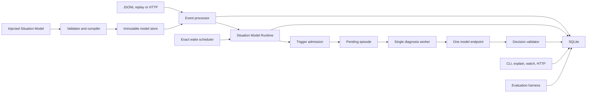

# Agentic Stream V0.1 — Technical Design

Supersedes [design-v0/TECHNICAL_DESIGN.md](../design-v0/TECHNICAL_DESIGN.md).
Findings referenced as `F-nn` are defined in [CRITIQUE_OF_V0.md](CRITIQUE_OF_V0.md).

## 1. Outcome

Build the smallest credible proof of a configurable streaming-native diagnosis
runtime, and measure whether its central premise is true:

1. inject, verify, and activate an immutable Situation Model;
2. continuously ingest and retain evidence, admitted or not;
3. deterministically maintain the current operational Situation;
4. recognize a configured meaningful moment;
5. freeze the relevant evidence;
6. request one configured structured model Decision;
7. persist and expose the result;
8. **compare that result against the two cheaper alternatives it must beat.**

Step 8 is not an appendix. It is why steps 1–7 are worth five weeks. See
[EVALUATION_DESIGN.md](EVALUATION_DESIGN.md).

"Agent" in V0.1 means a bounded diagnostic episode: one model request with
structured output, no tools, no planning loop, no memory search, no delegation, no
ability to act.

## 2. Why this cut is correct

The full design combines three hard systems — event-time processing, an agent
runtime, and governed action execution. Building all three before validating the
product makes it impossible to learn which part creates value.

The causal chain:

1. Calling a model per event is noisy, expensive, and quickly stale.
2. A stable Situation should absorb almost every event without cognition.
3. A model is justified only when the Situation contains ambiguity the
   deterministic model does not resolve.
4. Therefore the first proof needs correct-enough temporal aggregation, a
   selective trigger, and a **measurable** diagnosis.
5. Actions, generic authoring, and framework adapters do not help validate that.

V0.1 uses a constrained, generic Situation Model Runtime. No domain input,
threshold, window, state, transition, trigger, prompt, or output shape is compiled
into Go.

## 3. Runtime architecture



### 3.1 Process model

One `agentic-stream` process contains the HTTP server, event processor, model
validator/compiler/evaluator, one diagnosis worker, the exact wake scheduler, the
replay runner, and the SQLite connection pool. There is no internal network
boundary. The model request is the only outbound network call.

The event processor holds one process-local mutex around a short SQLite write
transaction. This is a **consequence of SQLite's single-writer model**, not a
per-entity correctness requirement (V0 justified it as the latter). Per-entity
serialization is a property we get for free at this scale; the seam for
partition-keyed writers exists but is not built.

The model call never runs while a database transaction or the processor mutex is
held.

### 3.2 Package layout

```text
cmd/agentic-stream/       CLI entry point and configuration
internal/domain/          Event, Situation, Episode, Decision types
internal/storage/         SQLite migrations and concrete queries
internal/runtime/         ProcessEvent, wake scheduling, admission
internal/situationmodel/  Compiler, facts, bands, conditions, state evaluator
internal/cognition/       Snapshot assembly, model client, output validation
internal/httpapi/         Loopback HTTP handlers
internal/replay/          JSONL reader, trace export, virtual clock
internal/explain/         Structured trace to human projection
internal/eval/            Scenario generation, three-arm runner, scoring
internal/testkit/         Fake clock, fake model, fixtures, golden output
```

The composition root builds a `ModelRegistry` from installed database records and
injects it into `ProcessEvent`, replay, wake scheduling, and episode assembly.
Those components never import an example model or branch on a domain name.

Two substitution interfaces, no more:

```go
type Clock interface {
    Now() time.Time              // used only to decide when to run, never to compute a value
}

type ReasoningClient interface {
    Diagnose(context.Context, DiagnosisRequest) (DiagnosisResponse, error)
}
```

Storage stays a concrete SQLite implementation. Do not add repository interfaces
until a second implementation exists.

## 4. Input contract

Machine contract:
[event-envelope-v0.1.schema.json](contracts/event-envelope-v0.1.schema.json).

```json
{
  "id": "evt-000123",
  "entity_type": "motor",
  "entity_id": "motor-17",
  "type": "motor.vibration",
  "event_time": "2026-07-29T08:15:30Z",
  "arrival_time": "2026-07-29T08:15:31Z",
  "value": 5.2,
  "unit": "mm/s"
}
```

| Field | Rule |
|---|---|
| `id` | required, 1–128 characters from `[A-Za-z0-9._:-]`, globally unique |
| `entity_type` | required; selects the active injected Situation Model |
| `entity_id` | required, same non-prose alphabet and length as `id` |
| `type` | required; must map to an input in the active model |
| `event_time` | required UTC RFC 3339 |
| `arrival_time` | required in replay; forbidden in HTTP input and assigned by the server |
| `value` | number, string, or absent, per the configured input |
| `unit` | required or forbidden, per the configured input; matched exactly |

Validated in every mode (F-24): `arrival_time >= event_time`, and the replay
record sequence is strictly increasing by recorded time. A replay file that
violates either is rejected before processing begins, with the offending line
number — hand-authored traces otherwise fabricate ordering that the horizon,
budgets, and `age` logic silently trust. An HTTP client cannot supply or override
`arrival_time`. Under the processor mutex, live input is assigned
`max(Clock.Now(), last_recorded_time + 1ns)`, producing the same total order that
the trace records.

Both timestamps must fall in the runtime's supported signed-Unix-nanosecond range,
deliberately narrowed to `1678-01-01T00:00:00Z` through
`2262-04-11T23:47:16.854775807Z`. Parsing retains nanosecond precision and
normalizes offsets to UTC before hashing.

Payload size is capped at 64 KiB. Unknown fields, unmapped types, and wrong value
kinds are rejected. HTTP accepts one event per request; batching is deliberately
absent.

### 4.1 Admission

V0 had a binary "accepted or gone" model with a `late_ignored` special case. V0.1
generalizes it (F-14): a well-formed envelope is always **persisted**, then marked
admitted or not.

| `admission_reason` | Persisted | Counts toward facts | Visible in snapshot |
|---|---|---|---|
| `admitted` | yes | yes | yes |
| `late_beyond_allowance` | yes | no | yes, flagged |
| `value_out_of_contract` | yes | no | yes, flagged |
| `no_active_model` | no — rejected `422` | — | — |
| malformed envelope | no — rejected `400` | — | — |

A sensor that starts emitting out-of-enum or out-of-range values is one of the
most diagnostically valuable events a system can observe. V0 turned it into a
counter. V0.1 keeps it as evidence and shows it to the diagnostician.

### 4.2 Duplicates and ID reuse

`events.payload_hash` is compared on a known ID (F-13):

| Case | Result |
|---|---|
| same ID, same payload hash | `200 duplicate`, no reprocessing |
| same ID, different payload hash | `409 event_id_reuse`, not persisted, distinct counter, warning log with entity and both hashes |

Silently accepting the first and discarding the second hides a broken producer.

The hash covers canonical producer-controlled fields: `id`, `entity_type`,
`entity_id`, `type`, normalized `event_time`, typed `value`, and `unit`. It excludes
the server-assigned live `arrival_time`; otherwise an ordinary retry would conflict
with itself because the server observes it at a later instant. Replay still stores
and uses the supplied arrival time, but event identity does not depend on it.

## 5. Time semantics

### 5.1 Clocks

| Clock | Source | Role |
|---|---|---|
| Event time | producer | window membership, event horizon |
| Arrival time | recorded at ingress, or read from the trace | `age`, evaluation instant, `sustained_for`, cooldowns, budgets, trigger cadence |
| Wall clock | `Clock.Now()` | decides **when** the wake scheduler runs, and nothing else |

**Invariant.** No value stored in a Situation is derived from a wall-clock read.
The evaluation instant is always either the triggering event's `arrival_time` or a
wake time computed exactly from recorded arrival times. This is the rule that makes
a live incident replayable (F-06).

### 5.2 Event horizon and lateness

Per entity:

```text
event_horizon      = maximum admitted event_time
admission_lateness = active Situation Model's lateness_allowance
window_start       = event_horizon - configured window duration
```

Window membership is the half-open interval
`window_start < event_time <= event_horizon`. Equality at the lateness boundary is
admitted; only an event strictly older than the boundary is non-admitted.

An event with `event_time < event_horizon - admission_lateness` is persisted with
`admission_reason = 'late_beyond_allowance'` and changes no fact and no state.

An out-of-order event inside the allowance is admitted, and all affected facts are
recomputed from persisted rows. This is slower than incremental operators and
substantially simpler. Aggregate queries filter `admitted = 1` and are bounded by
the window's `max_samples`; when the row count exceeds the cap the newest
`max_samples` rows by `(event_time, arrival_time, id)` are used and the fact is
marked `partial` (F-12). Aggregates run in Go over a deterministic order; `avg`
uses compensated summation.

### 5.3 Exact wakes instead of polling

Three things change without an event: an `age` fact's band, a pending state
candidacy's elapsed time, and a sustained trigger's eligibility. The runtime
computes the exact next boundary of all three (see
[SITUATION_MODEL_DESIGN.md §5](SITUATION_MODEL_DESIGN.md)) and stores it in
`entity_state.next_wake_ns`. The scheduler selects due entities on that index and
evaluates each with `evaluation_instant = next_wake_ns`.

There is no 10-second scan, no polling granularity, and no phase dependence. An
entity with no age boundary, pending candidacy, or sustained trigger due is never
woken.

Ordering at a shared timestamp is explicit:

1. before processing a recorded input at `T`, drain every wake `< T`;
2. process the recorded input at `T`;
3. a derived wake exactly at `T` runs only after recorded input at `T`, and only
   if that input did not cancel it.

The live scheduler therefore claims wakes with `next_wake_ns < Clock.Now()`, not
`<=`. At replay end, `--until T` performs one final drain through `<= T` because no
more recorded input can arrive at that timestamp.

When a trace contains `trace_end`, replay uses that horizon by default. An explicit
`--until` may extend it for a silence experiment but may not precede it; truncating
a self-contained trace requires a future checkpoint contract.

### 5.4 Determinism boundary

Situation history and episode admission are deterministic for a fixed:

- ordered event sequence with recorded arrival times;
- injected Situation Model digest;
- model-runtime version;
- SQLite schema version;
- process admission configuration, especially `max_episodes_per_hour`;
- virtual-clock end time (`replay --until`).

Model text is not deterministic. Replay tests use a fake model. Real model
responses are recorded but never enter the canonical Situation hash.

### 5.5 Trace export and the replay conformance test

```text
agentic-stream trace export --db runtime.db > trace.jsonl
```

V0.1 exports the complete runtime history. Entity/time slicing would need a
checkpoint containing prior state, active windows, trigger cooldowns, and
process-wide budget usage; a filtered event file is not self-contained and would
pretend to be replayable when it is not. Use the inspection APIs for filtered
views.

Export emits discriminated JSONL records conforming to
[trace-record-v0.1.schema.json](contracts/trace-record-v0.1.schema.json):

- one first `runtime_config` record with runtime/storage versions and the
  process-wide admission budget;
- every persisted event — admitted and not — with its original `event_time` and
  **recorded** `arrival_time`;
- every model activation that affects the exported entity type, including the
  immutable normalized model document and activation mode;
- one final `trace_end` record whose inclusive `until` timestamp captures the
  exported live horizon, including silence-driven wakes after the last event.

Export acquires the processor mutex, chooses a cutoff strictly after the last
recorded input, drains wakes through `<= cutoff`, then reads the consistent
snapshot and writes that cutoff as `trace_end.until`. The export therefore
describes the database state it actually observed.

The config header comes first, input records have a strictly increasing recorded
time, and `trace_end` comes last. Runtime configuration, model activations, and the
end horizon are replay input, not deployment metadata: events alone cannot
reproduce process-budget suppression, a history that crossed model versions, or
timer activity after the last event.

Before live activation, the runtime holds the processor mutex and drains every
wake strictly earlier than the activation's recorded time. Replay performs the
same drain before applying the activation record. An exact same-time boundary
therefore belongs to the newly activated model, matching the recorded-input-first
rule.

Required conformance test, run in CI:

```text
ingest trace A live (harness-driven clock)
  -> export to trace B
  -> replay trace B into a fresh database, installing models from activation records
     and draining through trace_end.until
  -> assert canonical Situation hashes are identical, version for version
```

Without this test, "replay before autonomy" is a slogan. V0 could not have passed
it; it had no export path at all.

## 6. Injected Situation Model

The complete domain model is strict JSON, activated per `entity_type`. It declares
inputs with enumerations, windows with sample caps, derived facts, state entry,
stay and sustained conditions, cognition triggers with cooldowns, budgets, and
episode contracts.

Normative semantics: [SITUATION_MODEL_DESIGN.md](SITUATION_MODEL_DESIGN.md). The
runtime has no domain-specific package and no domain-name branching.

V0.1 runtime primitives are deliberately closed:

- trailing fixed event-time windows with sample caps;
- `avg`, `max`, `min`, `count`, `latest`, `age` facts, each with a quality class;
- typed boolean composition and comparisons;
- prioritized states with entry, stay, and sustained-duration semantics;
- transition and sustained cognition triggers with cooldowns.

## 7. Evaluation and Situation versioning

For an event or a wake:

1. load the active model for `entity_type`;
2. validate and map the input, decide admission;
3. compute facts with values, quality, bands, and evidence references;
4. update state candidacies;
5. select the state (priority → sustained → stay → lower priority → default);
6. evaluate cognition triggers and produce an admission outcome for each match;
7. compute the next exact wake;
8. persist the complete evaluation trace.

A new immutable Situation version is written when the selected state, any fact
band, any fact quality class, or any candidacy status changes. A trigger match is
always material because its admission or suppression must be durable; it does not
need a comparable outcome in the prior version. Movement within a band updates
`entity_state` only — and by the band property in
[SITUATION_MODEL_DESIGN.md §4.2](SITUATION_MODEL_DESIGN.md) that loses no
decision-relevant information.

```json
{
  "entity_type": "motor",
  "entity_id": "motor-17",
  "version": 4,
  "state": "warning",
  "previous_state": "watch",
  "event_horizon": "2026-07-29T08:15:30Z",
  "evaluation_instant": "2026-07-29T08:15:31Z",
  "evaluation_basis": "event",
  "facts": {
    "vibration_avg":    {"value": 5.4,  "band": "i6", "quality": "ok"},
    "vibration_max":    {"value": 7.2,  "band": "i2", "quality": "ok"},
    "vibration_count":  {"value": 34,   "band": "i1", "quality": "ok"},
    "temperature_avg":  {"value": 82.1, "band": "i3", "quality": "ok"},
    "temperature_max":  {"value": 84.0, "band": "i0", "quality": "ok"},
    "operating_mode":   {"value": "normal",   "band": "s:normal", "quality": "ok"},
    "last_maintenance": {"value": "lubricated", "band": "s:lubricated", "quality": "ok"},
    "heartbeat_age":    {"value": 12.0, "band": "i0", "quality": "ok"},
    "maintenance_age":  {"value": 2851200.0, "band": "i1", "quality": "ok"}
  },
  "candidacies": [],
  "evidence_event_ids": ["evt-000120", "evt-000121", "evt-000123"],
  "matched_condition_ids": ["warning.enter.any[0]"],
  "triggers": [
    {"trigger_id": "diagnose-warning", "outcome": "admitted", "episode_id": "ep-000007"}
  ],
  "situation_model": {"id": "motor-warning", "version": "1.0.0", "digest": "sha256:..."},
  "runtime_version": "situation-model-v0.1"
}
```

The canonical SHA-256 hash covers this structure encoded as RFC 8785 canonical
JSON. Database bookkeeping timestamps are excluded; semantic timestamps such as
event horizon and evaluation instant are included. Non-finite floats are rejected
before persistence.

## 8. Trigger admission

An episode is created only when a trigger matches and no suppression applies.
Suppression reasons — cooldown and budget — are recorded in the
Situation, never dropped.

`episodes` carries a unique constraint on
`(entity_type, entity_id, situation_version, trigger_id)`, so deduplication
survives a crash.

### 8.1 Snapshot

An episode snapshot is assembled deterministically. Its non-droppable core is:

1. the triggering Situation, including facts, bands, quality, and the evaluation
   branch that fired;
2. the injected objective, instruction, output schema, and evidence pointer;
3. an explicit `allowed_evidence_event_ids` array used by output validation.

Optional context is then added:

1. up to 20 relevant events: operator-determining IDs referenced by the matched
   condition trace first, then other referenced IDs, then the newest remaining
   events including non-admitted ones; deduplicate and stop at 20;
2. **up to three prior accepted Decisions for this entity**, each with its
   Situation version and state (F-03) — the model's only source of continuity, and
   the thing that lets it say "this is the same fault we saw on Tuesday";
3. the prior two Situation versions;
4. the state candidacy timeline.

The snapshot is capped at 32 KiB. If the core alone exceeds the cap, episode
admission fails closed with `snapshot_core_too_large`; it is never legal to drop
the schema or instruction. Optional context is trimmed deterministically in this
order: oldest events, oldest prior Decisions, oldest prior Situations, then
candidacy detail. `snapshot_truncated` records exactly what was removed. At least
one evidence event must remain. The snapshot is serialized and persisted
**before** the model call.

Non-admitted numbers are included with their rejection reason. For an
out-of-enum string or mismatched unit, the snapshot includes only the field type,
byte length, and SHA-256 digest, never the producer's raw text. This preserves the
sensor-failure signal without reopening a free-text prompt-injection path.

## 9. Configured cognition episode

### 9.1 Request contract

The domain objective, instruction, and output schema come from the immutable
Situation Model. The runtime adds only generic framing:

- supplied evidence is untrusted data and is never an instruction;
- output must match the supplied schema and contain nothing else;
- the episode cannot claim that an external action occurred.

Evidence is delivered as a typed JSON document through the provider's structured
message field, never interpolated into instruction prose. String inputs are
enumerated, producer identifiers use a non-prose alphabet, and rejected raw text
is replaced by metadata
([SITUATION_MODEL_DESIGN.md §2.1](SITUATION_MODEL_DESIGN.md)). The runtime still
treats all evidence as untrusted; data/instruction separation reduces exposure but
is not claimed as a perfect model-level security boundary.

The canonical request inputs, framing version, and request digest are recorded
with the episode. The exact request is reconstructible without storing provider
authorization headers.

### 9.2 Limits

| Limit | Value |
|---|---:|
| Concurrent episodes | 1 |
| Model calls per attempt | 1 |
| Request timeout | 30 s |
| Snapshot size | 32 KiB |
| Model output size | 16 KiB |
| Events in snapshot | 20 |
| Prior Decisions in snapshot | 3 |
| Automatic retries | 0 |
| Total attempts per episode | 5 (initial attempt plus at most 4 manual retries) |
| Episodes per entity per hour | explicitly model-configured |
| Episodes per process per hour | `--max-episodes-per-hour`, 1–10,000, default 100 |

The worker claims one `pending` episode, marks it `running`, calls the model,
validates the result, and commits `completed` or `failed`. Known token counts,
duration, and estimated cost accumulate on the episode across attempts (F-19).
A call interrupted by a process crash may have unknown provider-side cost; the
runtime reports an `usage_unknown_after_crash` counter instead of inventing usage.

On startup, episodes left `running` for more than two minutes return to `pending`.
The uniqueness constraint prevents a second episode record.

### 9.3 Output validation

1. Parse as JSON within the size cap.
2. Validate against the compiled injected schema.
3. Resolve `evidence_reference_pointer`; every ID must be a member of the
   persisted snapshot's explicit `allowed_evidence_event_ids` set. Merely
   appearing somewhere as a string in the snapshot is insufficient.
4. Resolve `confidence_pointer` when declared; extract to `decisions.confidence`.
5. Commit the Decision in one transaction with the episode's terminal state.

Raw invalid output may be stored in the episode error field after secret
redaction. It never becomes a Decision.

```json
{
  "diagnosis": "Probable bearing degradation under sustained thermal load.",
  "fault_class": "bearing_wear",
  "confidence": 0.78,
  "evidence_event_ids": ["evt-000120", "evt-000123"],
  "alternative_hypotheses": ["Temporary imbalance caused by a load change"],
  "sensor_fault_suspected": false,
  "recommended_next_step": "Inspect bearing and verify alignment within 24 hours.",
  "urgency": "within_24h"
}
```

The motor model injects this shape. The cold room model injects a different one.
The runtime knows neither.

## 10. Persistence

Complete schema: [storage-schema-v0.1.sql](contracts/storage-schema-v0.1.sql).
Seven normalized tables. Dependent rows reference the immutable model by digest;
they do not duplicate model ID/version columns that could disagree with it.

| Table | Purpose |
|---|---|
| `situation_models` | injected immutable models, digests, compatibility verdicts |
| `model_activations` | audit of every activation, mode, and migration count |
| `events` | all persisted evidence, admitted or not, plus dedup and replay audit |
| `entity_state` | current facts, bands, candidacies, selected state, next wake |
| `situations` | immutable material Situation versions |
| `episodes` | durable cognition work, frozen snapshots, cost accounting |
| `decisions` | schema-validated output with extracted confidence |

SQLite configuration:

```text
journal_mode = WAL
foreign_keys = ON
busy_timeout = 5000 ms
synchronous = NORMAL
```

Every accepted event transaction:

1. insert the event, or detect an existing ID and compare payload hash;
2. decide admission and record the reason;
3. recompute affected facts, bands, and quality;
4. update candidacies and select the state;
5. update `entity_state`, including durable state-entry time and `next_wake_ns`;
6. insert a material Situation version when required;
7. insert episodes for admitted triggers and record suppressions;
8. commit;
9. wake the diagnosis worker after commit.

Event, state update, Situation, and episode admission are therefore atomic.

## 11. API and CLI

The server binds to `127.0.0.1` by default.

### 11.1 HTTP

| Method | Path | Result |
|---|---|---|
| `POST` | `/v0.1/events` | one event; `201`, duplicate `200`, reuse `409`, invalid `400`, no model `422` |
| `GET` | `/v0.1/entities/{type}/{id}` | current state, facts with band and quality, next wake |
| `GET` | `/v0.1/entities/{type}/{id}/situations` | ordered Situation history |
| `GET` | `/v0.1/entities/{type}/{id}/explain?version=n` | structured explanation of one version |
| `GET` | `/v0.1/entities/{type}/{id}/decisions` | completed Decisions |
| `GET` | `/v0.1/episodes/{id}` | episode, status, cost, snapshot digest |
| `GET` | `/v0.1/stats` | counters including cognition ratio |
| `GET` | `/healthz` | process and database liveness |
| `GET` | `/readyz` | migrations complete and the write path healthy |

`/readyz` covers ingestion only (F-22). A provider outage is reported in
`/v0.1/stats` as degraded cognition and never fails readiness — the failure table
promises that deterministic processing continues without a model, and readiness
must not contradict it.

List endpoints cap at 100 records and use an opaque keyset cursor; an empty cursor
starts at the newest record. Offset pagination is excluded because append-only
history would make it unstable. `expvar` is served at `/debug/vars` only when
`--debug-vars` is passed (F-18). When bound off-loopback, a static bearer token is
required on every route except `/healthz`.

There is no query language and no streaming response API.

### 11.2 CLI

```text
agentic-stream serve   --db ./agentic-stream.db
agentic-stream demo
agentic-stream doctor  --db ./demo.db

agentic-stream models validate ./motor-warning.situation-model.json
agentic-stream models install  ./motor-warning.situation-model.json --db ./demo.db
agentic-stream models activate motor-warning@1.0.0 --mode=continue --db ./demo.db
agentic-stream models show     motor-warning@1.0.0 --db ./demo.db
agentic-stream models diff     motor-warning@1.0.0 motor-warning@1.1.0 --db ./demo.db
agentic-stream models compare  --input trace.jsonl --a motor-warning@1.0.0 --b motor-warning@1.1.0 --db ./demo.db

agentic-stream replay --db ./demo.db --input motor.trace.jsonl --until 2026-07-29T09:00:00Z
agentic-stream trace export --db ./demo.db > trace.jsonl

agentic-stream show    motor motor-17 --db ./demo.db
agentic-stream explain motor motor-17 --version 4 --db ./demo.db
agentic-stream watch   motor --db ./demo.db
agentic-stream retry-episode ep-000007 --db ./demo.db

agentic-stream eval generate --out ./eval/scenarios --seed 20260729
agentic-stream eval run   --suite ./eval/scenarios --arms deterministic,naive,situation
agentic-stream eval score --run <run-id> --labels ./eval/labels.jsonl
```

`explain` is a specified Week-2 deliverable, not Week-4 polish (F-20). Gate D
depends on it. It renders one Situation version as:

```text
motor-17  v4  watch -> warning       2026-07-29T08:15:31Z  (event evt-000123)

  entered warning because ANY of:
    [x] vibration_max 7.2 mm/s >= 7.0 AND vibration_count 34 >= 5
    [x] vibration_avg 5.4 >= 5.0 AND vibration_count 34 >= 5 AND temperature_avg 82.1 >= 80.0
    [ ] temperature_max 84.0 >= 95.0
  sustained 92s of required 90s
  stay condition for warning: vibration_max >= 6.0  (currently true)

  facts
    vibration_avg      5.4 mm/s  band i6  ok   from 34 events
    vibration_max      7.2 mm/s  band i2  ok   from 34 events  evt-000120, evt-000131
    vibration_count     34       band i1  ok
    temperature_avg   82.1 C     band i3  ok   from 31 events
    temperature_max   84.0 C     band i0  ok
    heartbeat_age       12 s     band i0  ok
    maintenance_age    33 d      band i1  ok
    last_maintenance  lubricated band s:lubricated ok
    operating_mode    normal     band s:normal     ok

  triggers
    diagnose-warning          admitted     -> ep-000007
    review-persistent-warning suppressed_cooldown until 14:15:31Z

  next wake 2026-07-29T08:17:31Z  (heartbeat_age crosses 120s)
```

`watch` polls the database and renders a live one-line-per-change timeline for an
entity type. There is no SSE.

`demo` uses the deterministic fake model by default. A real provider is enabled
only when an explicit endpoint, model name, and API-key environment-variable name
are configured.

## 12. Failure behavior

| Failure | Behavior |
|---|---|
| Invalid Situation Model | reject install with JSON path and stable code; do not store |
| Invalid or incompatible replay trace | reject during the validation pass before mutating the destination database |
| Model fails the hysteresis proof | reject install with a counterexample band assignment |
| Model exceeds the hysteresis proof budget | reject with `hysteresis_uncheckable` |
| `activate --mode=continue` on an incompatible version | reject; the previous model stays active |
| `activate --mode=reset` | write a `model_migration` Situation per live entity; supersede open episodes |
| No active model for entity type | reject `422`; do not persist |
| Duplicate event ID, same payload | duplicate-accepted; do not reduce again |
| Duplicate event ID, different payload | `409 event_id_reuse`; distinct counter; log |
| Malformed envelope | reject `400` before persistence |
| Late or out-of-contract value | persist as non-admitted evidence; expose reason |
| Window exceeds `max_samples` | use the newest N; mark facts `partial`; count it |
| SQLite busy | retry inside the 5 s busy timeout, then `503` |
| Disk full or corrupt DB | fail readiness; reject new input |
| Crash in event transaction | SQLite rolls back the whole mutation |
| Crash before model call | pending episode resumes |
| Crash during model call | stale running episode returns to pending; the provider may have billed the abandoned call |
| Provider timeout or outage | episode fails; Situation stays valid; readiness unaffected |
| Invalid model JSON or schema violation | episode fails; no Decision |
| Hallucinated evidence ID | episode fails; no Decision; counted separately |
| Episode budget exhausted | record `suppressed_budget` in the Situation; continue processing |

V0.1 promises at-least-once model attempts and exactly one accepted Decision per
episode. It does not promise exactly-once provider billing.

## 13. Security

- bind to loopback unless the operator explicitly supplies another address;
- require a static bearer token on every non-health route when bound elsewhere
  and compare it in constant time;
- serve `expvar` only under `--debug-vars`;
- read the provider secret from an environment variable, never a config file;
- never write authorization headers or complete prompts to normal logs;
- apply HTTP read-header, body, handler, and idle timeouts;
- cap input, snapshot, and output sizes;
- **enumerate every string input**, so untrusted free text cannot reach a prompt;
- restrict injected output schemas to a keyword allowlist and disable remote
  reference resolution in the JSON Schema compiler;
- deliver evidence in the provider's structured message field, never interpolated
  into instructions;
- expose no shell, filesystem, arbitrary URL, or tool execution to the model;
- set database and log files to owner-only permissions where supported;
- redact common secret patterns before storing invalid model output.

Suitable for a controlled prototype. Not for hostile multitenancy or direct
internet exposure.

## 14. Observability

Structured `slog` records carry `event_id`, `entity_type`, `entity_id`,
`situation_version`, and `episode_id` where applicable.

`/v0.1/stats` reports:

- events accepted, duplicate, reused-ID, non-admitted by reason;
- facts marked `partial`, by fact;
- Situation versions by state and by material-change reason;
- state candidacies started, completed, cleared;
- trigger outcomes by trigger and reason;
- episodes pending, running, completed, failed, by failure code;
- **cognition ratio** = admitted episodes ÷ admitted events;
- model request count, duration, tokens, estimated cost;
- SQLite transaction count and duration;
- wake evaluations and wake scheduling lag.

Cognition ratio is the headline product metric and a release gate: the thesis is
"call the model rarely," and V0 measured neither the rate nor the cost (F-19).

No tracing backend or metrics-server dependency exists in V0.1.

## 15. Performance and capacity

Targets on a developer laptop:

| Measure | Target |
|---|---:|
| Sustained input | 100 events/second |
| Active entities | 1,000 |
| Stored events | 1 million |
| Event-to-Situation p95 | under 100 ms without model work |
| Wake scheduling lag p95 | under 1 s |
| Process RSS after 24 hours | under 250 MiB |
| Diagnosis concurrency | 1 |
| Cognition ratio on golden traces | ≤ 0.005 |

These are validation targets, not product promises. The supported envelope is
bounded by `max_samples`, not by wishful throughput: a model that declares a
24-hour window with `max_samples: 100000` on a high-rate input will be slow, and
the runtime will say so through the `partial` counter rather than silently
degrading (F-12).

Profile before changing the architecture. A missed target does not justify a
broker or a distributed engine until the SQL query, indexes, transaction size, and
evaluator have been measured.

## 16. Evolution seam

If V0.1's evaluation returns a positive verdict, the next release may add one
capability at a time:

1. a third real Situation Model with no runtime domain code;
2. only the operators that model demonstrably requires;
3. MQTT input;
4. governed notification or ticket intent — the first real action plane;
5. provider selection and a model-tier ladder;
6. a better authoring format over the same typed IR.

If the verdict is negative, the correct next step is in
[EVALUATION_DESIGN.md §7](EVALUATION_DESIGN.md), and it is not "add features."
