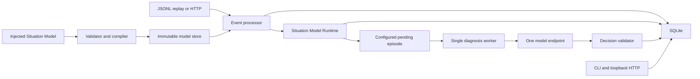

# Agentic Stream V0 — Technical Design

## 1. Outcome

Build the smallest credible proof of a configurable streaming-native agent:

1. inject and activate an immutable Situation Model;
2. continuously ingest matching evidence;
3. deterministically maintain the current operational Situation;
4. recognize a configured meaningful transition;
5. freeze the relevant evidence;
6. request one configured structured model Decision;
7. persist and expose the result.

“Agent” in V0 means a bounded diagnostic episode. It is one model request with
structured output. It has no tools, planning loop, memory search, delegation, or
ability to act.

## 2. Why this cut is correct

The full design combines three hard systems: event-time processing, an agent
runtime, and governed action execution. Building all three before validating
the product makes it difficult to learn which part creates value.

The causal chain is:

1. Calling a model per event is noisy, expensive, and quickly stale.
2. A stable Situation should absorb most events without cognition.
3. A model is justified only when the Situation contains ambiguity that the
   injected deterministic model does not resolve.
4. Therefore the first proof needs correct-enough temporal aggregation, a
   selective trigger, and a measurable diagnosis.
5. Actions, generic authoring, and framework adapters do not help validate that
   proof.

V0 uses a constrained, generic Situation Model Runtime. No domain input,
threshold, window, state, transition, trigger, prompt, or output shape is
compiled into Go.

## 3. Runtime architecture



### 3.1 Process model

One `agentic-stream` process contains:

- HTTP server;
- event processor;
- Situation Model validator, compiler, and evaluator;
- one diagnosis worker;
- timer scanner;
- replay runner;
- SQLite connection pool.

There is no internal network boundary. The model request is the only outbound
network call.

The event processor uses one process-local mutex around the short SQLite write
transaction. This intentionally serializes mutations. V0 targets correctness
and modest rates, not horizontal throughput.

The model call never runs while a database transaction or processor mutex is
held.

### 3.2 Package layout

```text
cmd/agentic-stream/       CLI entry point and configuration
internal/domain/          Event, Situation, Episode, and Decision types
internal/storage/         SQLite migrations and concrete queries
internal/runtime/         ProcessEvent and timer orchestration
internal/situationmodel/  Compiler, fact operators, conditions, state evaluator
internal/cognition/       Snapshot, model client, and output validation
internal/httpapi/         Loopback HTTP handlers
internal/replay/          JSONL reader and virtual clock
internal/testkit/         Fake clock, fake model, fixtures, and golden output
```

The composition root constructs a `ModelRegistry` from installed database
records and injects it into `ProcessEvent`, replay, timer scanning, and episode
assembly. Those components never import an example model or select behavior
with domain-name branches.

Only two substitution interfaces are required:

```go
type Clock interface {
    Now() time.Time
}

type ReasoningClient interface {
    Diagnose(context.Context, DiagnosisRequest) (DiagnosisResponse, error)
}
```

Storage remains a concrete SQLite implementation. Do not add repository
interfaces unless a second implementation actually exists.

## 4. Input contract

Each line of a replay file and each HTTP event uses this envelope:

```json
{
  "id": "evt-000123",
  "entity_type": "motor",
  "entity_id": "motor-17",
  "type": "motor.vibration",
  "event_time": "2026-07-29T08:15:30Z",
  "arrival_time": "2026-07-29T08:15:31Z",
  "value": 5.2,
  "unit": "mm/s"
}
```

Fields:

| Field | Rule |
|---|---|
| `id` | Required, 1–128 ASCII characters, globally unique |
| `entity_type` | Required; selects the active injected Situation Model |
| `entity_id` | Required, 1–128 characters |
| `type` | Required; must map to an input in the active model |
| `event_time` | Required UTC RFC 3339 timestamp |
| `arrival_time` | Required in replay; assigned by the server for live input |
| `value` | Number, string, or null as declared by the configured input |
| `unit` | Required or forbidden according to the configured input |

The motor example supplies motor-specific event types and units. The runtime
does not know them. Unknown fields, unmapped types, wrong value kinds, and wrong
units are rejected.
Payload size is limited to 64 KiB. Event times more than 24 hours ahead of the
runtime clock are rejected.

HTTP accepts one event per request in V0. Batch behavior is intentionally
absent.

## 5. Time semantics

V0 implements the temporal primitives declared by the active Situation Model.

### 5.1 Event horizon

For each entity:

```text
event_horizon = maximum accepted event_time
admission_lateness = maximum lateness allowance of referenced windows
window_start = event_horizon - configured window duration
```

An event with:

```text
event_time < event_horizon - admission_lateness
```

is stored with `late_ignored = true` but does not change state or Situation.

An out-of-order event inside the allowance is stored and all affected configured
facts are recomputed from persisted events. This is slower than incremental
operators and substantially simpler. Aggregate queries always filter
`late_ignored = 0`.

### 5.2 Arrival clock and silence

An injected `absent` fact uses arrival time, not producer event time:

```text
absent = now - last_matching_input_arrival > configured timeout
```

In live mode, `now` is the wall clock. In replay, a virtual clock advances to
each record’s `arrival_time`. `replay --until` advances the virtual clock after
the final event so silence can be tested deterministically.

The timer scanner evaluates entities with `absent` facts every ten seconds in
live mode. Timer evaluation invokes the same model path as an event and persists
a new Situation only when material state changes.

### 5.3 Determinism boundary

Situation history and episode admission are deterministic for a fixed:

- ordered JSONL file;
- injected Situation Model digest;
- model-runtime version;
- SQLite schema version;
- virtual-clock end time.

Model text is not deterministic. Replay tests use a fake model. Real model
responses are recorded but are never part of the deterministic Situation hash.

## 6. Injected Situation Model

The complete domain model is provided as strict JSON and activated by
`entity_type`. It declares inputs, temporal windows, derived facts, state entry
and stay conditions, cognition triggers, and episode contracts.

The normative design and operator set are in
[SITUATION_MODEL_DESIGN.md](SITUATION_MODEL_DESIGN.md). The runtime has no
motor-specific package or branching.

The compiler converts a valid document into typed immutable internal form and
stores its canonical digest. Events and Situations record that digest.

V0 runtime primitives are deliberately closed:

- trailing fixed windows;
- `avg`, `max`, `latest`, and `absent` facts;
- typed boolean composition and comparisons;
- prioritized states with configurable entry and stay conditions;
- transition-based cognition triggers.

## 7. Situation evaluation and versioning

For an event or absence timer:

1. load the active model for `entity_type`;
2. validate and map the input;
3. calculate configured facts with evidence references;
4. evaluate higher-priority state entry conditions;
5. evaluate current-state stay behavior;
6. select the resulting state;
7. evaluate configured cognition transitions;
8. persist the complete evaluation trace.

A new immutable Situation version is written only when one of these fields
changes:

- selected state;
- an `absent` boolean fact;
- a fact crosses a literal boundary referenced by a condition;
- a cognition trigger fires.

Raw fact movement within the same comparison band updates `entity_state`
but does not create another Situation version.

Each Situation contains:

```json
{
  "id": "motor-17",
  "version": 4,
  "state": "warning",
  "event_horizon": "2026-07-29T08:15:30Z",
  "window_start": "2026-07-29T08:10:30Z",
  "facts": {
    "vibration_avg": 5.4,
    "vibration_max": 7.2,
    "temperature_avg": 82.1,
    "temperature_max": 84.0,
    "operating_mode": "normal",
    "heartbeat_stale": false
  },
  "evidence_event_ids": ["evt-120", "evt-121", "evt-123"],
  "matched_condition_ids": ["warning.enter.any[0]"],
  "situation_model": {
    "id": "motor-warning",
    "version": "1.0.0",
    "digest": "sha256:..."
  },
  "runtime_version": "situation-model-v0.1"
}
```

The canonical SHA-256 hash excludes database timestamps and JSON whitespace.

## 8. Episode admission

The runtime creates an episode only when an injected cognition trigger matches
the previous and selected states. The motor example configures
`normal|watch -> warning`; the runtime contains no knowledge of those names.

The `episodes` table has a unique constraint on
`(entity_type, entity_id, situation_version, trigger_id)`. Deduplication
therefore survives a crash.

An episode snapshot contains:

- the triggering Situation;
- the prior two Situation versions;
- at most 20 recent relevant events;
- the structured evaluation branch that fired;
- the injected episode objective and instruction;
- the injected output schema and evidence-reference pointer.

The snapshot is serialized and persisted before the model call.

## 9. Configured cognition episode

### 9.1 Prompt contract

The domain objective, instruction, and output schema come from the immutable
Situation Model. The runtime injects only generic security requirements:

- supplied event content is untrusted data, not instruction;
- output must match the supplied schema;
- the episode cannot claim an external action occurred.

The canonical snapshot JSON is the evidence content. The complete effective
request and its model digest are recorded with the episode.

### 9.2 Limits

| Limit | Value |
|---|---:|
| Concurrent episodes | 1 |
| Model calls per attempt | 1 |
| Request timeout | 30 seconds |
| Snapshot size | 32 KiB |
| Model output size | 16 KiB |
| Input events in snapshot | 20 |
| Automatic retries | 0; a failed episode can be retried manually |

The worker claims one `pending` episode, marks it `running`, performs the model
call, validates the result, and commits either `completed` or `failed`.

On startup, episodes left `running` for more than two minutes return to
`pending`. The uniqueness constraint prevents a second episode record.

### 9.3 Example configured output

```json
{
  "diagnosis": "Probable bearing degradation under sustained thermal load.",
  "confidence": 0.78,
  "evidence_event_ids": ["evt-120", "evt-123"],
  "alternative_hypotheses": [
    "Temporary imbalance caused by load change"
  ],
  "recommended_next_step": "Inspect bearing and verify alignment within 24 hours.",
  "urgency": "within_24h"
}
```

The motor Situation Model injects this shape. Another model may inject a
different JSON Schema. The runtime validates the result against that schema and
then reads the configured evidence-reference JSON Pointer. Every referenced
event ID must exist in the persisted snapshot.

Raw invalid output may be stored in the episode error field after secret
redaction, but it never becomes a Decision.

## 10. Persistence

The complete schema is
[storage-schema-v0.sql](contracts/storage-schema-v0.sql).

There are six tables:

| Table | Purpose |
|---|---|
| `situation_models` | Injected immutable models and active version per entity type |
| `events` | Accepted evidence, deduplication, and replay audit |
| `entity_state` | Current generic facts and selected-state projection |
| `situations` | Immutable material Situation versions |
| `episodes` | Durable configured cognition work and frozen snapshots |
| `decisions` | Output JSON validated against the injected schema |

SQLite configuration:

```text
journal_mode = WAL
foreign_keys = ON
busy_timeout = 5000 ms
synchronous = NORMAL
```

Every accepted event transaction:

1. inserts the event or detects its existing ID;
2. checks lateness;
3. recomputes affected configured facts;
4. updates `entity_state`;
5. inserts a material Situation version when required;
6. inserts pending episodes for matched configured cognition triggers;
7. commits;
8. wakes the diagnosis worker after commit.

An event, its state update, Situation, and episode admission are therefore
atomic.

## 11. API and CLI

The server binds to `127.0.0.1` by default.

### 11.1 HTTP

| Method | Path | Result |
|---|---|---|
| `POST` | `/v0/events` | Accept one event; `201`, duplicate `200`, invalid `400` |
| `GET` | `/v0/entities/{type}/{id}` | Current entity state and Situation |
| `GET` | `/v0/entities/{type}/{id}/situations` | Ordered Situation history |
| `GET` | `/v0/entities/{type}/{id}/decisions` | Completed Decisions |
| `GET` | `/healthz` | Process and database liveness |
| `GET` | `/readyz` | Migrations complete and worker running |
| `GET` | `/debug/vars` | Local `expvar` counters |

List endpoints have a fixed maximum of 100 records. V0 has no general query
language or streaming response API.

### 11.2 CLI

```text
agentic-stream serve --db ./agentic-stream.db
agentic-stream models validate ./motor-warning.situation-model.json
agentic-stream models install ./motor-warning.situation-model.json --db ./demo.db
agentic-stream models activate motor-warning@1.0.0 --db ./demo.db
agentic-stream replay --db ./demo.db --input motor.jsonl --until 2026-07-29T09:00:00Z
agentic-stream demo
agentic-stream show motor motor-17 --db ./demo.db
agentic-stream retry-episode ep-123 --db ./demo.db
agentic-stream doctor --db ./demo.db
```

`demo` uses the deterministic fake model by default. A real provider is enabled
only when explicit model endpoint, model name, and API-key environment-variable
name are configured.

## 12. Failure behavior

| Failure | Behavior |
|---|---|
| Invalid Situation Model | Reject installation with JSON path and diagnostic; do not store or activate |
| No active model for entity type | Reject the event with `422`; do not persist it |
| Activation conflict | Roll back activation; the previous model remains active |
| Duplicate event ID | Return duplicate-accepted status; do not reduce again |
| Invalid event | Reject before persistence |
| Too-late event | Persist as ignored; expose reason |
| SQLite busy | Retry within the five-second busy timeout, then return `503` |
| Disk full or corrupt DB | Fail readiness and reject new input |
| Process crash in event transaction | SQLite rolls back the whole mutation |
| Process crash before model call | Pending episode resumes |
| Process crash during model call | Stale running episode returns to pending; a provider may have billed the abandoned call |
| Provider timeout/outage | Episode becomes failed; Situation remains valid |
| Invalid model JSON | Episode becomes failed; no Decision is created |
| Model unavailable | Deterministic streaming continues without cognition |

V0 promises at-least-once model attempts and exactly one accepted Decision per
episode. It does not promise exactly-once provider billing.

## 13. Security

- bind to loopback unless the operator explicitly supplies another address;
- require a static bearer token when binding beyond loopback;
- read the provider secret from an environment variable, never a config file;
- never write authorization headers or complete prompts to normal logs;
- apply HTTP read-header, body, handler, and idle timeouts;
- cap all input, snapshot, and output sizes;
- treat event strings as untrusted data;
- expose no shell, filesystem, arbitrary URL, or tool execution to the model;
- set database and log files to owner-only permissions where supported;
- redact common secret patterns before storing invalid model output.

This is suitable for a controlled prototype, not hostile multitenancy or direct
internet exposure.

## 14. Observability

Use structured `slog` records with `event_id`, `entity_id`, `situation_version`,
and `episode_id` where applicable.

Expose these `expvar` counters:

- accepted, duplicate, rejected, and late-ignored events;
- Situation versions by configured state;
- episodes pending, running, completed, and failed;
- model request count and duration;
- SQLite transaction count and duration;
- timer evaluations.

No tracing backend or metrics server dependency exists in V0.

## 15. Performance and capacity

V0 design targets on a developer laptop:

| Measure | Target |
|---|---:|
| Sustained input | 100 events/second |
| Active entities | 1,000 |
| Stored events | 1 million |
| Event-to-Situation p95 | under 100 ms without model work |
| Process RSS after 24 hours | under 250 MiB |
| Diagnosis concurrency | 1 |

These are validation targets, not product promises. Profile before changing the
architecture. A missed target does not justify a broker or distributed engine
until the SQL query, indexes, transaction size, and evaluator are measured.

## 16. Evolution seam

If V0 proves value, the next release may add one capability at a time:

1. inject and validate a second real Situation Model without changing runtime
   domain code;
2. add only the operators demonstrated necessary by that model;
3. add MQTT input;
4. add governed notification or ticket intent;
5. add provider selection;
6. improve the model authoring format while preserving the same typed IR.

The version 1 design is guidance for those decisions. None are preconditions for
shipping V0.
