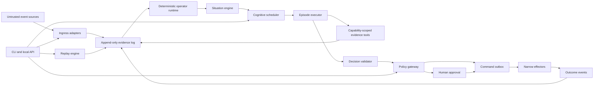
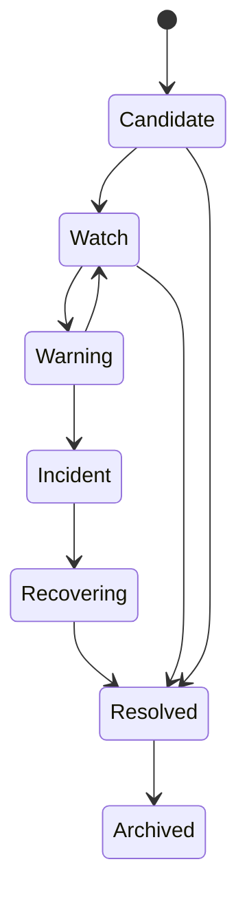
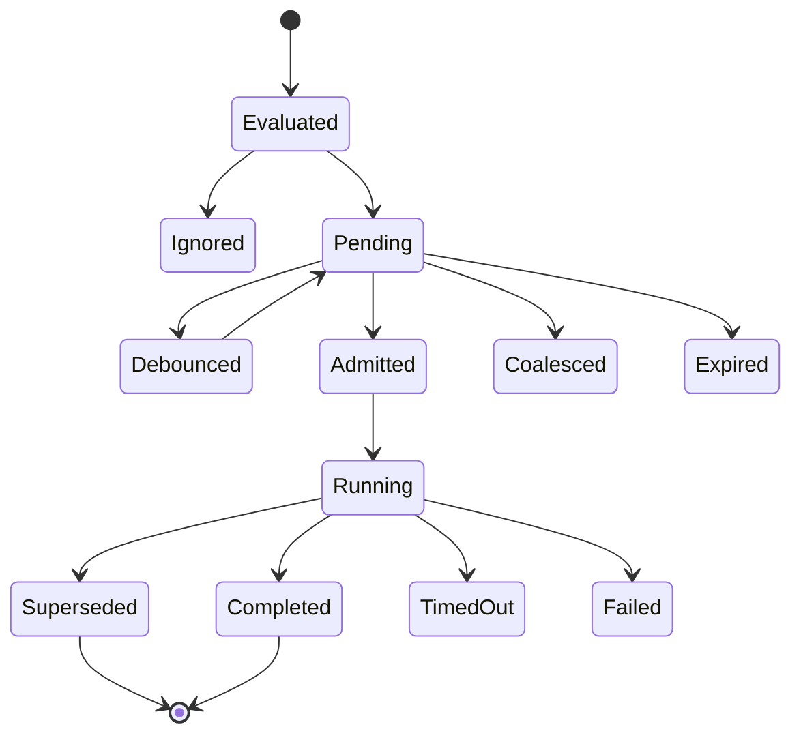
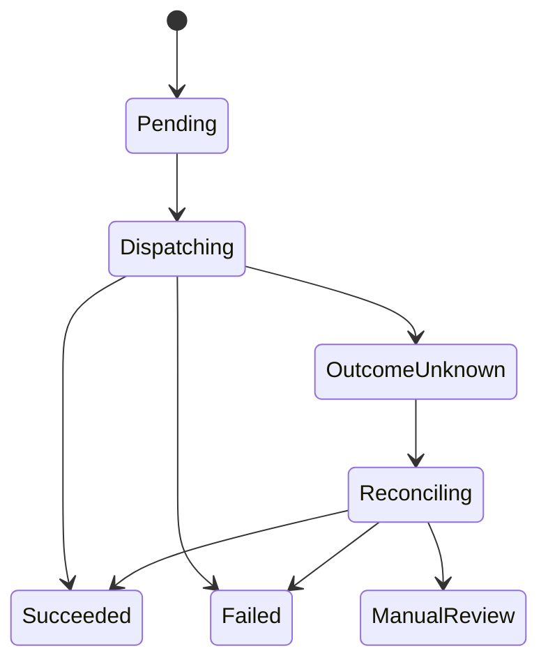

# Streaming-Native Agent Runtime — Technical Design

Status: implementation baseline  
Audience: maintainers, implementers, reviewers, and early integration partners  
Scope: single-node runtime through the first broker-backed production pilot

## 1. Executive decision

Agentic Stream will be a broker-neutral **Situation Runtime**.

It combines four planes:

1. A deterministic stream plane converts unbounded external evidence into
   time-aware features and immutable Situation versions.
2. A cognition plane decides when a Situation deserves a bounded agent episode
   and executes that episode against a frozen snapshot.
3. An action plane validates typed Intents against current policy and state,
   then executes idempotent Commands through narrow effectors.
4. A control plane validates and deploys SituationSpec versions, exposes
   inspection and replay APIs, and manages operational configuration.

The initial implementation is a Go modular monolith backed by SQLite WAL.
Worker implementations are Go-only: the runtime may use its native executor or
an out-of-process Go worker that implements the current v1 protocol. The system
is useful with no external broker and no web UI.

## 2. Root-cause analysis

The tempting design is “consume an event, call an agent, execute its tool.”
That fails for structural reasons:

1. **Why does event-to-agent invocation become expensive and unstable?**  
   An unbounded stream can arrive faster and longer than finite model calls.
2. **Why can the system not solve this with a queue?**  
   Most events do not deserve independent cognition; queued reasoning becomes
   stale while later evidence changes the condition.
3. **Why can the agent not reconstruct the condition from queued messages?**  
   Temporal truth requires event time, windows, watermarks, late correction,
   durable timers, deduplication, and keyed state.
4. **Why do existing agent runtimes not provide that truth?**  
   Their streaming surface describes progress inside an already-started run:
   token deltas, tool events, state updates, and checkpoints.
5. **Why is a new boundary required?**  
   The missing product is the semantic and operational transition from
   continuous evidence to a stable, versioned situation, then from that
   situation to governed cognition and safe effects.

The architecture therefore optimizes for **fewer, better-timed agent episodes**,
not maximum agent activity.

## 3. Goals and non-goals

### 3.1 Goals

- Correct event-time handling for ordered, out-of-order, late, duplicated,
  bursty, sparse, and silent sources.
- Durable keyed state, timers, Situation history, cognition records, and action
  ledgers on one node.
- A declarative SituationSpec that runs unchanged in local and broker-backed
  modes.
- Bounded, cancelable, version-aware cognition with explainable admission.
- Provider-neutral native model execution and optional external executors.
- Deterministic policy between model output and external effects.
- Crash-safe replay and duplicate-effect prevention.
- First-class deterministic, recorded, shadow, and counterfactual evaluation.
- One-command local operation and low-overhead edge deployment.
- Explicit contracts, migrations, observability, and compatibility tests.

### 3.2 Non-goals for version 1

- A replacement for Kafka, Pulsar, NATS, Flink, Beam, or Kafka Streams.
- Video-rate, robotics, PLC, or sub-millisecond control.
- A general chat assistant, messaging gateway, coding agent, or channel hub.
- Arbitrary DAG authoring or a visual workflow builder.
- In-process untrusted code plugins.
- Agent-controlled policy, self-modifying production rules, or automatic
  promotion of learned behavior.
- Universal exactly-once physical effects.
- Multi-agent swarms or recursive delegation.
- Hostile multi-tenant isolation in a shared operating-system process.

## 4. Quality attributes

| Attribute | Required behavior |
|---|---|
| Correctness | Fixed input, spec digest, operator versions, model artifacts, and clock produce the same deterministic history |
| Safety | No model path reaches effectors or production credentials directly |
| Explainability | Every Situation field, trigger outcome, episode result, policy decision, and command outcome has provenance |
| Resilience | Restart resumes offsets, timers, pending episodes, and commands without blind side-effect repetition |
| Boundedness | Every queue, window, payload, tool result, model call, episode, retry, and retention period has a configured limit |
| Portability | Local file, MQTT, and broker adapters preserve the same core contracts |
| Operability | Health, lag, watermarks, state size, cognitive backlog, budgets, and reconciliation are observable |
| Evolvability | Schemas, specs, state, prompts, policies, providers, and worker protocols are independently versioned |

## 5. System context and trust boundaries



Trust zones:

- **Ingress zone:** all fields are untrusted; schema, timestamps, units, size,
  identity, and source authorization are validated.
- **Deterministic core:** only normalized typed values enter operators and
  reducers. No model output mutates this state directly.
- **Cognition zone:** workers see immutable projections and narrow read tools.
  They do not receive broker, database, or effector credentials.
- **Policy zone:** revalidates typed intents using current durable state.
- **Effector zone:** owns narrow credentials and external reconciliation.
- **Operator zone:** local API and approval surfaces require an independent
  human or service identity.

## 6. Runtime architecture

### 6.1 Modules

| Module | Responsibility | Durable state |
|---|---|---|
| `contracts` | Versioned domain types and codecs | schema/version registry |
| `spec` | Parse, validate, compile, and hash SituationSpec | spec deployments |
| `ingress` | Authentication, decoding, normalization, unit conversion | connector cursors, quarantine |
| `eventlog` | Append, read, seek, deduplicate, retention | event log |
| `engine` | Virtual partitions, bounded queues, clocks, checkpoints | partition checkpoints |
| `operators` | Windows, aggregates, joins, timers, detectors | operator state |
| `situations` | Reducers, lifecycle, immutable versions, provenance | current and historical Situations |
| `cognition` | Trigger evaluation, admission, priority, coalescing | trigger evaluations and queue |
| `episodes` | Native loop and worker adapter | episode and event ledgers |
| `evidence` | Capability-scoped, bounded read tools | query audit |
| `decisions` | Schema, evidence, freshness, and consistency validation | accepted/rejected decisions |
| `policy` | Risk, permission, freshness, approval, quota, idempotency | policy decisions and approvals |
| `actions` | Outbox, dispatch, effectors, reconciliation | intents, commands, outcomes |
| `replay` | Deterministic and cognition-aware replay modes | replay jobs and comparisons |
| `api` | CLI, HTTP, SSE, internal worker RPC | API idempotency records |
| `telemetry` | Logs, metrics, traces, audit projection | optional local trace export |

Only true substitution or trust boundaries receive interfaces. Internal
packages use concrete types by default. Version 1 ports are:

```go
type Connector interface {
    Run(context.Context, EventSink) error
    Checkpoint(context.Context) (ConnectorCheckpoint, error)
}

type EventLog interface {
    Append(context.Context, []Envelope) ([]LogPosition, error)
    Read(context.Context, ReadRequest, func(LogRecord) error) error
}

type Clock interface {
    Now() time.Time
    NewTimer(time.Duration) Timer
}

type EpisodeExecutor interface {
    Execute(context.Context, EpisodeRequest, EpisodeEventSink) TerminalOutcome
}

type ModelProvider interface {
    Stream(context.Context, ModelRequest, ModelEventSink) ModelOutcome
}

type Effector interface {
    Capabilities() EffectorCapabilities
    Execute(context.Context, Command) EffectorResult
    Reconcile(context.Context, Command) ReconciliationResult
}
```

SQLite repositories are concrete implementations behind transaction-scoped
methods, not one interface per table.

### 6.2 Process model

The main binary owns:

- all deterministic processing;
- SQLite and file artifacts;
- the scheduler and action plane;
- the native direct-model executor;
- HTTP/SSE and the local worker gRPC server.

Optional Go workers are child processes or independently managed Go services.
The runtime supervises local child liveness, but an episode remains recoverable
from the durable ledger if a worker disappears. Python workers are not part of
the product, protocol conformance target, or deployment model.

Default local sockets:

- HTTP: loopback-only dynamic port, or explicit Unix socket;
- worker gRPC: Unix domain socket with filesystem permissions;
- no unauthenticated non-loopback listener.

### 6.3 Virtual partitioning

Even on one node, every normalized event is assigned to a stable virtual
partition:

```text
partition = hash(tenant_id + "\x00" + partition_key) mod partition_count
```

`partition_count` is immutable for a database generation and defaults to 64.
It is not the number of goroutines. A bounded pool of partition workers owns
serial processing for assigned virtual partitions.

Invariants:

- one transaction at a time mutates a virtual partition;
- events within a partition are applied in log-position order;
- a Situation has exactly one owning partition;
- state updates and derived outbox records commit atomically;
- cross-entity relationships use explicit derived events, never global locks.

The virtual partition ID is stored in every event, timer, state row, Situation,
and checkpoint. This creates a migration path to external broker partitions.

## 7. Canonical contracts

Every contract carries:

- semantic `type`;
- `schema_version`;
- stable identity;
- tenant and partition identity;
- timestamps with RFC 3339 nanosecond representation on external JSON;
- trace and causation identifiers;
- producer component and version;
- security classification;
- canonical payload hash where replay identity matters.

### 7.1 Event Envelope

```json
{
  "id": "evt_...",
  "type": "motor.vibration.observed",
  "schema_version": "1.0",
  "tenant_id": "default",
  "source": "simulator.motor-17",
  "partition_key": "motor-17",
  "entity": {"type": "motor", "id": "motor-17"},
  "event_time": "2026-07-29T08:15:30.000Z",
  "observed_at": "2026-07-29T08:15:29.950Z",
  "ingested_at": "2026-07-29T08:15:30.100Z",
  "correlation_id": "run_...",
  "causation_id": "evt_...",
  "traceparent": "...",
  "classification": "internal",
  "quality": [],
  "data": {"rms_mm_s": 5.2}
}
```

`processing_time` is not accepted from producers. The runtime records it when a
stage executes. Unknown payload fields are rejected by default unless the event
schema explicitly permits them.

### 7.2 Feature Event

A Feature Event includes:

- `feature_id`, name, value, value type, unit, and optional uncertainty;
- entity and partition;
- exact window start/end and window kind;
- input watermark and completeness state;
- operator ID, version, and configuration digest;
- input evidence IDs or a lineage-set reference;
- model artifact digest when a deterministic external detector is used;
- calculation time.

### 7.3 Situation and Situation Snapshot

A Situation identity is stable across its lifecycle. Every change creates an
immutable version. The mutable `situations_current` row is a projection pointing
to the newest immutable version.

Required groups:

| Group | Content |
|---|---|
| Identity | tenant, Situation ID, type, entity, partition, version |
| Time | first/latest evidence, event horizon, watermark, valid interval |
| Lifecycle | phase, previous phase, severity, status |
| Interpretation | structured facts, hypotheses, confidence, uncertainty |
| Evidence | feature/evidence references, contradictions, data-quality flags |
| Cognition | last reasoned version, in-flight episode, cooldown, priority |
| Action | open intents, commands, approvals, outcome status |
| Provenance | spec, reducer, operator, model artifact, policy, schema digests |

Completeness is one of:

- `provisional`;
- `on_time`;
- `corrected`;
- `final_by_policy`;
- `uncertain`.

A Situation Snapshot adds:

- a meaningful delta from the last reasoned version;
- bounded multi-resolution features;
- top supporting and contradicting evidence;
- previous Decisions and Outcomes;
- allowed tools and intent schemas;
- a canonical snapshot hash.

Snapshot assembly is deterministic. Generated natural-language summaries are
projections with evidence references, never authoritative fields.

### 7.4 Episode, Decision, Intent, Command, Outcome

An Episode Request binds:

- episode, trigger, Situation, and Situation-version identities;
- snapshot and spec digests;
- objective and Decision schema;
- model/executor policy;
- wall-time, model-call, input/output-token, tool-call, tool-output-byte,
  retry, and cost budgets;
- capability token and expiry;
- cancellation/supersession key;
- trace identity.

A Decision separates:

- facts used, each with evidence references;
- inferences and their confidence;
- alternative hypotheses;
- missing or requested evidence;
- validity conditions and expiry;
- zero or more typed Action Intents.

An Intent describes a desired effect. A Command is an approved executable
record. An Outcome records the observed result and later reconciliation.

## 8. SituationSpec

### 8.1 Authoring model

A SituationSpec is the primary developer artifact. It contains:

- metadata and compatibility version;
- accepted input schemas and partition key;
- source watermark and lateness policies;
- named windows, features, timers, and detectors;
- Situation identity, lifecycle, reducers, and retention;
- cognitive trigger policy and budgets;
- episode executor, prompt/objective reference, tool capabilities, and Decision
  schema;
- allowed intent types and risk policy;
- replay and telemetry settings.

### 8.2 Compilation

Compilation is a pure, ordered pipeline:

1. Parse YAML or JSON with duplicate-key rejection.
2. Validate structure with the versioned JSON Schema.
3. Resolve names and references.
4. Validate units and value types.
5. Validate operator topology and state bounds.
6. Validate time policy, allowed lateness, and idle-source policy.
7. Compile CEL expressions against typed environments.
8. Reject non-deterministic or unsupported functions.
9. Normalize defaults and sort semantically unordered collections.
10. Serialize canonical JSON and compute SHA-256 digest.
11. Produce immutable internal IR and an explainable compile report.

The deployed digest, not the source filename, identifies behavior.

### 8.3 Expression rules

CEL is limited to deterministic data transforms and conditions:

- no network, filesystem, environment, wall clock, random, reflection, or
  dynamic code loading;
- explicit numeric conversion;
- bounded collection size;
- runtime-supplied `event_time`, `watermark`, and feature values;
- stable function library versioned with the runtime.

Complex transforms use compiled built-in operators or registered Go reducers.
Version 1 does not load arbitrary reducer binaries at runtime.

### 8.4 Deployment and state compatibility

Deploying a new spec produces one of:

- `compatible`: existing state can continue;
- `replay_required`: build new state from retained evidence, then atomically
  switch the active deployment;
- `reset_required`: evidence is insufficient; operator confirmation required;
- `rejected`: schema or semantics are incompatible.

Version 1 supports compatible continuation and replay rebuild. It does not run
arbitrary in-place state migration code.

## 9. Event-time engine

### 9.1 Clocks

The runtime distinguishes:

| Clock | Owner | Use |
|---|---|---|
| Event time | source domain | windows, ordering, temporal causality |
| Observed time | sensor/source | clock-quality diagnosis |
| Ingestion time | runtime boundary | source/network lag |
| Processing time | runtime | queue and execution latency |
| Decision/action time | cognition/action planes | freshness and audit |

All persisted timestamps use UTC. Source timezone conversion occurs in ingress.
Clock-skew quality flags are durable evidence.

### 9.2 Watermarks

Each source partition declares:

- maximum out-of-orderness;
- idle timeout;
- optional source watermark field;
- clock-skew tolerance;
- allowed lateness.

For bounded-out-of-orderness sources:

```text
source_watermark = max_event_time_seen - max_out_of_orderness
partition_watermark = min(watermark of non-idle source partitions)
```

Watermarks are monotonic. An idle source is excluded only after its explicit
idle timeout. Rejoining sources may produce late events; they never move the
watermark backward.

### 9.3 Late data

Every operator declares one late-data policy:

- `drop_with_audit`;
- `history_only`;
- `correct`;
- `correct_and_reconsider`.

`correct` emits revised Feature Events and a corrected Situation version.
`correct_and_reconsider` also reevaluates cognition and action reconciliation.
The runtime never hides late correction behind an in-place overwrite.

### 9.4 Windows

Version 1 supports:

- tumbling time windows;
- sliding time windows;
- count windows;
- exponentially decayed state;
- fixed-duration conditions;
- multi-resolution named windows.

Session and calendar windows are designed but deferred until their timezone and
merge semantics have dedicated golden tests.

Initial aggregates:

- count, sum, min, max, mean;
- variance and standard deviation;
- RMS;
- first, last, delta, rate, and linear slope;
- quantile through a versioned bounded approximation;
- two-series covariance/correlation with explicit alignment policy.

Operator state declares maximum retained samples or uses bounded incremental
algorithms. No operator may retain an unbounded slice.

### 9.5 Timers and silence

Two durable timer classes exist:

- **event-time timer:** fires when the owning partition watermark reaches its
  timestamp;
- **processing-time timer:** fires against the runtime clock and is restored
  after restart.

Missing heartbeat and “expected event did not arrive” require processing-time
timers because no new event exists to advance event time. The emitted fact
records its timer basis, expected event horizon, clock quality, and actual fire
time. Replay uses a virtual processing clock so the same trace fires timers
deterministically.

### 9.6 Processing transaction

For each accepted local-log record:

1. Begin an immediate SQLite transaction.
2. Verify the event inbox identity is not already applied.
3. Load partition checkpoint and required operator/Situation state.
4. Apply deterministic operators in compiled topological order.
5. Apply due event-time timers.
6. Reduce emitted facts into zero or more new Situation versions.
7. Evaluate cognitive triggers for each new version.
8. Write operator state, timers, immutable Situation versions, trigger
   evaluations, and scheduler outbox records.
9. Advance the partition checkpoint.
10. Mark the inbox record applied.
11. Commit.

No model call, network request, approval wait, or effector call occurs inside
this transaction.

For an external broker, the database transaction commits before the broker
offset. Redelivery is expected and suppressed by the inbox identity. The
adapter exposes whether source IDs are stable and how duplicates are detected.

## 10. Situation engine

### 10.1 Identity and lifecycle

Default identity:

```text
tenant / situation_type / entity_id / occurrence_id
```

The reducer opens a new occurrence when entry criteria are met and no compatible
active Situation exists. A resolved recurrence normally receives a new
Situation ID so outcomes are independent.

Recommended lifecycle:



Transitions are spec-defined and include:

- entry and exit conditions;
- minimum duration;
- hysteresis;
- minimum supporting evidence;
- maximum staleness;
- human override policy.

### 10.2 Reducer semantics

Fields declare an explicit reducer:

- latest by event time with deterministic tie-breaker;
- min/max;
- bounded append;
- set union by stable ID;
- weighted confidence update;
- state-machine transition;
- source-priority replacement;
- human annotation;
- relation link.

Go map iteration order must never affect output. Evidence and facts are sorted
by stable keys before canonical serialization and hashing.

### 10.3 Provenance

Each derived field stores a compact provenance reference to:

- input event/feature IDs or a lineage set;
- operator and reducer IDs;
- spec digest;
- model artifact digest where applicable;
- previous Situation version;
- processing transaction and trace.

Large lineage sets are deduplicated into content-addressed rows. “Explain”
queries traverse lineage with depth and result-size limits.

## 11. Cognitive scheduler

### 11.1 Trigger evaluation

Triggers are deterministic policies over the new Situation version and the
last reasoned version. Each evaluation emits:

- component scores;
- reasons;
- evidence completeness;
- estimated cost and deadline;
- proposed lane and executor;
- admission outcome.

Initial score:

```text
priority =
  impact_weight * normalized_impact +
  urgency_weight * normalized_urgency +
  novelty_weight * normalized_novelty +
  uncertainty_weight * normalized_uncertainty -
  cost_weight * normalized_estimated_cost
```

All components and weights are persisted. A Boolean threshold is applied only
after the explanation is recorded.

### 11.2 Admission outcomes

- `ignored`: no material decision value;
- `debounced`: waiting for a burst to settle;
- `coalesced`: represented by another queued version;
- `deferred`: valid but capacity/budget unavailable;
- `admitted`: episode created;
- `superseded`: replaced by a newer material version;
- `expired`: decision deadline passed;
- `rejected`: invalid policy/configuration.

### 11.3 State machine



### 11.4 Concurrency and overload

Version 1:

- one active episode per Situation;
- bounded global worker permits;
- bounded lane queues;
- a durable pending row, not an in-memory-only backlog;
- priority ordered by lane, score, deadline, then creation identity;
- cooldown and debounce per trigger policy;
- cancellation through `context.Context`.

Overload policy:

1. Preserve ingress, evidence log, deterministic state, and action
   reconciliation.
2. Expire requests past their useful deadline.
3. Coalesce multiple versions of the same Situation.
4. Defer or drop lowest-value cognition with a durable reason.
5. Route to a cheaper model tier if the spec permits.
6. Produce notification-only deterministic outcomes if explicitly configured.

Multi-tenant weighted fair scheduling is Phase 5. Tenant identity is present in
all contracts from day one.

### 11.5 Supersession

A new Situation version is materially superseding when the compiled policy says
that it changes likely action, risk, validity, or primary hypothesis.

On supersession:

1. Mark the running episode `cancelling`.
2. Cancel its context/RPC.
3. Record the new trigger evaluation.
4. Enqueue the new version if it still deserves cognition.
5. Reject any late Decision from the old version.

Compatible newer versions may permit Decision revalidation against a bounded
delta. Version 1 defaults to rejection unless compatibility is explicitly
declared.

## 12. Episode runtime

### 12.1 Native loop

The native executor is intentionally smaller than Hermes or OpenClaw:

```text
validate request
  -> assemble immutable prompt projection
  -> model stream
  -> zero or more read-tool calls
  -> validate tool arguments and capability
  -> execute bounded evidence query
  -> append bounded observation
  -> continue until structured Decision or terminal budget
  -> validate Decision
  -> emit terminal outcome
```

It does not own a long-lived chat session, channel delivery, cron, workspace,
shell, self-authored memory, code editing, or subagents.

### 12.2 Event vocabulary

Episode execution emits typed events:

- `episode.started`;
- `model.started`, `model.delta`, `model.completed`;
- `tool.requested`, `tool.started`, `tool.progress`, `tool.completed`;
- `budget.updated`;
- `decision.proposed`, `decision.accepted`, `decision.rejected`;
- `episode.cancelling`;
- `episode.terminal`.

Presentation consumers may drop token deltas, but durable lifecycle and accepted
Decision events remain in the ledger. Model reasoning content is not exposed by
default; provider-specific protected reasoning is preserved only as opaque
metadata when required for replay.

### 12.3 Budgets

Every episode has hard ceilings:

- wall-clock deadline;
- model request count;
- input and output tokens;
- tool calls;
- total tool result bytes;
- per-tool result bytes;
- provider retries;
- estimated monetary cost.

Budgets are consumed monotonically. Internal representation retries may receive
a separately named recovery allowance; they never silently refund model cost.
When exhausted, the terminal state is `budget_exhausted`. The runtime may ask
for a tool-disabled structured summary only if the spec explicitly budgets that
fallback.

### 12.4 Tools

Initial evidence tools:

- `features.query`;
- `evidence.get`;
- `situations.related`;
- `history.prior_incidents`;
- `knowledge.search`;
- `forecast.run` through an optional registered model.

Each call includes:

- episode and call identity;
- capability token;
- tenant, entity, and allowed time range;
- maximum rows and bytes;
- schema-validated arguments;
- cancellation deadline.

Tools return bounded structured values plus artifact references. They do not
return secrets, raw database handles, or arbitrary executable content.

### 12.5 Structured Decision

Provider-native structured output is preferred. Tool-based structured output is
the fallback. Validation failures may receive one bounded repair attempt.

The validator checks:

- schema and maximum sizes;
- snapshot and Situation identity;
- referenced evidence exists and is visible to the episode;
- facts do not cite nonexistent fields;
- confidence is within range;
- validity and expiry are coherent;
- Intent types and parameters are allowed;
- no unconstrained instruction is embedded in an executable field.

### 12.6 External executors

The worker protocol in `contracts/runtime-v1.proto` allows a native Go
executor or a Go worker process implementing the exact current v1 contract.
Language-specific agent frameworks and Python workers are outside the product
boundary.

The adapter receives the same immutable Episode Request and returns the same
event vocabulary and terminal states. Framework-specific session or checkpoint
state is private to the adapter and cannot replace Situation state.

## 13. Decision and action plane

### 13.1 Policy pipeline

Every Intent passes this fail-closed ordered pipeline:

1. Verify Decision acceptance and signature/hash.
2. Validate Intent schema and target.
3. Verify executor capability allowed this Intent type.
4. Reload current Situation and compare version/freshness.
5. Evaluate explicit preconditions.
6. Resolve risk class.
7. Apply tenant, entity, and action rate/cost limits.
8. Determine automatic, simulated, approval, deny, or split outcome.
9. Create approval request or Command and outbox row atomically.

No prompt text can change this order.

### 13.2 Risk classes

| Class | Meaning | Version 1 default |
|---|---|---|
| R0 | Read/observe | automatic within capability |
| R1 | Inform or create safe draft | automatic with rate limit |
| R2 | Reversible bounded change | human approval |
| R3 | Consequential operational action | deny unless explicit deterministic policy and approval |
| R4 | Safety-critical or regulated | advisory only; no effector |

### 13.3 Approval

Approval records include:

- immutable Intent view;
- current Situation summary and delta;
- evidence and Decision links;
- risk explanation;
- approver identity;
- expiry;
- approve/deny reason;
- resulting Command identity.

An approval does not bypass freshness. Policy revalidates the Situation and
preconditions after approval and before Command creation.

### 13.4 Command lifecycle



Idempotency key:

```text
sha256(tenant + intent_id + effector_route + normalized_target)
```

Effectors declare:

- whether they honor an idempotency key;
- whether retry is safe before or after timeout;
- whether they support status lookup/reconciliation;
- credential and network requirements.

An uncertain effect is never blindly repeated.

## 14. Persistence design

### 14.1 SQLite profile

Defaults:

- WAL mode;
- foreign keys enabled;
- `busy_timeout` set and measured;
- full synchronous mode for action/ledger transactions;
- normal synchronous mode may be evaluated for reconstructible projections;
- one writer coordinator with bounded transactions;
- read-only connection pool for API queries;
- online backup through SQLite backup API, not file copying an active database.

The executable SQL baseline is
[storage-schema-v1.sql](contracts/storage-schema-v1.sql). Milestones may split
it into ordered migrations, but changes to keys or uniqueness guarantees require
an ADR and a crash/replay compatibility test.

### 14.2 Logical schema

| Table | Key purpose |
|---|---|
| `schema_migrations` | database version |
| `spec_deployments` | immutable compiled specs and active pointer |
| `event_log` | normalized and derived append-only events |
| `event_inbox` | duplicate/state-effect suppression |
| `connector_checkpoints` | source cursor/offset state |
| `partition_checkpoints` | last applied log position and watermark |
| `operator_state` | versioned keyed operator blobs |
| `timers` | durable event/processing-time timers |
| `lineage_sets` | deduplicated evidence-reference collections |
| `situations` | current Situation projection |
| `situation_versions` | immutable history |
| `trigger_evaluations` | score, reasons, and admission outcome |
| `scheduler_items` | durable cognition queue |
| `episodes` | immutable request plus mutable terminal status |
| `episode_events` | ordered execution ledger |
| `decisions` | raw, validation result, accepted projection |
| `intents` | proposed effects and policy state |
| `approvals` | human decisions |
| `commands` | executable approved effects |
| `outbox` | cross-boundary dispatch |
| `outcomes` | execution and reconciliation results |
| `replay_jobs` | mode, range, spec/executor versions, result |
| `artifacts` | content-addressed external payload metadata |

Important unique constraints:

- `event_log(tenant_id, event_id)`;
- `event_inbox(consumer, tenant_id, event_id)`;
- `situation_versions(situation_id, version)`;
- `scheduler_items(dedupe_key)`;
- `episodes(admission_key)`;
- `decisions(episode_id, ordinal)`;
- `commands(idempotency_key)`;
- `outbox(kind, aggregate_id, aggregate_version)`.

### 14.3 Artifacts

Large raw payloads, tool results, model transcripts, and replay outputs use a
content-addressed artifact store:

```text
artifacts/sha256/ab/cd/<digest>
```

SQLite stores digest, size, media type, encryption/classification, creation,
retention, and refcount metadata. Writes use temporary file, fsync, atomic
rename, then database reference. Orphan cleanup is conservative and audited.

### 14.4 Recovery

On startup:

1. Acquire the single-writer database lock.
2. Verify database and migration compatibility.
3. Reconcile artifact temporary files.
4. Restore connector and partition checkpoints.
5. Rebuild in-memory indexes from durable state.
6. Restore timers into bounded heaps by horizon.
7. Mark running episodes from the previous process as interrupted and decide
   reissue based on policy.
8. Resume pending scheduler items.
9. Reconcile Commands in `dispatching` or `outcome_unknown`.
10. Emit one recovery audit event and expose readiness.

The runtime is not ready for ingestion until steps 1–6 complete. Action
dispatch remains disabled until command reconciliation finishes or an operator
explicitly acknowledges the degraded state.

### 14.5 Retention

Retention is layer-specific:

- raw events: configurable, with tier-to-artifact option;
- features: based on window/replay needs;
- Situation versions and Decisions: long-lived audit;
- token deltas: short-lived unless required by investigation;
- accepted model/tool records: enough for recorded replay;
- commands and outcomes: longest relevant policy/legal period.

Deletion is a durable job with dry-run and legal-hold checks.

### 14.6 Recovery objectives

For committed local state:

- target RPO is zero committed transactions after process crash;
- target restart RTO is 60 seconds for the reference pilot database, excluding
  operator-requested replay rebuild of corrupt state;
- backup RPO is the configured backup interval;
- restore RTO is measured and published for each release.

An external broker may retain evidence beyond the local database, but it does
not weaken command-ledger backup requirements. Disaster recovery is not
complete until command idempotency and reconciliation state are restored.

## 15. API and CLI

### 15.1 HTTP API

Initial endpoints:

```text
POST   /v1/events
GET    /v1/events/stream
GET    /v1/situations
GET    /v1/situations/{id}
GET    /v1/situations/{id}/versions
GET    /v1/situations/{id}/explain
GET    /v1/triggers/{id}/explain
GET    /v1/episodes/{id}
GET    /v1/episodes/{id}/events
GET    /v1/intents
POST   /v1/intents/{id}/approve
POST   /v1/intents/{id}/deny
POST   /v1/replays
GET    /v1/replays/{id}
POST   /v1/specs/validate
POST   /v1/specs/deploy
GET    /health/live
GET    /health/ready
```

Mutation requests accept `Idempotency-Key`. Errors use a stable envelope:

```json
{
  "error": {
    "code": "situation_version_conflict",
    "message": "Intent was based on a superseded Situation version",
    "retryable": false,
    "diagnostic_ref": "diag_..."
  }
}
```

SSE event frames contain `id`, `type`, `time`, `aggregate`, `sequence`, and
`data`. Clients resume with `Last-Event-ID`. Token deltas may be ephemeral;
lifecycle and aggregate changes come from durable sequence positions.

### 15.2 CLI

```text
agentic-stream init
agentic-stream validate <spec>
agentic-stream run --spec <spec>
agentic-stream ingest <events.jsonl>
agentic-stream simulate predictive-maintenance
agentic-stream situation list
agentic-stream situation show <id>
agentic-stream explain situation <id> --version <n>
agentic-stream explain trigger <id>
agentic-stream episode show <id>
agentic-stream intent approve|deny <id>
agentic-stream replay <range> --mode deterministic
agentic-stream compare <replay-a> <replay-b>
agentic-stream doctor
agentic-stream config effective
```

Human-readable output defaults to concise tables. `--json` returns stable
machine-readable contracts. Every command that can create external effects has
an explicit confirmation or non-interactive authorization flag.

## 16. Replay and evaluation

### 16.1 Virtual time

Replay owns a virtual clock. File-log event order is authoritative for ingestion
order; each event retains original event time. Virtual processing time advances
according to the replay schedule so processing-time timers and debounces are
deterministic.

### 16.2 Isolation

Replay writes to a separate database namespace or temporary database. It never
shares:

- active scheduler rows;
- production command outbox;
- worker capability tokens;
- effector credentials.

The only way to exercise an effector is counterfactual simulation through a
registered simulator.

### 16.3 Comparison

A replay comparison reports:

- Situation histories and first divergence;
- watermark and timer differences;
- trigger admissions and missed/extra cognition;
- episode terminal outcomes, cost, and latency;
- Decision field differences;
- policy and Intent differences;
- expected outcome utility when labels exist.

Canonical hashes allow byte-level equality for deterministic projections.
Model comparisons use semantic field comparison, not answer-text equality.

## 17. Security

### 17.1 Threat model

Threats include:

- forged or poisoned sensor events;
- prompt injection in free-form evidence or retrieved documents;
- tenant/entity scope confusion;
- replay accidentally invoking real effects;
- worker compromise;
- tool-result data exfiltration;
- stale approval or stale Decision execution;
- duplicate or uncertain external effects;
- secret leakage in logs, artifacts, or model context;
- local API exposure beyond loopback.

### 17.2 Controls

- connector identity and per-source schema allowlists;
- maximum payload and collection sizes before decoding;
- typed normalization and instruction/content separation;
- capability tokens scoped by tenant, entity, time range, tool, and expiry;
- policy filtering before tool schemas are shown and revalidation at execution;
- OS process boundary for model workers;
- Unix socket permissions locally;
- secrets referenced by name and resolved only in owning adapters;
- redaction before logs, traces, transcripts, and artifacts;
- fail-closed policy and approval;
- effect-disabled replay namespace;
- database and artifact directory permission checks in `doctor`;
- dependency and container scanning in CI;
- signed release checksums and an SBOM.

The in-process policy layer is authorization, not containment for arbitrary
code. Version 1 therefore exposes no shell, generic HTTP tool, or production
credential to episode workers.

## 18. Observability

### 18.1 Trace model

One causal chain links:

```text
source event
  -> ingress
  -> log position
  -> operator update
  -> Situation version
  -> trigger evaluation
  -> episode/model/tool
  -> Decision
  -> policy/approval
  -> Command
  -> Outcome
```

Asynchronous stages use OpenTelemetry links when a parent-child span would be
misleading.

### 18.2 Core metrics

Ingress and stream:

- `events_ingested_total`;
- `events_rejected_total{reason}`;
- `events_duplicate_total`;
- `partition_lag`;
- `watermark_lag_seconds`;
- `late_events_total{policy}`;
- `operator_state_bytes`;
- `timers_pending`;
- `processing_latency_seconds`.

Situation and cognition:

- `situation_updates_total{type,phase}`;
- `situation_phase_duration_seconds`;
- `trigger_evaluations_total{outcome,reason}`;
- `scheduler_queue_depth{lane}`;
- `scheduler_queue_age_seconds{lane}`;
- `episodes_inflight`;
- `episode_terminal_total{status}`;
- `episode_superseded_total`;
- `episode_cost`;
- `episode_tokens_total`.

Action:

- `intents_total{risk,outcome}`;
- `approval_age_seconds`;
- `commands_total{state,effector}`;
- `command_reconciliation_total{result}`;
- `duplicate_effects_detected_total`.

Bound labels never include entity, Situation, event, episode, or command IDs.
Those belong in logs/traces.

### 18.3 Initial SLOs

These are engineering targets to validate on a documented reference machine,
not marketing guarantees:

- p95 accepted-event to Situation commit under 100 ms at 1,000 events/s for the
  reference topology;
- p99 scheduler admission transaction under 50 ms excluding debounce;
- no unbounded memory growth during a 24-hour soak;
- deterministic replay produces identical hashes across three consecutive runs;
- restart after injected crash produces zero duplicate accepted Commands;
- every non-admitted trigger has a durable explanation;
- 100% of accepted Decisions reference an existing snapshot and evidence horizon.

Performance gates are recalibrated after the Phase 1 benchmark establishes
real SQLite and operator costs.

## 19. Deployment

### 19.1 Local mode

One Go binary, one database, one artifact directory, optional model API key,
and optional Go worker processes. Default connectors are simulator, JSONL, and
HTTP.

### 19.2 Edge mode

Same binary with:

- MQTT;
- bounded offline buffer;
- compact retention;
- local deterministic features and Situations;
- optional local model;
- remote escalation disabled or queued while offline.

Certified safety controllers remain external. The runtime may observe and
explain their actions.

### 19.3 Broker-backed mode

Kafka or NATS replaces ingress durability. The Go runtime still owns Situation
state, scheduler, policy, and action ledgers. Partition mapping is explicit and
validated. Stateless connectors and episode workers scale independently only
after the single-node semantic suite passes.

### 19.4 External stream-engine mode

A later Flink/Kafka Streams adapter may produce Feature Events or Situation
versions using the same contracts. The core still owns cognitive admission and
the action plane. SituationSpec compilation to an external engine is a separate
compatibility target, not a version 1 feature.

## 20. Scalability model

Primary dimensions:

- events per second;
- number of active keys;
- number of mostly idle keys;
- timer cardinality;
- retained window state;
- late-event correction rate;
- cognition arrival and duration;
- pending approval and command reconciliation.

Slow streams can be state-heavy despite low throughput. Timer and idle-key
benchmarks are therefore equal to throughput benchmarks.

Scale-up levers:

- batch database writes within a bounded latency budget;
- compact incremental aggregates;
- timer horizon paging rather than loading every timer;
- cold operator-state eviction with durable reload;
- more partition workers up to SQLite write limits;
- independent episode worker capacity.

Scale-out is justified only after profiles show a hard node boundary. The first
split is episode workers, then ingress, then partition ownership. The policy and
command ledger remain strongly consistent.

## 21. Failure policy

| Failure | Behavior |
|---|---|
| Invalid event | Quarantine and audit; do not enter operator state |
| Duplicate event | Record suppression metric; no second state effect |
| Operator bug/panic | Roll back transaction, stop owning partition, fail readiness |
| Corrupt state blob | Quarantine partition, require replay rebuild |
| SQLite busy/IO error | Bounded retry before state effect; then stop ingestion |
| Model transport failure | Bounded retry/fallback within episode budget |
| Worker crash | Terminal interrupted/failed; reissue only by scheduler policy |
| Tool timeout | Return typed error; do not extend episode deadline |
| Decision invalid | One bounded repair if configured; otherwise reject |
| Episode superseded | Cancel; reject late Decision |
| Approval expires | Deny/expire; no Command |
| Effector timeout with unknown result | Mark `outcome_unknown`; reconcile |
| Replay mismatch | Fail comparison; never repair production state automatically |

Partition failure is visible and isolated, but version 1 fails global readiness
because silently processing other entities while one partition is stuck can
hide important evidence.

## 22. Versioning and rejection

Independent versions:

- external event schema;
- SituationSpec schema;
- compiled IR;
- operator state codec;
- Situation schema;
- worker protocol;
- Decision/Intent schema;
- HTTP API;
- database schema;
- model prompt and tool catalog;
- effector contract.

The runtime supports only the current version of each contract. Unknown,
previous, and future versions are rejected fail-closed; there is no legacy,
N/N-1, or historical-decoder compatibility surface in version 1. Tests cover
current-v1 contract conformance, current golden traces, connector duplicate
and restart behavior, and effector idempotency and reconciliation behavior.

## 23. Repository structure

```text
agentic-stream/
  cmd/agentic-stream/
  internal/
    contracts/
    spec/
    ingress/
    eventlog/
    engine/
    operators/
    situations/
    cognition/
    episodes/
    evidence/
    decisions/
    policy/
    actions/
    replay/
    api/
    telemetry/
    storage/
    clock/
  proto/agenticstream/runtime/v1/
  schemas/v1/
  migrations/
  examples/predictive-maintenance/
  testdata/golden/
  design/
  research/
```

Keep most Go packages under `internal` until their contracts survive a release.
Public SDK packages contain client and authoring types only; they do not expose
storage internals.

## 24. Deferred work

- Kafka, NATS, and Pulsar adapters beyond the first pilot need compatibility
  fixtures and failure injection.
- Session and calendar windows need full timezone and merge semantics.
- Distributed partition assignment needs fencing tokens, state movement, and
  split-brain tests.
- A web inspection UI should consume the stable HTTP/SSE API after CLI workflows
  settle.
- Semantic/vector knowledge retrieval requires evidence that keyword and
  metadata retrieval is insufficient.
- Learning may propose spec/prompt/policy changes only through offline replay and
  reviewed deployment.
- Multi-agent execution requires measured utility beyond one bounded executor.

## 25. Design review checklist

Implementation changes are not complete until reviewers can answer yes:

- Is event time distinct from processing time?
- Is every queue and retained collection bounded?
- Can the operation be replayed deterministically?
- Is state mutation serial for its owning partition?
- Is the relevant schema/version/digest persisted?
- Does a crash create a duplicate-state or duplicate-effect gap?
- Can a stale episode or approval still act?
- Can untrusted content become instructions or executable parameters?
- Does model or worker failure stay outside the stream-state transaction?
- Is the admission or rejection explainable?
- Are metrics labels bounded?
- Is the compatibility or migration behavior tested?
- Is the design still smaller than importing a general stream or agent platform?
