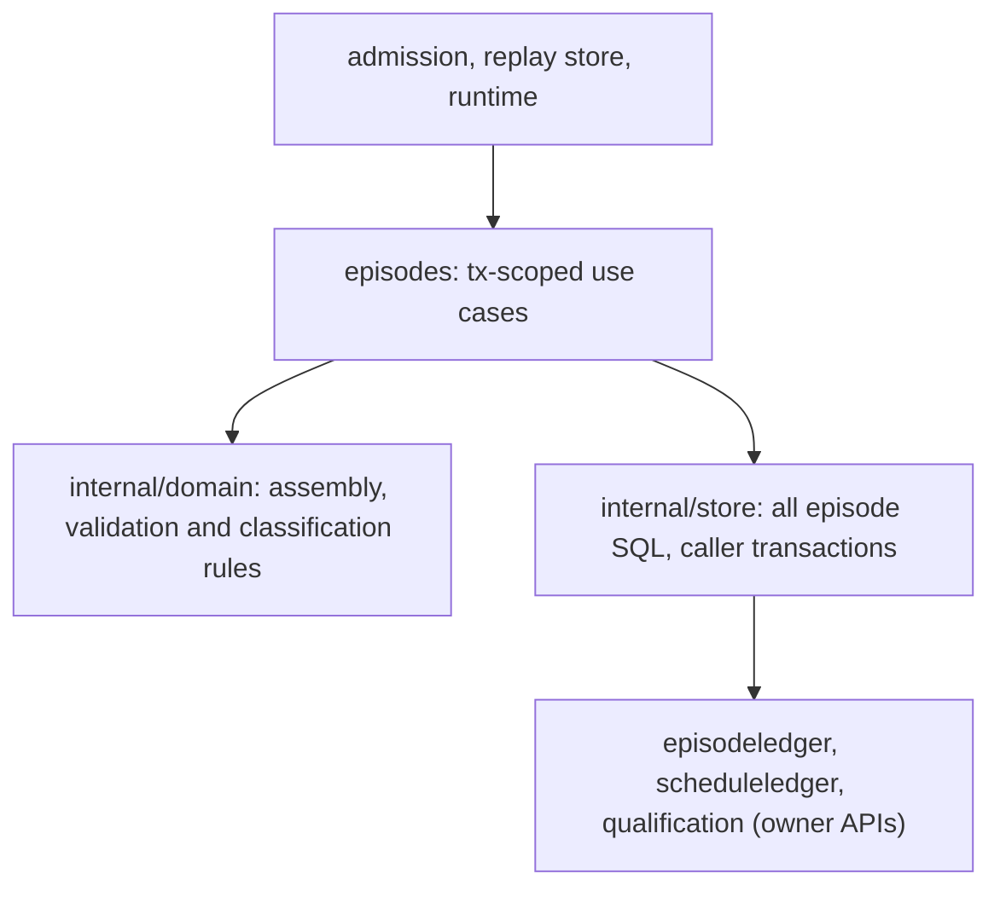

# Episodes reference-module migration

Episodes becomes the next reference module with the shape its transaction
contract dictates: a thin-ish facade holding the transaction-scoped use cases
(assembler and runner — the module's public API takes `*sql.Tx`, like
episodeledger), pure assembly, validation and classification rules in a
domain layer, and every SQL statement in a store layer that also takes the
caller's transaction. Behavior, public API and transaction boundaries are
preserved.

- [Findings](FINDINGS.md)
- [Ubiquitous language](UBIQUITOUS_LANGUAGE.md)
- [Design](DESIGN.md)
- [Plan and rounds](PLAN.md)
