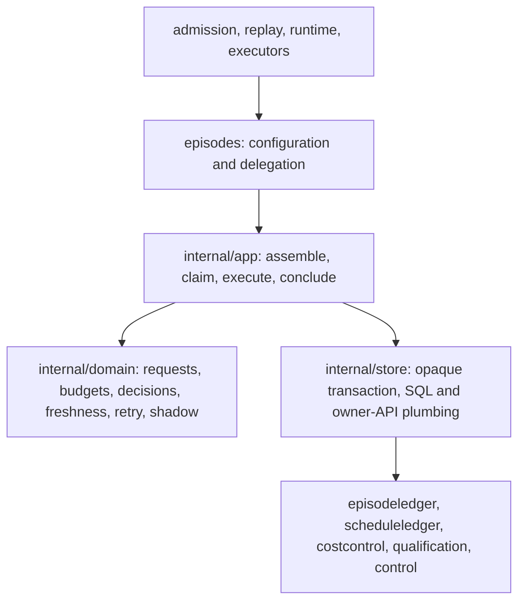

# Episodes reference-module migration

Complete the in-progress migration to a public facade, private application use
cases, pure domain rules and transaction-scoped persistence. Admission and
replay retain their original transactions: the facade joins them through an
opaque store transaction, just as policy does. Concrete deterministic fixture
execution belongs to `internal/executor/fixture` behind the episode port.

- [Findings](FINDINGS.md)
- [Language](UBIQUITOUS_LANGUAGE.md)
- [Design](DESIGN.md)
- [Rounds and validation](PLAN.md)
- [Dead and test-only code audit](CODE_AUDIT.md)
