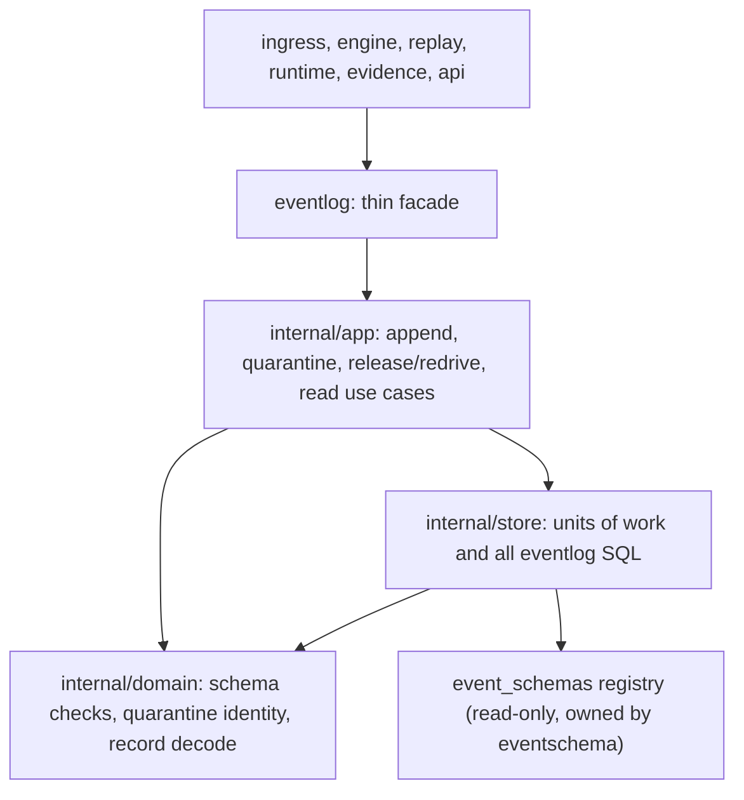

# Event log reference module migration

The append-only normalized evidence log becomes a reference module following
the authority pattern (it owns durable tables and their rules): a thin public
facade over ordered use cases, pure admission and identity rules in a domain
layer, and every SQL statement and transaction in a store layer with
caller-owned unit-of-work plumbing. The migration is behavior-preserving:
error strings and precedence, duplicate and quarantine semantics, digests,
transaction boundaries and clock reads stay identical, proven by the untouched
package test suite.

- [Findings](FINDINGS.md)
- [Ubiquitous language](UBIQUITOUS_LANGUAGE.md)
- [Design](DESIGN.md)
- [Plan and rounds](PLAN.md)
