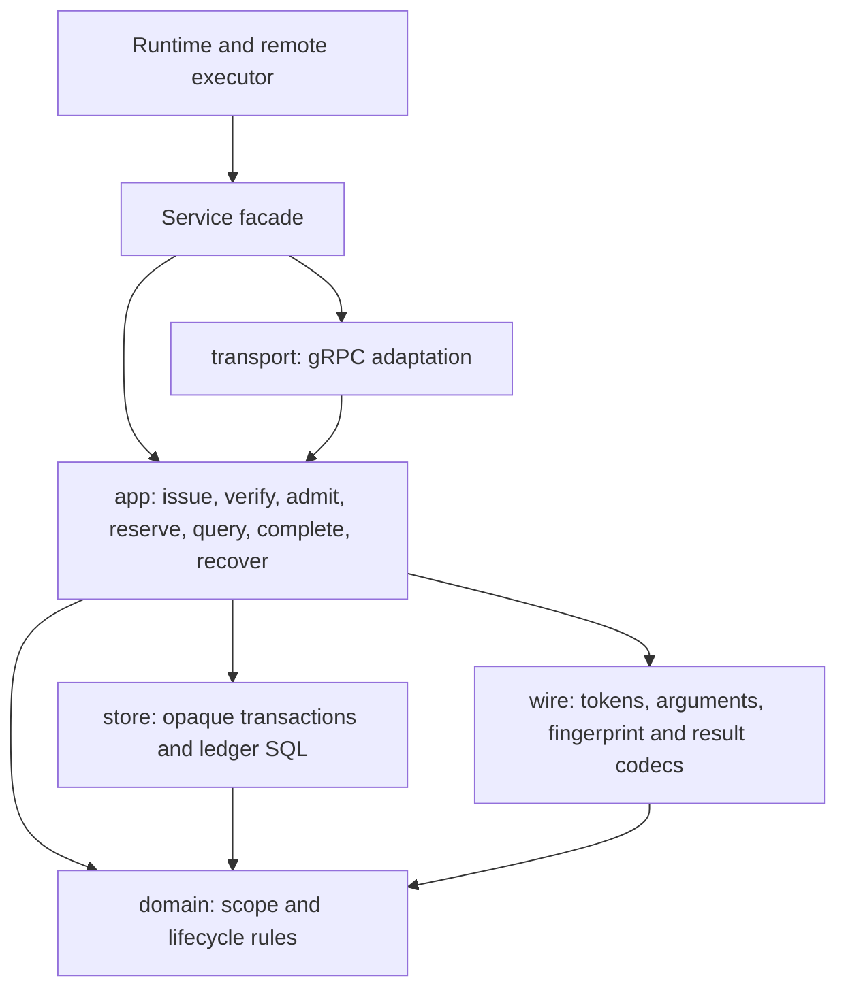

# Evidence reference-module migration

Evidence is the capability-scoped, bounded, read-only tool boundary for episode
workers. Its public package becomes a configured Service facade. Application
use cases order token admission, durable reservation, query and completion;
domain rules decide authorization and lifecycle validity; store owns SQL;
wire owns token/argument/result codecs; transport adapts gRPC to application
values. No protocol, schema, digest or external effect changes are planned.

- [Findings](FINDINGS.md)
- [Language](UBIQUITOUS_LANGUAGE.md)
- [Design](DESIGN.md)
- [Plan](PLAN.md)
