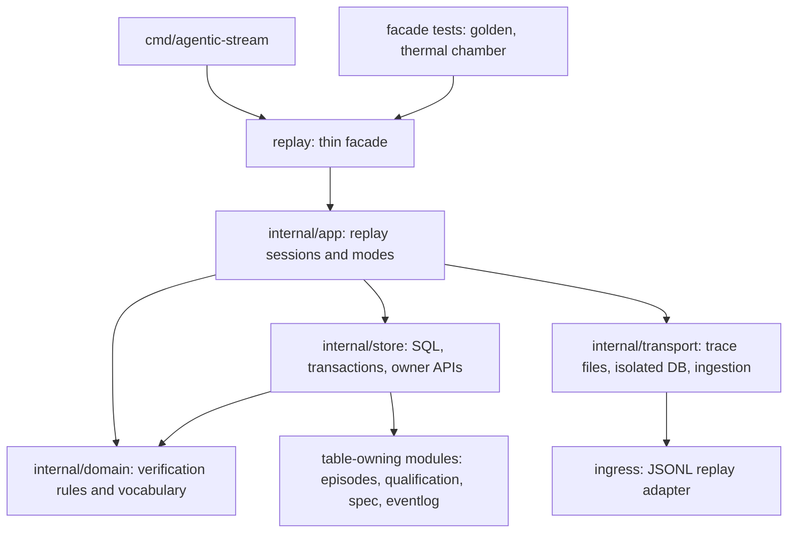

# Replay reference module migration

Replay becomes the next reference module, following the runtime composition
pattern: a thin public facade over ordered use cases, pure verification rules in
a domain layer, all SQL and transaction plumbing in a store layer, and file
sources (trace readers, isolated databases) in a transport layer. The migration
is behavior-preserving: digests, error precedence, clock semantics, transaction
boundaries and the effect-free boundary of every replay mode stay byte- and
rule-identical, proven by the untouched facade-level golden and thermal-chamber
tests.

- [Findings](FINDINGS.md)
- [Ubiquitous language](UBIQUITOUS_LANGUAGE.md)
- [Design](DESIGN.md)
- [Plan and rounds](PLAN.md)
