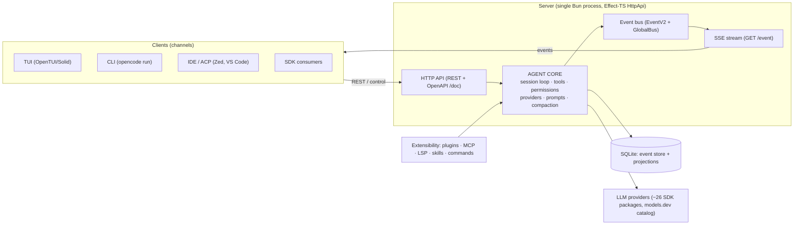
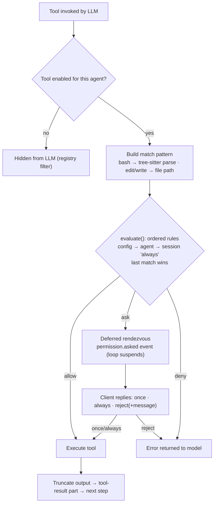
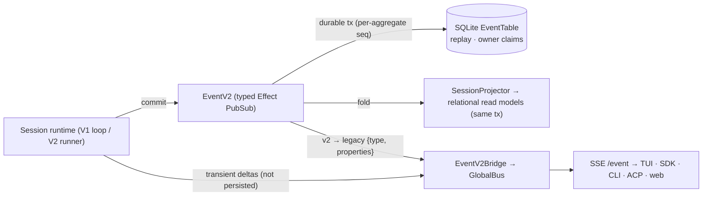
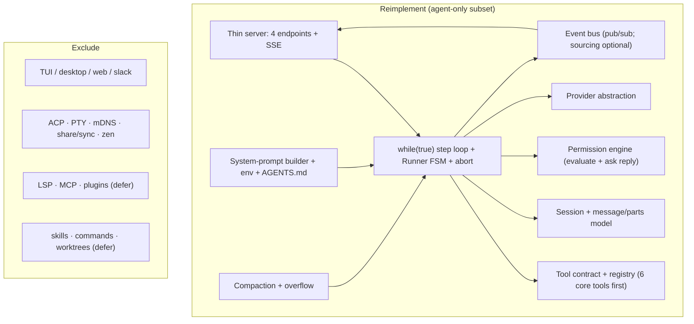

# Mermaid diagram sources (for ghassan-alhamoud.com reuse)

## M1 — Container map



## M2 — Agent loop sequence (one prompt turn)

```mermaid
sequenceDiagram
    autonumber
    participant C as Client (TUI/SDK/CLI)
    participant L as SessionPrompt loop
    participant P as Permission engine
    participant T as Tool registry
    participant M as LLM provider
    participant E as Event store + bus

    C->>L: POST /session/:id/prompt_async
    loop while(true) — hand-rolled ReAct loop
        L->>L: status=busy; load messages (filterCompacted)
        L->>M: streamText(system prompt + messages + tools)
        M-->>L: LLMEvent stream: text / reasoning / tool-call
        L->>E: commit part.updated (durable) + part.delta (transient)
        alt tool call requires approval
            L->>P: evaluate(permission, pattern)
            P-->>C: permission.asked event
            C-->>P: POST /permission/:id/reply (once/always/reject)
        end
        L->>T: execute tool (abort-aware, truncated output)
        T-->>L: result + <diagnostics> → tool part
        L->>L: guards: doom-loop, overflow→compact
    end
    L->>E: final message + token/cost summary
    E-->>C: SSE /event fan-out
```

## M3 — Permission evaluation



## M4 — Event-sourced core



## M5 — Clone blueprint (minimal subset)


