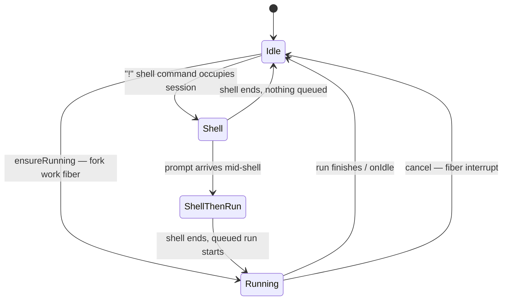
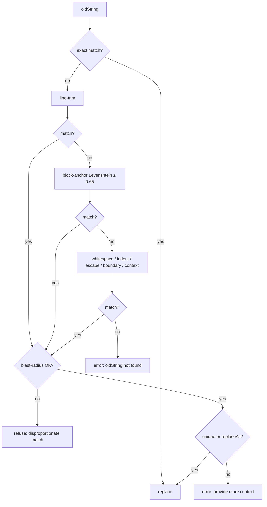
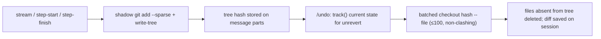
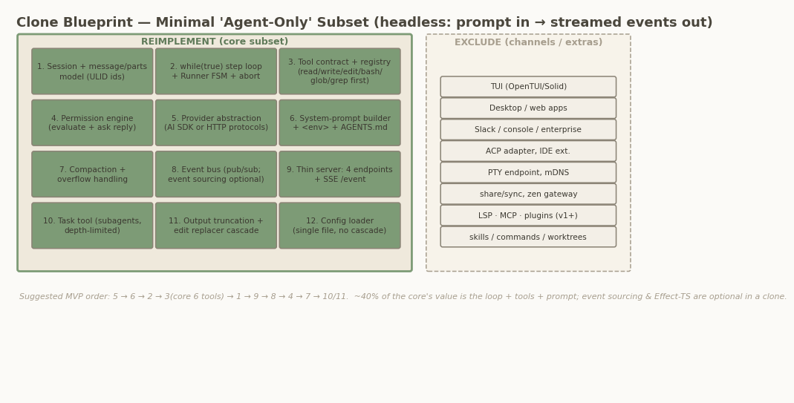
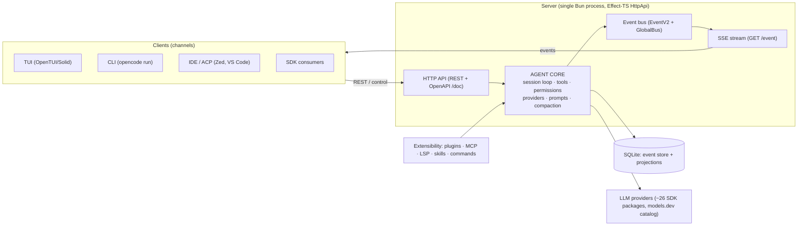
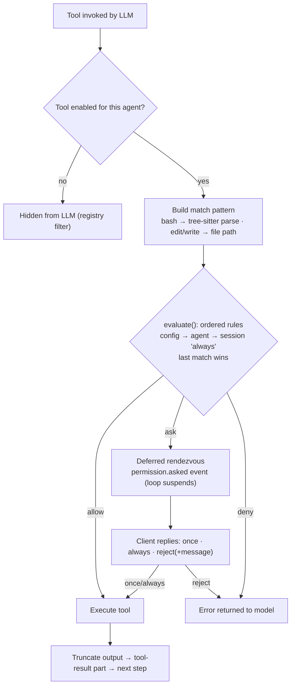
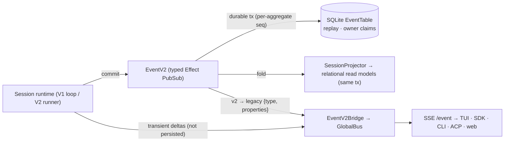
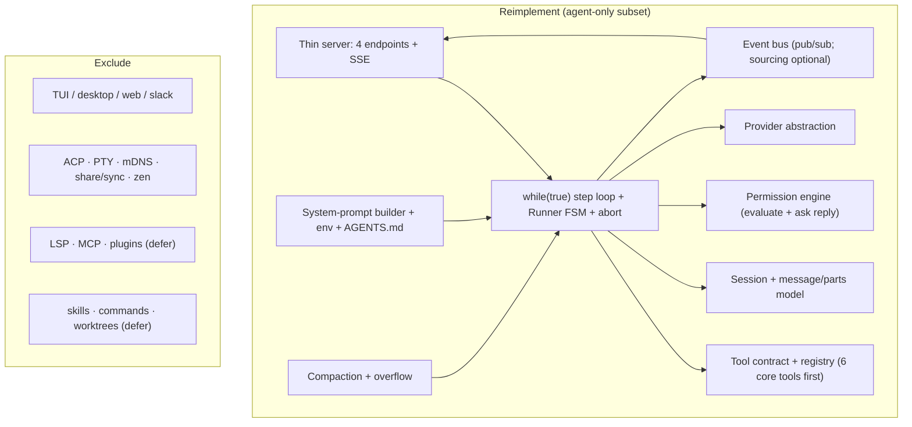

# OpenCode Under the Hood: Architecture and Agent Patterns of a Production Coding Agent

**A senior-architect study of the OpenCode codebase, with a blueprint for cloning the agent core**

| | |
|---|---|
| **Subject** | OpenCode — "the open source AI coding agent" |
| **Repository** | [github.com/anomalyco/opencode](https://github.com/anomalyco/opencode) (formerly sst/opencode) |
| **Revision analyzed** | `dev` branch @ `a19b52e85bf2`, version 1.18.3, snapshot 2026-07-20 |
| **Companion to** | The AI Agents Patterns handbook at ghassan-alhamoud.com |
| **Scope** | The agent itself — loop, tools, models, permissions, events, extensibility. Channels (TUI, desktop, web, Slack) are analyzed only as clients of the agent core. |

*Methodology: this study is based on a full read of the source tree at the revision above, performed by seven parallel analysis tracks (agent loop, tool system, providers/models, permissions, server/events, extensibility, official documentation), cross-validated and spot-verified against the code. Every architectural claim carries an inline file:line citation that can be checked against the repository at that commit. Where the code and the documentation disagree, the code wins and the disagreement is flagged.*

---

## Chapter 1 — Executive Summary

OpenCode (`anomalyco/opencode`) is the open-source, MIT-licensed AI coding agent: provider-agnostic by design, it runs as a terminal UI, desktop app, IDE extension, and headless server against 24 bundled provider packages and the models.dev catalog. With roughly 187k GitHub stars as of July 2026 and a full v2 rewrite in flight, it is one of the very few production-grade agent codebases whose internals — loop, tools, permissions, provider layer, storage — can be read end to end. This study analyzes the dev branch at commit a19b52e85bf2 (v1.18.3, analyzed 2026-07-20), and every claim cites file and line so the reader can verify it against the source. OpenCode rewards this scrutiny because it has already solved, in public, the problems every agent builder hits in private — and because its mistakes and migrations are as instructive as its successes.

Five findings headline the study:

| # | Headline finding | Treated in |
|---|---|---|
| 1 | Own the loop: a hand-rolled `while (true)` ReAct loop beats SDK steppers for control | Chapter 3 |
| 2 | Everything is a permission-gated tool behind a fail-closed ordered-rule engine | Chapters 4, 6 |
| 3 | Client–server plus an event-sourced core makes every channel replaceable | Chapters 2, 7 |
| 4 | Pattern density: ~35 canonical design patterns in one codebase | Chapter 9 |
| 5 | The tree is mid-migration: the v1 production loop runs atop a staged Effect-TS v2 core | Chapters 2, 3, 10 |

Each finding is load-bearing. Owning the loop (`session/prompt.ts:1088`) is what makes exit tests, step accounting, and mid-stream overflow truncation expressible at all — the AI SDK's `maxSteps` cannot see the event-sourced history those mechanisms need. The permission engine reduces safety to an ordered rule array with last-match-wins semantics and a default of `ask`: a gate, an audit trail, and a steering channel in thirteen lines. Because every mutation is a durable event committed with its projections, fork, revert, compaction replay, and live multi-client streaming fall out of a single commit path rather than being features in their own right. The pattern census (Chapter 9) quantifies the study's central observation: a production coding agent is roughly 20% cognition and 80% control engineering. And the migration warning is practical, not academic — readers must distinguish what serves production today (`packages/opencode/src/session/`) from staged successors (`packages/core`, `packages/llm`, `packages/protocol`) before copying anything.

The clone takeaway, in three sentences: clone the behavioral core — the loop, the tool set, the prompt pipeline, the permission gate, and compaction — which Chapter 10 estimates at roughly 2,000 disciplined lines to reproduce what makes OpenCode useful; defer the heavy infrastructure (additional channels, Effect-TS, event sourcing, the config cascade) until you feel its pain, because OpenCode itself shipped without them; and remember that the MIT license makes the source itself the documentation — read it, don't reinvent it.

To read this study: Chapters 2–3 establish the system shape and the agent loop; Chapters 4–6 dissect the working surfaces (tools, models and providers, permissions); Chapters 7–8 cover the server, event, storage, and extensibility layers; Chapter 9 synthesizes the patterns catalog; and Chapter 10 distills everything into a clone blueprint. Interpretation is always marked as such; everything else is code evidence.

---

## Chapter 2 — System Architecture & Design Philosophy

This chapter establishes the architectural frame for the whole study: what OpenCode is, how its processes and packages are laid out, which internal layers the agent core organizes into, and the design philosophy that explains why. Everything is verified against the dev-branch checkout (`anomalyco/opencode` @ `a19b52e85bf2`, `opencode` package v1.18.3); interpretive claims are marked as such.

### 2.1 What OpenCode is

OpenCode is an open-source (MIT-licensed) AI coding agent distributed as a single Bun/TypeScript binary. Its own documentation defines it by delivery channel rather than by runtime: "an open source AI coding agent… available as a terminal-based interface, desktop app, or IDE extension" ([docs](https://opencode.ai/docs/)). Three commitments distinguish it from its two closest comparators:

1. **Provider agnosticism.** Where Claude Code is coupled to Anthropic's models and Cursor to its own subscription backend, OpenCode connects to "75+ LLM providers through Models.dev, including local models" ([opencode.ai](https://opencode.ai/)). The project's canonical FAQ states the reasoning: as models converge and prices drop, "being provider agnostic is important" ([2025 README mirror](https://github.com/Decentralised-AI/opencode2025)).
2. **Full source availability.** The entire agent — loop, tools, permissions, server — is in one public monorepo, which is what makes this study (and cloning) possible at all.
3. **Client/server as a first-class claim.** The FAQ's fourth pillar is architectural: "the TUI frontend is just one of the possible clients." This is not marketing; §2.2 shows it is the load-bearing structural decision.

A fourth, softer commitment is privacy: "OpenCode does not store any of your code or context data" ([landing page](https://opencode.ai/)); session state lives under local XDG directories (`packages/core/src/global.ts:10-29`). Historically the project was a Go codebase (BubbleTea TUI), rewritten to Bun/TypeScript during the 0.x line — a fact documented only externally, but consistent with today's `Bun.build({compile: true})` distribution.

### 2.2 Client–server topology: one process, many channels

The docs are unusually direct about the runtime shape: "When you run `opencode` it starts a TUI and a server. Where the TUI is the client that talks to the server. The server exposes an OpenAPI 3.1 spec endpoint… This architecture lets opencode support multiple clients and allows you to interact with opencode programmatically" ([server docs](https://opencode.ai/docs/server/)). Figure 1 maps the containers.


*Figure 1: OpenCode container map. One process hosts server and agent core; every client channel consumes the same typed HTTP API and SSE event stream.*

The code confirms the picture with one correction to common belief: the HTTP stack is **not Hono** (zero `hono` imports remain) but Effect-TS `HttpApi`/`HttpRouter` served over Node's `http` via `@effect/platform-node` (`packages/opencode/src/server/server.ts:100-115`). Key topology facts:

- **Listener.** `Server.listen()` (`server.ts:73-98`) binds TCP, trying port **4096 first, then any free port** (`server.ts:117-122`). Authentication is optional HTTP Basic (`server/auth.ts:17-34`).
- **In-process mode.** `Server.Default` (`server.ts:56-65`) exposes the identical router as a Web `fetch` handler with no socket. The headless CLI drives exactly this against the synthetic origin `http://opencode.internal` (`packages/opencode/src/cli/cmd/run.ts:911-953`), so `opencode run` and `opencode serve` exercise one code path.
- **Channels.** The TUI runs in a worker thread whose `fetch` is an RPC bridge into the main process (`packages/opencode/src/cli/cmd/tui.ts:25-48`); the JS SDK spawns `opencode serve` as a child process (`packages/sdk/js/src/server.ts:24-60`); `sdk-next` drives the same handlers in memory (`packages/sdk-next/src/opencode.ts:11-42`); ACP editors (Zed et al.) reach a thin adapter delegating every protocol method to an `OpencodeClient` (`packages/opencode/src/acp/agent.ts:24-93`) — a channel, not a second agent.
- **Streaming.** SSE is the primary event transport (`GET /event`, first frame `server.connected`); WebSockets exist **only** for pseudo-terminal connections.
- **Multi-project.** One process serves many working directories: `InstanceStore` caches one instance context per absolute directory (`packages/opencode/src/project/instance-store.ts:37-203`), and every request is routed by a `?directory=` / `x-opencode-directory` header (`packages/opencode/src/server/routes/instance/httpapi/middleware/workspace-routing.ts:22-27`).

The architectural consequence (interpretation): because all session state lives server-side and every client is disposable, "the agent" is unambiguously the server process. This is the single most clone-friendly property of the system — a cloner can reimplement four endpoints plus SSE and remain wire-compatible (Chapter 7, Chapter 8).

### 2.3 Monorepo layering: v1 production meets v2 foundation

The repo is a Bun workspace monorepo (`packages/*` in the root `package.json`). Its most important structural fact is that it currently houses **two generations of the agent**, coexisting by design: the v1 production core in `packages/opencode`, and the v2 rewrite staged as separate `@opencode-ai/*` packages.

| Package | Role | Line | Effect-TS? |
|---|---|---|---|
| `opencode` (`packages/opencode`) | v1 production: session loop, tools, permissions, server, CLI/TUI entry | v1 | Yes (services + Layer DAG; LLM via AI SDK by default) |
| `@opencode-ai/schema` | Event/type contracts, event manifest, Effect Schema codecs | v2 | Yes |
| `@opencode-ai/core` | Durable event store, projectors, session runtime, DI utilities (`LayerNode`) | v2 | Yes |
| `@opencode-ai/protocol` | v2 HTTP API contract as a typed `HttpApi` | v2 | Yes |
| `@opencode-ai/server` | v2 route assembly and service wiring for that contract | v2 | Yes |
| `@opencode-ai/llm` | Canonical provider protocols, routing, `LLMEvent` schema, cache policy | v2 (shared) | Yes |
| `@opencode-ai/client` | Generated client; root entry zero-Effect, `/effect` subpath | v2 | Peer-only |
| `@opencode-ai/sdk-next` | Embedded composition (Client + Core + Server in memory) | v2 | Yes |
| `@opencode-ai/plugin` | Public plugin API types (`Plugin`, `tool`) | v1 | Yes |
| `@opencode-ai/tui`, `packages/{desktop,web,app,…}` | Channel packages | both | Yes / n/a |

The layering is enforced, not informal: `AGENTS.md` mandates the dependency direction "from Schema to Core and Protocol, then from Core and Protocol to Server," forbids Client from importing Core or Server, and requires regenerating the typed client whenever the public Protocol or Server `HttpApi` changes. Every v2 package depends on `effect` 4.0.0-beta; `client` lists it only as a peer dependency, preserving a zero-Effect entry point for browser consumers. For a cloner (interpretation) the v2 packages form a ports-and-adapters skeleton — `protocol` owns contracts, `server` injects services, channels are interchangeable adapters (`packages/protocol/src/api.ts:37-64`, `packages/server/src/routes.ts:39-63`) — while v1 remains the code that actually ships. Reading v1 teaches the behavior users run; reading v2 teaches where the boundaries are being formalized.

### 2.4 Internal component architecture

Zooming into the agent core itself (`packages/opencode/src` atop `packages/core` and `packages/llm`), the components arrange into three layers, shown in Figure 2.


*Figure 2: Internal component architecture. Session orchestration drives capabilities; capabilities rest on the foundation layer. All components are Effect services composed in a Layer DAG and scoped per project.*

- **Session orchestration** owns the conversation lifecycle: the hand-rolled `while (true)` agent loop in `SessionPrompt` (`packages/opencode/src/session/prompt.ts:1088`), the per-turn `SessionProcessor` that folds the LLM event stream into message parts, the per-session `Runner` state machine (`Idle | Running | Shell | ShellThenRun`, `packages/opencode/src/effect/runner.ts:33-37`), compaction/overflow management, and the retry schedule. This layer is the subject of Chapter 3.
- **Capability layer** owns what the agent can do: the tool registry (Chapter 4), the tri-state permission engine (Chapter 6), prompt assembly with cache breakpoints, agent definitions (`build`/`plan`/`general`/`explore` plus hidden system agents), and git-backed snapshots enabling `/undo`.
- **Foundation layer** owns externalized concerns: provider/model abstraction over the Vercel AI SDK with a Models.dev registry, the opt-in native `@opencode-ai/llm` stack (Chapter 5), the `EventV2` durable event bus with SQLite-backed event sourcing (Chapter 7), authentication, and the eight-level config cascade.

Two facts orient all later chapters. First, persistence is already v2 even though the loop is v1: `Session` is a façade whose every mutation publishes a durable event (`packages/opencode/src/session/session.ts:537`), folded into relational read tables by `SessionProjector` (`packages/core/src/session/projector.ts`) — textbook CQRS. Second, both LLM runtimes converge on one canonical `LLMEvent` stream, so orchestration is runtime-agnostic (`packages/opencode/src/session/llm/AGENTS.md`).

### 2.5 Design philosophy

Three philosophical commitments recur everywhere and explain most local decisions.

**Effect-TS dependency injection.** Every major component is a `Context.Service` identified by a string tag (e.g. `@opencode/Session`, `session.ts:476`; `@opencode/InstanceStore`, `instance-store.ts:29`), and wiring is declared as a DAG of `LayerNode`s with statically checked dependencies (`packages/core/src/effect/layer-node.ts`). Per-project state uses a distinctive pattern: `InstanceState` wraps a `ScopedCache` keyed by the instance directory (`packages/opencode/src/effect/instance-state.ts:30-52`), so services written as singletons transparently resolve per-project values. The payoff (interpretation): testability and multi-tenancy from one mechanism, and a v1→v2 migration that can proceed service-by-service because each is an independent DAG node.

**Event-driven, event-sourced core.** `EventV2` (`packages/core/src/event.ts:150`) unifies typed pub/sub with durable event sourcing: a durable event commits in one SQLite transaction that assigns a per-aggregate sequence, runs projectors inline, and only then notifies subscribers (`event.ts:205-366`); a compatibility bridge re-emits everything onto the legacy `GlobalBus` (`packages/opencode/src/event-v2-bridge.ts:14-67`). Events are not a notification afterthought but the sole state-change mechanism — which is what makes multi-client sync, replay, and the `/sync/*` endpoints possible.

**The HTTP API is the extension boundary.** The server serves an OpenAPI 3.1 document at `GET /doc`, and the published SDK is generated from it (`packages/sdk/js/script/build.ts`); plugins receive an SDK client rather than internal module handles. The docs state the intent plainly — the architecture "allows you to interact with opencode programmatically" ([server docs](https://opencode.ai/docs/server/)). Internal TypeScript modules are explicitly *not* the supported surface.

### 2.6 Version context

This study pins v1.18.3 (`packages/opencode/package.json`). Three signals locate that release on the v1→v2 trajectory. First, the native LLM path exists but is gated: `experimentalNativeLlm` is bound to `OPENCODE_EXPERIMENTAL_NATIVE_LLM` (`packages/opencode/src/effect/runtime-flags.ts:54`) and restricted to openai/anthropic/opencode providers. Second, `CONTEXT.md` ("OpenCode Session Runtime") is a 225-line domain-language spec for the v2 session engine — it legislates vocabulary ("System Context," *avoid*: "system prompt"; "Provider Turn"; "Prompt Promotion") and records unsettled public decisions, such as the singular-vs-plural `session` namespace and the planned `sdk-next` → `sdk` rename. Third, `AGENTS.md` already enforces the v2 dependency direction and codegen workflow. The public v2 beta (`@opencode-ai/cli@next`, binary `opencode2`, [v2.opencode.ai](https://v2.opencode.ai/)) warns that data may be wiped and APIs may change. Cloners should treat v1.18.3 as the behavioral reference and the v2 packages as the structural preview.

### Architect's take

*(Interpretation.)* OpenCode's deepest design decision is not Effect-TS or event sourcing but the insistence that the server is the product and every interface is a client; that single choice buys multi-channel reach, a generated SDK, and a clean clone boundary almost for free. If you clone, copy the v1 loop's *behavior* but adopt the v2 packages' *boundaries* — contracts in a protocol package, services behind DI tags, events as the only mutation path. And treat the OpenAPI document, not the source tree, as the compatibility contract: everything else is explicitly allowed to move.

---

## Chapter 3 — The Agent Loop

The agent loop is the heart of OpenCode: the code that turns a user prompt into a bounded cycle of model calls, tool executions, and history updates. In the current dev tree it lives in `packages/opencode/src/session/` as four cooperating Effect-TS services — `SessionPrompt` (turn cycle), `SessionProcessor` (one provider turn), `LLM` (request preparation and streaming), and `Session` (the session aggregate) — all composed through dependency-injected `Context.Service` layers (`packages/opencode/src/session/session.ts:476`). A durable next-generation foundation already exists under `packages/core/src/`, and this chapter notes where the production V1 loop is already a façade over it; the migration itself is treated in the architecture-overview chapter. Everything below is verified against `anomalyco/opencode` dev @ a19b52e85bf2.

### 3.1 Session and message model

A session is created by `Session.create` → `createNext` (`session.ts:501–540`), which builds an `Info` record (`session.ts:224–244`) carrying: a **descending ULID** as `id` (so lexicographic order equals recency, making "latest message" a max-id lookup), a human `slug`, `projectID`, an optional `parentID` that links subagent sessions into a tree, a generated `title`, the active `agent`, the selected `model {id, providerID, variant}`, usage rollups (`summary`, `cost`, `tokens {input, output, reasoning, cache{read, write}}`), and bookkeeping for `share`, `revert`, and the session's `permission` ruleset. Every mutation is published as a durable event (`session.ts:537`, `session.ts:736–749`), which is what makes the read model, forks, and reverts cheap — see below.

Messages form a three-level model, defined in `packages/schema/src/v1/session.ts` and re-exported as `SessionV1`. A **user message** (`v1/session.ts:332–354`) pins the `agent`, `model`, optional output `format` (text or JSON schema), per-message `tools` overrides, and an optional `system` prompt override. An **assistant message** (`v1/session.ts:453–485`) points back via `parentID` to the user message it answers — the conversation is a parent-linked chain, not an array — and records `cost`, `tokens`, the `finish` reason, and an `error` typed as a discriminated union of eight classes (AuthError, AbortedError, APIError, ContextOverflowError, ContentFilterError, StructuredOutputError, OutputLengthError, Unknown; `v1/session.ts:385–394`). Each message owns a list of **parts**, the twelve content variants the loop can emit (`v1/session.ts:357–370`):

| Part variant | Role in the model |
|---|---|
| `text` | Streamed user/assistant text, folded from deltas |
| `reasoning` | Model reasoning stream, published as deltas only |
| `tool` | A tool call, itself a four-state machine (see below) |
| `file` | Attached file content (e.g. base64 images/PDFs from tool results, `tool/tool.ts:48–53`) |
| `step-start`, `step-finish` | Step boundaries; `step-finish` triggers snapshot, usage accounting, and the patch diff (`processor.ts:457–482`) |
| `snapshot` | Git snapshot reference used by revert |
| `patch` | Diff of the step's file changes, computed from the snapshot |
| `agent`, `subtask` | Multi-agent bookkeeping; a `subtask` on a user message queues work the loop dispatches |
| `retry` | Records a retry attempt |
| `compaction` | A compaction task carried on a synthetic user message |

The table hides the most important detail: the `tool` part is not a value but a **state machine** (`v1/session.ts:259–313`) — `pending {input, raw}` → `running {…, time.start}` → `completed {output, metadata, time, …}` or `error {error, time, …}`. Because every transition is an event, the UI renders a tool call's life cycle live and the loop can reason about "unfinished tool parts" when deciding whether to continue; the `time.compacted` field doubles as the tombstone used by output pruning (§3.6). Persisting parts rather than whole messages is also what lets delta streaming stay transient while state transitions stay durable — the split the next paragraph makes precise.

**Persistence is event-sourced.** All state changes are published as durable events declared `durable: { aggregate: "sessionID", version: 1 }` (`v1/session.ts:502–507`); only `message.part.delta` (`v1/session.ts:632–641`) is deliberately non-durable, reserved for high-frequency streaming. The commit path, `EventV2.commitDurableEvent` (`packages/core/src/event.ts:205–366`), runs inside a single SQLite `immediate` transaction: increment the per-aggregate sequence, run the registered **projectors** in the same transaction, append to `EventTable`. Replay is guarded by optimistic concurrency — a sequence mismatch or payload divergence dies with `InvalidDurableEventError` (`event.ts:284–302`). Projectors in `packages/core/src/session/projector.ts` upsert `MessageTable`/`PartTable` rows and re-apply usage rollups with signed add/subtract; reads then hit the projections, not the log (`message-v2.ts:425–467` paginates `MessageTable` newest-first with a `(time, id)` cursor). The practical consequence: the legacy V1 session service is already a thin event-publishing façade over the V2 store.

Two tree operations round out the model. **Fork** (`session.ts:693–734`) copies messages up to an optional boundary, re-issuing ascending message/part IDs and remapping assistant `parentID`s through an ID map. **Revert** (`packages/opencode/src/session/revert.ts:38–88`) captures a git snapshot, undoes file changes via the recorded `patch` parts, and stores `session.revert{messageID, partID, snapshot, diff}` — but deletes messages only lazily, at the start of the *next* prompt (`prompt.ts:1056`), which is exactly what makes `unrevert` (`revert.ts:90–98`) possible.

### 3.2 The hand-rolled loop

`SessionPrompt.prompt` (`prompt.ts:1052–1071`) is the entry point: clean up any pending revert, build the user message (resolving `@file`/`@agent` mentions and data URLs into parts), touch the session, apply per-message permission overrides, then enter `loop({sessionID})`. The loop body, `runLoop` (`prompt.ts:1081–1341`), is an explicit **`while (true)`** (`prompt.ts:1088`) inside an Effect generator. This is a deliberate design decision: the AI SDK is used strictly per turn (`streamText` with `maxRetries: input.retries ?? 0`, `llm.ts:323`), and the SDK's own `maxSteps`/`stopWhen` machinery is **not** used. Step accounting, continuation, compaction scheduling, and step limits are owned by OpenCode, because all of them require access to the event-sourced history and session state that an SDK-internal stepper cannot see (this rationale is interpretation; the ownership itself is directly visible in the code). One iteration of the loop:

1. Set status `busy`; reload history through `MessageV2.filterCompactedEffect` (`:1092`).
2. Derive bindings via `MessageV2.latest` (`message-v2.ts:585–601`): max-id user/assistant/finished messages plus unprocessed `subtask`/`compaction` tasks.
3. **Exit test** (`:1111–1130`): break when the last assistant finished with a reason other than `tool-calls`, no unfinished tool parts remain (orphaned interrupted tools ignored, `:96–100`), and `lastUser.id < lastAssistant.id`. The comment at `:1103–1109` documents why the extra checks exist: some providers return `stop` even with pending tool calls.
4. `step++`; on step 1, fork title generation on a small model (`:1133–1139`).
5. Dispatch queued tasks: `subtask` → `handleSubtask`, `compaction` → `compaction.process`; **overflow pre-check** creates an auto-compaction if the last turn's tokens overflow the model (`:1161–1168`).
6. Resolve the agent and `maxSteps = agent.steps ?? Infinity` (`:1178`); on the last allowed step, append a synthetic "tools are disabled, respond with text only" message (`MAX_STEPS_PROMPT`, `packages/core/src/session/runner/max-steps.ts:1–16`).
7. Inject synthetic reminder parts (plan-mode/build-switch prompts, `reminders.ts:15–90`).
8. Create and publish the assistant message; run `processor.create` guarded by an interrupt finalizer that stamps `AbortedError` (`:1203–1219`).
9. Resolve the tool set; JSON-schema sessions get a forced `StructuredOutput` tool with `toolChoice: "required"` (`:1243–1250`).
10. Assemble system context, convert history, and run one provider turn (`:1272–1286`).
11. Map the outcome (`:1288–1329`): structured output → break; `content-filter` → synthesize `ContentFilterError` and break; `"stop"` → break; `"compact"` → auto-compaction and continue.

After the loop, output pruning is forked and the last assistant message returned (`:1338–1339`). The net effect is a textbook ReAct cycle — reason, act, observe, repeat until the model stops asking for tools — implemented with full ownership of every transition.

### 3.3 The streaming pipeline


*Figure 3: One prompt turn end to end. The loop owns continuation; the AI SDK (or native runtime) only streams a single turn; persistence is split between durable part states and transient deltas.*

One provider turn is `SessionProcessor.process` (`processor.ts:627–683`), and its core fits in five lines:

```ts
const stream = llm.stream(streamInput)
yield* stream.pipe(
  Stream.tap((event) => handleEvent(event)),
  Stream.takeUntil(() => ctx.needsCompaction),
  Stream.runDrain,
)
```

(`processor.ts:640–646`). The stream is wrapped in `Effect.retry` with the session retry policy, `Effect.catch` for the halting path, and `Effect.ensuring` for cleanup; the result is the tri-state `"compact" | "stop" | "continue"` (`:679–681`) that the loop's outcome mapping consumes. `handleEvent` (`:278–537`) folds the canonical `LLMEvent` algebra into parts: reasoning events maintain a delta-only map; `tool-input-*` events create pending parts with one `Deferred` per call; a `tool-call` flips the part to running and passes the **doom-loop guard** — if the last `DOOM_LOOP_THRESHOLD = 3` tool parts are the same tool with identical input, a `doom_loop` permission is raised (`:356–380`); `tool-result` completes the part (normalizing image attachments); `tool-error` fails it and sets `ctx.blocked` so the loop stops after a denial (`:200–202`, overridable via `experimental.continue_loop_on_deny`, `:633`). On `step-finish` the processor takes a git snapshot, computes usage, diffs a `patch` part, and runs the overflow check that sets `needsCompaction` (`:457–482`) — which `Stream.takeUntil` turns into a mid-stream truncation. `cleanup` (`:539–597`) finalizes open parts, waits 250 ms for in-flight tool `Deferred`s, and fails unsettled calls with `"Tool execution aborted"` and `metadata.interrupted: true` — the exact marker the loop's orphan check reads.

Two properties make this pipeline robust. First, it is **runtime-agnostic**: whether events come from the AI SDK adapter (`LLMAISDK.toLLMEvents`, `llm/ai-sdk.ts:76+`) or from the opt-in native runtime over `@opencode-ai/llm`, they converge on the same `LLMEvent` stream, a seam documented in `packages/opencode/src/session/llm/AGENTS.md`. Second, persistence is **frequency-split**: full part states publish durable `message.part.updated` events (`session.ts:637–645`), while high-frequency text/reasoning deltas publish non-durable `message.part.delta` (`session.ts:879–887`) — the event log never pays for token-by-token streaming.
### 3.4 Aborts and interrupts: the Runner state machine

Concurrency control is centralized in `SessionRunState` (`run-state.ts:35–69`), which keeps exactly one `Runner` per session, and in `Runner.make` (`packages/opencode/src/effect/runner.ts:39–215`), a four-state machine (`runner.ts:33–37`):



`ensureRunning` implements **prompt coalescing**: if a run is already in flight, the caller joins its `Deferred` instead of forking a second loop, so duplicate prompts can never interleave tool calls on one session. A `!`-prefixed shell command may occupy the session first, queueing the pending run in `ShellThenRun`; `onIdle` flips `SessionStatus` back to idle and deregisters the runner (`run-state.ts:60–65`). Cancellation is a cascade: `SessionPrompt.cancel` → `SessionRunState.cancel` (`run-state.ts:77–86`) cancels matching background jobs iteratively over the descendant set (`:111–143`), then `Runner.cancel` interrupts the work fiber, whose scope release in turn aborts the in-flight HTTP request to the provider (`llm.ts:361–364`). Every level has a corresponding cleanup: the loop's `Effect.onInterrupt` finalizer stamps the assistant message with `AbortedError` and `time.completed` (`prompt.ts:1203–1211`), and the processor's cleanup marks unsettled tool parts as interrupted — so a cancelled session is left in a consistent, resumable state rather than a half-written one.

### 3.5 Retries and error classification

Retry behavior exists at two deliberately different layers. The **session-level** policy, `SessionRetry.policy` (`packages/opencode/src/session/retry.ts:176–199`), is an Effect `Schedule` that retries *unbounded* as long as `retryable()` returns a reason. Its delay honors `retry-after-ms`/`retry-after` response headers (capped at 2³¹−1 ms) and otherwise backs off exponentially at `2000·2^(attempt−1)` ms, capped at 30 s (`:26–66`). `retryable()` (`:68–152`) never retries `ContextOverflowError`, retries `APIError` when flagged retryable or on status ≥ 500, and pattern-matches provider-specific bodies — free-tier usage limits map to a Go upsell action, account rate limits to a humanized reset-time message. Every attempt publishes a `SessionStatus {type: "retry", attempt, message, action, next}` event (`processor.ts:664–672`), so the UI can show a live countdown instead of a frozen spinner. The **transport layer** inside `packages/llm` has its own bounded retry — `MAX_RETRIES = 2` on statuses 429/503/504/529, jittered backoff `500·2^a ±20%` capped at 10 s, with aggressive credential redaction (`packages/llm/src/route/executor.ts:353–364`) — so a single HTTP call never hangs the unbounded outer schedule on transient flaps.

Errors raised anywhere in a turn are normalized by `MessageV2.fromError` (`message-v2.ts:603–731`) into the eight-class union of §3.1, then handled by `halt` (`processor.ts:599–625`):

| Error class | Typical source signal | Loop behavior |
|---|---|---|
| `AbortedError` | `DOMException` AbortError (user cancel) | Stamped by the interrupt finalizer; loop exits |
| `AuthError` | `LoadAPIKeyError` | Terminal: message error + `session.error`, session idles |
| `APIError` | `APICallError`, ECONNRESET, stream/header-timeout failures | Retried per policy when `isRetryable` or status ≥ 500 |
| `ContextOverflowError` | Provider rejection (`context_overflow`) or token check | Never retried; routed to auto-compaction (`halt` sets `needsCompaction`) |
| `ContentFilterError` | `finish: "content-filter"` | Synthesized by the outcome mapping + `session.error`; loop breaks (`prompt.ts:1288–1329`) |
| `StructuredOutputError`, `OutputLengthError`, `Unknown` | Schema/length failures, unrecognized throws | Terminal via `halt`: message error + `session.error`, session idles |

The notable asymmetry is that context overflow is classified as *never retryable* yet is the only error that is routinely recovered from — by compaction rather than repetition (`halt` diverts it to `needsCompaction` unless `compaction.auto === false`, in which case it becomes a terminal error). Retrying an overflowed request would be deterministic waste, while retrying a 5xx is nearly free; the classification encodes exactly that economics. Publishing retries as first-class session-status events, rather than logging them, is what keeps the failure mode observable to every connected client.

### 3.6 Context-window management

OpenCode treats the context window as a budget with three enforcement points. The budget itself is computed in `overflow.ts`: `usable()` = `limit.input − reserved`, where `reserved` is `config.compaction.reserved` or `min(COMPACTION_BUFFER = 20_000, maxOutputTokens)`; overflow is declared when the last turn's total tokens meet or exceed it. The three triggers: a **post-turn check** in the loop (`prompt.ts:1161–1168`), a **mid-stream check** at `step-finish` that truncates the live stream via `Stream.takeUntil(needsCompaction)` (`processor.ts:477–482`), and a **provider-rejected overflow** surfaced as `ContextOverflowError` through `halt`.

Recovery is the **compaction protocol** (`packages/opencode/src/session/compaction.ts`). `create` appends a synthetic user message carrying a `compaction` part (`:513–536`), which the loop picks up as a task. `process` (`:289–511`) then: finds the previous real user message as a replay anchor and drops everything after it (`:310–326`); hides earlier compaction/summary pairs; and selects the tail to preserve with `select` (`:188–239`) — the last `compaction.tail_turns` (default 2) user turns that fit `preserve_recent_tokens`, defaulting to `clamp(usable·0.25, 2_000, 8_000)`, with `splitTurn` allowing a partial turn. Summarization is delegated to the hidden `compaction` agent (`agent/agent.ts:219–233`, all-deny permissions), prompted by `buildPrompt` (`packages/core/src/session/compaction.ts:161–168`) to produce an **anchored summary** that updates the previous summary inside a fixed Markdown template (Objective / Important Details / Work State / Next Move / Relevant Files). Media is stripped and tool outputs truncated to 2 000 characters (`:351–354`). On success the session's `tail_start_id` advances, the replayed user message (or a synthetic "continue" message, gated by `experimental.compaction.autocontinue`) is re-injected, and a `Compacted` event is published; if even compaction overflows, the session fails terminally (`:404–413`). Reads then go through `MessageV2.filterCompacted` (`message-v2.ts:521–572`), which rebuilds model-visible history as `[compaction-user, summary, …tail from tail_start_id, …newer messages]` — a sliding window with a summarized past.

Independently, **pruning** (`compaction.ts:243–287`) reclaims tool-output bulk without touching semantics: walking newest→oldest past the last two user turns, it keeps the newest `PRUNE_PROTECT = 40_000` tokens of tool output and marks older completed tool parts `time.compacted` once more than `PRUNE_MINIMUM = 20_000` tokens would be pruned; the `skill` tool is protected, and pruning stops at summary boundaries. Pruned parts render as `"[Old tool result content cleared]"` (`message-v2.ts:293–294`), and the pass is forked after every run (`prompt.ts:1338`). Token accounting is authoritative from provider usage on `step-finish`, normalized by `Session.getUsage` (`session.ts:338–407`) — AI SDK v6 reports cache-inclusive input, so cache read/write are subtracted for costing — with `chars/4` as the offline estimate (`packages/core/src/util/token.ts`).

### 3.7 Subagents and session trees

Subagents are not a separate engine; they are the same loop, re-entered. Agents are defined in `agent/agent.ts:35–56` with a `mode` of `primary`, `subagent`, or `all`, a permission ruleset, and optional model/prompt/`steps` overrides; built-ins (`:140–265`) include the primaries `build` and `plan`, the subagents `general` and `explore` (read/search-only), and the hidden service agents `compaction`, `title`, and `summary` already met above. Spawning happens through the **`task` tool** (`tool/task.ts`): a depth check against `subagent_depth` (default 1, `:104–117`) prevents unbounded recursion; `permission.ask("task")` gates the spawn; the child session is created with `parentID` and a derived permission ruleset that auto-denies `todowrite` and nested `task` unless the agent declares them (`:139–172`); and the child then runs through the *same* `SessionPrompt.prompt` loop in-process (`:200–214`), inheriting the parent's model unless the agent pins one (`task.ts:175–180`). Foreground execution races `background.wait` against promotion, with parent abort cascading into child cancel (`:317–347`); background mode (behind `experimentalBackgroundSubagents`) registers a `BackgroundJob` and later injects the result into the parent as a synthetic `<task …>` user message (`:216–254`). User-queued `subtask` parts take a third path, executed inline by `handleSubtask` (`prompt.ts:255–449`) as a `task` tool part on a fresh assistant message. Because children are ordinary sessions, tree operations compose naturally: deleting a session recurses over its children and cancels their background jobs (`session.ts:608–629`).

### Architect's take

The single most transferable decision in this chapter is to *own the loop and rent the transport*: by confining the AI SDK to one streaming turn and keeping continuation, compaction, and step limits in a hand-rolled `while (true)`, OpenCode can implement exit tests, orphan handling, and mid-stream overflow truncation that no SDK-internal stepper exposes — a cloner should copy that boundary before anything else (this is interpretation). The event-sourced message model looks heavyweight until you notice that fork, revert, compaction replay, and live UI streaming all fall out of it for free; the durable/transient event split keeps that affordable. Finally, the cheap guards — the three-strike doom-loop check and tool-output pruning — are disproportionately valuable for long autonomous runs and are easy to overlook. What to watch: the durable V2 runner under `packages/core/src/session/runner/` is explicitly marked work-in-progress, so this chapter's V1 loop remains the production truth until its parity checklist closes.

---

## Chapter 4 — The Tool System

Chapter 3 followed the agent loop that emits tool calls; this chapter dissects what sits on the receiving end: how tools are defined, registered, gated, executed, and how their outputs are shaped before returning to the model. The permission engine that `ctx.ask` delegates to is the subject of Chapter 6; here we cover only the tool-side machinery.

### 4.1 The tool contract: Effect Schema in, Effect out

OpenCode's internal tool contract is neither the AI SDK's `tool()` helper nor zod — it is an Effect-TS abstraction defined in `packages/opencode/src/tool/tool.ts`. Every built-in is produced by `Tool.define(id, Effect.gen(...))` (`tool/tool.ts:151-169`), which yields an `Info` — a lazy `{id, init}` pair — whose initialized definition is:

```ts
// tool/tool.ts:55-65
export interface Def<Parameters extends Schema.Decoder<unknown>, M extends Metadata = Metadata> {
  id: string
  description: string
  parameters: Parameters            // Effect Schema.Struct, e.g. read.ts:28-36
  jsonSchema?: JSONSchema7          // pre-computed schema (plugin tools only)
  execute(args: Schema.Schema.Type<Parameters>, ctx: Context): Effect.Effect<ExecuteResult<M>>
  formatValidationError?(error: unknown): string
}
```

Three design decisions follow from this shape. First, **the parameter schema is the single source of truth**: one Effect `Schema.Struct` drives both runtime decoding of model-supplied arguments and, via `ToolJsonSchema.fromTool` plus per-model `ProviderTransform.schema` adaptation (`session/tools.ts:97-98`), the JSON Schema shown to the LLM. Second, **`execute` returns an `Effect`**, so tools compose with the runtime's dependency injection and structured concurrency. Third, results are normalized to `{title, metadata, output: string, attachments?}` (`tool/tool.ts:48-53`), where attachments carry base64 file parts — how `read` returns images and PDFs to multimodal models.

The execution `Context` (`tool/tool.ts:36-46`) is what makes a tool more than a pure function. It carries `sessionID`, `messageID`, the calling `agent` name, an `abort` signal, an optional `callID`, the prior `messages`, an `extra` bag (used to smuggle the model handle and `promptOps` into the task tool), and two callbacks: `metadata({title?, metadata?})`, streaming progress into the tool-call part for live UI rendering, and `ask(...)`, raising a permission request that blocks the fiber until the user approves or rejects. Every side-effecting tool funnels through `ask` — the fail-closed gate analyzed in Chapter 6.

`Tool.define` does not merely register the definition; it **wraps every `execute`** in a decorator (`tool/tool.ts:99-149`) that adds three cross-cutting concerns without any tool opting in:

```ts
// tool/tool.ts:120-135 (abridged)
const decoded = yield* decode(args).pipe(
  Effect.mapError((error) =>
    new InvalidArgumentsError({
      tool: id,
      detail: toolInfo.formatValidationError ? toolInfo.formatValidationError(error) : String(error),
    }),
  ),
)
const result = yield* execute(decoded as Schema.Schema.Type<Parameters>, ctx)
if (result.metadata.truncated !== undefined) {
  return result
}
const agent = yield* agents.get(ctx.agent)
const truncated = yield* truncate.output(result.output, {}, agent)
```

The decoder closure is hoisted once per init (`tool.ts:108-110` notes `decodeUnknownEffect` allocates per call). Decode failures become `InvalidArgumentsError` (`tool.ts:24-34`) whose message is deliberately model-facing prose — *"Please rewrite the input so it satisfies the expected schema"* — because the AI SDK feeds tool errors back as tool results, turning validation into a self-correction prompt. The wrapper also stamps an OTEL span `Tool.execute` with `tool.name`/`session.id`/`message.id`/`tool.call_id` attributes and applies **automatic output truncation** unless the tool already managed it (§4.8).

A second, provider-agnostic contract exists in `packages/llm/src/tool.ts` (typed and dynamic modes, a `ToolRuntime.dispatch` decode→execute→encode pipeline), but it is live only behind the `experimentalNativeLlm` flag; production bridges these `Def`s into AI SDK `tool()` wrappers in `SessionTools.resolve` (`session/tools.ts:41-49`). Plugin authors see a third surface — plain zod plus promises (`packages/plugin/src/tool.ts:45-51`) — which the registry adapts back into the internal contract (§4.2).

### 4.2 The registry: eager built-ins, scanned customs, per-model gating

`ToolRegistry` is an Effect service (`tool/registry.ts:84-344`) whose layer eagerly initializes all built-ins (`registry.ts:96-114`) and then assembles per-instance state — per project directory — via `InstanceState.make` (`registry.ts:116-249`). Tool sources are threefold:

1. **Built-ins.** Invalid, question, shell (exposed id `"bash"`, kept for compatibility — `tool/shell/id.ts:14-16`), read, glob, grep, edit, write, task, webfetch, todowrite, websearch, skill, apply_patch (`registry.ts:226-240`), plus three flag-gated additions: `execute` (code mode, `experimentalCodeMode`), `lsp` (`experimentalLspTool`), and `plan_exit` (`experimentalPlanMode` *and* CLI client) (`registry.ts:241-243`). The question tool is additionally gated to `app|cli|desktop` clients or `enableQuestionTool` (`registry.ts:202,228`).
2. **File-system custom tools.** Every config directory is scanned for `{tool,tools}/*.{js,ts}` (`registry.ts:178-192`); matches are dynamically imported as `file://` URLs and each export duck-type-validated (`isPluginTool`, `registry.ts:350-352`). Plugin packages contribute `p.tool` entries (`registry.ts:194-199`).
3. **The plugin adapter.** `fromPlugin` (`registry.ts:120-176`) converts zod args to JSON Schema via `z.toJSONSchema` with metadata normalization (`zodJsonSchema`, `registry.ts:369-416`), bridges the Effect-based `ask` into a promise for plugin code, and post-hoc truncates string results — so custom tools get the same output hygiene as built-ins.

Resolution for a request happens in `tools()` (`registry.ts:286-335`) and is **model- and agent-dependent**. `websearch` is exposed only for the opencode-zen provider or with exa/parallel flags (`registry.ts:288-290`). Most strikingly, **apply_patch and edit/write are mutually exclusive**: `usePatch = modelID.includes("gpt-") && !oss && !gpt-4` selects `apply_patch` for the gpt-5 family and `edit`+`write` otherwise (`registry.ts:292-295`) — the harness swaps the editing interface to match each model family's training. The task tool's description is dynamically suffixed with the subagent roster filtered through the caller's `task` permission (`describeTask`, `registry.ts:260-273`), and a plugin hook `tool.definition` may rewrite any description or schema per model (`registry.ts:313`).

Agent definitions never list tools; they carry a permission ruleset, and denied tools are **removed from the schema shown to the model** rather than merely refused at runtime (`session/llm/request.ts:208-213`, via `Permission.disabled`, which aliases `edit|write|apply_patch → "edit"`). The model cannot call what it cannot see; anything it *can* see but lacks approval for hits `ctx.ask` inside `execute`. This hidden-vs-ask split is the first two layers of the defense-in-depth cascade detailed in Chapter 6.

### 4.3 Built-in tool inventory

The table below enumerates every built-in tool at this commit. "Permission" is the key passed to `ctx.ask` (or the key used to hide the tool); "truncation" describes output capping behavior.

| Tool id | Purpose | Permission asked | Truncation | Notes |
|---|---|---|---|---|
| `invalid` | Represents malformed model tool calls | none | n/a | Description: "Do not use"; exists so bad calls surface as error parts (`invalid.ts:9-12`) |
| `bash` | Execute shell commands | `bash` + `external_directory` | own: 2× maxBytes in-memory ring, mid-stream spill, tail-biased cut | tree-sitter permission decomposition; 2-min default timeout (§4.5) |
| `read` | Read file or directory | `read` (+ `external_directory`) | own: 2000 lines / 50 KB / 2000 chars-per-line, offset hints (`read.ts:13-17,344-350`) | images/PDFs returned as attachments |
| `glob` | Find files by name pattern | `glob` (+ `external_directory`) | hard 100-result cap (`glob.ts:48-50`) | ripgrep-backed |
| `grep` | Regex content search | `grep` (+ `external_directory`) | hard 100-result cap (`grep.ts:63-68`) | description redirects counting to `rg` via bash |
| `edit` | Exact-string replacement | `edit` | decorator | 9-strategy replacer cascade, per-file lock, diff-before-ask (§4.4) |
| `write` | Full-file create/overwrite | `edit` | decorator | BOM-aware, creates parent dirs (`write.ts:54-72`) |
| `apply_patch` | Multi-hunk patch envelope | `edit` (single batched ask, `apply_patch.ts:206-215`) | decorator | gpt-5-family models only; validate-then-commit |
| `task` | Spawn subagent session | `task` (pattern = subagent type) | decorator | depth guard, background promotion (§4.6) |
| `todowrite` | Replace the session todo list | `todowrite` | decorator | denied to `general` subagent by default |
| `webfetch` | Fetch URL → markdown/text/html | `webfetch` (per-URL pattern) | decorator | HTTP→HTTPS upgrade; attachments |
| `websearch` | Web search via session provider | `websearch` (per-query) | decorator | zen provider or exa/parallel flags only |
| `skill` | Invoke a named skill | `skill` | decorator | loads skill instructions into context |
| `question` | Ask the user structured questions | hidden via `question` key | decorator | Deferred suspension; client-gated (§4.6) |
| `lsp` ⚑ | Language-server queries | `lsp` | decorator | `experimentalLspTool` flag |
| `plan_exit` ⚑ | Ask to leave plan mode | hidden via `plan_exit` key | decorator | `experimentalPlanMode` + CLI only; reuses question machinery |
| `execute` ⚑ | Code-mode: confined script over MCP catalog | per-MCP-tool rules | decorator | replaces individual MCP tools under `experimentalCodeMode` |

⚑ = flag-gated. MCP-bridged tools (`session/tools.ts:390-489`) and user custom tools extend this list at runtime.

Reading the inventory as a whole reveals the harness's editorial voice. Read-path tools (`read`, `glob`, `grep`) are cheap and always available with self-service caps; write-path tools (`edit`, `write`, `apply_patch`) all collapse into one `edit` permission so a single ruleset governs mutation regardless of interface. Interaction tools (`question`, `plan_exit`, `task`) are the most restricted — flag- or client-gated, and able to suspend or fork the loop. The `apply_patch`↔`edit`/`write` exclusion is a quiet admission that tool *schema* is a model-compatibility surface, not just an API; and `invalid` shows the designers treating malformed model output as a first-class event to record, not an exception to swallow.

### 4.4 Edit/write safety: the replacer cascade and its guardrails

The edit tool is where OpenCode spends the most engineering effort, because fuzzy string replacement is where coding agents most often corrupt files. The header credits the approach to cline and gemini-cli evals (`edit.ts:1-4`). At its core is a **cascade of nine `Replacer` generators** (`edit.ts:694-704`), tried in order of decreasing strictness:

1. `SimpleReplacer` — exact substring
2. `LineTrimmedReplacer` — per-line trimmed comparison
3. `BlockAnchorReplacer` — first/last-line anchors + Levenshtein ≥ 0.65 over middle lines
4. `WhitespaceNormalizedReplacer`
5. `IndentationFlexibleReplacer`
6. `EscapeNormalizedReplacer`
7. `TrimmedBoundaryReplacer`
8. `ContextAwareReplacer` — ≥50% middle-line match (`edit.ts:588-644`)
9. `MultiOccurrenceReplacer` — valid only with `replaceAll` or a unique match

The block-anchor strategy illustrates the flavor: anchor on the trimmed first and last lines of `oldString`, accept blocks within ±25% line count, then average per-line Levenshtein similarity over the middle:

```ts
// edit.ts:307-321 (abridged)
for (let i = 0; i < originalLines.length; i++) {
  if (originalLines[i].trim() !== firstLineSearch) continue
  for (let j = i + 2; j < originalLines.length; j++) {
    if (originalLines[j].trim() === lastLineSearch) {
      const actualBlockSize = j - i + 1
      if (Math.abs(actualBlockSize - searchBlockSize) <= maxLineDelta) {
        candidates.push({ startLine: i, endLine: j })
      }
      break
    }
  }
}
```

A single candidate needs similarity ≥ `SINGLE_CANDIDATE_SIMILARITY_THRESHOLD = 0.65` (`edit.ts:220,358`); with multiple candidates the best must clear the same bar (`edit.ts:410`). The cascade's control flow:



Fuzzy fallback is dangerous, so guardrails bound it. The **blast-radius guard** `isDisproportionateMatch` refuses any fuzzy match whose span is ≥ `max(oldLines+3, oldLines*2)` lines or more than 4×/500 chars larger than `oldString`, telling the model to re-read and supply the exact text (`edit.ts:709-713,731-737`). Identical `oldString`/`newString` is rejected up front (`edit.ts:75-77`), an empty `oldString` on an existing file is rejected with a steer to `write` (`edit.ts:90-96`), and non-unique single matches fail with *"Provide more surrounding context"* (`edit.ts:728`). A **per-file semaphore** keyed by resolved path serializes read-modify-write (`locks` map, `edit.ts:35-45,88`); line endings are detected and preserved (`edit.ts:26-33`) and the BOM survives via `Bom.split/join` (`edit.ts:126-135`). Crucially for the approval UX, a unified diff (`createTwoFilesPatch` + the `trimDiff` indent normalizer, `edit.ts:646-680`) is computed **before** `ctx.ask` and attached to the request metadata (`edit.ts:137-153`), so the human approves the exact change; after the write the formatter runs, the diff is recomputed, and post-write LSP diagnostics are appended to the tool output (`edit.ts:196-201`).

One honesty note, verified against this commit: `edit.txt:4` and `write.txt:5` both claim the tool "will error if you attempt an edit without reading the file," but **no code enforces a fresh-read check** — searches for `markRead|hasRead|lastRead|without reading` across `packages/opencode/src` find nothing, and `edit.ts` merely re-stats the file at execution time. The enforcement is prompt-text only; the semaphore is the sole real concurrency control. *(Interpretation: an earlier upstream file-time check was never ported to this Effect rewrite.)*

`write` is the blunt sibling: full-file replacement with the same diff-first `edit` ask (`write.ts:54-62`), parent-directory creation, and post-commit watcher events. `apply_patch` goes the other way — it parses the `*** Begin Patch` envelope, resolves Add/Delete/Update/Move hunks with exact-sequence seeking plus Unicode punctuation normalization, builds **all** per-file diffs, and only then issues a single batched ask and writes (`apply_patch.ts:190-215`): all-or-nothing validate-then-commit.

### 4.5 The shell tool: parse-first permissions over raw process spawning

The shell tool's exposed id stays `"bash"` regardless of the actual shell (`tool/shell/id.ts:14-16`), because permission rulesets and model training both key on that name. Its description is a **rendered template** (`shell/prompt.ts`) injecting OS/shell notes, limits, and `${tmp}` guidance — a bash description differs from a PowerShell one.

Execution uses Effect's `ChildProcessSpawner` over cross-spawn — **no pty**: stdin is ignored and stdout/stderr merge into one Effect Stream (PowerShell gets `-NoLogo -NoProfile -NonInteractive -Command`, `shell.ts:293-310`). Before anything runs, the command string is parsed by a lazily-initialized web-tree-sitter with **WASM grammars for both bash and PowerShell** (`shell.ts:311-336`); every `command` node anywhere in the AST — pipelines, lists, substitutions — is scanned (`shell.ts:378-414`). File-mutating verbs (`rm`, `cp`, `mv`, `mkdir`, `cat`, PowerShell cmdlets, cmd.exe verbs; `shell.ts:28-64`) have their path arguments resolved through unquoting, `~`/env expansion, and cygpath translation; anything landing outside the instance triggers an `external_directory` ask (`shell.ts:263-280`). Each sub-command's full source becomes a permission pattern, and `BashArity.prefix` — a generated dictionary of subcommand arities (`git`→2, `npm run`→3) — produces a `"<prefix> *"` **always-allow suggestion** (`shell.ts:407-410`), so one approval covers semantically equivalent future commands. Approving `git status && rm -rf x` requires both patterns to pass (Chapter 6).

The lifecycle races three effects — process exit, abort signal, and `sleep(timeout + 100ms)` — with a 2-minute default (`flags.bashDefaultTimeoutMs ?? 2*60*1000`, `shell.ts:347,540-546`); on timeout or abort the process is killed with a 3-second grace and a `<shell_metadata>` note coaches the model to retry with a larger timeout (`shell.ts:556-567`). Output handling is **tail-biased**: a `maxBytes*2` in-memory ring spills mid-stream to a truncation file (`shell.ts:438-446,500-523`), and the final output keeps the *end* of the stream with UTF-8-safe byte cutting (`tail`, `shell.ts:225-255`) — the correct bias for build logs and test failures, where the signal is at the bottom.

### 4.6 Interaction tools: question, plan_exit, task

Three tools exist not to act on the world but to mediate between the loop and the human (or between loops).

**question** suspends the tool call on an Effect `Deferred`: `Question.ask` registers a pending request, publishes `Event.Asked`, and awaits (`question/index.ts:88-114`); the UI resolves it via `reply`/`reject`. The loop pauses purely because the tool's Effect has not settled — coroutine suspension as elicitation. Answers return as `"q"="a1, a2"` text (`question.ts:30-36`).

**plan_exit** reuses that machinery to ask *"switch to the build agent?"* and, on approval, injects a **synthetic user message** with `agent: "build"` (`plan.ts:29-70`) — agent switching as tool + elicitation + synthetic message rather than a dedicated control channel.

**task** spawns a child session: depth is checked against `subagent_depth ?? 1` (`task.ts:104-113`), spawning is gated by a `task` ask patterned on the subagent type (`task.ts:115-125`), and the child gets derived permissions plus default denies for `todowrite` and nested `task`. The parent drives the child through injected `promptOps` and receives its last text part wrapped in `<task …><task_result>` XML. Under `experimentalBackgroundSubagents` the tool returns immediately with anti-polling instructions and later **injects the result as a synthetic user message** into the parent (`task.ts:206-241`); foreground execution races completion against promotion, and parent abort cancels the child.

### 4.7 Tool descriptions as prompt engineering

Descriptions live in colocated `.txt` files imported as strings (`read.ts:7` importing `read.txt`) — 15 files, 235 lines — and they do serious behavioral work:

| Pattern | Example |
|---|---|
| When-to-use / when-NOT-to-use | `task.txt`: "When NOT to use the Task tool: If you want to read a specific file path, use Read or Glob…" |
| Tool-selection disambiguation | `read.txt` steers to grep/glob; `glob.txt` and `grep.txt` both redirect open-ended search to Task; `webfetch.txt` defers to better fetchers |
| Negative instructions | `edit.txt` "NEVER write new files unless explicitly required"; `shell.txt` "DO NOT use it for file operations"; git policy embedded in `shell.txt` |
| Error-contract priming | `edit.txt` pre-documents the exact failure strings so the model supplies unique context up front |
| Parallelism / context nudges | `read.txt` "Call this tool in parallel…", "Avoid tiny repeated slices"; `glob.txt` "speculatively perform multiple searches as a batch" |
| Temporal grounding | `websearch.txt` injects `{{year}}`: "You MUST use this year when searching" |
| Delegation framing | `task.txt` "highly detailed task description" (fresh context), "The agent's outputs should generally be trusted" |

This is the cheapest context-engineering surface in the system: no code changes, immediate behavioral effect. Notably, the descriptions are *mutually aware* — read points at grep, grep points at bash `rg`, both point at task — forming a routing layer that steers the model to the cheapest tool before any permission check happens. The disambiguation tables above are effectively a hand-tuned classifier expressed in prose.

### 4.8 The truncation service: one policy, applied everywhere

Output capping is centralized in the `Truncate` service (`tool/truncate.ts`) rather than left to individual tools. Defaults are `MAX_LINES = 2000` and `MAX_BYTES = 50 * 1024` (`truncate.ts:15-16`), overridable via config `tool_output.max_lines/max_bytes` (`truncate.ts:75-83`). When output exceeds the caps, the **full text is spilled to disk** and the model receives a head (or tail) preview plus a hint (`truncate.ts:124-140`). Spill files live in `Global.Path.data/tool-output` (`truncation-dir.ts:4`), are named with ascending `ToolID`s, and are garbage-collected hourly with seven-day retention (`truncate.ts:13,143-148`).

The hint text is **agent-aware** (`truncate.ts:129-131`): agents whose ruleset permits `task` are told to delegate the spilled file to the explore subagent — "Do NOT read the full file yourself - delegate to save context" — while agents without `task` are told to grep or read with offset/limit. Context-management policy is thus injected exactly at the boundary where context pressure materializes. Individual tools layer their own caps beneath the global one (read's 2000-line window, glob/grep's 100-result ceilings, the shell's streaming spill), and the `Tool.define` decorator (§4.1) applies the service automatically to any tool that did not set `metadata.truncated` itself — so even future custom tools inherit the policy.

### Architect's take

*(Interpretation.)* Three ideas here are worth stealing: the single-schema contract, where one Effect Schema drives both validation and LLM-facing JSON Schema; the decorator that makes truncation and decode-error normalization cross-cutting instead of per-tool; and the replacer cascade with an explicit blast-radius guard, which turns the most failure-prone tool in any coding agent into a bounded-risk operation. The prompt-only fresh-read "enforcement" is the counter-lesson — any claim a `.txt` makes that code does not back is a latent bug report. And the edit/apply_patch mutex per model family is the chapter's sharpest signal: treat your tool surface as part of the model's training-distribution contract, and version it accordingly.

---

## Chapter 5 — Model & Provider Abstraction, Prompt Assembly

Chapter 3 traced what the agent loop does with a provider turn; this chapter explains how OpenCode decides *which* provider, *which* model, and *which exact bytes* go on the wire — and how the system prompt the model sees is assembled. Every claim was verified against the dev-branch checkout (commit a19b52e8); the provider layer is one of the most actively migrated areas of the codebase, so gating flags and fallback behavior are cited explicitly wherever they apply.

### 5.1 Two LLM stacks behind one runtime seam

OpenCode ships **two complete provider stacks**. The production stack is built on the Vercel AI SDK v6: every provider is an npm package exposing a `LanguageModelV3` factory, driven from `packages/opencode/src/provider/` and invoked once per turn through `streamText` (Chapter 3). The second, `@opencode-ai/llm` (`packages/llm/`), is an in-house Effect-TS replacement whose central abstraction is a **Route** — an immutable composition of four orthogonal axes, documented at the canonical constructor: `Protocol` ("what is the API I'm speaking"), `Endpoint` ("where do I send the request"), `Auth` ("how do I authenticate it"), and `Framing` ("how do I cut the response stream into protocol frames") (`packages/llm/src/route/client.ts:306-320`).

Selection happens at exactly one seam. When `flags.experimentalNativeLlm` is set, `LLM.stream` offers the turn to the native runtime first (`packages/opencode/src/session/llm.ts:225-275`); the gate in `native-runtime.ts:55-65` accepts only the `openai`, `anthropic`, and `opencode*` providers carrying API-key (not OAuth) credentials, and otherwise returns a concrete `{type:"unsupported", reason}` — after which the session falls back to the AI-SDK path with the reason logged. Both paths converge on the same canonical `LLMEvent` stream, so the processor never learns which stack served the turn.

| Axis | AI SDK v6 path (production) | `@opencode-ai/llm` (native) |
|---|---|---|
| Status | Default runtime for every session | Opt-in via `experimentalNativeLlm`; automatic logged fallback |
| Location | `packages/opencode/src/provider/` | `packages/llm/` |
| Composition | `BUNDLED_PROVIDERS` — 24 lazily imported SDK packages — plus `custom()` quirk loaders (`provider.ts:107-134, 168`) | `Route.make` composing Protocol × Endpoint × Auth × Framing (`client.ts:303-339`) |
| Wire protocols | Whatever each vendor SDK implements | Hand-written protocols: `anthropic-messages`, `openai-chat`, `openai-responses`, `openai-compatible-chat`, `gemini`, `bedrock-converse` (+ event-stream framing), `packages/llm/src/protocols/` |
| Message adaptation | `ProviderTransform.message` middleware per request (`transform.ts:442-491`) | Canonical `LLMRequest` lowered by `Protocol.body.from`; shared lowering in `protocols/shared.ts` |
| Cache policy | `applyCaching`: first 2 system + last 2 messages, Anthropic family only (`transform.ts:335-384`) | `cache-policy.ts`: last tool + last system part + latest user message, at compile time (`:18-22`) |
| Auth | `auth.json` store + per-provider `custom()` loaders | Composable `Credential`/`Auth` combinators with `orElse` chains (`route/auth.ts`) |
| Used when | Always, unless the flag is on and the native gate accepts | Only `openai`/`anthropic`/`opencode*` with API-key auth (`native-runtime.ts:55-65`) |

The coexistence is a textbook strangler-fig migration, and the table shows the maturity gradient plainly. The legacy stack wins on breadth — two dozen vendors for free, because each AI SDK package absorbs a provider's wire format — at the cost of a thick normalization layer (`transform.ts`, §5.4) that exists precisely because OpenCode does not control those implementations. The native stack inverts the trade: it owns seven protocols end to end, which is what makes semantic cache policy (§5.5), composable credential chains (§5.6), and provider-agnostic structured output possible, but it pays for that control in hand-maintained wire code and a deliberately narrow support gate. Keeping both behind one `LLMEvent` algebra is what makes the migration reversible per request rather than per release.

### 5.2 The provider registry: lazy imports and a quirk layer

The AI-SDK registry, `BUNDLED_PROVIDERS` (`provider.ts:107-134`), maps 24 npm package names to thunks that `import()` the package on first use — startup cost is paid only for providers actually configured — and packages outside the map are installed at runtime from npm (`Npm.add`, `provider.ts:1776-1796`). Behavior is then specialized per provider by `custom()` loaders (`provider.ts:168+`), each returning `{autoload, getModel, vars, options, discoverModels}`. This is where vendor quirks live, and the survey reads like a field guide to API inconsistency:

- **anthropic** injects the beta headers `interleaved-thinking-2025-05-14,fine-grained-tool-streaming-2025-05-14` (`provider.ts:170-178`).
- **opencode** (the in-house "zen" gateway), when no key is configured, deletes every paid model from the catalog entry and falls back to `apiKey: "public"` — free-tier gating implemented as model-list surgery (`provider.ts:179-201`).
- **openai / xai** force the Responses API over Chat Completions via `sdk.responses(modelID)` (`provider.ts:202-224`); **github-copilot** chooses chat-vs-responses per model from a `gpt-5` regex (`provider.ts:225-239`).
- **azure** resolves the resource name from config → auth metadata → env (`provider.ts:240-293`); **amazon-bedrock** implements cross-region inference-profile prefixing (`us.`, `eu.`, `apac.`…) and the full AWS credential chain (`provider.ts:294-455`); **google-vertex** resolves project/location from six environment variables and authenticates with Application Default Credentials (`provider.ts:498-549`).

(Interpretation.) The architectural value is *concentration*: every workaround is one loader with a comment, not an `if` scattered through session code. A cloner should treat this file as institutional memory — each entry documents a provider bug or convention that will otherwise be rediscovered in production.

### 5.3 The model catalog: models.dev as the source of truth

Model metadata does not come from the providers at all. `ModelsDev.Service` (`packages/core/src/models-dev.ts:154`) fetches `https://models.dev/api.json` (overridable via `OPENCODE_MODELS_URL`), caches it as `models.json` under a file lock with a five-minute TTL, and maps each entry into OpenCode's `Model` record: `api.{id,url,npm}`, `capabilities.{temperature, reasoning, attachment, toolcall, modalities, interleaved}`, `cost` (including cache read/write pricing and context tiers), `limit.{context,input,output}`, `status`, and `release_date` (`provider.ts:1031-1045, 1207-1258`). models.dev `experimental.modes` expand into synthetic `<id>-<mode>` models.

Resolution is a layered merge — catalog → plugin `models` hooks → config `provider.*` overrides → environment API keys → stored auth → plugin auth loaders → the `custom()` loaders above — followed by filtering (`disabled_providers`, per-model blacklists, `alpha` gating on `enableExperimentalModels`, `deprecated` deletion) (`provider.ts:1338-1664`). A user can therefore override a model's npm package, base URL, cost table, limits, or capabilities from config alone. At request time, `parseModel` splits `provider/model` on the first `/` (`provider.ts:1992-1998`), `getModel` resolves with fuzzysort "did you mean" suggestions, and `getLanguage` caches one `LanguageModelV3` per provider/model pair (`provider.ts:1830-1859`). Default selection is its own fallback chain: configured model → most recently used (`state/model.json`) → first available from a hardcoded priority list (`["gpt-5","claude-sonnet-4","big-pickle","gemini-3-pro"]`, `provider.ts:1981-1990`), with a parallel `getSmallModel` family priority (`gemini-flash`, `gpt-nano`, `claude-haiku`) feeding cheap tasks such as title generation (Chapter 3).

### 5.4 Message transforms: the normalization gauntlet

Before any AI-SDK request leaves the process, `wrapLanguageModel` middleware runs `ProviderTransform.message` (`transform.ts:442-491`), a pipeline that rewrites the message list for the target vendor: lone UTF-16 surrogates are sanitized everywhere; Anthropic/Bedrock requests drop empty messages and unsigned reasoning parts (`:146-199`); Claude tool-call IDs are scrubbed to `[a-zA-Z0-9_-]` (`:201-228`); Mistral IDs are forced to 9-character alphanumerics, with a synthetic `assistant:"Done."` message spliced between a tool result and the next user message (`:230-278`); DeepSeek assistants must carry a reasoning part (`:280-296`); `reasoning_content`/`reasoning_details` from interleaved-thinking proxies are hoisted into `providerOptions.openaiCompatible` (`:298-330`); and Responses-API `itemId`s are stripped whenever `store !== true` so signed bodies stay immutable (`:474-488`). A sibling `options()` (`:1107-1275`) applies per-vendor defaults — `store:false` for the OpenAI family, `promptCacheKey = sessionID`, encrypted-reasoning includes for stateless GPT-5, `thinkingConfig.includeThoughts` for Google — and `variants()` (`:685+`) encodes reasoning-effort presets per model family, down to release-date-gated GPT-5 effort levels. This file is the price of the AI-SDK strategy: breadth bought from vendor SDKs must be repaid as a 1 787-line anti-corruption layer.

### 5.5 Prompt caching as a policy decision

Both stacks treat cache breakpoints as a *policy*, not an accident of message order. The native stack's default `"auto"` policy places three ephemeral breakpoints (`packages/llm/src/cache-policy.ts:18-22`):

```ts
// packages/llm/src/cache-policy.ts:18-22
const AUTO: CachePolicyObject = {
  tools: true,                      // breakpoint on the last tool definition
  system: true,                     // breakpoint on the last system part
  messages: "latest-user-message",  // breakpoint on the newest user message
}
```

The header comment states the reasoning (`cache-policy.ts:5-29`): within one turn the assistant/tool round-trips multiply while everything up to the latest user message stays fixed, so a breakpoint there makes every intra-turn call a prefix hit; and the economics need only one reuse — Anthropic's five-minute cache write costs 1.25× base, a read 0.1×. Hints are emitted only for protocols that honor them — `RESPECTS_INLINE_HINTS = {"anthropic-messages","bedrock-converse"}` (`:42`) — because OpenAI and Gemini caching is implicit; the protocols lower hints to vendor blocks (`cache_control:{type:"ephemeral"}`, Bedrock `CachePointBlock`s). The AI-SDK path's equivalent, `applyCaching` (`transform.ts:335-384`), is a coarser positional heuristic: mark the **first two system messages and the last two non-system messages**, Anthropic-family only, with per-SDK option keys (`anthropic.cacheControl`, `bedrock.cachePoint`, `copilot.copilot_cache_control`, …). The contrast is diagnostic of the whole migration: the legacy code encodes *positions*; the new code encodes the *semantics* of a tool-use loop's stable prefix boundary.

### 5.6 Authentication: three credential shapes, OAuth as a plugin

Credentials persist in `auth.json` under the data directory, always written with mode `0o600` (`packages/opencode/src/auth/index.ts:79`), as a discriminated union `Oauth{refresh,access,expires,…} | Api{key,metadata} | WellKnown{key,token}` (`auth/index.ts:14-34`); the `OPENCODE_AUTH_CONTENT` environment variable can inject the entire store for headless use. OAuth itself is not core code: `ProviderAuth.Service` (`provider/auth.ts`) obtains its *methods* from plugin `auth` hooks and orchestrates `authorize`/`callback` over them — GitHub Copilot's device-code flow and OpenAI Codex's PKCE-plus-localhost-callback flow are both bundled plugins (`plugin/github-copilot/copilot.ts:222-300`, `plugin/openai/codex.ts:80-230`; Chapter 8 covers the plugin surface). In the native stack, auth is a composable value instead: Anthropic's route is `Auth.optional(apiKey).orElse(Auth.config("ANTHROPIC_API_KEY")).pipe(Auth.header("x-api-key"))` (`packages/llm/src/providers/anthropic.ts:13-18`) — a chain of responsibility that falls through explicit credential sources and redacts secrets from error payloads.

### 5.7 Agent definitions: personas as data

Agents are configuration, not code. `Agent.Info` (`packages/opencode/src/agent/agent.ts:35-55`) bundles a mode (`primary | subagent | all`), optional `model`/`variant`/`temperature`/`topP`, a `prompt` override, a `steps` cap, and a permission ruleset. Seven agents are built in (`agent.ts:140-265`):

| Agent | Mode | Visible | Permission profile | Prompt / tuning |
|---|---|---|---|---|
| `build` | primary | yes (default) | base defaults; `question`/`plan_enter` allowed | family prompt via `SystemPrompt.provider` |
| `plan` | primary | yes | all edits denied except plan files; `task.general` denied; `plan_exit` allowed | family prompt + plan-mode reminders |
| `general` | subagent | yes | `todowrite` denied | default prompt |
| `explore` | subagent | yes | all denied except read/grep/glob/list/bash/web | own `agent/prompt/explore.txt` |
| `compaction` | primary | hidden | `"*": deny` | own `compaction.txt` (anchored summary, §3.6) |
| `title` | primary | hidden | `"*": deny` | own `title.txt`, `temperature: 0.5` |
| `summary` | primary | hidden | `"*": deny` | own `summary.txt` |

The hidden trio deserves attention: session maintenance functions — compacting history, titling sessions, summarizing — are expressed as *agents* so they ride the same model resolution, retry, and permission machinery as user-facing work, with all-deny rulesets that make them structurally incapable of touching tools. Base defaults allow everything but gate `doom_loop`/`question`/`plan_enter`/`plan_exit` and ask before reading `*.env` (`agent.ts:119-136`). Two extension paths exist: config `agent.*` entries merge into, override, or `disable` natives (`agent.ts:267-294`), and markdown files under `.opencode/{agent,agents}/**/*.md` become agents whose frontmatter is config and whose body is the system prompt (`config/agent.ts:11-32`). Subagent spawning applies capability attenuation: the child inherits the parent's `deny` and `external_directory` rules, and `todowrite`/`task` are denied unless the subagent's own ruleset permits them (`subagent-permissions.ts:14-27`) — so a child can never be more powerful than its parent.

### 5.8 System prompt assembly: cache-stable by construction

The system prompt is rebuilt per step and finalized in `LLMRequestPrep.prepare` (`session/llm/request.ts:56-78`):

```ts
// packages/opencode/src/session/llm/request.ts:58-66 (trimmed)
const system = [
  [
    ...(input.agent.prompt ? [input.agent.prompt] : SystemPrompt.provider(input.model)),
    ...input.system,
    ...(input.user.system ? [input.user.system] : []),
  ].filter((x) => x).join("\n"),
]
```

The base layer is either the agent's prompt override or a **model-family prompt**: `SystemPrompt.provider` (`session/system.ts:27-42`) substring-matches the model id — `claude`→`anthropic.txt`, `gpt`→`gpt.txt` (with `codex` and `gpt-4`/`o1`/`o3` special cases), `gemini-`, `kimi`, `trinity`, `muse-spark`→`meta.txt`, else `default.txt`. Fourteen prompt text files ship in `session/prompt/`; the remainder are plan-mode and build-switch reminders injected on mode transitions (Chapter 3). On top of the base come, in order: the `<env>` block — working directory, workspace root, git-repo flag, platform, date (`system.ts:60-76`); instruction files — global `AGENTS.md`/`CLAUDE.md`, the first project-level match found walking up to the worktree, `config.instructions` globs, and remote http(s) instruction URLs fetched with a five-second timeout (`session/instruction.ts:95-103, 155-169`); and permission-filtered `<mcp_instructions>` plus the skill catalog (`system.ts:98-128`, detailed in Chapter 8). Two rules protect the cache prefix: after the plugin hook `experimental.chat.system.transform` runs, if the header is unchanged the tail is re-joined so the base prompt remains the first system message verbatim (`request.ts:68-78`); and on the OpenAI-OAuth path the entire system block moves to `providerOptions.instructions` instead of system messages (`request.ts:99-112`), because that API expects instructions as a parameter, not a message.

### Architect's take

*(Interpretation.)* A cloner should copy three decisions wholesale: externalize model metadata into a fetchable catalog with a config-merge override chain instead of hardcoding per-vendor model lists; concentrate every vendor quirk in one transform/loader layer with a comment per workaround, because that file becomes your institutional memory of provider bugs; and place cache breakpoints deliberately at the latest-user-message boundary — the highest-leverage cost optimization in a tool-use loop. The dual-stack seam is worth studying but not cloning on day one: start behind a single canonical event algebra and a `Protocol`-shaped interface, and let a second runtime earn its place. Per-agent model/prompt/permission overrides, finally, cost almost nothing — they are data — and they are exactly what make plan mode, read-only explore agents, and hidden maintenance agents trivial to express.

---

## Chapter 6 — Permissions & Security Model

Chapter 4 showed that every built-in tool calls `ctx.ask(...)` before producing a side effect. This chapter explains the engine behind that call. The overall finding, stated up front and substantiated below: OpenCode implements a **cooperative, policy-based authorization layer with a fail-closed default — not a sandbox**. Approved code runs with the user's full privileges; the system mediates the LLM↔user trust gap, not a process boundary.

### 6.1 The rule engine: ordered triples, last match wins

A permission rule is a triple `{permission, pattern, action}` with `action ∈ allow | ask | deny` (`packages/schema/src/v1/permission.ts:15-21`). A ruleset is an **ordered array**, and order is the entire precedence mechanism — there is no IAM-style "explicit deny overrides" logic. The evaluator is thirteen lines (`packages/opencode/src/permission/index.ts:28-38`):

```ts
export function evaluate(permission: string, pattern: string, ...rulesets: PermissionV1.Ruleset[]): PermissionV1.Rule {
  return (
    rulesets
      .flat()
      .findLast((rule) => Wildcard.match(permission, rule.permission) && Wildcard.match(pattern, rule.pattern)) ?? {
      action: "ask",
      permission,
      pattern: "*",
    }
  )
}
```

Three properties deserve attention. First, **`findLast` wins**: specific rules are expressed by placing them *after* catch-alls, so ruleset concatenation order *is* policy. `Permission.merge` is plain array concatenation (`permission/index.ts:200-202`), and the config parser preserves user key order via Effect Schema's `propertyOrder: "original"` option — the JSON object order in `opencode.json` is the rule order (`packages/core/src/v1/config/permission.ts:14-16`). Second, **the default is fail-closed**: an unmatched query returns `ask`, never `allow`. Third, the permission *key itself* is wildcarded, so `"*": "deny"` matches everything — this is how the hidden `compaction`/`title`/`summary` agents are neutered wholesale (`agent/agent.ts:219-264`).

The wildcard dialect is minimal (`packages/core/src/util/wildcard.ts:3-14`): `*` → `.*`, `?` → `.`, everything else regex-escaped, anchored `^…$`, case-insensitive on Windows with backslashes normalized to `/`. One subtlety matters for UX: a pattern ending in `" *"` is rewritten to `( .*)?`, so `"git status *"` also matches the bare `git status` (`wildcard.ts:11`).

### 6.2 The arity dictionary: synthesizing "always allow" patterns

When a user approves a bash command "always", OpenCode does not whitelist the literal string. `packages/opencode/src/permission/arity.ts` is a generated dictionary mapping **command prefixes to token counts** — how many whitespace-separated tokens constitute the "human-understandable command". `BashArity.prefix(tokens)` (`arity.ts:1-9`) does a longest-prefix lookup (`git` → 2, `npm run` → 3; flags never count; unknown commands fall back to the first token), and the shell tool builds the always-approve suggestion as `prefix.join(" ") + " *"` (`tool/shell.ts:407-410`). Approving `git status --porcelain` therefore whitelists `git status *` — semantically equivalent future invocations auto-approve, while `git push` still asks. The dictionary itself is LLM-generated; the generation prompt is preserved in a source comment (`arity.ts:11-23`), a rare case of a model-authored lookup table checked into the repo.

### 6.3 The approval flow: a Deferred rendezvous over the event bus

When evaluation yields `ask`, the tool fiber does not poll — it **suspends on an Effect `Deferred` with no timeout** (`permission/index.ts:97-106`). The request is stored in a per-instance `pending` map keyed by a `per_*` ID, a `permission.asked` event is published, and `Effect.ensuring` guarantees map cleanup. Clients (TUI, SDK consumers, the ACP adapter for Zed) receive the event over SSE and answer via `POST /permission/:requestID/reply` with `{reply: once | always | reject, message?}` (`server/routes/instance/httpapi/groups/permission.ts:31-40`).


*Figure 4: Tool-call gating. Denied tools are hidden from the model's schema; visible tools evaluate ordered rules (config → agent → session → in-memory "always" grants); `ask` suspends the loop on a Deferred until a client replies; reject-with-message feeds back to the model as a CorrectedError.*

`Permission.reply` (`permission/index.ts:109-167`) implements three materially different outcomes. **`once`** succeeds the Deferred; nothing is remembered. **`always`** additionally appends `{permission, pattern, action: "allow"}` to an in-memory `approved` array (`index.ts:143-151`), then auto-resolves any *other* pending same-session requests now fully covered (`:153-166`) — one approval can drain a queue. **`reject`** fails the Deferred with `RejectedError`, or with `CorrectedError` when the user typed feedback (`:121-127`); the correction text surfaces to the model as the tool error, turning a denial into a steering input. Rejection also **cascade-rejects all other pending requests of the same session** (`:129-138`) — a coherent "stop everything" semantic. The pattern is a synchronous-blocking consumer with an asynchronous producer, correlated by request ID: a rendezvous over pub/sub, not a bidirectional RPC.

### 6.4 Bash: granular checks via tree-sitter, honestly bounded

The bash tool never regex-splits commands. It parses every invocation with lazily loaded tree-sitter WASM grammars for **both bash and PowerShell** (`tool/shell.ts:311-336`) and extracts every `command` node anywhere in the AST — pipelines, `&&`/`||` lists, subshells, command substitutions (`shell.ts:123-125`). Each sub-command's full source text becomes a separate permission pattern, so `git status && rm -rf x` produces *two* patterns and the engine evaluates every one: a single `ask` blocks the whole invocation, one `deny` aborts with feedback (`permission/index.ts:72-82`). For known file-mutating verbs (`rm cp mv mkdir cat chmod …` plus cmd.exe and PowerShell variants, `shell.ts:28-64`), path arguments are statically resolved — unquoting, `~`/`$HOME`/`$env:` expansion, cygpath translation on Windows — and any path outside the instance triggers an `external_directory` ask (`shell.ts:263-280`).

The limits are equally explicit. There is **no dangerous-command blocklist** anywhere in the codebase; safety is user config plus the ask flow. Arguments containing `$(`, backticks, or `$VAR` are refused resolution (`shell.ts:174-179`), and redirect *targets* are excluded from path scanning — `echo x > /etc/foo` is gated only by the whole-command pattern, not by the external-directory check.

### 6.5 The external-directory boundary

The workspace boundary is a pure function: `containsPath` returns true if a path is under the instance directory **or** the git worktree root, with the worktree check skipped when it is `/` (non-git projects) so external-dir prompts still fire (`project/instance-context.ts:18-26`). Enforcement is **cooperative**: each tool opts in by calling `assertExternalDirectoryEffect(ctx, target)` (`tool/external-directory.ts:15-45`), which asks `external_directory` with a `<parent-dir>/*` glob offered as an always-pattern; all file tools, apply_patch, and the shell scanner call it. The default policy asks for everything outside the workspace but pre-allows internal directories (truncation store, tmp, skill and reference dirs, `agent/agent.ts:122-125`). There is no filesystem-level interception — a tool that forgets the call is unguarded.

### 6.6 Per-agent permission profiles

Agent definitions carry no tool lists; they carry rulesets, layered as defaults → agent overlay → user config → session rules (later = stronger, per §6.1). At request time, tools denied with pattern `*` are additionally **removed from the model's tool schema entirely** (`Permission.disabled`, `permission/index.ts:204-219`) — a proactive layer before any runtime check.

| Agent | Key rules (over shared defaults) | Effect |
|---|---|---|
| `build` (primary) | `question: allow`, `plan_enter: allow` | Full-capability default agent |
| `plan` (primary) | `edit: {"*": deny, .opencode/plans/*.md: allow, <global plans dir>: allow}`; `task.general: deny` | Read-only planning with a write carve-out for plan files |
| `general` (subagent) | `todowrite: deny` | Full subagent without todo writes |
| `explore` (subagent) | `"*": deny`, then allow `grep glob list bash webfetch websearch read` | Search/read-only profile — but `bash` is allowed, so not OS-level read-only |
| `compaction`, `title`, `summary` (hidden) | `"*": deny` | Pure-LLM utility agents, no tools at all |

The shared defaults themselves are opinionated (`agent/agent.ts:119-136`): `"*": "allow"`, but `doom_loop: ask`, `external_directory: ask`, `question: deny`, `plan_enter/plan_exit: deny`, and a `read` overlay that asks before reading `*.env`/`*.env.*` while allowing `*.env.example` — secrets protection expressed as policy. Two design points stand out. First, the plan agent is the clearest example of *mode-as-ruleset*: "plan mode" is not a code path but a permission overlay whose only write capability is the plans directory, which is exactly what makes it safe to let the model run unattended while planning. Second, the explore agent illustrates the honesty limits of profile naming: marketed as read-only, it retains `bash`, so its real guarantee is "no edit tools", not "no side effects". Subagent sessions inherit from the parent session only `external_directory` rules and **all deny rules**, plus default denies for `todowrite`/`task` unless the subagent declares them (`agent/subagent-permissions.ts:14-27`) — restrictions propagate downward, capabilities do not.

### 6.7 Circuit breakers, headless behavior, and the honest security boundary

Two runtime guards complement the rule engine. The **doom-loop breaker** watches tool calls in the processor: if the last `DOOM_LOOP_THRESHOLD = 3` tool parts are the same tool with byte-identical input, it raises a `doom_loop` ask (`session/processor.ts:29,356-377`) — anomaly detection routed through the same approval machinery rather than a hard stop, so a user can legitimately allow repetition. In **headless** `opencode run` there is no human at the SSE stream and the server-side Deferred waits forever; the CLI resolves this client-side, replying `"once"` under `--auto`/`--yolo`/`--dangerously-skip-permissions` and **auto-rejecting otherwise** (`cli/cmd/run.ts:796-816`). Deny rules are enforced regardless of auto mode, and instance teardown rejects all pending requests (`permission/index.ts:54-61`) — every path fails closed.

The boundary assessment, verified against the source: there is **no OS sandbox** — a grep for seccomp, seatbelt, sandbox-exec, bwrap, or landlock across `packages/` returns nothing — and "sandbox" elsewhere in the code means git worktrees, not isolation. Bash executes as the user with the user's environment (`process.env` is read directly for expansion, `tool/shell.ts:142-144`), so environment secrets are visible to any approved command. Network access is permission-gated per tool but unrestricted for approved bash. "Always" grants live in memory per instance, neither persisted nor shared (`permission/index.ts:25-26`). Even the docs drift from the code: `permissions.mdx` claims `.env` reads are denied by default while the code asks (`agent/agent.ts:132-133`). The service also trusts its in-process callers — plugins wrap tool execution outside the decision path. What OpenCode secures is the model's *intent*; what executes afterward is unmediated user code.

### Architect's take

*(Interpretation.)* For a clone, copy three things verbatim: the ordered rule array with `findLast` semantics — it replaces an entire policy framework with thirteen lines; the arity dictionary, which is the cheapest UX multiplier in the system; and the reject-with-message loop, which converts the permission layer from a gate into a steering channel. Do not copy the in-memory-only "always" set without persisting it, and do not market the result as a sandbox: pair the rule engine with real OS isolation (containers or seatbelt) if your threat model includes a compromised or jailbroken model, because OpenCode's design explicitly does not.

---

## Chapter 7 — Server, Event Architecture & Storage

Chapter 2 mapped OpenCode's containers; this chapter opens the server box. Three claims from that overview are examined at line level: a single typed HTTP API is the agent's only boundary, every state change flows through an event-sourced core, and storage is mid-migration from JSON files to SQLite. All three hold, with one correction to common belief: at this commit the HTTP stack is Effect-TS `HttpApi`/`HttpRouter` over Node's `http` module — a repository-wide search finds no Hono import anywhere in `packages/opencode/src`, `packages/server/src`, or `packages/protocol/src` (the only case-insensitive matches are the words "honors"/"honor" in comments).

### 7.1 One typed API tree, three composition layers

The API surface is declared in three places and merged into one `HttpApi`. `packages/opencode/src/server/routes/instance/httpapi/api.ts:54-94` builds `RootHttpApi` (control, control-plane, global groups), `InstanceHttpApi` (fifteen per-project groups, session through workspace), and finally `OpenCodeHttpApi`, which adds the SSE `EventApi`, the v2 protocol surface, and `PtyConnectApi`. The v2 surface is owned by a separate package: `packages/protocol/src/api.ts:37-64` declares eighteen groups (Health through ProjectCopy) and owns middleware placement, while `packages/server` injects the concrete services. This split is deliberate hexagonal architecture: the protocol package fixes contracts, the server package supplies implementations, and neither imports a channel.

Every endpoint is a typed `HttpApiEndpoint` with Effect-Schema codecs, so the OpenAPI 3.1 document is derived, not hand-written: `OpenApi.fromApi(PublicApi)` is built lazily on the first hit of `GET /doc`, then cached (`packages/opencode/src/server/routes/instance/httpapi/server.ts:183-192`). The listener is thin: `Server.listen` tries port 4096 first, then any free port (`packages/opencode/src/server/server.ts:120-122`), and — critically — also exists as `Server.Default`, which exposes the same router as an in-memory Web `fetch` handler with no TCP socket (`server.ts:56-65`).

| Route group | Purpose | Typical client |
|---|---|---|
| `/session/*` (v1) | Session CRUD, `POST /session/:id/message` and `/prompt_async`, abort, fork, revert, summarize (`groups/session.ts:80-104`) | TUI, `opencode run`, JS SDK |
| `/event`, `/global/event` | v1-shape SSE fan-out, instance-filtered and raw (`handlers/event.ts:25-90`) | TUI, CLI, SDK |
| `/permission/*`, `/question/*` | Approval and elicitation rendezvous: `POST /permission/:requestID/reply` (`groups/permission.ts:31`) | TUI, ACP, headless CLI |
| `/file`, `/config`, `/provider`, `/mcp`, `/instance` | Filesystem search/status, configuration, provider/model and MCP introspection | TUI pickers, SDK applications |
| `/tui/*` | Remote-control a running TUI (append prompt, open help, toast) | IDE extension |
| `/pty` | Pseudo-terminal sessions, WebSocket data plane | Web/desktop clients |
| `/sync/*` | Cross-node durable-event replication (history, replay, steal) | A second OpenCode node |
| `/api/*` (v2 protocol) | Durable session admission (`POST /api/session/:id/prompt`, `packages/protocol/src/groups/session.ts:205-222`), typed event replay | sdk-next, v2 SDK |

The table's last column is the architectural point: no group has a channel-specific handler, and no channel has a private back door into the agent. The TUI's file pickers, the IDE extension's prompt box, and a third-party SDK script exercise the same endpoints with the same schemas — which is why the OpenAPI document at `/doc` is a complete description of the agent's public surface. For a cloner the table is a scope menu: most groups are channel conveniences, and Section 7.7 identifies the few that are load-bearing.

### 7.2 Streaming and transport policy

Server-Sent Events (SSE) is the only streaming transport for agent traffic; WebSocket is reserved for pseudo-terminals. Of the three SSE endpoints, `GET /event` emits `server.connected` first, filters events to the requesting instance's directory and workspace, merges a ten-second `server.heartbeat`, and terminates when `server.instance.disposed` arrives (`handlers/event.ts:25-90`); `GET /global/event` is the unfiltered `GlobalBus` stream the local TUI subscribes to; `GET /api/event` serves v2-native payloads from a queue bounded at 256 events with fifteen-second comment heartbeats (`packages/server/src/handlers/event.ts:9-49`) — the bound protects server memory from slow consumers, at the price of disconnecting anyone 256 events behind. The PTY exception is deliberate: `groups/pty.ts:116-153` issues a short-lived connect ticket over HTTP, then upgrades to a WebSocket, because terminal I/O is bidirectional in a way agent events are not.

Transport policy is equally austere. Authentication is optional HTTP Basic (`OPENCODE_SERVER_PASSWORD`), accepted as an `Authorization` header or an `?auth_token=` query parameter for SSE/WS clients that cannot set headers (`middleware/authorization.ts:73-83`); when unset, the server is open and says so at startup. Discovery publishes `opencode-<port>` at `opencode.local` via `bonjour-service` only when `--mdns` is set and the hostname is non-loopback (`server/mdns.ts:6-34`, `server.ts:155-170`) — plainly "localhost-first, network-exposed by explicit opt-in."

### 7.3 Event architecture: pub/sub and event sourcing in one service

The event system has three tiers, and only one is load-bearing for correctness. `EventV2` (`packages/core/src/event.ts:126-148`) is an Effect service — `publish`, `subscribe`, `all`, `durable`, `project`, `replay`/`replayAll`, `remove`, `claim` — combining typed in-process pub/sub (one `PubSub` per event type plus a global one, `event.ts:174-178`) with genuine event sourcing into SQLite. `GlobalBus` (`packages/opencode/src/bus/global.ts:11-22`) is a process-wide Node `EventEmitter` carrying `{directory, project, workspace, payload}` envelopes for v1-era consumers. `EventV2Bridge` (`packages/opencode/src/event-v2-bridge.ts:35-61`) stitches them: it stamps instance location on publish, re-emits every event on `GlobalBus` as legacy `{id, type, properties}`, and reshapes durable events into `sync` envelopes carrying versioned type, per-aggregate sequence, and aggregate ID.

The durable commit path is the interesting machinery. Events opt in by declaration — the v1 session events share `durable: { aggregate: "sessionID", version: 1 }` (`packages/schema/src/v1/session.ts:502-507`, spread into seven definitions at `:574-623`) — and `commitDurableEvent` (`event.ts:205-352`) executes it inside a single `immediate` SQLite transaction: read the aggregate's `event_sequence` row, verify sequence continuity and ownership (mismatch or replay divergence dies with `InvalidDurableEventError`), run every registered projector, upsert the sequence, append to the event table; subscribers are notified only after commit. The projector step is worth quoting, because it is what makes reads consistent with writes:

```ts
// packages/core/src/event.ts:316-323 — inside the commit transaction
const committed = {
  ...event,
  durable: { aggregateID, seq, version: durable.version },
} as Payload
for (const projector of list) {
  yield* projector(committed)
}
if (commit) yield* commit(seq)
```

Equally deliberate is what is *not* durable. High-frequency streaming deltas — `message.part.delta`, declared without a `durable` block (`v1/session.ts:632-641`) — are pure pub/sub: they carry token-by-token text to SSE clients and never touch the log, keeping the store small and replay cheap. The split is a data-classification decision: state transitions are sourced; ephemera are broadcast.


*Figure 5: The event-sourced core. Durable events are committed with per-aggregate sequences in the same SQLite transaction that folds them into relational read models; `EventV2Bridge` re-shapes the stream for legacy and SSE consumers, while transient `part.delta` traffic stays on pub/sub only.*

Read against each other, the three tiers are two systems wearing one interface. Only the durable tier has ordering guarantees, ownership claims, and replay — everything multi-node sync and crash recovery require; the pub/sub tier lets internal services react without polling; the `GlobalBus` tier exists so v1-era consumers survived the migration unmodified. A cloner should adopt the durable tier's semantics and emit one canonical event shape from day one — the bridge is a compatibility tax, not a pattern.

### 7.4 CQRS projectors and the dual-storage reality

Because projectors run inside the commit transaction, the read model lags the write model by at most that transaction — textbook Command Query Responsibility Segregation (CQRS) without a message queue. `SessionProjector` (`packages/core/src/session/projector.ts`) folds v1 session events into relational tables: session upserts (`projector.ts:44-76`), message and part upserts, and usage accounting via signed cost/token deltas on the session row (`projector.ts:90-110`). Reads hit the projections, not the log — message history pages newest-first over `MessageTable` with a cursor (`packages/opencode/src/session/message-v2.ts:425-467`). One trap for readers: `packages/opencode/src/server/projectors.ts` is an empty stub kept by an import; the real projector lives in `core`.

Storage at this commit is dual in infrastructure but no longer dual in fact. The SQLite side — drizzle over `EffectDrizzleSqlite` at `~/.local/share/opencode/opencode.db` (channel-suffixed for non-production installs), WAL mode, `busy_timeout = 5000`, foreign keys on (`packages/core/src/database/database.ts:27-32,43-55`) — is the system of record for session state. The legacy JSON document store (`packages/opencode/src/storage/storage.ts`, rooted at `~/.local/share/opencode/storage`, `:224`) still ships numbered migrations and per-file `TxReentrantLock`ing (`:82-211`, `:219`), yet a caller audit shows its session-domain writes have shrunk to one artifact: revert diff summaries (`session/revert.ts:76` writes `session_diff`); every other former consumer imports only its `NotFoundError` type. The v2 direction documented in `CONTEXT.md` — the event log as sole source of truth — is thus already ~95% executed in the session path; the JSON store is a vestige, and the `/sync/*` endpoints that replicate the event log across nodes (history, replay, ownership steal) have no JSON counterpart.

### 7.5 SDK generation and the embedded variant

The JavaScript SDK is generated, not maintained. `packages/sdk/js/script/build.ts` runs `bun dev generate` to dump the OpenAPI document, prunes unreachable `SessionNext*` schemas, and feeds it to `@hey-api/openapi-ts`, producing a single `OpencodeClient` with namespaced resources (`sdk.gen.ts`, 7,219 lines) and 13,618 lines of types; SSE endpoints surface as async-iterable streams. Two successors matter. `packages/sdk-next` embeds the server itself — `createEmbeddedRoutes()` converted to a Web handler, driven through an Effect `FetchHttpClient` over a synthetic `fetch`; same handlers, same codecs, zero sockets (`packages/sdk-next/src/opencode.ts:11-42`). And the Agent Client Protocol (ACP) integration for editors such as Zed is a thin adapter whose `Agent` delegates every ACP method to a plain SDK client (`packages/opencode/src/acp/agent.ts:24-93`) — evidence that the HTTP API is the only extension boundary the project honors internally.

### 7.6 Multi-project instances and lifecycle

One process serves many projects. `InstanceStore` (`packages/opencode/src/project/instance-store.ts`) caches per-directory instance contexts, booting each exactly once behind a `Deferred` so concurrent first requests join rather than duplicate the bootstrap (`instance-store.ts:108-123`). Every instance request carries `?directory=` or an `x-opencode-directory` header (defaulting to the process working directory), which the SDK injects automatically; a workspace-routing middleware can additionally proxy to remote workspace targets. Disposal is explicit and observable: `POST /instance/dispose` tears one instance down and emits `server.instance.disposed`, the very event that terminates each `/event` SSE stream (`handlers/event.ts`), while `POST /global/dispose` disposes all instances. Lifecycle events are part of the protocol, not side effects — clients always learn when their context vanished.

### 7.7 The client boundary — and what a clone actually needs

Every channel consumes the same router, differing only in transport. The TUI runs in a worker thread whose `fetch` is an RPC bridge into the main process, which calls `Server.Default().app.fetch` in memory and forwards `GlobalBus` events back as RPC messages (`packages/opencode/src/cli/cmd/tui.ts:24-48`); headless `opencode run` does the same trick directly, with `baseUrl: "http://opencode.internal"` (`cli/cmd/run.ts:911-953`); `opencode serve` puts the identical router on TCP; sdk-next embeds it; ACP adapts it. Channels are replaceable because the server never knew they existed — transport is a parameter, handlers and schemas are constants.

For the clone blueprint (Chapter 10), the load-bearing subset is small: `POST /session`, `POST /session/:id/message` (or `/prompt_async`), `GET /session/:id/message` for history, `GET /event` for the SSE stream, `POST /session/:id/abort`, and the `POST /permission/:requestID/reply` rendezvous (plus its question sibling if elicitation is cloned). Everything else — `/tui/*`, `/pty`, `/sync/*`, mDNS, share, fork, the v2 `/api/*` tree — is channel convenience or multi-node machinery a single-user clone can defer. The event contract matters more than the routes: `{id, type, properties}` frames with `server.connected`, a heartbeat, and durable `message.part.updated` states are what clients render.

### Architect's take

*(Interpretation.)* The server layer is the cleanest part of this codebase: one typed API, one commit path, one read model, transports as parameters. What deserves imitation is the discipline that OpenAPI, SDK, TUI, and headless CLI all fall out of the same router — that is what makes an agent core cloneable at all. What does not deserve imitation is the three-tier event bridge: it exists to avoid rewriting v1 consumers, and a greenfield clone should collapse it to a single canonical event stream with an optional durable log. If you keep only two ideas from this chapter, keep *durable commit with in-transaction projection* and *the in-memory `app.fetch` trick* — the first buys correctness, the second buys every client you will ever write.

---

## Chapter 8 — Extensibility & Infrastructure

OpenCode's extensibility is three-tiered. At the top sit **imperative code plugins** — in-process JavaScript/TypeScript modules with lifecycle and interception points. In the middle are **protocol adapters** (MCP, LSP) that normalize external capabilities into the same tool, permission, and diagnostics fabric the built-in tools use. At the bottom are **declarative markdown extensions** (agents, commands, skills) resolved through the layered configuration cascade. Around all three stands the infrastructure that keeps the agent safe and configurable: an eight-layer config cascade, a shadow-git snapshot store for revert, and a formatter pipeline. Every subsystem is an Effect-TS `Context.Service` built by a `Layer`, with per-project state created lazily via `InstanceState.make` and torn down by finalizers (`packages/opencode/src/project/instance-context.ts:5-9`). All paths below are relative to the repository root.

### 8.1 The plugin system: a closed Hooks contract

A plugin is an async function `(input: PluginInput) => Promise<Hooks>` (`packages/plugin/src/index.ts:74`). `PluginInput` supplies a typed SDK client, `project`/`directory`/`worktree`, the `serverUrl`, a `BunShell` (`$`), and an experimental workspace-registration hook (`packages/plugin/src/index.ts:56-66`). The entire contract is the `Hooks` interface (`packages/plugin/src/index.ts:222-335`) — a closed, versioned enumeration of interception points. Nothing outside this list can be hooked.

| Hook | When fired | Mutability |
|---|---|---|
| `config` | after config load, per plugin (`packages/opencode/src/plugin/index.ts:241-249`) | full config object, in place |
| `event` | every bus event, filtered per directory (`packages/opencode/src/plugin/index.ts:251-258`) | none — pure observer |
| `dispose` | instance teardown finalizer (`packages/opencode/src/plugin/index.ts:261-274`) | none |
| `tool` map | tool-registry build (`packages/opencode/src/tool/registry.ts:194-199`) | adds custom tools |
| `auth`, `provider` | provider-layer construction | OAuth methods, model catalogs |
| `chat.message` | user message ingested (`packages/opencode/src/session/prompt.ts:1000`) | message + parts |
| `chat.params` | LLM request assembly (`packages/opencode/src/session/llm/request.ts:114-132`) | temperature/topP/topK/maxOutputTokens/options |
| `chat.headers` | LLM request assembly (`packages/opencode/src/session/llm/request.ts:134-146`) | HTTP headers |
| `shell.env` | shell/pty spawn (`packages/opencode/src/session/prompt.ts:554`) | environment variables |
| `tool.execute.before` | before tool run (`packages/opencode/src/session/tools.ts:106-110`) | tool arguments |
| `tool.execute.after` | after tool run (`packages/opencode/src/session/tools.ts:121-125`) | title/output/metadata |
| `command.execute.before` | slash-command run (`packages/opencode/src/session/prompt.ts:1460-1461`) | command parts |
| `tool.definition` | tool advertised to model (`packages/opencode/src/tool/registry.ts:313`) | description/parameters sent to the LLM |
| `experimental.chat.system.transform` | system-prompt assembly (`packages/opencode/src/session/llm/request.ts:69-73`) | system prompt array |
| `experimental.chat.messages.transform` | history assembly and compaction (`packages/opencode/src/session/prompt.ts:1255`) | full message history |
| `experimental.session.compacting`, `experimental.compaction.autocontinue` | compaction (`packages/opencode/src/session/compaction.ts:343,454`) | compaction prompt / continue turn |
| `experimental.text.complete` | generated text finished (`packages/opencode/src/session/processor.ts:516`) | generated text |
| `experimental.provider.small_model` | small-model selection (`packages/opencode/src/provider/provider.ts:1887`) | model pick |
| `permission.ask` | **never — declared but dead** (see below) | — |

*Table 8.1: The plugin hook surface (v1), with verified trigger sites.*

Two structural facts fall out of this table. First, the contract is almost entirely **mutational**: every hook after the lifecycle trio receives an `output` bag it may rewrite, which makes plugins composable — a redaction plugin and a telemetry plugin can both sit on `tool.execute.after` without knowing about each other. Second, the surface spans the whole LLM loop — ingress, request shaping, tool execution, history/system-prompt transforms, compaction, small-model selection — but only at points the authors chose. Read the hook list as a *requirements list for an agent runtime*: anywhere OpenCode has a hook is somewhere real users demanded intervention.

Dispatch is deliberately trivial. `Plugin.trigger` runs hooks sequentially in registration order over one shared mutable bag (`packages/opencode/src/plugin/index.ts:280-293`):

```ts
const trigger = Effect.fn("Plugin.trigger")(function* <
  Name extends TriggerName,
  Input = Parameters<Required<Hooks>[Name]>[0],
  Output = Parameters<Required<Hooks>[Name]>[1],
>(name: Name, input: Input, output: Output) {
  if (!name) return output
  const s = yield* InstanceState.get(state)
  for (const hook of s.hooks) {
    const fn = hook[name] as any
    if (!fn) continue
    yield* Effect.promise(async () => fn(input, output))
  }
  return output
})
```

There is no priority, no veto, no short-circuit: a failing hook is contained by `Effect.promise`, and even `tool.execute.before` cannot cancel the call — the real `item.execute` always runs (`packages/opencode/src/session/tools.ts:111`). The sharpest illustration of the closed contract is `permission.ask`: it is *declared* in the interface (`packages/plugin/src/index.ts:261`) with an `output: { status: "ask" | "deny" | "allow" }` bag, yet a repo-wide search finds **zero trigger sites** — plugins cannot programmatically approve or deny permissions in v1. Loading is a four-stage pipeline (`packages/opencode/src/plugin/loader.ts:86-145`): **install/resolve** (path specs become `file://` URLs; npm specs install on demand into a global cache under a file lock, `packages/core/src/npm.ts:115-137`) → **entrypoint detection** (`exports["./server"]` → `main` → `index.*`, with a containment check against directory escape, `packages/opencode/src/plugin/shared.ts:89-97`) → **compatibility** (optional `engines.opencode` semver range, `shared.ts:194-205`) → **dynamic `import()`**. Auto-discovery adds `{plugin,plugins}/*.{ts,js}` from every config directory, deduplicated with provenance (`packages/opencode/src/config/plugin.ts:18-29,60-78`). Plugins run in-process with full shell and filesystem access — there is no sandbox. A next-generation v2 API (`define({ id, setup })`, domain transforms, explicit disposal) exists in parallel under `packages/plugin/src/v2/`; given documented v2 instability, treat the v1 Hooks shape as the stable target.

### 8.2 MCP: a protocol adapter with production-grade OAuth

The Model Context Protocol (MCP) client manager is a per-instance Effect service holding `{config, status, clients, defs, instructions}` (`packages/opencode/src/mcp/index.ts:142-148`). On initialization all configured servers connect **concurrently** (`Effect.forEach … concurrency: "unbounded"`, `mcp/index.ts:505-529`), so a slow server never blocks the others. Local servers use stdio with merged environment; remote servers try the StreamableHTTP transport first and fall back to Server-Sent Events (`mcp/index.ts:269-284`), wrapped in `Effect.acquireUseRelease` so half-open transports are closed. Status is a small state machine — `connected | disabled | failed | needs_auth | needs_client_registration` (`mcp/index.ts:83-107`) — and teardown kills the entire stdio process tree (`mcp/index.ts:531-556`).

Remote-server authentication is a full OAuth2 implementation: dynamic client registration as fallback, a local callback server, browser launch, a CSRF state check, and `finishAuth` on the pending transport (`mcp/index.ts:909-942`), with tokens and code verifiers persisted under lock in `~/.local/share/opencode/mcp-auth.json`. Tool bridging prefixes server to tool — `sanitize(clientName) + "_" + sanitize(toolName)` where `sanitize` maps `\[\^a-zA-Z0-9_-\]` to `_` (`packages/opencode/src/mcp/catalog.ts:117-119`). That prefix *is* the collision strategy; if two sanitized keys still collide, the last writer wins (`mcp/index.ts:684`). Each MCP tool is adapted into the same wrapper used by built-ins, gaining `tool.execute.before/after` plugin hooks and permission checks (`packages/opencode/src/session/tools.ts:390-424`). MCP **resources** surface as three synthetic tools (`list_mcp_resources`, `list_mcp_resource_templates`, `read_mcp_resource`), and per-agent gating needs no MCP-specific field: the generic permission filter simply removes denied tools from the model's tool set (`packages/opencode/src/session/llm/request.ts:208-214`). The clone-relevant insight is that string-prefix namespacing plus reuse of the ordinary tool-permission path makes an entire external protocol feel native for roughly a hundred lines of adapter code.

### 8.3 LSP: lazy diagnostics as tool feedback

The Language Server Protocol (LSP) subsystem ships roughly 39 built-in server descriptors of shape `{ id, extensions, root, spawn }` (`packages/opencode/src/lsp/server.ts:69-74`) — TypeScript, gopls, rust-analyzer, clangd, pyright/ty, jdtls, and more, many auto-installed via npm. Roots are computed by walking up for marker files, and user config merges over the built-ins (`packages/opencode/src/lsp/lsp.ts:149-189`). Nothing spawns at startup: the first tool call touching a file maps extension → candidate servers → root, caches clients per `root+serverID`, deduplicates concurrent spawns through a `spawning` promise map, and records permanent failures in a `broken` set — a small circuit breaker (`lsp.ts:208-297`).

Each client merges pushed (`textDocument/publishDiagnostics`) and pulled (`textDocument/diagnostic`) diagnostic maps with a 150 ms debounce. The payoff lands in the mutation tools: after `edit`, `write`, or `apply_patch`, the tool runs `lsp.touchFile(path, "document")` (didOpen/didChange plus `waitForDiagnostics`) and appends severity-1 errors — capped at 20 per file — directly into the LLM-visible output as `"\n\nLSP errors detected in this file, please fix:\n<diagnostics …>"` (`packages/opencode/src/tool/edit.ts:197-201`; same pattern in `write.ts:75-76` and `apply_patch.ts:269-271`). Notably, the [official LSP documentation](https://opencode.ai/docs/lsp/) concedes LSP "is not always a net positive," and the subsystem is **disabled by default** — a useful calibration: diagnostics-in-tool-output is the valuable pattern; the LSP transport behind it is optional and deferrable.

### 8.4 The configuration cascade: eight layers, one merge

Config files are JSONC, interpolated with `{env:VAR}` and `{file:path}` **before** parsing (`packages/opencode/src/config/variable.ts:33-91`), then decoded with Effect Schema using `errors: "all"` and strict rejection of unknown top-level keys — typos fail loudly instead of being silently ignored. Layering happens lowest-to-highest precedence, deep-merged with remeda's `mergeDeep`, except `instructions`, which concatenates and deduplicates (`packages/opencode/src/config/config.ts:41-51,314-596`).

| Layer | Source | Precedence |
|---|---|---|
| Well-known remote | `https://<auth-host>/.well-known/opencode`, token-injected | 1 (lowest) |
| Global file | `~/.config/opencode/{config.json,opencode.json[c]}` | 2 |
| Env-specified file | `OPENCODE_CONFIG` path | 3 |
| Project files | `opencode.json[c]` walking **up** from cwd to worktree, root-first | 4 |
| `.opencode` directories | global config dir, project ancestors, `~/.opencode`, `OPENCODE_CONFIG_DIR` — config plus markdown agents/commands and file plugins | 5 |
| Inline env content | `OPENCODE_CONFIG_CONTENT` JSON | 6 |
| Organization remote | Console org config | 7 |
| Managed | managed config dir + macOS MDM preferences (`ai.opencode.managed`) | 8 (highest, not user-overridable) |

*Table 8.2: The eight-layer config cascade (`packages/opencode/src/config/config.ts:314-596`).*

The ordering encodes a governance story: individual developers sit mid-stack, sandwiched between machine-wide defaults below and organizational authority above — layers 7–8 exist purely for enterprises, and MDM is explicitly not user-overridable. The odd one out is `instructions` (the `AGENTS.md` family): rule files compose rather than override, so concatenation-with-dedupe replaces `mergeDeep` for that key alone — a one-line special case worth copying verbatim. There is intentionally **no hot reload**: instance config is read once into `InstanceState`, and only the global file is invalidated on explicit writes (grep-verified: no file watchers in the server tree). Re-read-on-restart removes an entire class of stale-state bugs at the cost of one restart — a defensible trade for a cloner.

### 8.5 Skills and commands: the declarative tier

Skills are discovered from `.claude/skills/**/SKILL.md` and `.agents/skills/**/SKILL.md` in `$HOME` and ancestors (deliberate Claude Code ecosystem compatibility), from `{skill,skills}/**/SKILL.md` under every config directory, and from remote bundles in `config.skills.urls[]` — fetched via an `index.json` manifest into `~/.cache/opencode/skills/<name>` and refreshed atomically through a staging directory, rename, and `.opencode-version` stamp (`packages/opencode/src/skill/discovery.ts:49-132`). Only `name` (required) and `description` are read from the YAML frontmatter; the body is prompt text. The LLM invokes a skill through the permission-gated `skill` tool, which returns the body inside `<skill_content>` with a base-directory convention note (`packages/opencode/src/tool/skill.ts:12-69`). Commands unify three sources behind one registry (`packages/opencode/src/command/index.ts:65-157`): markdown files with `{description, agent, model, subtask}` frontmatter, MCP prompts (lazy `getPrompt` with positional `$1…$n`), and skills themselves — every skill is also a slash command — with `$ARGUMENTS`/`$N` placeholders extracted for UI hints. This tier is the declarative counterpart to plugins: no code execution, no hooks, just prompt text and routing metadata through the same config cascade. It is also the cheapest tier to clone and the one users adopt fastest.

### 8.6 Snapshot and revert: shadow-git mementos

Revert safety is handled out-of-band by a **shadow git directory** per project+worktree — `~/.local/share/opencode/snapshot/<project.id>/<hash(worktree)>` — always invoked as `git --git-dir <shadow> --work-tree <worktree>`, so the user's repository is never mutated (`packages/opencode/src/snapshot/index.ts:71-75`). Initialization tunes git for large trees, then *seeds* the shadow store by writing `objects/info/alternates` pointing at the real repo's object database and copying its index (`snapshot/index.ts:198-233`) — content the user's repo already hashed is reused instead of re-hashed. Capture enumerates `diff-files` plus untracked files, filters them through the source repo's `check-ignore`, excludes untracked files over 2 MB, and `write-tree`s the survivors into a tree hash. Mementos are recorded before each LLM stream and at every `step-start`/`step-finish` (`packages/opencode/src/session/processor.ts:102,425,436`); tool parts carry `patch` parts derived from consecutive hashes. A semaphore per git dir serializes all operations.



*Figure 8.1: Capture and revert flow through the shadow git store.*

Revert collects `patch` parts after the target message, snapshots the current state first (which is what makes `unrevert` possible), then restores files with `git checkout <hash> -- <file>`, batching up to 100 same-hash, non-overlapping paths per invocation and deleting files absent from the target tree (`packages/opencode/src/session/revert.ts:38-88`, `snapshot/index.ts:447-521`). An hourly `git gc --prune=7.days` bounds storage (`snapshot/index.ts:23,300-316`). The design is a textbook Memento with git as the persistence engine: no custom diff format, one semaphore for locking, garbage collection delegated to a battle-tested tool.

### 8.7 Formatters: closing the mutation loop

A registry of fifteen-plus formatters (prettier, biome, gofmt, ruff, clang-format, ktlint, mix, and others in `packages/opencode/src/format/formatter.ts`) probes each command once and caches resolution. After `write`, `edit`, or `apply_patch`, the tool calls `format.file(path)`, which runs every formatter matching the extension with `$FILE` substituted into the command line (`packages/opencode/src/format/index.ts:73-116`, substitution at `:82`); the tool then re-reads the file before computing its diff (e.g. `edit.ts:112`). Formatting is therefore *inside* the mutation → diff → LSP-diagnostics feedback loop rather than a post-commit hook — the model sees post-format content and fresh errors in the same step.

### Architect's take

*Interpretation:* If you clone one thing from this chapter, clone the shadow-git memento store — roughly 800 lines, trustworthy `/undo`, independent of every other subsystem. The sequential mutable-bag dispatcher and the declarative markdown tier are the next-cheapest wins; copy the closed hook list as your initial requirements, but add the two things OpenCode lacks — a real `permission.ask` trigger and hook-level cancellation — because integrators will demand both within a month. Defer MCP OAuth2, LSP pull-diagnostics, and the MDM config layer: each solves a problem you only have at enterprise scale. And respect the config cascade's discipline — strict schema validation, no hot reload, provenance on every plugin spec — because extensibility systems fail by ambiguity long before they fail by missing features.

---

## Chapter 9 — Patterns Catalog

### 9.1 Why this catalog

OpenCode is a pattern-dense reference implementation: a production AI coding agent whose loop, tools, permissions, and storage layers each realize several canonical design patterns — often the same pattern twice, at different layers of the stack. This chapter consolidates every pattern observed in Chapters 3–8 into a single catalog, naming each in classic design-pattern vocabulary *and* in the AI-agent pattern language of the companion handbook (ReAct, planning, multi-agent orchestration, guardrails, memory/context management). Every entry carries a file:line citation verified against dev @ a19b52e85bf2; cross-references point to the chapter where the mechanism is treated in depth, so the prose here frames rather than repeats.

### 9.2 Agent-loop patterns

The core cycle is a **hand-rolled ReAct loop** (`packages/opencode/src/session/prompt.ts:1088`, Chapter 3): reason → act → observe, repeated until the model stops requesting tools, with the AI SDK confined to single turns so that exit tests, continuation, and step limits remain OpenCode's own. Around it sit four agent-native patterns. The **doom-loop guard** (`session/processor.ts:356–380`) is an anomaly detector: three identical consecutive tool calls escalate to a `doom_loop` permission, a guardrail against degenerate repetition. **Sliding-window memory with anchored summarization** (`session/compaction.ts:188–239`) together with **tool-output pruning** (`session/compaction.ts:243–287`) implements context management as a first-class loop concern rather than a prompt hack. **Subagent-as-tool orchestration** (`tool/task.ts:104–214`) recurses into the *same* loop under a derived permission ruleset and a depth cap — delegation without a second engine. Finally, **plan/act separation** is realized not as two algorithms but as two agents: `plan` is a permission-restricted profile (`agent/agent.ts:156–181`), and `plan_exit` is a human-approved gate that injects a synthetic agent-switch message (`tool/plan.ts:29–70`) — planning expressed through the permission system (Chapter 6).

### 9.3 Structural patterns

Five classic patterns recur. **Registry**: tools (`tool/registry.ts:96–114`), LSP servers, formatters, and providers are name-keyed registries that configuration merges into and overrides. **Adapter**: every foreign shape is normalized at the boundary — MCP tools (`mcp/catalog.ts:42–83`), plugin zod tools (`tool/registry.ts:120–176`), AI SDK streams (`session/llm/ai-sdk.ts:76+`), LSP diagnostics — an anti-corruption layer per integration (Chapter 8). **Strategy** appears twice with different intent: the nine-replacer cascade in edit (`tool/edit.ts:682–729`) buys tolerance for imperfect model output, while per-model prompt variants (`session/system.ts:27–42`) buy behavioral portability across model families. **Decorator**: `Tool.define` wraps every `execute` in schema validation, tracing, and truncation without tools opting in (`tool/tool.ts:99–149`). **Template method**: the request `compile()` pipeline fixes its phases — options merge → cache policy → body build → validation → transport — with protocol-specific hooks (`packages/llm/src/route/client.ts:344–359`). Beneath everything, **dependency injection** via Effect `Context.Service` plus `LayerNode.make` with declared `deps` (e.g. `mcp/index.ts:998–1002`) keeps the whole service graph explicit and testable.

### 9.4 Concurrency & control patterns

Structured concurrency is where OpenCode diverges most from naive agent scripts. A per-session **Runner finite-state machine** (`effect/runner.ts:33–37`) guarantees one in-flight loop per session and coalesces duplicate prompts by joining their `Deferred`. Human-in-the-loop is a **Deferred rendezvous**: permission and question asks block a fiber on a `Deferred` correlated by request ID over the event bus (`permission/index.ts:98–106`, `question/index.ts:88–114`) — synchronous consumer, asynchronous producer, no polling (Chapter 6). A **keyed mutex** (per-file `Semaphore(1)`, `tool/edit.ts:35–45`) serializes read-modify-write per path. Cancellation is a **fiber-interrupt cascade** running from session to background jobs to the in-flight HTTP request itself (`session/run-state.ts:77–143`, `session/llm.ts:361–364`). The next-generation coordinator adds **wake coalescing**: a `pendingWake` flag collapses redundant drains into one run (`packages/core/src/session/run-coordinator.ts:51–65`).

### 9.5 Data & persistence patterns

Persistence is **event sourcing**: durable events with per-aggregate sequences committed in a single SQLite `immediate` transaction (`packages/core/src/event.ts:205–366`). **CQRS projections** are built by projectors inside that same transaction, and all reads hit the projected tables (`packages/core/src/session/projector.ts`, Chapter 7). **Memento** is implemented as shadow-git tree hashes — snapshots taken before every step make revert/unrevert a selective restore that never touches the user's repository (`snapshot/index.ts:318–347`, `session/revert.ts:38–88`). The V1-over-V2 **dual-write façade** (`event-v2-bridge.ts:35–61`) is a migration pattern: the legacy session service publishes V2 durable events while a bridge reshapes them for legacy consumers — a rewrite without a flag day. Reads page through **cursor pagination** on `(time, id)` (`session/message-v2.ts:425–467`).

### 9.6 Reliability patterns

Retries are deliberately two-layered: an unbounded session-level **retry schedule** honoring `Retry-After` headers with exponential fallback (`session/retry.ts:26–66,176–199`), and a bounded, jittered transport retry with aggressive credential redaction (`packages/llm/src/route/executor.ts:345–364`). Circuit breaking appears twice: the doom-loop guard above, and the LSP **broken set** that permanently stops respawning failing servers (`lsp/lsp.ts:208–297`). Authorization is **fail-closed** — unmatched rules default to `ask` (`permission/index.ts:33–36`), and headless runs auto-reject unless `--auto` is passed. **Defensive truncation** caps every tool output and spills the remainder to disk with a model-readable pointer (`tool/truncate.ts:15–16,129–131`). The native-LLM runtime is a **graceful fallback**: unsupported providers or auth modes fall back to the AI SDK path with a logged reason (`session/llm.ts:225–275`).

### 9.7 Prompt-engineering patterns

Prompt behavior is engineered as code, not prose. **Tool-description engineering** uses colocated `.txt` files with when-to-use/when-not-to-use sections, cross-tool disambiguation, and error-contract priming (Chapter 4). **Cache-breakpoint placement** is policy-driven: three ephemeral breakpoints at the stable prefix boundaries of a turn (`packages/llm/src/cache-policy.ts:18–22`), mirrored by per-SDK marks in the legacy path (`provider/transform.ts:335–384`). **Per-model prompt variants** and capability-based filtering keep one codebase serving 24 bundled provider packages (`session/system.ts:27–42`, `session/llm/request.ts:208–214`). **Layered instructions** aggregate global, project, and remote `AGENTS.md`-style files into attributable blocks (`session/instruction.ts:121–169`). And **error-as-feedback** turns failures into model input: permission rejections carrying user commentary become `CorrectedError` (`packages/core/src/v1/permission.ts:13–19`), and schema violations become prose `InvalidArgumentsError` (`tool/tool.ts:24–34`) — a lightweight reflection loop with no critic model.
### 9.8 The master table

The catalog below consolidates all 35 patterns. "Handbook mapping" gives the closest classic AI-agent pattern; "— (enabler)" marks infrastructure patterns with no direct agent-pattern analog — they are what makes the agent patterns survivable in production.

| Pattern | Category | Where in code | Problem it solves | Handbook mapping |
|---|---|---|---|---|
| Hand-rolled ReAct loop | Agent loop | `session/prompt.ts:1088` | Exit tests, step limits, and compaction need history access SDK steppers lack | ReAct / tool-use loop |
| Doom-loop guard | Agent loop | `session/processor.ts:356–380` | Identical repeated calls burn tokens and time | Guardrails (circuit breaker) |
| Sliding-window compaction | Agent loop | `session/compaction.ts:188–239` | Finite context window vs long sessions | Memory/context management |
| Tool-output pruning | Agent loop | `session/compaction.ts:243–287` | Stale bulk crowds out live context | Memory/context management |
| Subagent-as-tool | Agent loop | `tool/task.ts:104–214` | Delegation with isolated context | Multi-agent orchestration |
| Plan/act separation | Agent loop | `agent/agent.ts:156–181`; `tool/plan.ts:29–70` | Safe analysis before mutation | Planning |
| Hidden specialist agents | Agent loop | `agent/agent.ts:219–264` | Meta-work (titles, summaries) done cheaply out of band | Multi-agent orchestration |
| Registry | Structural | `tool/registry.ts:96–114` | Late binding and config override of capabilities | Tool-use (extensibility) |
| Adapter / anti-corruption layer | Structural | `mcp/catalog.ts:42–83`; `session/llm/ai-sdk.ts:76+` | Heterogeneous protocols behind one event algebra | Tool-use (interoperability) |
| Strategy (replacer cascade) | Structural | `tool/edit.ts:682–729` | Models emit imperfect match strings | Guardrails (robust execution) |
| Strategy (prompt variants) | Structural | `session/system.ts:27–42` | Model families need different personas | Prompt management |
| Decorator (`Tool.define` wrap) | Structural | `tool/tool.ts:99–149` | Validation, tracing, truncation for free | Guardrails (uniform policy) |
| Template method (`compile()`) | Structural | `packages/llm/src/route/client.ts:344–359` | Fixed request pipeline, pluggable protocols | — (enabler) |
| Dependency injection (Effect layers) | Structural | `mcp/index.ts:998–1002` | Explicit service DAG, scoped lifetimes | — (enabler) |
| Runner FSM | Concurrency | `effect/runner.ts:33–37` | One loop per session; duplicate prompts | Guardrails (execution safety) |
| Deferred rendezvous | Concurrency | `permission/index.ts:98–106` | Suspend the loop for a human decision | Human-in-the-loop |
| Keyed mutex (per-file semaphore) | Concurrency | `tool/edit.ts:35–45` | Concurrent edits to one file | — (enabler) |
| Abort cascade | Concurrency | `session/run-state.ts:77–143` | Partial work left behind on cancel | Guardrails (clean teardown) |
| Wake coalescing | Concurrency | `packages/core/src/session/run-coordinator.ts:51–65` | Redundant drains of the same session | — (enabler) |
| Event sourcing | Data | `packages/core/src/event.ts:205–366` | Auditable, replayable, syncable state | Memory (episodic audit log) |
| CQRS projections | Data | `packages/core/src/session/projector.ts` | The log is write-optimized; queries need tables | — (enabler) |
| Memento (shadow-git snapshots) | Data | `snapshot/index.ts:318–347`; `session/revert.ts:38–88` | Reversible file mutation by an agent | Guardrails (reversibility) |
| Dual-write migration façade | Data | `event-v2-bridge.ts:35–61` | Rewrite the core without a flag day | — (enabler) |
| Cursor pagination | Data | `session/message-v2.ts:425–467` | Stable pages over growing history | — (enabler) |
| Retry schedule with Retry-After | Reliability | `session/retry.ts:176–199` | Rate limits and transient 5xx | Guardrails (self-healing) |
| Bounded transport retry + redaction | Reliability | `packages/llm/src/route/executor.ts:345–364` | HTTP flaps; secret hygiene in errors | — (enabler) |
| LSP broken-set circuit breaker | Reliability | `lsp/lsp.ts:208–297` | Failing servers would respawn forever | Guardrails (circuit breaker) |
| Fail-closed defaults | Reliability | `permission/index.ts:33–36` | Unknown actions must never auto-run | Guardrails (default-to-ask) |
| Defensive truncation + spill files | Reliability | `tool/truncate.ts:15–16,129–131` | Unbounded tool output vs context budget | Memory/context management |
| Graceful runtime fallback | Reliability | `session/llm.ts:225–275` | The new LLM stack's incomplete coverage | — (enabler) |
| Tool-description engineering | Prompt | `tool/*.txt` (e.g. `edit.txt`) | Model misuse of powerful tools | Tool-use (prompt design) |
| Cache-breakpoint policy | Prompt | `packages/llm/src/cache-policy.ts:18–22` | Token cost and time-to-first-token | Memory (prefix reuse) |
| Layered instructions (AGENTS.md) | Prompt | `session/instruction.ts:121–169` | Project conventions delivered at the right scope | Memory/context management |
| Error-as-feedback | Prompt | `packages/core/src/v1/permission.ts:13–19`; `tool/tool.ts:24–34` | Failures must teach the model, not just stop it | Reflection (feedback loop) |
| Capability-based filtering | Prompt | `session/llm/request.ts:208–214` | Models see only what they can actually do | Guardrails (least exposure) |

Read as a histogram, the table is dominated by **guardrails** (ten mappings) — fitting for an agent whose whole purpose is mutating real files and running real shell commands — followed by memory/context management (six). Three patterns appear at two independent layers (retry, circuit breaking, adaptation), which reads as deliberate defense in depth rather than ad-hoc patching. Equally telling is what the "— (enabler)" rows imply: roughly a quarter of the catalog is conventional infrastructure with no agent-specific novelty, and it is exactly this unglamorous quarter — DI, pagination, migrations, mutexes — that carries the agent-specific two-thirds in production. Note also that every memory pattern here is *structural* (events, projections, summaries, truncation), never learned: OpenCode's context strategy is engineering, not retrieval.

### 9.9 Patterns notably absent

Just as instructive is what a pattern-dense codebase does **not** contain (the reasoning in this section is interpretation, grounded in the cited code facts):

- **No reflexion / self-critique loop.** No critic model ever reviews an answer before it is shown. The nearest analogs are external: LSP diagnostics appended to edit results (`tool/edit.ts:196–201`) and `CorrectedError` rejections carrying human feedback. For code, ground truth is cheap — compilers, tests, and linters verify — so a second model pass would add latency and cost for little signal.
- **No vector/RAG memory.** There is no embedding store anywhere in the repo; codebase search is `grep`/`glob`, and long-term memory is the compaction summary plus the event log. For a local checkout, ripgrep is exact, fresh, and free, while embeddings go stale with every edit.
- **No planner–executor split beyond plan mode.** `plan` is a permission profile, not a search or decomposition algorithm; there is no task tree, no hierarchical planner, no plan-execute-replan cycle. Task decomposition is delegated to the model's own reasoning within one loop.
- **No multi-agent debate or voting.** Subagents return a single answer, and the task tool's own prompt instructs the parent to trust it (`tool/task.ts`, description engineering in `task.txt`) — consensus machinery would multiply cost on a task whose verifier (the build) already exists.

The common thread is economics: interactive latency budgets, deterministic debuggability (an event-sourced core favors reproducible runs), and a domain whose ground truth is executable. Where the handbook's autonomy-maximizing patterns would spend tokens to reduce uncertainty, OpenCode spends them only where no cheaper oracle exists.

### Architect's take

The patterns worth stealing are the boring ones: own the loop, make guardrails first-class (fail-closed permissions, doom-loop detection, truncation at every boundary), and let tools and compilers play the critic that reflexion loops play elsewhere (this is interpretation). OpenCode demonstrates that a production coding agent is roughly 20% cognition and 80% control engineering — cloners should budget their effort accordingly. If you adopt only three rows from the master table, take the hand-rolled loop, the Deferred-rendezvous human gate, and the shadow-git memento: together they determine whether users trust the agent enough to let it run.

---

## Chapter 10 — Clone Blueprint

Every preceding chapter ends with a takeaway; this chapter assembles them into a build plan. The goal is a *headless agent core* — prompt in, streamed events out — not a terminal UI, not a desktop app, not a gateway business. What follows is the boundary (what to build), the modules (what to copy from where), the sequencing (what to build first), and the traps (what OpenCode itself gets wrong). Effort figures assume one senior engineer fluent with LLM APIs and are marked as interpretation.

### 10.1 The clone boundary

Chapters 2 and 7 established that OpenCode's agent is a client–server core: everything the user perceives as "the agent" is a set of services behind one HTTP/SSE API, and every interface — TUI, desktop, web, IDE, ACP — is a replaceable channel. The clone boundary follows directly. **The agent is**: the session and message model, the step loop, the tool contract with its registry, the permission engine, the provider abstraction, the system-prompt assembly, compaction, and a thin server with one event stream. **The agent is not**: the TUI (OpenTUI/Solid), desktop and web apps, Slack/console/enterprise packages, the ACP adapter, the PTY endpoint, mDNS discovery, session sharing and multi-node sync, and the Zen gateway. Figure 6 draws the line.



*Figure 6: The minimal agent-only subset. The twelve numbered modules on the left are the clone; the right column is everything OpenCode ships that a headless clone never needs. The suggested build order (provider → prompt → loop → tools → session model → server → events → permissions → compaction → subagents/truncation) reflects dependency order, not importance.*

The exclusion list is as valuable as the inclusion list: OpenCode's monorepo spends most of its packages on channels, and a clone that starts from "a coding agent is a TUI" drowns in rendering code before the first tool call lands. The server-first topology (Chapter 7) means the clone can live as a library with a CLI harness for weeks and gain an HTTP surface in an afternoon.

### 10.2 Minimal viable architecture, module by module

The table maps each clone module to its OpenCode reference implementation — the files worth reading before writing — with a complexity rating (1 = an evening, 5 = a month), the phase needing it (Section 10.7), and whether it can be deferred past the first working version. It lists thirteen rows: the six core tools, drawn as a single box in Figure 6, are broken out individually here because they are built — and read — one at a time.

| Module | Reference implementation in OpenCode | Complexity (1–5) | Clone priority | Can defer? |
|---|---|---|---|---|
| Provider abstraction (single provider first) | `packages/opencode/src/provider/provider.ts`, `session/llm.ts` | 4 | P0 | No |
| System-prompt builder (`<env>` + AGENTS.md) | `session/system.ts:27-66`, `session/instruction.ts` | 2 | P0 | No |
| Step loop (`while (true)` + abort) | `session/prompt.ts:1081-1341` | 4 | P0 | No |
| Session + message/parts model | `packages/schema/src/v1/session.ts`, `session/message-v2.ts` | 2 | P0 | No |
| Tool contract + registry | `tool/tool.ts`, `tool/registry.ts` | 2 | P0 | No |
| Six core tools (read/write/edit/bash/glob/grep) | `tool/{read,write,edit,shell,glob,grep}.ts` | 3 | P0–P1 | Partially (start with 3) |
| Config loader (single file) | `config/config.ts` (clone: 5% of it) | 1 | P0 | No |
| Permission engine (evaluate + ask) | `permission/index.ts:28-38`, `session/tools.ts` | 3 | P1 | No (defer only in toy demos) |
| Output truncation + edit replacer cascade | `tool/truncate.ts`, `tool/edit.ts:682-729` | 3 | P1 | No |
| Compaction + overflow triggers | `session/compaction.ts`, `session/overflow.ts` | 3 | P2 | Yes |
| Task tool (depth-limited subagents) | `tool/task.ts` | 3 | P2 | Yes |
| Thin server + SSE (4–6 endpoints) | `server/routes/instance/httpapi/groups/session.ts`, `handlers/event.ts` | 2 | P3 | Yes (library/CLI first) |
| Event bus (pub/sub; sourcing optional) | `packages/core/src/event.ts` (clone: 10% of it) | 2 | P3 | Partially |

Two judgments embedded in this table deserve emphasis. First, nothing in the clone exceeds complexity 4, and the two 4s — provider abstraction and the step loop — are hard because of streaming edge cases (partial tool-call deltas, mid-stream aborts, provider-specific quirks), not because of architectural depth; a single-provider start converts the first 4 into a 2. Second, the "can defer?" column is intentionally stingy: only compaction, subagents, and the server are truly deferrable, because the remaining modules are what *makes a run safe and useful* — and Sections 10.5 and 10.8 show the failure modes that appear when they are cut. The OpenCode column is also a reading list: roughly 6,000 lines of reference code govern the whole clone, of which a faithful reimplementation needs perhaps 2,000.

### 10.3 The 20% that delivers 80%

Five pieces carry the agent's behavior; get them right and the rest is plumbing.

**The hand-rolled loop.** OpenCode deliberately does *not* use the AI SDK's `maxSteps`/`stopWhen`; it runs an explicit `while (true)` (`packages/opencode/src/session/prompt.ts:1088`) so that it owns the exit test, step accounting, compaction dispatch, and step limits. The exit test is subtle — break only when the last assistant message finished with something other than `tool-calls`, no unfinished tool parts remain, and the last user message precedes the last assistant — because some providers report `stop` while tool calls are pending (comment at `prompt.ts:1103-1109`). A clone that delegates continuation to the SDK inherits none of this control. Copy the boundary: SDK per turn, loop per task.

**The six core tools.** Read, write, edit, bash, glob, grep; everything else OpenCode ships — webfetch, websearch, task, question, skill, todowrite, apply_patch — is additive. The six cover the model's three needs: observe (read/glob/grep), mutate (edit/write/bash), and search the environment it mutates.

**The system-prompt builder.** A per-model family prompt selected by model ID (`session/system.ts:27-42`), an `<env>` block with working directory, git status, platform, and date (`system.ts:60-66`), and AGENTS.md instructions found walking up from the project (`session/instruction.ts:61-66,122`). Cheap to build, disproportionately grounding: the env block alone eliminates whole classes of "wrong path" model errors.

**Permission evaluate + ask.** The engine is thirteen lines: an ordered rule array, last match wins, default `ask` (`permission/index.ts:28-38`). Paired with an ask channel that blocks the tool call until the user replies, it converts an autonomous agent from a liability into a supervised tool.

**Truncation.** Every tool output passes one policy — 2,000 lines / 50 KB caps with a spill file and a pointer to the full content (`tool/truncate.ts:15-16`). Without it, a single `cat` of a log file destroys the context window compaction is supposed to protect.

### 10.4 Safe simplifications

OpenCode carries infrastructure a clone does not need. Five simplifications are safe, with their costs named:

1. **Skip Effect-TS.** The services are plain dependency injection in functional-programming clothing; constructors with explicit dependencies reproduce the architecture. What you lose — structured concurrency (`Effect.ensuring`, fiber interruption) — you replace with disciplined `AbortSignal` threading and `try/finally`, which the loop and permission ask need anyway.
2. **Skip event sourcing.** The durable log with per-aggregate sequences (`packages/core/src/event.ts`) buys replay, multi-node sync, and crash recovery. A single-user clone can persist sessions as JSON files or one SQLite table of messages/parts, plus in-memory pub/sub for streaming. Keep the *event vocabulary* (`session.updated`, `message.part.updated`, `permission.asked`) so the door to durability stays open.
3. **Collapse the config cascade.** OpenCode merges eight layers (`config/config.ts:314-596`); one JSON file with schema validation covers a clone. Add `{env:VAR}` interpolation only when secrets demand it.
4. **Ship one provider first.** The registry abstracts 24 vendors (`provider/provider.ts`); a clone targeting Anthropic *or* an OpenAI-compatible endpoint needs one code path and one message transform. The second provider will force the right abstraction — writing it for the first is speculation.
5. **Skip models.dev.** A static table of the two or three models you support (context limit, output limit, cost, reasoning flag) replaces the fetched catalog; compaction and cost accounting need exactly those fields.

The common shape of these five: they defer *generality*, never *behavior*. The agent acts the same; it just acts in a smaller world.

### 10.5 What NOT to cut

Each of these looks optional until the first long autonomous run. The failure mode each prevents:

- **Output truncation** — without caps, one verbose command (`npm install`, a test suite, a stack trace) floods the context window, and the model hallucinates over a middle it never saw. Failure mode: silent context poisoning.
- **The edit replacer cascade** — exact-string edit fails constantly because models reproduce indentation and whitespace imperfectly. OpenCode runs nine strategies in order (`edit.ts:694-704`); a clone needs at least the first three — exact, line-trimmed, block-anchor with similarity ≥ 0.65 (`edit.ts:220-221,288`). Failure mode: the agent's most important tool errors out on correct intentions, and the model learns to avoid editing.
- **Fail-closed permission default** — unmatched rules resolve to `ask`, never `allow` (`permission/index.ts:33-36`). Failure mode if inverted: every new tool you add is silently pre-approved, including the one that runs shell commands.
- **Compaction trigger logic** — overflow must be detected *before* the provider rejects the request: post-turn checks, mid-stream checks, an error-path trigger (Chapter 3). The tail-preservation budget — last two user turns within `clamp(usable × 0.25, 2k, 8k)` tokens (`compaction.ts:32-34,83`) — is tuned; copy the constants rather than rediscovering them. Failure mode: hard `context_overflow` API errors mid-task, no recovery path.
- **The doom-loop guard** — three identical consecutive tool calls trigger a permission ask (`session/processor.ts:29,356-377`). Failure mode: a stuck model billing you for the same failing call hundreds of times in one unattended run.
- **Abort propagation** — user cancel must interrupt the HTTP stream, the running tool, and the loop, and still finalize the assistant message (Chapter 3's `AbortedError` stamping). Failure mode: zombie runs mutating files after the user walked away, and corrupt half-written message state.

Note what unites these: *cheap guards around expensive failure*. None exceeds a hundred lines; each prevents a run-ending or trust-ending event.

### 10.6 Suggested stacks

| Criterion | TypeScript clone | Python clone |
|---|---|---|
| Runtime | Bun or Node 20+ | CPython 3.12+ with asyncio |
| LLM client | Vercel AI SDK (what OpenCode uses; per-turn `streamText`) | `anthropic` SDK or litellm for multi-provider |
| Schema validation | Effect Schema or Zod — one schema drives validation *and* the LLM-facing JSON Schema | Pydantic v2 (`model_json_schema()` plays the same dual role) |
| Concurrency | `AbortController` + async iterables; closest to upstream's fiber model | `asyncio.Task` cancellation + `async for` streams |
| Streaming events | SSE via any HTTP framework; trivial in Bun | SSE via FastAPI/Starlette |
| Key advantage | Closest to the reference code — chapters 3–7 translate almost line-for-line; the same SDK means the same quirks already solved | Best fit if the clone must embed in a Python application or data stack |
| Key risk | Effect-TS idioms in the source can mislead — read for behavior, not style | Tool-call streaming and provider quirks (tool-call ID rules, reasoning parts) must be re-solved without the AI SDK's normalization layer |

The TypeScript path is lower-risk for a faithful clone: the reference implementation's pivotal mechanisms — the per-turn `streamText` boundary, the `fullStream` event algebra, per-provider message transforms — are AI SDK behaviors, and another ecosystem means re-deriving work the SDK already encodes. Python is the pragmatic choice when the clone's *host environment* matters more than fidelity, e.g. embedding in an existing Python service; litellm then approximates the provider abstraction and Pydantic reproduces the single-schema tool contract. Both stacks can implement everything in this chapter; they differ in how much provider-normalization labor lands on the author.

### 10.7 Phased roadmap

| Phase | Scope | Exit test | Effort (person-weeks) |
|---|---|---|---|
| P0 — Headless core | Single provider; system prompt with `<env>`; hand-rolled loop; read/edit/bash tools; in-memory session model; JSON config | CLI: "fix this failing test" completes a multi-turn run with edits | 2–3 |
| P1 — Safety & fidelity | Write/glob/grep; replacer cascade (3+ strategies); truncation; permission engine with CLI approve/deny; abort; doom-loop guard | Unattended run asks before mutations; giant outputs spill; identical-call loop is caught | 3–4 |
| P2 — Endurance | Compaction with anchored summary + tail preservation; tool-output pruning; task tool with depth 1 | A 50-step refactor survives context pressure; a subagent returns a digest | 2–3 |
| P3 — Server | 4–6 endpoints from Section 7.7's subset; SSE event stream; permission reply endpoint; persisted sessions | Two CLI clients attach to one server and watch the same run live | 1–2 |
| P4 — Extensions (optional) | MCP tools with namespacing; plugin hooks (`tool.execute.before/after`, `chat.params`); LSP diagnostics after edits | An MCP server's tool is callable and permission-gated | 3–6 |

*(Effort is interpretation: calibrated for one senior engineer with LLM-API experience, excluding testing infrastructure.)* The sequencing logic matters more than the numbers. P0 reaches a *behaviorally complete* agent as fast as possible — loop, prompt, three tools — because every later phase is validated by watching real runs. P1 front-loads trust mechanisms before any unattended use, deliberately ahead of endurance features: an agent that runs long but cannot be trusted is worth less than one that runs short and asks. P3 is cheap *because* it comes late — the server is a thin shell over a working core, the lesson of Chapter 7's in-memory `app.fetch`. The path totals roughly 11–18 person-weeks, consistent with OpenCode's own v1 loop, tools, and permission engine each being a few thousand lines, and with Figure 6's estimate that loop + tools + prompt carry ~40% of the core's value.

### 10.8 Pitfalls observed in OpenCode itself

A clone benefits from OpenCode's mistakes as much as its mechanisms. Five, each verified at this commit:

**Dual-stack migration drag.** Two provider stacks (AI SDK vs `@opencode-ai/llm`), two session cores (V1 loop vs the marked-work-in-progress V2 runner), and two plugin APIs coexist behind feature flags (Chapter 5). Lesson: migrate by *replacing* behind a stable interface, not by accreting parallel stacks; every flag is a permanent tax on each reader.

**Documentation drift.** The permissions docs state `.env` files are *denied* by default (`packages/web/src/content/docs/permissions.mdx:174-183`); the code says *ask* (`packages/opencode/src/agent/agent.ts:131-136`). Lesson: generate user-facing default tables from the ruleset source, or assert them in tests — prose rots.

**Dead extension points.** The plugin API declares a `"permission.ask"` hook with zero trigger sites (`packages/plugin/src/index.ts:261`): plugins believe they can veto permissions; nothing calls them. Lesson: a declared-but-unwired hook is worse than none — integrators build against the declaration.

**Prompt-only enforcement.** `edit.txt:4` and `write.txt:5` promise the tool "will error if you attempt an edit without reading the file"; no code enforces it. Lesson: any behavioral claim made to the model should be backed by code or phrased as preference; unbacked promises become silent model-training lies (Chapter 4's counter-lesson).

**Heuristic security boundaries.** Bash path scanning skips redirect targets and refuses to resolve `$(...)`, backticks, and `$VAR` arguments (`tool/shell.ts:99,174-180`), so `echo x > /outside/file` and dynamically built commands escape the `external_directory` check. Lesson: enforce a promised boundary at the syscall level (containers, seatbelt) or document the evasion class honestly — a heuristic presented as a wall invites misplaced trust (Chapter 6's honest assessment).

### 10.9 Licensing and practical notes

OpenCode is MIT-licensed: the repository root carries an MIT `LICENSE` file ("Copyright (c) 2025 opencode"), confirmed by `"license": "MIT"` in both the root and `packages/opencode` manifests. Code may be copied, modified, and redistributed, including commercially, with the license text preserved. Two caveats remain. First, the MIT grant covers copyright in the code, not the *brand*: "opencode", the logo, and the opencode.ai identity should not be reused for a derivative product — clone the architecture, name your own agent. Second, copying is not coupling: model providers' terms of service, and the licenses of data sources such as the models.dev catalog, apply independently. A clean-room reader can instead treat this study plus the OpenAPI document as the specification and copy no lines at all — the mechanisms in Chapters 3–7 are unpatented, well-understood patterns.

### Architect's take

*(Interpretation.)* The honest summary of this study is that a coding agent's core is smaller than its reputation: a loop, six tools, a prompt builder, a permission gate, and a truncator — perhaps 2,000 disciplined lines — reproduce the behavior that makes OpenCode useful, and everything else is scale, channels, or enterprise. Build in the roadmap's order and resist two symmetric temptations: do not import OpenCode's infrastructure (Effect-TS, event sourcing, the cascade) before you feel its pain, and do not cut its guards (truncation, the replacer cascade, fail-closed defaults) because they look small — they are small the way seatbelts are small. The winning clone is not a smaller OpenCode; it is OpenCode's behavioral core with the courage to stay simple.

---

## Appendix A — References

**Primary source (all file:line citations refer to this revision):**

- OpenCode repository — [github.com/anomalyco/opencode](https://github.com/anomalyco/opencode), `dev` branch @ `a19b52e85bf2` (2026-07-20), v1.18.3, MIT license. Note: the project previously lived at `sst/opencode`; GitHub redirects to the new organization.
- In-repo architecture documents: `CONTEXT.md` (v2 session-runtime domain spec) and `AGENTS.md` (layering rules, style guide) at the repository root.

**Official documentation and sites:**

- OpenCode documentation — [opencode.ai/docs](https://opencode.ai/docs/) (agents, config, permissions, plugins, MCP, server, SDK; English sources in-repo at `packages/web/src/content/docs/`)
- OpenCode 2.0 beta documentation — [v2.opencode.ai](https://v2.opencode.ai) (flagged unstable; APIs may change)
- models.dev — [models.dev](https://models.dev) (the model catalog consumed at runtime)

**Technologies referenced:**

- Vercel AI SDK v6 — [sdk.vercel.ai](https://sdk.vercel.ai) (production LLM transport)
- Effect-TS — [effect.website](https://effect.website) (v2 service layer: `Context.Service`, `Layer`, fibers, `Deferred`, `Schedule`)
- Model Context Protocol — [modelcontextprotocol.io](https://modelcontextprotocol.io) (tool/resource bridging)
- Agent Client Protocol — [agentclientprotocol.com](https://agentclientprotocol.com) (IDE/Zed integration)
- OpenTUI — [github.com/anomalyco/opentui](https://github.com/anomalyco/opentui) (terminal UI toolkit)
- tree-sitter — [tree-sitter.github.io](https://tree-sitter.github.io) (bash/PowerShell command parsing for permissions)

## Appendix B — Mermaid Diagram Sources (for web reuse)

The figures in this study were rendered as images for print fidelity. The following Mermaid sources reproduce them for websites that render Mermaid (such as the handbook at ghassan-alhamoud.com).

## M1 — Container map



## M2 — Agent loop sequence (one prompt turn)

```mermaid
sequenceDiagram
    autonumber
    participant C as Client (TUI/SDK/CLI)
    participant L as SessionPrompt loop
    participant P as Permission engine
    participant T as Tool registry
    participant M as LLM provider
    participant E as Event store + bus

    C->>L: POST /session/:id/prompt_async
    loop while(true) — hand-rolled ReAct loop
        L->>L: status=busy; load messages (filterCompacted)
        L->>M: streamText(system prompt + messages + tools)
        M-->>L: LLMEvent stream: text / reasoning / tool-call
        L->>E: commit part.updated (durable) + part.delta (transient)
        alt tool call requires approval
            L->>P: evaluate(permission, pattern)
            P-->>C: permission.asked event
            C-->>P: POST /permission/:id/reply (once/always/reject)
        end
        L->>T: execute tool (abort-aware, truncated output)
        T-->>L: result + <diagnostics> → tool part
        L->>L: guards: doom-loop, overflow→compact
    end
    L->>E: final message + token/cost summary
    E-->>C: SSE /event fan-out
```

## M3 — Permission evaluation



## M4 — Event-sourced core



## M5 — Clone blueprint (minimal subset)


