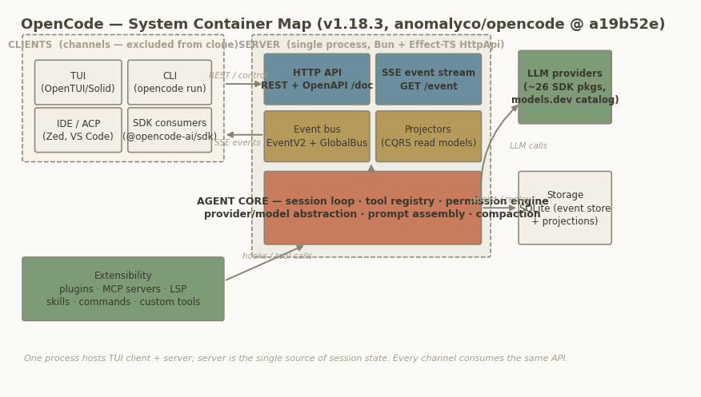

## Chapter 2 — System Architecture & Design Philosophy

This chapter establishes the architectural frame for the whole study: what OpenCode is, how its processes and packages are laid out, which internal layers the agent core organizes into, and the design philosophy that explains why. Everything is verified against the dev-branch checkout (`anomalyco/opencode` @ `a19b52e85bf2`, `opencode` package v1.18.3); interpretive claims are marked as such.

### 2.1 What OpenCode is

OpenCode is an open-source (MIT-licensed) AI coding agent distributed as a single Bun/TypeScript binary. Its own documentation defines it by delivery channel rather than by runtime: "an open source AI coding agent… available as a terminal-based interface, desktop app, or IDE extension" ([docs](https://opencode.ai/docs/)). Three commitments distinguish it from its two closest comparators:

1. **Provider agnosticism.** Where Claude Code is coupled to Anthropic's models and Cursor to its own subscription backend, OpenCode connects to "75+ LLM providers through Models.dev, including local models" ([opencode.ai](https://opencode.ai/)). The project's canonical FAQ states the reasoning: as models converge and prices drop, "being provider agnostic is important" ([2025 README mirror](https://github.com/Decentralised-AI/opencode2025)).
2. **Full source availability.** The entire agent — loop, tools, permissions, server — is in one public monorepo, which is what makes this study (and cloning) possible at all.
3. **Client/server as a first-class claim.** The FAQ's fourth pillar is architectural: "the TUI frontend is just one of the possible clients." This is not marketing; §2.2 shows it is the load-bearing structural decision.

A fourth, softer commitment is privacy: "OpenCode does not store any of your code or context data" ([landing page](https://opencode.ai/)); session state lives under local XDG directories (`packages/core/src/global.ts:10-29`). Historically the project was a Go codebase (BubbleTea TUI), rewritten to Bun/TypeScript during the 0.x line — a fact documented only externally, but consistent with today's `Bun.build({compile: true})` distribution.

### 2.2 Client–server topology: one process, many channels

The docs are unusually direct about the runtime shape: "When you run `opencode` it starts a TUI and a server. Where the TUI is the client that talks to the server. The server exposes an OpenAPI 3.1 spec endpoint… This architecture lets opencode support multiple clients and allows you to interact with opencode programmatically" ([server docs](https://opencode.ai/docs/server/)). Figure 1 maps the containers.

*Figure 1: OpenCode container map. One process hosts server and agent core; every client channel consumes the same typed HTTP API and SSE event stream.*

The code confirms the picture with one correction to common belief: the HTTP stack is **not Hono** (zero `hono` imports remain) but Effect-TS `HttpApi`/`HttpRouter` served over Node's `http` via `@effect/platform-node` (`packages/opencode/src/server/server.ts:100-115`). Key topology facts:

- **Listener.** `Server.listen()` (`server.ts:73-98`) binds TCP, trying port **4096 first, then any free port** (`server.ts:117-122`). Authentication is optional HTTP Basic (`server/auth.ts:17-34`).
- **In-process mode.** `Server.Default` (`server.ts:56-65`) exposes the identical router as a Web `fetch` handler with no socket. The headless CLI drives exactly this against the synthetic origin `http://opencode.internal` (`packages/opencode/src/cli/cmd/run.ts:911-953`), so `opencode run` and `opencode serve` exercise one code path.
- **Channels.** The TUI runs in a worker thread whose `fetch` is an RPC bridge into the main process (`packages/opencode/src/cli/cmd/tui.ts:25-48`); the JS SDK spawns `opencode serve` as a child process (`packages/sdk/js/src/server.ts:24-60`); `sdk-next` drives the same handlers in memory (`packages/sdk-next/src/opencode.ts:11-42`); ACP editors (Zed et al.) reach a thin adapter delegating every protocol method to an `OpencodeClient` (`packages/opencode/src/acp/agent.ts:24-93`) — a channel, not a second agent.
- **Streaming.** SSE is the primary event transport (`GET /event`, first frame `server.connected`); WebSockets exist **only** for pseudo-terminal connections.
- **Multi-project.** One process serves many working directories: `InstanceStore` caches one instance context per absolute directory (`packages/opencode/src/project/instance-store.ts:37-203`), and every request is routed by a `?directory=` / `x-opencode-directory` header (`packages/opencode/src/server/routes/instance/httpapi/middleware/workspace-routing.ts:22-27`).

The architectural consequence (interpretation): because all session state lives server-side and every client is disposable, "the agent" is unambiguously the server process. This is the single most clone-friendly property of the system — a cloner can reimplement four endpoints plus SSE and remain wire-compatible (Chapter 7, Chapter 8).

### 2.3 Monorepo layering: v1 production meets v2 foundation

The repo is a Bun workspace monorepo (`packages/*` in the root `package.json`). Its most important structural fact is that it currently houses **two generations of the agent**, coexisting by design: the v1 production core in `packages/opencode`, and the v2 rewrite staged as separate `@opencode-ai/*` packages.

| Package | Role | Line | Effect-TS? |
|---|---|---|---|
| `opencode` (`packages/opencode`) | v1 production: session loop, tools, permissions, server, CLI/TUI entry | v1 | Yes (services + Layer DAG; LLM via AI SDK by default) |
| `@opencode-ai/schema` | Event/type contracts, event manifest, Effect Schema codecs | v2 | Yes |
| `@opencode-ai/core` | Durable event store, projectors, session runtime, DI utilities (`LayerNode`) | v2 | Yes |
| `@opencode-ai/protocol` | v2 HTTP API contract as a typed `HttpApi` | v2 | Yes |
| `@opencode-ai/server` | v2 route assembly and service wiring for that contract | v2 | Yes |
| `@opencode-ai/llm` | Canonical provider protocols, routing, `LLMEvent` schema, cache policy | v2 (shared) | Yes |
| `@opencode-ai/client` | Generated client; root entry zero-Effect, `/effect` subpath | v2 | Peer-only |
| `@opencode-ai/sdk-next` | Embedded composition (Client + Core + Server in memory) | v2 | Yes |
| `@opencode-ai/plugin` | Public plugin API types (`Plugin`, `tool`) | v1 | Yes |
| `@opencode-ai/tui`, `packages/{desktop,web,app,…}` | Channel packages | both | Yes / n/a |

The layering is enforced, not informal: `AGENTS.md` mandates the dependency direction "from Schema to Core and Protocol, then from Core and Protocol to Server," forbids Client from importing Core or Server, and requires regenerating the typed client whenever the public Protocol or Server `HttpApi` changes. Every v2 package depends on `effect` 4.0.0-beta; `client` lists it only as a peer dependency, preserving a zero-Effect entry point for browser consumers. For a cloner (interpretation) the v2 packages form a ports-and-adapters skeleton — `protocol` owns contracts, `server` injects services, channels are interchangeable adapters (`packages/protocol/src/api.ts:37-64`, `packages/server/src/routes.ts:39-63`) — while v1 remains the code that actually ships. Reading v1 teaches the behavior users run; reading v2 teaches where the boundaries are being formalized.

### 2.4 Internal component architecture

Zooming into the agent core itself (`packages/opencode/src` atop `packages/core` and `packages/llm`), the components arrange into three layers, shown in Figure 2.

*Figure 2: Internal component architecture. Session orchestration drives capabilities; capabilities rest on the foundation layer. All components are Effect services composed in a Layer DAG and scoped per project.*

- **Session orchestration** owns the conversation lifecycle: the hand-rolled `while (true)` agent loop in `SessionPrompt` (`packages/opencode/src/session/prompt.ts:1088`), the per-turn `SessionProcessor` that folds the LLM event stream into message parts, the per-session `Runner` state machine (`Idle | Running | Shell | ShellThenRun`, `packages/opencode/src/effect/runner.ts:33-37`), compaction/overflow management, and the retry schedule. This layer is the subject of Chapter 3.
- **Capability layer** owns what the agent can do: the tool registry (Chapter 4), the tri-state permission engine (Chapter 6), prompt assembly with cache breakpoints, agent definitions (`build`/`plan`/`general`/`explore` plus hidden system agents), and git-backed snapshots enabling `/undo`.
- **Foundation layer** owns externalized concerns: provider/model abstraction over the Vercel AI SDK with a Models.dev registry, the opt-in native `@opencode-ai/llm` stack (Chapter 5), the `EventV2` durable event bus with SQLite-backed event sourcing (Chapter 7), authentication, and the eight-level config cascade.

Two facts orient all later chapters. First, persistence is already v2 even though the loop is v1: `Session` is a façade whose every mutation publishes a durable event (`packages/opencode/src/session/session.ts:537`), folded into relational read tables by `SessionProjector` (`packages/core/src/session/projector.ts`) — textbook CQRS. Second, both LLM runtimes converge on one canonical `LLMEvent` stream, so orchestration is runtime-agnostic (`packages/opencode/src/session/llm/AGENTS.md`).

### 2.5 Design philosophy

Three philosophical commitments recur everywhere and explain most local decisions.

**Effect-TS dependency injection.** Every major component is a `Context.Service` identified by a string tag (e.g. `@opencode/Session`, `session.ts:476`; `@opencode/InstanceStore`, `instance-store.ts:29`), and wiring is declared as a DAG of `LayerNode`s with statically checked dependencies (`packages/core/src/effect/layer-node.ts`). Per-project state uses a distinctive pattern: `InstanceState` wraps a `ScopedCache` keyed by the instance directory (`packages/opencode/src/effect/instance-state.ts:30-52`), so services written as singletons transparently resolve per-project values. The payoff (interpretation): testability and multi-tenancy from one mechanism, and a v1→v2 migration that can proceed service-by-service because each is an independent DAG node.

**Event-driven, event-sourced core.** `EventV2` (`packages/core/src/event.ts:150`) unifies typed pub/sub with durable event sourcing: a durable event commits in one SQLite transaction that assigns a per-aggregate sequence, runs projectors inline, and only then notifies subscribers (`event.ts:205-366`); a compatibility bridge re-emits everything onto the legacy `GlobalBus` (`packages/opencode/src/event-v2-bridge.ts:14-67`). Events are not a notification afterthought but the sole state-change mechanism — which is what makes multi-client sync, replay, and the `/sync/*` endpoints possible.

**The HTTP API is the extension boundary.** The server serves an OpenAPI 3.1 document at `GET /doc`, and the published SDK is generated from it (`packages/sdk/js/script/build.ts`); plugins receive an SDK client rather than internal module handles. The docs state the intent plainly — the architecture "allows you to interact with opencode programmatically" ([server docs](https://opencode.ai/docs/server/)). Internal TypeScript modules are explicitly *not* the supported surface.

### 2.6 Version context

This study pins v1.18.3 (`packages/opencode/package.json`). Three signals locate that release on the v1→v2 trajectory. First, the native LLM path exists but is gated: `experimentalNativeLlm` is bound to `OPENCODE_EXPERIMENTAL_NATIVE_LLM` (`packages/opencode/src/effect/runtime-flags.ts:54`) and restricted to openai/anthropic/opencode providers. Second, `CONTEXT.md` ("OpenCode Session Runtime") is a 225-line domain-language spec for the v2 session engine — it legislates vocabulary ("System Context," *avoid*: "system prompt"; "Provider Turn"; "Prompt Promotion") and records unsettled public decisions, such as the singular-vs-plural `session` namespace and the planned `sdk-next` → `sdk` rename. Third, `AGENTS.md` already enforces the v2 dependency direction and codegen workflow. The public v2 beta (`@opencode-ai/cli@next`, binary `opencode2`, [v2.opencode.ai](https://v2.opencode.ai/)) warns that data may be wiped and APIs may change. Cloners should treat v1.18.3 as the behavioral reference and the v2 packages as the structural preview.

### Architect's take

*(Interpretation.)* OpenCode's deepest design decision is not Effect-TS or event sourcing but the insistence that the server is the product and every interface is a client; that single choice buys multi-channel reach, a generated SDK, and a clean clone boundary almost for free. If you clone, copy the v1 loop's *behavior* but adopt the v2 packages' *boundaries* — contracts in a protocol package, services behind DI tags, events as the only mutation path. And treat the OpenAPI document, not the source tree, as the compatibility contract: everything else is explicitly allowed to move.
