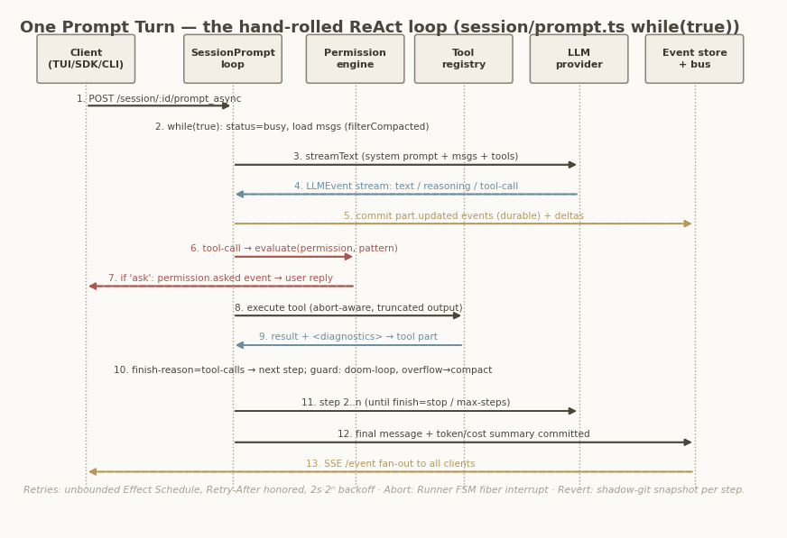
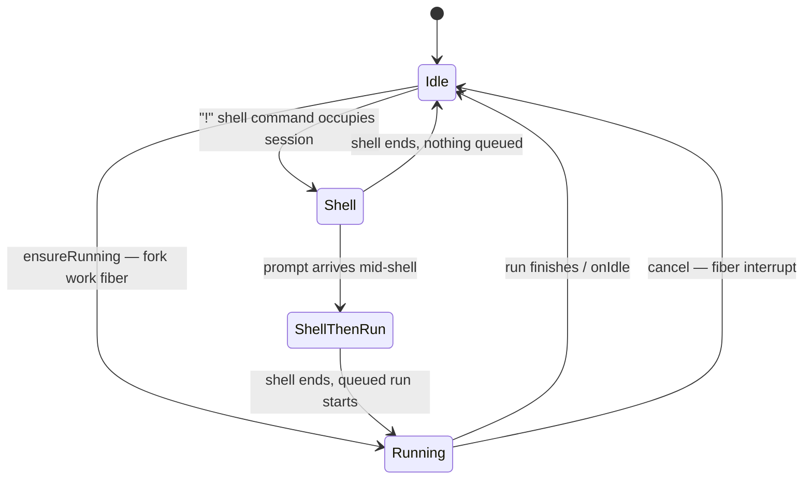

## Chapter 3 — The Agent Loop

The agent loop is the heart of OpenCode: the code that turns a user prompt into a bounded cycle of model calls, tool executions, and history updates. In the current dev tree it lives in `packages/opencode/src/session/` as four cooperating Effect-TS services — `SessionPrompt` (turn cycle), `SessionProcessor` (one provider turn), `LLM` (request preparation and streaming), and `Session` (the session aggregate) — all composed through dependency-injected `Context.Service` layers (`packages/opencode/src/session/session.ts:476`). A durable next-generation foundation already exists under `packages/core/src/`, and this chapter notes where the production V1 loop is already a façade over it; the migration itself is treated in the architecture-overview chapter. Everything below is verified against `anomalyco/opencode` dev @ a19b52e85bf2.

### 3.1 Session and message model

A session is created by `Session.create` → `createNext` (`session.ts:501–540`), which builds an `Info` record (`session.ts:224–244`) carrying: a **descending ULID** as `id` (so lexicographic order equals recency, making "latest message" a max-id lookup), a human `slug`, `projectID`, an optional `parentID` that links subagent sessions into a tree, a generated `title`, the active `agent`, the selected `model {id, providerID, variant}`, usage rollups (`summary`, `cost`, `tokens {input, output, reasoning, cache{read, write}}`), and bookkeeping for `share`, `revert`, and the session's `permission` ruleset. Every mutation is published as a durable event (`session.ts:537`, `session.ts:736–749`), which is what makes the read model, forks, and reverts cheap — see below.

Messages form a three-level model, defined in `packages/schema/src/v1/session.ts` and re-exported as `SessionV1`. A **user message** (`v1/session.ts:332–354`) pins the `agent`, `model`, optional output `format` (text or JSON schema), per-message `tools` overrides, and an optional `system` prompt override. An **assistant message** (`v1/session.ts:453–485`) points back via `parentID` to the user message it answers — the conversation is a parent-linked chain, not an array — and records `cost`, `tokens`, the `finish` reason, and an `error` typed as a discriminated union of eight classes (AuthError, AbortedError, APIError, ContextOverflowError, ContentFilterError, StructuredOutputError, OutputLengthError, Unknown; `v1/session.ts:385–394`). Each message owns a list of **parts**, the twelve content variants the loop can emit (`v1/session.ts:357–370`):

| Part variant | Role in the model |
|---|---|
| `text` | Streamed user/assistant text, folded from deltas |
| `reasoning` | Model reasoning stream, published as deltas only |
| `tool` | A tool call, itself a four-state machine (see below) |
| `file` | Attached file content (e.g. base64 images/PDFs from tool results, `tool/tool.ts:48–53`) |
| `step-start`, `step-finish` | Step boundaries; `step-finish` triggers snapshot, usage accounting, and the patch diff (`processor.ts:457–482`) |
| `snapshot` | Git snapshot reference used by revert |
| `patch` | Diff of the step's file changes, computed from the snapshot |
| `agent`, `subtask` | Multi-agent bookkeeping; a `subtask` on a user message queues work the loop dispatches |
| `retry` | Records a retry attempt |
| `compaction` | A compaction task carried on a synthetic user message |

The table hides the most important detail: the `tool` part is not a value but a **state machine** (`v1/session.ts:259–313`) — `pending {input, raw}` → `running {…, time.start}` → `completed {output, metadata, time, …}` or `error {error, time, …}`. Because every transition is an event, the UI renders a tool call's life cycle live and the loop can reason about "unfinished tool parts" when deciding whether to continue; the `time.compacted` field doubles as the tombstone used by output pruning (§3.6). Persisting parts rather than whole messages is also what lets delta streaming stay transient while state transitions stay durable — the split the next paragraph makes precise.

**Persistence is event-sourced.** All state changes are published as durable events declared `durable: { aggregate: "sessionID", version: 1 }` (`v1/session.ts:502–507`); only `message.part.delta` (`v1/session.ts:632–641`) is deliberately non-durable, reserved for high-frequency streaming. The commit path, `EventV2.commitDurableEvent` (`packages/core/src/event.ts:205–366`), runs inside a single SQLite `immediate` transaction: increment the per-aggregate sequence, run the registered **projectors** in the same transaction, append to `EventTable`. Replay is guarded by optimistic concurrency — a sequence mismatch or payload divergence dies with `InvalidDurableEventError` (`event.ts:284–302`). Projectors in `packages/core/src/session/projector.ts` upsert `MessageTable`/`PartTable` rows and re-apply usage rollups with signed add/subtract; reads then hit the projections, not the log (`message-v2.ts:425–467` paginates `MessageTable` newest-first with a `(time, id)` cursor). The practical consequence: the legacy V1 session service is already a thin event-publishing façade over the V2 store.

Two tree operations round out the model. **Fork** (`session.ts:693–734`) copies messages up to an optional boundary, re-issuing ascending message/part IDs and remapping assistant `parentID`s through an ID map. **Revert** (`packages/opencode/src/session/revert.ts:38–88`) captures a git snapshot, undoes file changes via the recorded `patch` parts, and stores `session.revert{messageID, partID, snapshot, diff}` — but deletes messages only lazily, at the start of the *next* prompt (`prompt.ts:1056`), which is exactly what makes `unrevert` (`revert.ts:90–98`) possible.

### 3.2 The hand-rolled loop

`SessionPrompt.prompt` (`prompt.ts:1052–1071`) is the entry point: clean up any pending revert, build the user message (resolving `@file`/`@agent` mentions and data URLs into parts), touch the session, apply per-message permission overrides, then enter `loop({sessionID})`. The loop body, `runLoop` (`prompt.ts:1081–1341`), is an explicit **`while (true)`** (`prompt.ts:1088`) inside an Effect generator. This is a deliberate design decision: the AI SDK is used strictly per turn (`streamText` with `maxRetries: input.retries ?? 0`, `llm.ts:323`), and the SDK's own `maxSteps`/`stopWhen` machinery is **not** used. Step accounting, continuation, compaction scheduling, and step limits are owned by OpenCode, because all of them require access to the event-sourced history and session state that an SDK-internal stepper cannot see (this rationale is interpretation; the ownership itself is directly visible in the code). One iteration of the loop:

1. Set status `busy`; reload history through `MessageV2.filterCompactedEffect` (`:1092`).
2. Derive bindings via `MessageV2.latest` (`message-v2.ts:585–601`): max-id user/assistant/finished messages plus unprocessed `subtask`/`compaction` tasks.
3. **Exit test** (`:1111–1130`): break when the last assistant finished with a reason other than `tool-calls`, no unfinished tool parts remain (orphaned interrupted tools ignored, `:96–100`), and `lastUser.id < lastAssistant.id`. The comment at `:1103–1109` documents why the extra checks exist: some providers return `stop` even with pending tool calls.
4. `step++`; on step 1, fork title generation on a small model (`:1133–1139`).
5. Dispatch queued tasks: `subtask` → `handleSubtask`, `compaction` → `compaction.process`; **overflow pre-check** creates an auto-compaction if the last turn's tokens overflow the model (`:1161–1168`).
6. Resolve the agent and `maxSteps = agent.steps ?? Infinity` (`:1178`); on the last allowed step, append a synthetic "tools are disabled, respond with text only" message (`MAX_STEPS_PROMPT`, `packages/core/src/session/runner/max-steps.ts:1–16`).
7. Inject synthetic reminder parts (plan-mode/build-switch prompts, `reminders.ts:15–90`).
8. Create and publish the assistant message; run `processor.create` guarded by an interrupt finalizer that stamps `AbortedError` (`:1203–1219`).
9. Resolve the tool set; JSON-schema sessions get a forced `StructuredOutput` tool with `toolChoice: "required"` (`:1243–1250`).
10. Assemble system context, convert history, and run one provider turn (`:1272–1286`).
11. Map the outcome (`:1288–1329`): structured output → break; `content-filter` → synthesize `ContentFilterError` and break; `"stop"` → break; `"compact"` → auto-compaction and continue.

After the loop, output pruning is forked and the last assistant message returned (`:1338–1339`). The net effect is a textbook ReAct cycle — reason, act, observe, repeat until the model stops asking for tools — implemented with full ownership of every transition.

### 3.3 The streaming pipeline



*Figure 3: One prompt turn end to end. The loop owns continuation; the AI SDK (or native runtime) only streams a single turn; persistence is split between durable part states and transient deltas.*

One provider turn is `SessionProcessor.process` (`processor.ts:627–683`), and its core fits in five lines:

```ts
const stream = llm.stream(streamInput)
yield* stream.pipe(
  Stream.tap((event) => handleEvent(event)),
  Stream.takeUntil(() => ctx.needsCompaction),
  Stream.runDrain,
)
```

(`processor.ts:640–646`). The stream is wrapped in `Effect.retry` with the session retry policy, `Effect.catch` for the halting path, and `Effect.ensuring` for cleanup; the result is the tri-state `"compact" | "stop" | "continue"` (`:679–681`) that the loop's outcome mapping consumes. `handleEvent` (`:278–537`) folds the canonical `LLMEvent` algebra into parts: reasoning events maintain a delta-only map; `tool-input-*` events create pending parts with one `Deferred` per call; a `tool-call` flips the part to running and passes the **doom-loop guard** — if the last `DOOM_LOOP_THRESHOLD = 3` tool parts are the same tool with identical input, a `doom_loop` permission is raised (`:356–380`); `tool-result` completes the part (normalizing image attachments); `tool-error` fails it and sets `ctx.blocked` so the loop stops after a denial (`:200–202`, overridable via `experimental.continue_loop_on_deny`, `:633`). On `step-finish` the processor takes a git snapshot, computes usage, diffs a `patch` part, and runs the overflow check that sets `needsCompaction` (`:457–482`) — which `Stream.takeUntil` turns into a mid-stream truncation. `cleanup` (`:539–597`) finalizes open parts, waits 250 ms for in-flight tool `Deferred`s, and fails unsettled calls with `"Tool execution aborted"` and `metadata.interrupted: true` — the exact marker the loop's orphan check reads.

Two properties make this pipeline robust. First, it is **runtime-agnostic**: whether events come from the AI SDK adapter (`LLMAISDK.toLLMEvents`, `llm/ai-sdk.ts:76+`) or from the opt-in native runtime over `@opencode-ai/llm`, they converge on the same `LLMEvent` stream, a seam documented in `packages/opencode/src/session/llm/AGENTS.md`. Second, persistence is **frequency-split**: full part states publish durable `message.part.updated` events (`session.ts:637–645`), while high-frequency text/reasoning deltas publish non-durable `message.part.delta` (`session.ts:879–887`) — the event log never pays for token-by-token streaming.
### 3.4 Aborts and interrupts: the Runner state machine

Concurrency control is centralized in `SessionRunState` (`run-state.ts:35–69`), which keeps exactly one `Runner` per session, and in `Runner.make` (`packages/opencode/src/effect/runner.ts:39–215`), a four-state machine (`runner.ts:33–37`):



`ensureRunning` implements **prompt coalescing**: if a run is already in flight, the caller joins its `Deferred` instead of forking a second loop, so duplicate prompts can never interleave tool calls on one session. A `!`-prefixed shell command may occupy the session first, queueing the pending run in `ShellThenRun`; `onIdle` flips `SessionStatus` back to idle and deregisters the runner (`run-state.ts:60–65`). Cancellation is a cascade: `SessionPrompt.cancel` → `SessionRunState.cancel` (`run-state.ts:77–86`) cancels matching background jobs iteratively over the descendant set (`:111–143`), then `Runner.cancel` interrupts the work fiber, whose scope release in turn aborts the in-flight HTTP request to the provider (`llm.ts:361–364`). Every level has a corresponding cleanup: the loop's `Effect.onInterrupt` finalizer stamps the assistant message with `AbortedError` and `time.completed` (`prompt.ts:1203–1211`), and the processor's cleanup marks unsettled tool parts as interrupted — so a cancelled session is left in a consistent, resumable state rather than a half-written one.

### 3.5 Retries and error classification

Retry behavior exists at two deliberately different layers. The **session-level** policy, `SessionRetry.policy` (`packages/opencode/src/session/retry.ts:176–199`), is an Effect `Schedule` that retries *unbounded* as long as `retryable()` returns a reason. Its delay honors `retry-after-ms`/`retry-after` response headers (capped at 2³¹−1 ms) and otherwise backs off exponentially at `2000·2^(attempt−1)` ms, capped at 30 s (`:26–66`). `retryable()` (`:68–152`) never retries `ContextOverflowError`, retries `APIError` when flagged retryable or on status ≥ 500, and pattern-matches provider-specific bodies — free-tier usage limits map to a Go upsell action, account rate limits to a humanized reset-time message. Every attempt publishes a `SessionStatus {type: "retry", attempt, message, action, next}` event (`processor.ts:664–672`), so the UI can show a live countdown instead of a frozen spinner. The **transport layer** inside `packages/llm` has its own bounded retry — `MAX_RETRIES = 2` on statuses 429/503/504/529, jittered backoff `500·2^a ±20%` capped at 10 s, with aggressive credential redaction (`packages/llm/src/route/executor.ts:353–364`) — so a single HTTP call never hangs the unbounded outer schedule on transient flaps.

Errors raised anywhere in a turn are normalized by `MessageV2.fromError` (`message-v2.ts:603–731`) into the eight-class union of §3.1, then handled by `halt` (`processor.ts:599–625`):

| Error class | Typical source signal | Loop behavior |
|---|---|---|
| `AbortedError` | `DOMException` AbortError (user cancel) | Stamped by the interrupt finalizer; loop exits |
| `AuthError` | `LoadAPIKeyError` | Terminal: message error + `session.error`, session idles |
| `APIError` | `APICallError`, ECONNRESET, stream/header-timeout failures | Retried per policy when `isRetryable` or status ≥ 500 |
| `ContextOverflowError` | Provider rejection (`context_overflow`) or token check | Never retried; routed to auto-compaction (`halt` sets `needsCompaction`) |
| `ContentFilterError` | `finish: "content-filter"` | Synthesized by the outcome mapping + `session.error`; loop breaks (`prompt.ts:1288–1329`) |
| `StructuredOutputError`, `OutputLengthError`, `Unknown` | Schema/length failures, unrecognized throws | Terminal via `halt`: message error + `session.error`, session idles |

The notable asymmetry is that context overflow is classified as *never retryable* yet is the only error that is routinely recovered from — by compaction rather than repetition (`halt` diverts it to `needsCompaction` unless `compaction.auto === false`, in which case it becomes a terminal error). Retrying an overflowed request would be deterministic waste, while retrying a 5xx is nearly free; the classification encodes exactly that economics. Publishing retries as first-class session-status events, rather than logging them, is what keeps the failure mode observable to every connected client.

### 3.6 Context-window management

OpenCode treats the context window as a budget with three enforcement points. The budget itself is computed in `overflow.ts`: `usable()` = `limit.input − reserved`, where `reserved` is `config.compaction.reserved` or `min(COMPACTION_BUFFER = 20_000, maxOutputTokens)`; overflow is declared when the last turn's total tokens meet or exceed it. The three triggers: a **post-turn check** in the loop (`prompt.ts:1161–1168`), a **mid-stream check** at `step-finish` that truncates the live stream via `Stream.takeUntil(needsCompaction)` (`processor.ts:477–482`), and a **provider-rejected overflow** surfaced as `ContextOverflowError` through `halt`.

Recovery is the **compaction protocol** (`packages/opencode/src/session/compaction.ts`). `create` appends a synthetic user message carrying a `compaction` part (`:513–536`), which the loop picks up as a task. `process` (`:289–511`) then: finds the previous real user message as a replay anchor and drops everything after it (`:310–326`); hides earlier compaction/summary pairs; and selects the tail to preserve with `select` (`:188–239`) — the last `compaction.tail_turns` (default 2) user turns that fit `preserve_recent_tokens`, defaulting to `clamp(usable·0.25, 2_000, 8_000)`, with `splitTurn` allowing a partial turn. Summarization is delegated to the hidden `compaction` agent (`agent/agent.ts:219–233`, all-deny permissions), prompted by `buildPrompt` (`packages/core/src/session/compaction.ts:161–168`) to produce an **anchored summary** that updates the previous summary inside a fixed Markdown template (Objective / Important Details / Work State / Next Move / Relevant Files). Media is stripped and tool outputs truncated to 2 000 characters (`:351–354`). On success the session's `tail_start_id` advances, the replayed user message (or a synthetic "continue" message, gated by `experimental.compaction.autocontinue`) is re-injected, and a `Compacted` event is published; if even compaction overflows, the session fails terminally (`:404–413`). Reads then go through `MessageV2.filterCompacted` (`message-v2.ts:521–572`), which rebuilds model-visible history as `[compaction-user, summary, …tail from tail_start_id, …newer messages]` — a sliding window with a summarized past.

Independently, **pruning** (`compaction.ts:243–287`) reclaims tool-output bulk without touching semantics: walking newest→oldest past the last two user turns, it keeps the newest `PRUNE_PROTECT = 40_000` tokens of tool output and marks older completed tool parts `time.compacted` once more than `PRUNE_MINIMUM = 20_000` tokens would be pruned; the `skill` tool is protected, and pruning stops at summary boundaries. Pruned parts render as `"[Old tool result content cleared]"` (`message-v2.ts:293–294`), and the pass is forked after every run (`prompt.ts:1338`). Token accounting is authoritative from provider usage on `step-finish`, normalized by `Session.getUsage` (`session.ts:338–407`) — AI SDK v6 reports cache-inclusive input, so cache read/write are subtracted for costing — with `chars/4` as the offline estimate (`packages/core/src/util/token.ts`).

### 3.7 Subagents and session trees

Subagents are not a separate engine; they are the same loop, re-entered. Agents are defined in `agent/agent.ts:35–56` with a `mode` of `primary`, `subagent`, or `all`, a permission ruleset, and optional model/prompt/`steps` overrides; built-ins (`:140–265`) include the primaries `build` and `plan`, the subagents `general` and `explore` (read/search-only), and the hidden service agents `compaction`, `title`, and `summary` already met above. Spawning happens through the **`task` tool** (`tool/task.ts`): a depth check against `subagent_depth` (default 1, `:104–117`) prevents unbounded recursion; `permission.ask("task")` gates the spawn; the child session is created with `parentID` and a derived permission ruleset that auto-denies `todowrite` and nested `task` unless the agent declares them (`:139–172`); and the child then runs through the *same* `SessionPrompt.prompt` loop in-process (`:200–214`), inheriting the parent's model unless the agent pins one (`task.ts:175–180`). Foreground execution races `background.wait` against promotion, with parent abort cascading into child cancel (`:317–347`); background mode (behind `experimentalBackgroundSubagents`) registers a `BackgroundJob` and later injects the result into the parent as a synthetic `<task …>` user message (`:216–254`). User-queued `subtask` parts take a third path, executed inline by `handleSubtask` (`prompt.ts:255–449`) as a `task` tool part on a fresh assistant message. Because children are ordinary sessions, tree operations compose naturally: deleting a session recurses over its children and cancels their background jobs (`session.ts:608–629`).

### Architect's take

The single most transferable decision in this chapter is to *own the loop and rent the transport*: by confining the AI SDK to one streaming turn and keeping continuation, compaction, and step limits in a hand-rolled `while (true)`, OpenCode can implement exit tests, orphan handling, and mid-stream overflow truncation that no SDK-internal stepper exposes — a cloner should copy that boundary before anything else (this is interpretation). The event-sourced message model looks heavyweight until you notice that fork, revert, compaction replay, and live UI streaming all fall out of it for free; the durable/transient event split keeps that affordable. Finally, the cheap guards — the three-strike doom-loop check and tool-output pruning — are disproportionately valuable for long autonomous runs and are easy to overlook. What to watch: the durable V2 runner under `packages/core/src/session/runner/` is explicitly marked work-in-progress, so this chapter's V1 loop remains the production truth until its parity checklist closes.
