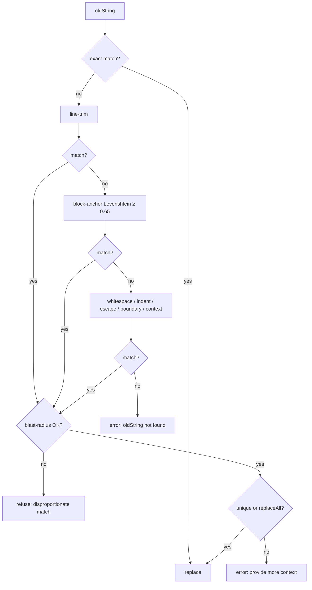

## Chapter 4 — The Tool System

Chapter 3 followed the agent loop that emits tool calls; this chapter dissects what sits on the receiving end: how tools are defined, registered, gated, executed, and how their outputs are shaped before returning to the model. The permission engine that `ctx.ask` delegates to is the subject of Chapter 6; here we cover only the tool-side machinery.

### 4.1 The tool contract: Effect Schema in, Effect out

OpenCode's internal tool contract is neither the AI SDK's `tool()` helper nor zod — it is an Effect-TS abstraction defined in `packages/opencode/src/tool/tool.ts`. Every built-in is produced by `Tool.define(id, Effect.gen(...))` (`tool/tool.ts:151-169`), which yields an `Info` — a lazy `{id, init}` pair — whose initialized definition is:

```ts
// tool/tool.ts:55-65
export interface Def<Parameters extends Schema.Decoder<unknown>, M extends Metadata = Metadata> {
  id: string
  description: string
  parameters: Parameters            // Effect Schema.Struct, e.g. read.ts:28-36
  jsonSchema?: JSONSchema7          // pre-computed schema (plugin tools only)
  execute(args: Schema.Schema.Type<Parameters>, ctx: Context): Effect.Effect<ExecuteResult<M>>
  formatValidationError?(error: unknown): string
}
```

Three design decisions follow from this shape. First, **the parameter schema is the single source of truth**: one Effect `Schema.Struct` drives both runtime decoding of model-supplied arguments and, via `ToolJsonSchema.fromTool` plus per-model `ProviderTransform.schema` adaptation (`session/tools.ts:97-98`), the JSON Schema shown to the LLM. Second, **`execute` returns an `Effect`**, so tools compose with the runtime's dependency injection and structured concurrency. Third, results are normalized to `{title, metadata, output: string, attachments?}` (`tool/tool.ts:48-53`), where attachments carry base64 file parts — how `read` returns images and PDFs to multimodal models.

The execution `Context` (`tool/tool.ts:36-46`) is what makes a tool more than a pure function. It carries `sessionID`, `messageID`, the calling `agent` name, an `abort` signal, an optional `callID`, the prior `messages`, an `extra` bag (used to smuggle the model handle and `promptOps` into the task tool), and two callbacks: `metadata({title?, metadata?})`, streaming progress into the tool-call part for live UI rendering, and `ask(...)`, raising a permission request that blocks the fiber until the user approves or rejects. Every side-effecting tool funnels through `ask` — the fail-closed gate analyzed in Chapter 6.

`Tool.define` does not merely register the definition; it **wraps every `execute`** in a decorator (`tool/tool.ts:99-149`) that adds three cross-cutting concerns without any tool opting in:

```ts
// tool/tool.ts:120-135 (abridged)
const decoded = yield* decode(args).pipe(
  Effect.mapError((error) =>
    new InvalidArgumentsError({
      tool: id,
      detail: toolInfo.formatValidationError ? toolInfo.formatValidationError(error) : String(error),
    }),
  ),
)
const result = yield* execute(decoded as Schema.Schema.Type<Parameters>, ctx)
if (result.metadata.truncated !== undefined) {
  return result
}
const agent = yield* agents.get(ctx.agent)
const truncated = yield* truncate.output(result.output, {}, agent)
```

The decoder closure is hoisted once per init (`tool.ts:108-110` notes `decodeUnknownEffect` allocates per call). Decode failures become `InvalidArgumentsError` (`tool.ts:24-34`) whose message is deliberately model-facing prose — *"Please rewrite the input so it satisfies the expected schema"* — because the AI SDK feeds tool errors back as tool results, turning validation into a self-correction prompt. The wrapper also stamps an OTEL span `Tool.execute` with `tool.name`/`session.id`/`message.id`/`tool.call_id` attributes and applies **automatic output truncation** unless the tool already managed it (§4.8).

A second, provider-agnostic contract exists in `packages/llm/src/tool.ts` (typed and dynamic modes, a `ToolRuntime.dispatch` decode→execute→encode pipeline), but it is live only behind the `experimentalNativeLlm` flag; production bridges these `Def`s into AI SDK `tool()` wrappers in `SessionTools.resolve` (`session/tools.ts:41-49`). Plugin authors see a third surface — plain zod plus promises (`packages/plugin/src/tool.ts:45-51`) — which the registry adapts back into the internal contract (§4.2).

### 4.2 The registry: eager built-ins, scanned customs, per-model gating

`ToolRegistry` is an Effect service (`tool/registry.ts:84-344`) whose layer eagerly initializes all built-ins (`registry.ts:96-114`) and then assembles per-instance state — per project directory — via `InstanceState.make` (`registry.ts:116-249`). Tool sources are threefold:

1. **Built-ins.** Invalid, question, shell (exposed id `"bash"`, kept for compatibility — `tool/shell/id.ts:14-16`), read, glob, grep, edit, write, task, webfetch, todowrite, websearch, skill, apply_patch (`registry.ts:226-240`), plus three flag-gated additions: `execute` (code mode, `experimentalCodeMode`), `lsp` (`experimentalLspTool`), and `plan_exit` (`experimentalPlanMode` *and* CLI client) (`registry.ts:241-243`). The question tool is additionally gated to `app|cli|desktop` clients or `enableQuestionTool` (`registry.ts:202,228`).
2. **File-system custom tools.** Every config directory is scanned for `{tool,tools}/*.{js,ts}` (`registry.ts:178-192`); matches are dynamically imported as `file://` URLs and each export duck-type-validated (`isPluginTool`, `registry.ts:350-352`). Plugin packages contribute `p.tool` entries (`registry.ts:194-199`).
3. **The plugin adapter.** `fromPlugin` (`registry.ts:120-176`) converts zod args to JSON Schema via `z.toJSONSchema` with metadata normalization (`zodJsonSchema`, `registry.ts:369-416`), bridges the Effect-based `ask` into a promise for plugin code, and post-hoc truncates string results — so custom tools get the same output hygiene as built-ins.

Resolution for a request happens in `tools()` (`registry.ts:286-335`) and is **model- and agent-dependent**. `websearch` is exposed only for the opencode-zen provider or with exa/parallel flags (`registry.ts:288-290`). Most strikingly, **apply_patch and edit/write are mutually exclusive**: `usePatch = modelID.includes("gpt-") && !oss && !gpt-4` selects `apply_patch` for the gpt-5 family and `edit`+`write` otherwise (`registry.ts:292-295`) — the harness swaps the editing interface to match each model family's training. The task tool's description is dynamically suffixed with the subagent roster filtered through the caller's `task` permission (`describeTask`, `registry.ts:260-273`), and a plugin hook `tool.definition` may rewrite any description or schema per model (`registry.ts:313`).

Agent definitions never list tools; they carry a permission ruleset, and denied tools are **removed from the schema shown to the model** rather than merely refused at runtime (`session/llm/request.ts:208-213`, via `Permission.disabled`, which aliases `edit|write|apply_patch → "edit"`). The model cannot call what it cannot see; anything it *can* see but lacks approval for hits `ctx.ask` inside `execute`. This hidden-vs-ask split is the first two layers of the defense-in-depth cascade detailed in Chapter 6.

### 4.3 Built-in tool inventory

The table below enumerates every built-in tool at this commit. "Permission" is the key passed to `ctx.ask` (or the key used to hide the tool); "truncation" describes output capping behavior.

| Tool id | Purpose | Permission asked | Truncation | Notes |
|---|---|---|---|---|
| `invalid` | Represents malformed model tool calls | none | n/a | Description: "Do not use"; exists so bad calls surface as error parts (`invalid.ts:9-12`) |
| `bash` | Execute shell commands | `bash` + `external_directory` | own: 2× maxBytes in-memory ring, mid-stream spill, tail-biased cut | tree-sitter permission decomposition; 2-min default timeout (§4.5) |
| `read` | Read file or directory | `read` (+ `external_directory`) | own: 2000 lines / 50 KB / 2000 chars-per-line, offset hints (`read.ts:13-17,344-350`) | images/PDFs returned as attachments |
| `glob` | Find files by name pattern | `glob` (+ `external_directory`) | hard 100-result cap (`glob.ts:48-50`) | ripgrep-backed |
| `grep` | Regex content search | `grep` (+ `external_directory`) | hard 100-result cap (`grep.ts:63-68`) | description redirects counting to `rg` via bash |
| `edit` | Exact-string replacement | `edit` | decorator | 9-strategy replacer cascade, per-file lock, diff-before-ask (§4.4) |
| `write` | Full-file create/overwrite | `edit` | decorator | BOM-aware, creates parent dirs (`write.ts:54-72`) |
| `apply_patch` | Multi-hunk patch envelope | `edit` (single batched ask, `apply_patch.ts:206-215`) | decorator | gpt-5-family models only; validate-then-commit |
| `task` | Spawn subagent session | `task` (pattern = subagent type) | decorator | depth guard, background promotion (§4.6) |
| `todowrite` | Replace the session todo list | `todowrite` | decorator | denied to `general` subagent by default |
| `webfetch` | Fetch URL → markdown/text/html | `webfetch` (per-URL pattern) | decorator | HTTP→HTTPS upgrade; attachments |
| `websearch` | Web search via session provider | `websearch` (per-query) | decorator | zen provider or exa/parallel flags only |
| `skill` | Invoke a named skill | `skill` | decorator | loads skill instructions into context |
| `question` | Ask the user structured questions | hidden via `question` key | decorator | Deferred suspension; client-gated (§4.6) |
| `lsp` ⚑ | Language-server queries | `lsp` | decorator | `experimentalLspTool` flag |
| `plan_exit` ⚑ | Ask to leave plan mode | hidden via `plan_exit` key | decorator | `experimentalPlanMode` + CLI only; reuses question machinery |
| `execute` ⚑ | Code-mode: confined script over MCP catalog | per-MCP-tool rules | decorator | replaces individual MCP tools under `experimentalCodeMode` |

⚑ = flag-gated. MCP-bridged tools (`session/tools.ts:390-489`) and user custom tools extend this list at runtime.

Reading the inventory as a whole reveals the harness's editorial voice. Read-path tools (`read`, `glob`, `grep`) are cheap and always available with self-service caps; write-path tools (`edit`, `write`, `apply_patch`) all collapse into one `edit` permission so a single ruleset governs mutation regardless of interface. Interaction tools (`question`, `plan_exit`, `task`) are the most restricted — flag- or client-gated, and able to suspend or fork the loop. The `apply_patch`↔`edit`/`write` exclusion is a quiet admission that tool *schema* is a model-compatibility surface, not just an API; and `invalid` shows the designers treating malformed model output as a first-class event to record, not an exception to swallow.

### 4.4 Edit/write safety: the replacer cascade and its guardrails

The edit tool is where OpenCode spends the most engineering effort, because fuzzy string replacement is where coding agents most often corrupt files. The header credits the approach to cline and gemini-cli evals (`edit.ts:1-4`). At its core is a **cascade of nine `Replacer` generators** (`edit.ts:694-704`), tried in order of decreasing strictness:

1. `SimpleReplacer` — exact substring
2. `LineTrimmedReplacer` — per-line trimmed comparison
3. `BlockAnchorReplacer` — first/last-line anchors + Levenshtein ≥ 0.65 over middle lines
4. `WhitespaceNormalizedReplacer`
5. `IndentationFlexibleReplacer`
6. `EscapeNormalizedReplacer`
7. `TrimmedBoundaryReplacer`
8. `ContextAwareReplacer` — ≥50% middle-line match (`edit.ts:588-644`)
9. `MultiOccurrenceReplacer` — valid only with `replaceAll` or a unique match

The block-anchor strategy illustrates the flavor: anchor on the trimmed first and last lines of `oldString`, accept blocks within ±25% line count, then average per-line Levenshtein similarity over the middle:

```ts
// edit.ts:307-321 (abridged)
for (let i = 0; i < originalLines.length; i++) {
  if (originalLines[i].trim() !== firstLineSearch) continue
  for (let j = i + 2; j < originalLines.length; j++) {
    if (originalLines[j].trim() === lastLineSearch) {
      const actualBlockSize = j - i + 1
      if (Math.abs(actualBlockSize - searchBlockSize) <= maxLineDelta) {
        candidates.push({ startLine: i, endLine: j })
      }
      break
    }
  }
}
```

A single candidate needs similarity ≥ `SINGLE_CANDIDATE_SIMILARITY_THRESHOLD = 0.65` (`edit.ts:220,358`); with multiple candidates the best must clear the same bar (`edit.ts:410`). The cascade's control flow:



Fuzzy fallback is dangerous, so guardrails bound it. The **blast-radius guard** `isDisproportionateMatch` refuses any fuzzy match whose span is ≥ `max(oldLines+3, oldLines*2)` lines or more than 4×/500 chars larger than `oldString`, telling the model to re-read and supply the exact text (`edit.ts:709-713,731-737`). Identical `oldString`/`newString` is rejected up front (`edit.ts:75-77`), an empty `oldString` on an existing file is rejected with a steer to `write` (`edit.ts:90-96`), and non-unique single matches fail with *"Provide more surrounding context"* (`edit.ts:728`). A **per-file semaphore** keyed by resolved path serializes read-modify-write (`locks` map, `edit.ts:35-45,88`); line endings are detected and preserved (`edit.ts:26-33`) and the BOM survives via `Bom.split/join` (`edit.ts:126-135`). Crucially for the approval UX, a unified diff (`createTwoFilesPatch` + the `trimDiff` indent normalizer, `edit.ts:646-680`) is computed **before** `ctx.ask` and attached to the request metadata (`edit.ts:137-153`), so the human approves the exact change; after the write the formatter runs, the diff is recomputed, and post-write LSP diagnostics are appended to the tool output (`edit.ts:196-201`).

One honesty note, verified against this commit: `edit.txt:4` and `write.txt:5` both claim the tool "will error if you attempt an edit without reading the file," but **no code enforces a fresh-read check** — searches for `markRead|hasRead|lastRead|without reading` across `packages/opencode/src` find nothing, and `edit.ts` merely re-stats the file at execution time. The enforcement is prompt-text only; the semaphore is the sole real concurrency control. *(Interpretation: an earlier upstream file-time check was never ported to this Effect rewrite.)*

`write` is the blunt sibling: full-file replacement with the same diff-first `edit` ask (`write.ts:54-62`), parent-directory creation, and post-commit watcher events. `apply_patch` goes the other way — it parses the `*** Begin Patch` envelope, resolves Add/Delete/Update/Move hunks with exact-sequence seeking plus Unicode punctuation normalization, builds **all** per-file diffs, and only then issues a single batched ask and writes (`apply_patch.ts:190-215`): all-or-nothing validate-then-commit.

### 4.5 The shell tool: parse-first permissions over raw process spawning

The shell tool's exposed id stays `"bash"` regardless of the actual shell (`tool/shell/id.ts:14-16`), because permission rulesets and model training both key on that name. Its description is a **rendered template** (`shell/prompt.ts`) injecting OS/shell notes, limits, and `${tmp}` guidance — a bash description differs from a PowerShell one.

Execution uses Effect's `ChildProcessSpawner` over cross-spawn — **no pty**: stdin is ignored and stdout/stderr merge into one Effect Stream (PowerShell gets `-NoLogo -NoProfile -NonInteractive -Command`, `shell.ts:293-310`). Before anything runs, the command string is parsed by a lazily-initialized web-tree-sitter with **WASM grammars for both bash and PowerShell** (`shell.ts:311-336`); every `command` node anywhere in the AST — pipelines, lists, substitutions — is scanned (`shell.ts:378-414`). File-mutating verbs (`rm`, `cp`, `mv`, `mkdir`, `cat`, PowerShell cmdlets, cmd.exe verbs; `shell.ts:28-64`) have their path arguments resolved through unquoting, `~`/env expansion, and cygpath translation; anything landing outside the instance triggers an `external_directory` ask (`shell.ts:263-280`). Each sub-command's full source becomes a permission pattern, and `BashArity.prefix` — a generated dictionary of subcommand arities (`git`→2, `npm run`→3) — produces a `"<prefix> *"` **always-allow suggestion** (`shell.ts:407-410`), so one approval covers semantically equivalent future commands. Approving `git status && rm -rf x` requires both patterns to pass (Chapter 6).

The lifecycle races three effects — process exit, abort signal, and `sleep(timeout + 100ms)` — with a 2-minute default (`flags.bashDefaultTimeoutMs ?? 2*60*1000`, `shell.ts:347,540-546`); on timeout or abort the process is killed with a 3-second grace and a `<shell_metadata>` note coaches the model to retry with a larger timeout (`shell.ts:556-567`). Output handling is **tail-biased**: a `maxBytes*2` in-memory ring spills mid-stream to a truncation file (`shell.ts:438-446,500-523`), and the final output keeps the *end* of the stream with UTF-8-safe byte cutting (`tail`, `shell.ts:225-255`) — the correct bias for build logs and test failures, where the signal is at the bottom.

### 4.6 Interaction tools: question, plan_exit, task

Three tools exist not to act on the world but to mediate between the loop and the human (or between loops).

**question** suspends the tool call on an Effect `Deferred`: `Question.ask` registers a pending request, publishes `Event.Asked`, and awaits (`question/index.ts:88-114`); the UI resolves it via `reply`/`reject`. The loop pauses purely because the tool's Effect has not settled — coroutine suspension as elicitation. Answers return as `"q"="a1, a2"` text (`question.ts:30-36`).

**plan_exit** reuses that machinery to ask *"switch to the build agent?"* and, on approval, injects a **synthetic user message** with `agent: "build"` (`plan.ts:29-70`) — agent switching as tool + elicitation + synthetic message rather than a dedicated control channel.

**task** spawns a child session: depth is checked against `subagent_depth ?? 1` (`task.ts:104-113`), spawning is gated by a `task` ask patterned on the subagent type (`task.ts:115-125`), and the child gets derived permissions plus default denies for `todowrite` and nested `task`. The parent drives the child through injected `promptOps` and receives its last text part wrapped in `<task …><task_result>` XML. Under `experimentalBackgroundSubagents` the tool returns immediately with anti-polling instructions and later **injects the result as a synthetic user message** into the parent (`task.ts:206-241`); foreground execution races completion against promotion, and parent abort cancels the child.

### 4.7 Tool descriptions as prompt engineering

Descriptions live in colocated `.txt` files imported as strings (`read.ts:7` importing `read.txt`) — 15 files, 235 lines — and they do serious behavioral work:

| Pattern | Example |
|---|---|
| When-to-use / when-NOT-to-use | `task.txt`: "When NOT to use the Task tool: If you want to read a specific file path, use Read or Glob…" |
| Tool-selection disambiguation | `read.txt` steers to grep/glob; `glob.txt` and `grep.txt` both redirect open-ended search to Task; `webfetch.txt` defers to better fetchers |
| Negative instructions | `edit.txt` "NEVER write new files unless explicitly required"; `shell.txt` "DO NOT use it for file operations"; git policy embedded in `shell.txt` |
| Error-contract priming | `edit.txt` pre-documents the exact failure strings so the model supplies unique context up front |
| Parallelism / context nudges | `read.txt` "Call this tool in parallel…", "Avoid tiny repeated slices"; `glob.txt` "speculatively perform multiple searches as a batch" |
| Temporal grounding | `websearch.txt` injects `{{year}}`: "You MUST use this year when searching" |
| Delegation framing | `task.txt` "highly detailed task description" (fresh context), "The agent's outputs should generally be trusted" |

This is the cheapest context-engineering surface in the system: no code changes, immediate behavioral effect. Notably, the descriptions are *mutually aware* — read points at grep, grep points at bash `rg`, both point at task — forming a routing layer that steers the model to the cheapest tool before any permission check happens. The disambiguation tables above are effectively a hand-tuned classifier expressed in prose.

### 4.8 The truncation service: one policy, applied everywhere

Output capping is centralized in the `Truncate` service (`tool/truncate.ts`) rather than left to individual tools. Defaults are `MAX_LINES = 2000` and `MAX_BYTES = 50 * 1024` (`truncate.ts:15-16`), overridable via config `tool_output.max_lines/max_bytes` (`truncate.ts:75-83`). When output exceeds the caps, the **full text is spilled to disk** and the model receives a head (or tail) preview plus a hint (`truncate.ts:124-140`). Spill files live in `Global.Path.data/tool-output` (`truncation-dir.ts:4`), are named with ascending `ToolID`s, and are garbage-collected hourly with seven-day retention (`truncate.ts:13,143-148`).

The hint text is **agent-aware** (`truncate.ts:129-131`): agents whose ruleset permits `task` are told to delegate the spilled file to the explore subagent — "Do NOT read the full file yourself - delegate to save context" — while agents without `task` are told to grep or read with offset/limit. Context-management policy is thus injected exactly at the boundary where context pressure materializes. Individual tools layer their own caps beneath the global one (read's 2000-line window, glob/grep's 100-result ceilings, the shell's streaming spill), and the `Tool.define` decorator (§4.1) applies the service automatically to any tool that did not set `metadata.truncated` itself — so even future custom tools inherit the policy.

### Architect's take

*(Interpretation.)* Three ideas here are worth stealing: the single-schema contract, where one Effect Schema drives both validation and LLM-facing JSON Schema; the decorator that makes truncation and decode-error normalization cross-cutting instead of per-tool; and the replacer cascade with an explicit blast-radius guard, which turns the most failure-prone tool in any coding agent into a bounded-risk operation. The prompt-only fresh-read "enforcement" is the counter-lesson — any claim a `.txt` makes that code does not back is a latent bug report. And the edit/apply_patch mutex per model family is the chapter's sharpest signal: treat your tool surface as part of the model's training-distribution contract, and version it accordingly.
