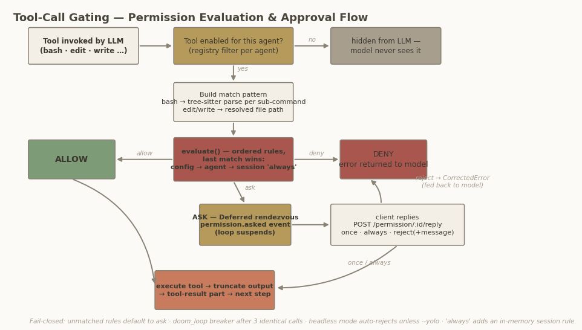

## Chapter 6 — Permissions & Security Model

Chapter 4 showed that every built-in tool calls `ctx.ask(...)` before producing a side effect. This chapter explains the engine behind that call. The overall finding, stated up front and substantiated below: OpenCode implements a **cooperative, policy-based authorization layer with a fail-closed default — not a sandbox**. Approved code runs with the user's full privileges; the system mediates the LLM↔user trust gap, not a process boundary.

### 6.1 The rule engine: ordered triples, last match wins

A permission rule is a triple `{permission, pattern, action}` with `action ∈ allow | ask | deny` (`packages/schema/src/v1/permission.ts:15-21`). A ruleset is an **ordered array**, and order is the entire precedence mechanism — there is no IAM-style "explicit deny overrides" logic. The evaluator is thirteen lines (`packages/opencode/src/permission/index.ts:28-38`):

```ts
export function evaluate(permission: string, pattern: string, ...rulesets: PermissionV1.Ruleset[]): PermissionV1.Rule {
  return (
    rulesets
      .flat()
      .findLast((rule) => Wildcard.match(permission, rule.permission) && Wildcard.match(pattern, rule.pattern)) ?? {
      action: "ask",
      permission,
      pattern: "*",
    }
  )
}
```

Three properties deserve attention. First, **`findLast` wins**: specific rules are expressed by placing them *after* catch-alls, so ruleset concatenation order *is* policy. `Permission.merge` is plain array concatenation (`permission/index.ts:200-202`), and the config parser preserves user key order via Effect Schema's `propertyOrder: "original"` option — the JSON object order in `opencode.json` is the rule order (`packages/core/src/v1/config/permission.ts:14-16`). Second, **the default is fail-closed**: an unmatched query returns `ask`, never `allow`. Third, the permission *key itself* is wildcarded, so `"*": "deny"` matches everything — this is how the hidden `compaction`/`title`/`summary` agents are neutered wholesale (`agent/agent.ts:219-264`).

The wildcard dialect is minimal (`packages/core/src/util/wildcard.ts:3-14`): `*` → `.*`, `?` → `.`, everything else regex-escaped, anchored `^…$`, case-insensitive on Windows with backslashes normalized to `/`. One subtlety matters for UX: a pattern ending in `" *"` is rewritten to `( .*)?`, so `"git status *"` also matches the bare `git status` (`wildcard.ts:11`).

### 6.2 The arity dictionary: synthesizing "always allow" patterns

When a user approves a bash command "always", OpenCode does not whitelist the literal string. `packages/opencode/src/permission/arity.ts` is a generated dictionary mapping **command prefixes to token counts** — how many whitespace-separated tokens constitute the "human-understandable command". `BashArity.prefix(tokens)` (`arity.ts:1-9`) does a longest-prefix lookup (`git` → 2, `npm run` → 3; flags never count; unknown commands fall back to the first token), and the shell tool builds the always-approve suggestion as `prefix.join(" ") + " *"` (`tool/shell.ts:407-410`). Approving `git status --porcelain` therefore whitelists `git status *` — semantically equivalent future invocations auto-approve, while `git push` still asks. The dictionary itself is LLM-generated; the generation prompt is preserved in a source comment (`arity.ts:11-23`), a rare case of a model-authored lookup table checked into the repo.

### 6.3 The approval flow: a Deferred rendezvous over the event bus

When evaluation yields `ask`, the tool fiber does not poll — it **suspends on an Effect `Deferred` with no timeout** (`permission/index.ts:97-106`). The request is stored in a per-instance `pending` map keyed by a `per_*` ID, a `permission.asked` event is published, and `Effect.ensuring` guarantees map cleanup. Clients (TUI, SDK consumers, the ACP adapter for Zed) receive the event over SSE and answer via `POST /permission/:requestID/reply` with `{reply: once | always | reject, message?}` (`server/routes/instance/httpapi/groups/permission.ts:31-40`).



*Figure 4: Tool-call gating. Denied tools are hidden from the model's schema; visible tools evaluate ordered rules (config → agent → session → in-memory "always" grants); `ask` suspends the loop on a Deferred until a client replies; reject-with-message feeds back to the model as a CorrectedError.*

`Permission.reply` (`permission/index.ts:109-167`) implements three materially different outcomes. **`once`** succeeds the Deferred; nothing is remembered. **`always`** additionally appends `{permission, pattern, action: "allow"}` to an in-memory `approved` array (`index.ts:143-151`), then auto-resolves any *other* pending same-session requests now fully covered (`:153-166`) — one approval can drain a queue. **`reject`** fails the Deferred with `RejectedError`, or with `CorrectedError` when the user typed feedback (`:121-127`); the correction text surfaces to the model as the tool error, turning a denial into a steering input. Rejection also **cascade-rejects all other pending requests of the same session** (`:129-138`) — a coherent "stop everything" semantic. The pattern is a synchronous-blocking consumer with an asynchronous producer, correlated by request ID: a rendezvous over pub/sub, not a bidirectional RPC.

### 6.4 Bash: granular checks via tree-sitter, honestly bounded

The bash tool never regex-splits commands. It parses every invocation with lazily loaded tree-sitter WASM grammars for **both bash and PowerShell** (`tool/shell.ts:311-336`) and extracts every `command` node anywhere in the AST — pipelines, `&&`/`||` lists, subshells, command substitutions (`shell.ts:123-125`). Each sub-command's full source text becomes a separate permission pattern, so `git status && rm -rf x` produces *two* patterns and the engine evaluates every one: a single `ask` blocks the whole invocation, one `deny` aborts with feedback (`permission/index.ts:72-82`). For known file-mutating verbs (`rm cp mv mkdir cat chmod …` plus cmd.exe and PowerShell variants, `shell.ts:28-64`), path arguments are statically resolved — unquoting, `~`/`$HOME`/`$env:` expansion, cygpath translation on Windows — and any path outside the instance triggers an `external_directory` ask (`shell.ts:263-280`).

The limits are equally explicit. There is **no dangerous-command blocklist** anywhere in the codebase; safety is user config plus the ask flow. Arguments containing `$(`, backticks, or `$VAR` are refused resolution (`shell.ts:174-179`), and redirect *targets* are excluded from path scanning — `echo x > /etc/foo` is gated only by the whole-command pattern, not by the external-directory check.

### 6.5 The external-directory boundary

The workspace boundary is a pure function: `containsPath` returns true if a path is under the instance directory **or** the git worktree root, with the worktree check skipped when it is `/` (non-git projects) so external-dir prompts still fire (`project/instance-context.ts:18-26`). Enforcement is **cooperative**: each tool opts in by calling `assertExternalDirectoryEffect(ctx, target)` (`tool/external-directory.ts:15-45`), which asks `external_directory` with a `<parent-dir>/*` glob offered as an always-pattern; all file tools, apply_patch, and the shell scanner call it. The default policy asks for everything outside the workspace but pre-allows internal directories (truncation store, tmp, skill and reference dirs, `agent/agent.ts:122-125`). There is no filesystem-level interception — a tool that forgets the call is unguarded.

### 6.6 Per-agent permission profiles

Agent definitions carry no tool lists; they carry rulesets, layered as defaults → agent overlay → user config → session rules (later = stronger, per §6.1). At request time, tools denied with pattern `*` are additionally **removed from the model's tool schema entirely** (`Permission.disabled`, `permission/index.ts:204-219`) — a proactive layer before any runtime check.

| Agent | Key rules (over shared defaults) | Effect |
|---|---|---|
| `build` (primary) | `question: allow`, `plan_enter: allow` | Full-capability default agent |
| `plan` (primary) | `edit: {"*": deny, .opencode/plans/*.md: allow, <global plans dir>: allow}`; `task.general: deny` | Read-only planning with a write carve-out for plan files |
| `general` (subagent) | `todowrite: deny` | Full subagent without todo writes |
| `explore` (subagent) | `"*": deny`, then allow `grep glob list bash webfetch websearch read` | Search/read-only profile — but `bash` is allowed, so not OS-level read-only |
| `compaction`, `title`, `summary` (hidden) | `"*": deny` | Pure-LLM utility agents, no tools at all |

The shared defaults themselves are opinionated (`agent/agent.ts:119-136`): `"*": "allow"`, but `doom_loop: ask`, `external_directory: ask`, `question: deny`, `plan_enter/plan_exit: deny`, and a `read` overlay that asks before reading `*.env`/`*.env.*` while allowing `*.env.example` — secrets protection expressed as policy. Two design points stand out. First, the plan agent is the clearest example of *mode-as-ruleset*: "plan mode" is not a code path but a permission overlay whose only write capability is the plans directory, which is exactly what makes it safe to let the model run unattended while planning. Second, the explore agent illustrates the honesty limits of profile naming: marketed as read-only, it retains `bash`, so its real guarantee is "no edit tools", not "no side effects". Subagent sessions inherit from the parent session only `external_directory` rules and **all deny rules**, plus default denies for `todowrite`/`task` unless the subagent declares them (`agent/subagent-permissions.ts:14-27`) — restrictions propagate downward, capabilities do not.

### 6.7 Circuit breakers, headless behavior, and the honest security boundary

Two runtime guards complement the rule engine. The **doom-loop breaker** watches tool calls in the processor: if the last `DOOM_LOOP_THRESHOLD = 3` tool parts are the same tool with byte-identical input, it raises a `doom_loop` ask (`session/processor.ts:29,356-377`) — anomaly detection routed through the same approval machinery rather than a hard stop, so a user can legitimately allow repetition. In **headless** `opencode run` there is no human at the SSE stream and the server-side Deferred waits forever; the CLI resolves this client-side, replying `"once"` under `--auto`/`--yolo`/`--dangerously-skip-permissions` and **auto-rejecting otherwise** (`cli/cmd/run.ts:796-816`). Deny rules are enforced regardless of auto mode, and instance teardown rejects all pending requests (`permission/index.ts:54-61`) — every path fails closed.

The boundary assessment, verified against the source: there is **no OS sandbox** — a grep for seccomp, seatbelt, sandbox-exec, bwrap, or landlock across `packages/` returns nothing — and "sandbox" elsewhere in the code means git worktrees, not isolation. Bash executes as the user with the user's environment (`process.env` is read directly for expansion, `tool/shell.ts:142-144`), so environment secrets are visible to any approved command. Network access is permission-gated per tool but unrestricted for approved bash. "Always" grants live in memory per instance, neither persisted nor shared (`permission/index.ts:25-26`). Even the docs drift from the code: `permissions.mdx` claims `.env` reads are denied by default while the code asks (`agent/agent.ts:132-133`). The service also trusts its in-process callers — plugins wrap tool execution outside the decision path. What OpenCode secures is the model's *intent*; what executes afterward is unmediated user code.

### Architect's take

*(Interpretation.)* For a clone, copy three things verbatim: the ordered rule array with `findLast` semantics — it replaces an entire policy framework with thirteen lines; the arity dictionary, which is the cheapest UX multiplier in the system; and the reject-with-message loop, which converts the permission layer from a gate into a steering channel. Do not copy the in-memory-only "always" set without persisting it, and do not market the result as a sandbox: pair the rule engine with real OS isolation (containers or seatbelt) if your threat model includes a compromised or jailbroken model, because OpenCode's design explicitly does not.
