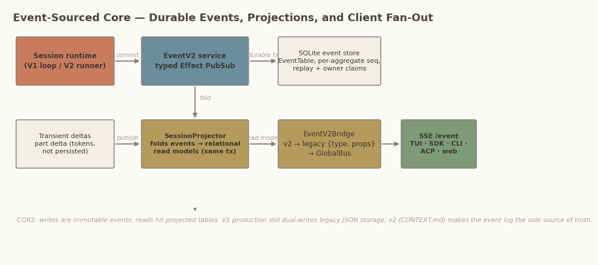

## Chapter 7 — Server, Event Architecture & Storage

Chapter 2 mapped OpenCode's containers; this chapter opens the server box. Three claims from that overview are examined at line level: a single typed HTTP API is the agent's only boundary, every state change flows through an event-sourced core, and storage is mid-migration from JSON files to SQLite. All three hold, with one correction to common belief: at this commit the HTTP stack is Effect-TS `HttpApi`/`HttpRouter` over Node's `http` module — a repository-wide search finds no Hono import anywhere in `packages/opencode/src`, `packages/server/src`, or `packages/protocol/src` (the only case-insensitive matches are the words "honors"/"honor" in comments).

### 7.1 One typed API tree, three composition layers

The API surface is declared in three places and merged into one `HttpApi`. `packages/opencode/src/server/routes/instance/httpapi/api.ts:54-94` builds `RootHttpApi` (control, control-plane, global groups), `InstanceHttpApi` (fifteen per-project groups, session through workspace), and finally `OpenCodeHttpApi`, which adds the SSE `EventApi`, the v2 protocol surface, and `PtyConnectApi`. The v2 surface is owned by a separate package: `packages/protocol/src/api.ts:37-64` declares eighteen groups (Health through ProjectCopy) and owns middleware placement, while `packages/server` injects the concrete services. This split is deliberate hexagonal architecture: the protocol package fixes contracts, the server package supplies implementations, and neither imports a channel.

Every endpoint is a typed `HttpApiEndpoint` with Effect-Schema codecs, so the OpenAPI 3.1 document is derived, not hand-written: `OpenApi.fromApi(PublicApi)` is built lazily on the first hit of `GET /doc`, then cached (`packages/opencode/src/server/routes/instance/httpapi/server.ts:183-192`). The listener is thin: `Server.listen` tries port 4096 first, then any free port (`packages/opencode/src/server/server.ts:120-122`), and — critically — also exists as `Server.Default`, which exposes the same router as an in-memory Web `fetch` handler with no TCP socket (`server.ts:56-65`).

| Route group | Purpose | Typical client |
|---|---|---|
| `/session/*` (v1) | Session CRUD, `POST /session/:id/message` and `/prompt_async`, abort, fork, revert, summarize (`groups/session.ts:80-104`) | TUI, `opencode run`, JS SDK |
| `/event`, `/global/event` | v1-shape SSE fan-out, instance-filtered and raw (`handlers/event.ts:25-90`) | TUI, CLI, SDK |
| `/permission/*`, `/question/*` | Approval and elicitation rendezvous: `POST /permission/:requestID/reply` (`groups/permission.ts:31`) | TUI, ACP, headless CLI |
| `/file`, `/config`, `/provider`, `/mcp`, `/instance` | Filesystem search/status, configuration, provider/model and MCP introspection | TUI pickers, SDK applications |
| `/tui/*` | Remote-control a running TUI (append prompt, open help, toast) | IDE extension |
| `/pty` | Pseudo-terminal sessions, WebSocket data plane | Web/desktop clients |
| `/sync/*` | Cross-node durable-event replication (history, replay, steal) | A second OpenCode node |
| `/api/*` (v2 protocol) | Durable session admission (`POST /api/session/:id/prompt`, `packages/protocol/src/groups/session.ts:205-222`), typed event replay | sdk-next, v2 SDK |

The table's last column is the architectural point: no group has a channel-specific handler, and no channel has a private back door into the agent. The TUI's file pickers, the IDE extension's prompt box, and a third-party SDK script exercise the same endpoints with the same schemas — which is why the OpenAPI document at `/doc` is a complete description of the agent's public surface. For a cloner the table is a scope menu: most groups are channel conveniences, and Section 7.7 identifies the few that are load-bearing.

### 7.2 Streaming and transport policy

Server-Sent Events (SSE) is the only streaming transport for agent traffic; WebSocket is reserved for pseudo-terminals. Of the three SSE endpoints, `GET /event` emits `server.connected` first, filters events to the requesting instance's directory and workspace, merges a ten-second `server.heartbeat`, and terminates when `server.instance.disposed` arrives (`handlers/event.ts:25-90`); `GET /global/event` is the unfiltered `GlobalBus` stream the local TUI subscribes to; `GET /api/event` serves v2-native payloads from a queue bounded at 256 events with fifteen-second comment heartbeats (`packages/server/src/handlers/event.ts:9-49`) — the bound protects server memory from slow consumers, at the price of disconnecting anyone 256 events behind. The PTY exception is deliberate: `groups/pty.ts:116-153` issues a short-lived connect ticket over HTTP, then upgrades to a WebSocket, because terminal I/O is bidirectional in a way agent events are not.

Transport policy is equally austere. Authentication is optional HTTP Basic (`OPENCODE_SERVER_PASSWORD`), accepted as an `Authorization` header or an `?auth_token=` query parameter for SSE/WS clients that cannot set headers (`middleware/authorization.ts:73-83`); when unset, the server is open and says so at startup. Discovery publishes `opencode-<port>` at `opencode.local` via `bonjour-service` only when `--mdns` is set and the hostname is non-loopback (`server/mdns.ts:6-34`, `server.ts:155-170`) — plainly "localhost-first, network-exposed by explicit opt-in."

### 7.3 Event architecture: pub/sub and event sourcing in one service

The event system has three tiers, and only one is load-bearing for correctness. `EventV2` (`packages/core/src/event.ts:126-148`) is an Effect service — `publish`, `subscribe`, `all`, `durable`, `project`, `replay`/`replayAll`, `remove`, `claim` — combining typed in-process pub/sub (one `PubSub` per event type plus a global one, `event.ts:174-178`) with genuine event sourcing into SQLite. `GlobalBus` (`packages/opencode/src/bus/global.ts:11-22`) is a process-wide Node `EventEmitter` carrying `{directory, project, workspace, payload}` envelopes for v1-era consumers. `EventV2Bridge` (`packages/opencode/src/event-v2-bridge.ts:35-61`) stitches them: it stamps instance location on publish, re-emits every event on `GlobalBus` as legacy `{id, type, properties}`, and reshapes durable events into `sync` envelopes carrying versioned type, per-aggregate sequence, and aggregate ID.

The durable commit path is the interesting machinery. Events opt in by declaration — the v1 session events share `durable: { aggregate: "sessionID", version: 1 }` (`packages/schema/src/v1/session.ts:502-507`, spread into seven definitions at `:574-623`) — and `commitDurableEvent` (`event.ts:205-352`) executes it inside a single `immediate` SQLite transaction: read the aggregate's `event_sequence` row, verify sequence continuity and ownership (mismatch or replay divergence dies with `InvalidDurableEventError`), run every registered projector, upsert the sequence, append to the event table; subscribers are notified only after commit. The projector step is worth quoting, because it is what makes reads consistent with writes:

```ts
// packages/core/src/event.ts:316-323 — inside the commit transaction
const committed = {
  ...event,
  durable: { aggregateID, seq, version: durable.version },
} as Payload
for (const projector of list) {
  yield* projector(committed)
}
if (commit) yield* commit(seq)
```

Equally deliberate is what is *not* durable. High-frequency streaming deltas — `message.part.delta`, declared without a `durable` block (`v1/session.ts:632-641`) — are pure pub/sub: they carry token-by-token text to SSE clients and never touch the log, keeping the store small and replay cheap. The split is a data-classification decision: state transitions are sourced; ephemera are broadcast.



*Figure 5: The event-sourced core. Durable events are committed with per-aggregate sequences in the same SQLite transaction that folds them into relational read models; `EventV2Bridge` re-shapes the stream for legacy and SSE consumers, while transient `part.delta` traffic stays on pub/sub only.*

Read against each other, the three tiers are two systems wearing one interface. Only the durable tier has ordering guarantees, ownership claims, and replay — everything multi-node sync and crash recovery require; the pub/sub tier lets internal services react without polling; the `GlobalBus` tier exists so v1-era consumers survived the migration unmodified. A cloner should adopt the durable tier's semantics and emit one canonical event shape from day one — the bridge is a compatibility tax, not a pattern.

### 7.4 CQRS projectors and the dual-storage reality

Because projectors run inside the commit transaction, the read model lags the write model by at most that transaction — textbook Command Query Responsibility Segregation (CQRS) without a message queue. `SessionProjector` (`packages/core/src/session/projector.ts`) folds v1 session events into relational tables: session upserts (`projector.ts:44-76`), message and part upserts, and usage accounting via signed cost/token deltas on the session row (`projector.ts:90-110`). Reads hit the projections, not the log — message history pages newest-first over `MessageTable` with a cursor (`packages/opencode/src/session/message-v2.ts:425-467`). One trap for readers: `packages/opencode/src/server/projectors.ts` is an empty stub kept by an import; the real projector lives in `core`.

Storage at this commit is dual in infrastructure but no longer dual in fact. The SQLite side — drizzle over `EffectDrizzleSqlite` at `~/.local/share/opencode/opencode.db` (channel-suffixed for non-production installs), WAL mode, `busy_timeout = 5000`, foreign keys on (`packages/core/src/database/database.ts:27-32,43-55`) — is the system of record for session state. The legacy JSON document store (`packages/opencode/src/storage/storage.ts`, rooted at `~/.local/share/opencode/storage`, `:224`) still ships numbered migrations and per-file `TxReentrantLock`ing (`:82-211`, `:219`), yet a caller audit shows its session-domain writes have shrunk to one artifact: revert diff summaries (`session/revert.ts:76` writes `session_diff`); every other former consumer imports only its `NotFoundError` type. The v2 direction documented in `CONTEXT.md` — the event log as sole source of truth — is thus already ~95% executed in the session path; the JSON store is a vestige, and the `/sync/*` endpoints that replicate the event log across nodes (history, replay, ownership steal) have no JSON counterpart.

### 7.5 SDK generation and the embedded variant

The JavaScript SDK is generated, not maintained. `packages/sdk/js/script/build.ts` runs `bun dev generate` to dump the OpenAPI document, prunes unreachable `SessionNext*` schemas, and feeds it to `@hey-api/openapi-ts`, producing a single `OpencodeClient` with namespaced resources (`sdk.gen.ts`, 7,219 lines) and 13,618 lines of types; SSE endpoints surface as async-iterable streams. Two successors matter. `packages/sdk-next` embeds the server itself — `createEmbeddedRoutes()` converted to a Web handler, driven through an Effect `FetchHttpClient` over a synthetic `fetch`; same handlers, same codecs, zero sockets (`packages/sdk-next/src/opencode.ts:11-42`). And the Agent Client Protocol (ACP) integration for editors such as Zed is a thin adapter whose `Agent` delegates every ACP method to a plain SDK client (`packages/opencode/src/acp/agent.ts:24-93`) — evidence that the HTTP API is the only extension boundary the project honors internally.

### 7.6 Multi-project instances and lifecycle

One process serves many projects. `InstanceStore` (`packages/opencode/src/project/instance-store.ts`) caches per-directory instance contexts, booting each exactly once behind a `Deferred` so concurrent first requests join rather than duplicate the bootstrap (`instance-store.ts:108-123`). Every instance request carries `?directory=` or an `x-opencode-directory` header (defaulting to the process working directory), which the SDK injects automatically; a workspace-routing middleware can additionally proxy to remote workspace targets. Disposal is explicit and observable: `POST /instance/dispose` tears one instance down and emits `server.instance.disposed`, the very event that terminates each `/event` SSE stream (`handlers/event.ts`), while `POST /global/dispose` disposes all instances. Lifecycle events are part of the protocol, not side effects — clients always learn when their context vanished.

### 7.7 The client boundary — and what a clone actually needs

Every channel consumes the same router, differing only in transport. The TUI runs in a worker thread whose `fetch` is an RPC bridge into the main process, which calls `Server.Default().app.fetch` in memory and forwards `GlobalBus` events back as RPC messages (`packages/opencode/src/cli/cmd/tui.ts:24-48`); headless `opencode run` does the same trick directly, with `baseUrl: "http://opencode.internal"` (`cli/cmd/run.ts:911-953`); `opencode serve` puts the identical router on TCP; sdk-next embeds it; ACP adapts it. Channels are replaceable because the server never knew they existed — transport is a parameter, handlers and schemas are constants.

For the clone blueprint (Chapter 10), the load-bearing subset is small: `POST /session`, `POST /session/:id/message` (or `/prompt_async`), `GET /session/:id/message` for history, `GET /event` for the SSE stream, `POST /session/:id/abort`, and the `POST /permission/:requestID/reply` rendezvous (plus its question sibling if elicitation is cloned). Everything else — `/tui/*`, `/pty`, `/sync/*`, mDNS, share, fork, the v2 `/api/*` tree — is channel convenience or multi-node machinery a single-user clone can defer. The event contract matters more than the routes: `{id, type, properties}` frames with `server.connected`, a heartbeat, and durable `message.part.updated` states are what clients render.

### Architect's take

*(Interpretation.)* The server layer is the cleanest part of this codebase: one typed API, one commit path, one read model, transports as parameters. What deserves imitation is the discipline that OpenAPI, SDK, TUI, and headless CLI all fall out of the same router — that is what makes an agent core cloneable at all. What does not deserve imitation is the three-tier event bridge: it exists to avoid rewriting v1 consumers, and a greenfield clone should collapse it to a single canonical event stream with an optional durable log. If you keep only two ideas from this chapter, keep *durable commit with in-transaction projection* and *the in-memory `app.fetch` trick* — the first buys correctness, the second buys every client you will ever write.
