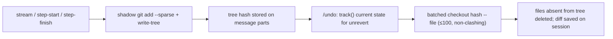

## Chapter 8 — Extensibility & Infrastructure

OpenCode's extensibility is three-tiered. At the top sit **imperative code plugins** — in-process JavaScript/TypeScript modules with lifecycle and interception points. In the middle are **protocol adapters** (MCP, LSP) that normalize external capabilities into the same tool, permission, and diagnostics fabric the built-in tools use. At the bottom are **declarative markdown extensions** (agents, commands, skills) resolved through the layered configuration cascade. Around all three stands the infrastructure that keeps the agent safe and configurable: an eight-layer config cascade, a shadow-git snapshot store for revert, and a formatter pipeline. Every subsystem is an Effect-TS `Context.Service` built by a `Layer`, with per-project state created lazily via `InstanceState.make` and torn down by finalizers (`packages/opencode/src/project/instance-context.ts:5-9`). All paths below are relative to the repository root.

### 8.1 The plugin system: a closed Hooks contract

A plugin is an async function `(input: PluginInput) => Promise<Hooks>` (`packages/plugin/src/index.ts:74`). `PluginInput` supplies a typed SDK client, `project`/`directory`/`worktree`, the `serverUrl`, a `BunShell` (`$`), and an experimental workspace-registration hook (`packages/plugin/src/index.ts:56-66`). The entire contract is the `Hooks` interface (`packages/plugin/src/index.ts:222-335`) — a closed, versioned enumeration of interception points. Nothing outside this list can be hooked.

| Hook | When fired | Mutability |
|---|---|---|
| `config` | after config load, per plugin (`packages/opencode/src/plugin/index.ts:241-249`) | full config object, in place |
| `event` | every bus event, filtered per directory (`packages/opencode/src/plugin/index.ts:251-258`) | none — pure observer |
| `dispose` | instance teardown finalizer (`packages/opencode/src/plugin/index.ts:261-274`) | none |
| `tool` map | tool-registry build (`packages/opencode/src/tool/registry.ts:194-199`) | adds custom tools |
| `auth`, `provider` | provider-layer construction | OAuth methods, model catalogs |
| `chat.message` | user message ingested (`packages/opencode/src/session/prompt.ts:1000`) | message + parts |
| `chat.params` | LLM request assembly (`packages/opencode/src/session/llm/request.ts:114-132`) | temperature/topP/topK/maxOutputTokens/options |
| `chat.headers` | LLM request assembly (`packages/opencode/src/session/llm/request.ts:134-146`) | HTTP headers |
| `shell.env` | shell/pty spawn (`packages/opencode/src/session/prompt.ts:554`) | environment variables |
| `tool.execute.before` | before tool run (`packages/opencode/src/session/tools.ts:106-110`) | tool arguments |
| `tool.execute.after` | after tool run (`packages/opencode/src/session/tools.ts:121-125`) | title/output/metadata |
| `command.execute.before` | slash-command run (`packages/opencode/src/session/prompt.ts:1460-1461`) | command parts |
| `tool.definition` | tool advertised to model (`packages/opencode/src/tool/registry.ts:313`) | description/parameters sent to the LLM |
| `experimental.chat.system.transform` | system-prompt assembly (`packages/opencode/src/session/llm/request.ts:69-73`) | system prompt array |
| `experimental.chat.messages.transform` | history assembly and compaction (`packages/opencode/src/session/prompt.ts:1255`) | full message history |
| `experimental.session.compacting`, `experimental.compaction.autocontinue` | compaction (`packages/opencode/src/session/compaction.ts:343,454`) | compaction prompt / continue turn |
| `experimental.text.complete` | generated text finished (`packages/opencode/src/session/processor.ts:516`) | generated text |
| `experimental.provider.small_model` | small-model selection (`packages/opencode/src/provider/provider.ts:1887`) | model pick |
| `permission.ask` | **never — declared but dead** (see below) | — |

*Table 8.1: The plugin hook surface (v1), with verified trigger sites.*

Two structural facts fall out of this table. First, the contract is almost entirely **mutational**: every hook after the lifecycle trio receives an `output` bag it may rewrite, which makes plugins composable — a redaction plugin and a telemetry plugin can both sit on `tool.execute.after` without knowing about each other. Second, the surface spans the whole LLM loop — ingress, request shaping, tool execution, history/system-prompt transforms, compaction, small-model selection — but only at points the authors chose. Read the hook list as a *requirements list for an agent runtime*: anywhere OpenCode has a hook is somewhere real users demanded intervention.

Dispatch is deliberately trivial. `Plugin.trigger` runs hooks sequentially in registration order over one shared mutable bag (`packages/opencode/src/plugin/index.ts:280-293`):

```ts
const trigger = Effect.fn("Plugin.trigger")(function* <
  Name extends TriggerName,
  Input = Parameters<Required<Hooks>[Name]>[0],
  Output = Parameters<Required<Hooks>[Name]>[1],
>(name: Name, input: Input, output: Output) {
  if (!name) return output
  const s = yield* InstanceState.get(state)
  for (const hook of s.hooks) {
    const fn = hook[name] as any
    if (!fn) continue
    yield* Effect.promise(async () => fn(input, output))
  }
  return output
})
```

There is no priority, no veto, no short-circuit: a failing hook is contained by `Effect.promise`, and even `tool.execute.before` cannot cancel the call — the real `item.execute` always runs (`packages/opencode/src/session/tools.ts:111`). The sharpest illustration of the closed contract is `permission.ask`: it is *declared* in the interface (`packages/plugin/src/index.ts:261`) with an `output: { status: "ask" | "deny" | "allow" }` bag, yet a repo-wide search finds **zero trigger sites** — plugins cannot programmatically approve or deny permissions in v1. Loading is a four-stage pipeline (`packages/opencode/src/plugin/loader.ts:86-145`): **install/resolve** (path specs become `file://` URLs; npm specs install on demand into a global cache under a file lock, `packages/core/src/npm.ts:115-137`) → **entrypoint detection** (`exports["./server"]` → `main` → `index.*`, with a containment check against directory escape, `packages/opencode/src/plugin/shared.ts:89-97`) → **compatibility** (optional `engines.opencode` semver range, `shared.ts:194-205`) → **dynamic `import()`**. Auto-discovery adds `{plugin,plugins}/*.{ts,js}` from every config directory, deduplicated with provenance (`packages/opencode/src/config/plugin.ts:18-29,60-78`). Plugins run in-process with full shell and filesystem access — there is no sandbox. A next-generation v2 API (`define({ id, setup })`, domain transforms, explicit disposal) exists in parallel under `packages/plugin/src/v2/`; given documented v2 instability, treat the v1 Hooks shape as the stable target.

### 8.2 MCP: a protocol adapter with production-grade OAuth

The Model Context Protocol (MCP) client manager is a per-instance Effect service holding `{config, status, clients, defs, instructions}` (`packages/opencode/src/mcp/index.ts:142-148`). On initialization all configured servers connect **concurrently** (`Effect.forEach … concurrency: "unbounded"`, `mcp/index.ts:505-529`), so a slow server never blocks the others. Local servers use stdio with merged environment; remote servers try the StreamableHTTP transport first and fall back to Server-Sent Events (`mcp/index.ts:269-284`), wrapped in `Effect.acquireUseRelease` so half-open transports are closed. Status is a small state machine — `connected | disabled | failed | needs_auth | needs_client_registration` (`mcp/index.ts:83-107`) — and teardown kills the entire stdio process tree (`mcp/index.ts:531-556`).

Remote-server authentication is a full OAuth2 implementation: dynamic client registration as fallback, a local callback server, browser launch, a CSRF state check, and `finishAuth` on the pending transport (`mcp/index.ts:909-942`), with tokens and code verifiers persisted under lock in `~/.local/share/opencode/mcp-auth.json`. Tool bridging prefixes server to tool — `sanitize(clientName) + "_" + sanitize(toolName)` where `sanitize` maps `[^a-zA-Z0-9_-]` to `_` (`packages/opencode/src/mcp/catalog.ts:117-119`). That prefix *is* the collision strategy; if two sanitized keys still collide, the last writer wins (`mcp/index.ts:684`). Each MCP tool is adapted into the same wrapper used by built-ins, gaining `tool.execute.before/after` plugin hooks and permission checks (`packages/opencode/src/session/tools.ts:390-424`). MCP **resources** surface as three synthetic tools (`list_mcp_resources`, `list_mcp_resource_templates`, `read_mcp_resource`), and per-agent gating needs no MCP-specific field: the generic permission filter simply removes denied tools from the model's tool set (`packages/opencode/src/session/llm/request.ts:208-214`). The clone-relevant insight is that string-prefix namespacing plus reuse of the ordinary tool-permission path makes an entire external protocol feel native for roughly a hundred lines of adapter code.

### 8.3 LSP: lazy diagnostics as tool feedback

The Language Server Protocol (LSP) subsystem ships roughly 39 built-in server descriptors of shape `{ id, extensions, root, spawn }` (`packages/opencode/src/lsp/server.ts:69-74`) — TypeScript, gopls, rust-analyzer, clangd, pyright/ty, jdtls, and more, many auto-installed via npm. Roots are computed by walking up for marker files, and user config merges over the built-ins (`packages/opencode/src/lsp/lsp.ts:149-189`). Nothing spawns at startup: the first tool call touching a file maps extension → candidate servers → root, caches clients per `root+serverID`, deduplicates concurrent spawns through a `spawning` promise map, and records permanent failures in a `broken` set — a small circuit breaker (`lsp.ts:208-297`).

Each client merges pushed (`textDocument/publishDiagnostics`) and pulled (`textDocument/diagnostic`) diagnostic maps with a 150 ms debounce. The payoff lands in the mutation tools: after `edit`, `write`, or `apply_patch`, the tool runs `lsp.touchFile(path, "document")` (didOpen/didChange plus `waitForDiagnostics`) and appends severity-1 errors — capped at 20 per file — directly into the LLM-visible output as `"\n\nLSP errors detected in this file, please fix:\n<diagnostics …>"` (`packages/opencode/src/tool/edit.ts:197-201`; same pattern in `write.ts:75-76` and `apply_patch.ts:269-271`). Notably, the [official LSP documentation](https://opencode.ai/docs/lsp/) concedes LSP "is not always a net positive," and the subsystem is **disabled by default** — a useful calibration: diagnostics-in-tool-output is the valuable pattern; the LSP transport behind it is optional and deferrable.

### 8.4 The configuration cascade: eight layers, one merge

Config files are JSONC, interpolated with `{env:VAR}` and `{file:path}` **before** parsing (`packages/opencode/src/config/variable.ts:33-91`), then decoded with Effect Schema using `errors: "all"` and strict rejection of unknown top-level keys — typos fail loudly instead of being silently ignored. Layering happens lowest-to-highest precedence, deep-merged with remeda's `mergeDeep`, except `instructions`, which concatenates and deduplicates (`packages/opencode/src/config/config.ts:41-51,314-596`).

| Layer | Source | Precedence |
|---|---|---|
| Well-known remote | `https://<auth-host>/.well-known/opencode`, token-injected | 1 (lowest) |
| Global file | `~/.config/opencode/{config.json,opencode.json[c]}` | 2 |
| Env-specified file | `OPENCODE_CONFIG` path | 3 |
| Project files | `opencode.json[c]` walking **up** from cwd to worktree, root-first | 4 |
| `.opencode` directories | global config dir, project ancestors, `~/.opencode`, `OPENCODE_CONFIG_DIR` — config plus markdown agents/commands and file plugins | 5 |
| Inline env content | `OPENCODE_CONFIG_CONTENT` JSON | 6 |
| Organization remote | Console org config | 7 |
| Managed | managed config dir + macOS MDM preferences (`ai.opencode.managed`) | 8 (highest, not user-overridable) |

*Table 8.2: The eight-layer config cascade (`packages/opencode/src/config/config.ts:314-596`).*

The ordering encodes a governance story: individual developers sit mid-stack, sandwiched between machine-wide defaults below and organizational authority above — layers 7–8 exist purely for enterprises, and MDM is explicitly not user-overridable. The odd one out is `instructions` (the `AGENTS.md` family): rule files compose rather than override, so concatenation-with-dedupe replaces `mergeDeep` for that key alone — a one-line special case worth copying verbatim. There is intentionally **no hot reload**: instance config is read once into `InstanceState`, and only the global file is invalidated on explicit writes (grep-verified: no file watchers in the server tree). Re-read-on-restart removes an entire class of stale-state bugs at the cost of one restart — a defensible trade for a cloner.

### 8.5 Skills and commands: the declarative tier

Skills are discovered from `.claude/skills/**/SKILL.md` and `.agents/skills/**/SKILL.md` in `$HOME` and ancestors (deliberate Claude Code ecosystem compatibility), from `{skill,skills}/**/SKILL.md` under every config directory, and from remote bundles in `config.skills.urls[]` — fetched via an `index.json` manifest into `~/.cache/opencode/skills/<name>` and refreshed atomically through a staging directory, rename, and `.opencode-version` stamp (`packages/opencode/src/skill/discovery.ts:49-132`). Only `name` (required) and `description` are read from the YAML frontmatter; the body is prompt text. The LLM invokes a skill through the permission-gated `skill` tool, which returns the body inside `<skill_content>` with a base-directory convention note (`packages/opencode/src/tool/skill.ts:12-69`). Commands unify three sources behind one registry (`packages/opencode/src/command/index.ts:65-157`): markdown files with `{description, agent, model, subtask}` frontmatter, MCP prompts (lazy `getPrompt` with positional `$1…$n`), and skills themselves — every skill is also a slash command — with `$ARGUMENTS`/`$N` placeholders extracted for UI hints. This tier is the declarative counterpart to plugins: no code execution, no hooks, just prompt text and routing metadata through the same config cascade. It is also the cheapest tier to clone and the one users adopt fastest.

### 8.6 Snapshot and revert: shadow-git mementos

Revert safety is handled out-of-band by a **shadow git directory** per project+worktree — `~/.local/share/opencode/snapshot/<project.id>/<hash(worktree)>` — always invoked as `git --git-dir <shadow> --work-tree <worktree>`, so the user's repository is never mutated (`packages/opencode/src/snapshot/index.ts:71-75`). Initialization tunes git for large trees, then *seeds* the shadow store by writing `objects/info/alternates` pointing at the real repo's object database and copying its index (`snapshot/index.ts:198-233`) — content the user's repo already hashed is reused instead of re-hashed. Capture enumerates `diff-files` plus untracked files, filters them through the source repo's `check-ignore`, excludes untracked files over 2 MB, and `write-tree`s the survivors into a tree hash. Mementos are recorded before each LLM stream and at every `step-start`/`step-finish` (`packages/opencode/src/session/processor.ts:102,425,436`); tool parts carry `patch` parts derived from consecutive hashes. A semaphore per git dir serializes all operations.



*Figure 8.1: Capture and revert flow through the shadow git store.*

Revert collects `patch` parts after the target message, snapshots the current state first (which is what makes `unrevert` possible), then restores files with `git checkout <hash> -- <file>`, batching up to 100 same-hash, non-overlapping paths per invocation and deleting files absent from the target tree (`packages/opencode/src/session/revert.ts:38-88`, `snapshot/index.ts:447-521`). An hourly `git gc --prune=7.days` bounds storage (`snapshot/index.ts:23,300-316`). The design is a textbook Memento with git as the persistence engine: no custom diff format, one semaphore for locking, garbage collection delegated to a battle-tested tool.

### 8.7 Formatters: closing the mutation loop

A registry of fifteen-plus formatters (prettier, biome, gofmt, ruff, clang-format, ktlint, mix, and others in `packages/opencode/src/format/formatter.ts`) probes each command once and caches resolution. After `write`, `edit`, or `apply_patch`, the tool calls `format.file(path)`, which runs every formatter matching the extension with `$FILE` substituted into the command line (`packages/opencode/src/format/index.ts:73-116`, substitution at `:82`); the tool then re-reads the file before computing its diff (e.g. `edit.ts:112`). Formatting is therefore *inside* the mutation → diff → LSP-diagnostics feedback loop rather than a post-commit hook — the model sees post-format content and fresh errors in the same step.

### Architect's take

*Interpretation:* If you clone one thing from this chapter, clone the shadow-git memento store — roughly 800 lines, trustworthy `/undo`, independent of every other subsystem. The sequential mutable-bag dispatcher and the declarative markdown tier are the next-cheapest wins; copy the closed hook list as your initial requirements, but add the two things OpenCode lacks — a real `permission.ask` trigger and hook-level cancellation — because integrators will demand both within a month. Defer MCP OAuth2, LSP pull-diagnostics, and the MDM config layer: each solves a problem you only have at enterprise scale. And respect the config cascade's discipline — strict schema validation, no hot reload, provenance on every plugin spec — because extensibility systems fail by ambiguity long before they fail by missing features.
