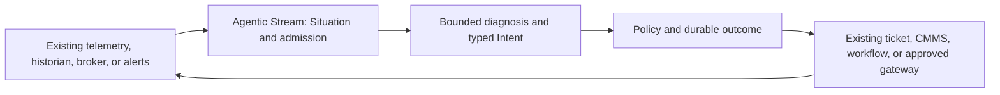

# Agentic Stream as a standalone product

Research findings · 2026-09-24 · Decision research, **not** a release plan or architecture change

Read with the [research plan](RESEARCH_PLAN.md), [source ledger](SOURCES.md), and the later [deep dive](DEEP_DIVE.md). **Fact** means verified in the current checkout or a cited primary source; **inference** means a reasoned interpretation; **hypothesis** means a proposition requiring customer or comparative evidence. Product status can drift after this date. The deep dive adds the current competitive picture, workflow alternatives, repository adoption gaps and revised decision; use it instead of any first-pass ranking below.

## Executive finding

**There is a coherent product thesis, but no validated standalone business yet.** The thesis is an *operational Situation supervisor*: take a noisy, late, multi-source condition; preserve a versioned explanation of what is true; invoke bounded diagnosis only when the condition warrants it; and govern, record, and verify any proposed action. This describes the architecture, not a validated buyer demand claim. The later [deep dive](DEEP_DIVE.md) narrows the current opportunity: broad agentic SRE claims face direct competition, and the industrial example has credible process-based alternatives.

The two useful discovery paths remain (1) a specific production software incident workflow and (2) a stationary-equipment maintenance exception. They are test cases, not market rankings. The checked-in motor example is narrower than the design acceptance target and remains synthetic. Replay/evaluation is the shortest technical proof path; a separate buyer and renewal reason are unproven. The attached ExecutionRail idea is a separate product hypothesis: keep any executor external unless buyers justify a design change and the resulting safety/field burden.

**Recommended next decision:** run paired buyer/workflow discovery and a read-only, side-by-side proof on *real customer traces* before committing to either vertical. Keep the candidate product boundary: Agentic Stream owns temporal Situation truth, cognitive admission, intent policy, and decision/effect records; existing brokers, observability systems, CMMS/ticketing platforms, and qualified physical controllers retain their existing roles. Do not claim product-market fit, lower cost, safety certification, or benchmark superiority from this desk research.

## 1. What problem would a product solve? Five whys

The [technical design's root-cause analysis](../../design/TECHNICAL_DESIGN.md) explains why calling a model on every event fails. For a product, there is a second chain:

1. **Why do teams still suffer after they have alerts and automation?** An alert can mark a threshold without preserving a complete, evolving operational condition, its source health, and why the system acted now. This is a *hypothesis*, not a claim about every alerting tool.
2. **Why is a condition hard to preserve?** In candidate workflows, evidence *can be* duplicated, delayed, contradictory, or absent. Business context and equipment/operator state may arrive on different clocks. The frequency and cost of these problems require P0 validation; event-time semantics, provenance, and corrections otherwise become application code.
3. **Why does an LLM or workflow engine alone not close it?** They can reason and persist workflows, but the application still must define when a changing stream merits an episode, what immutable snapshot it saw, and what to do if the world changed during reasoning. This is an integration-design inference, not a statement that [Temporal](https://docs.temporal.io/workflows) or [LangGraph](https://docs.langchain.com/oss/python/langgraph/persistence) cannot be configured to do so.
4. **Why is a safe action another seam?** A suggestion can be stale, unauthorized, duplicated, or accepted by an external system before its response is lost. The policy decision and observed outcome need a lifecycle separate from model text. The repository's [invariants](../../../README.md) and [limitations](../../../documentation/overview/limitations.md) explicitly model this distinction.
5. **Why might a new product still be unnecessary?** Existing stream, workflow, alerting, and IoT products can be composed; for many customers simple rules and human runbooks are sufficient. The unresolved question is whether the integrated Situation contract improves an important outcome enough to justify another deployed system.

The fifth answer is the product kill question. Elegant semantics alone are insufficient.

## 2. Baseline: current checkout versus product claim

The current repository is MIT licensed and [describes itself](../../../README.md) as an unreleased development snapshot. The [release manifest](../../../documentation/governance/release-status.json) is dated 2026-08-17 and still says `development`/`unreleased`; [release evidence](../../../documentation/governance/release.md) lists backup/restore, crash/disk-full, soak, security, compatibility, and artifact gates. That manifest is a conservative release boundary, not a complete inventory of later code.

| Current checkout evidence | Product implication and limit |
| --- | --- |
| [SituationSpec compiler](../../../internal/spec/), [event-time processing](../../../internal/eventlog/), [operators](../../../internal/operators/), [Situation state](../../../internal/situations/), [cognitive scheduler](../../../internal/cognition/) | Technical basis for temporal, versioned operational context. Focused tests do not establish customer value or production workload capacity. |
| [Episodes](../../../internal/episodes/), [decisions](../../../internal/decisions/), [policy](../../../internal/policy/), [action outbox](../../../internal/actions/), [replay](../../../internal/replay/) | The integrated semantic seam exists in code. External-effect exactly-once and safety cannot be inferred from an outbox; provider reconciliation and target deployment evidence remain necessary. |
| [CLI](../../../cmd/agentic-stream/main.go) exposes `validate`, `run`, `run-live`, `serve`, `export-run`, and `verify-run` | There is a local engineer-facing path. Public operator inspection, approval resolution, quarantine redrive, and configuration introspection remain incomplete in [limitations](../../../documentation/overview/limitations.md). |
| [Live Unix-socket ingress](../../../internal/ingress/live_socket.go) and gated [emulator/physical effect profiles](../../../cmd/agentic-stream/effect_profile.go) exist in the current checkout | The [public status page](../../../documentation/overview/status.md) still describes primarily file/simulator ingress and simulated effects. Record this as documentation/status drift to reconcile in a separate implementation or release task. Code paths are **not** evidence of field-qualified hardware control. |
| [Predictive-maintenance example](../../../examples/predictive-maintenance/) and [design acceptance](../../design/README.md) | A coherent proof fixture, not a design partner or real asset validation. The proposed product must work on unfamiliar customer traces. |

The ten [product invariants](../../design/README.md) remain the governing constraints. The [technical design](../../design/TECHNICAL_DESIGN.md) expressly excludes robotics, PLC, video-rate, and sub-millisecond control in v1. Any new product framing must distinguish current code, design targets, a qualified deployment, and a commercial offer.

## 3. Landscape by customer job

These are **documented overlaps**, not a claim that competitors lack unlisted features. Buyers can compose products or write application code. The difficult comparison is total workflow cost and outcome quality.

| Customer job | Strong existing choices, evidenced scope | What Agentic Stream would have to prove |
| --- | --- | --- |
| Process event streams correctly | [Apache Flink](https://nightlies.apache.org/flink/flink-docs-stable/docs/learn-flink/fault_tolerance/) checkpoints state and source positions; [Kafka Streams](https://kafka.apache.org/42/streams/developer-guide/config-streams/) supports stateful Kafka applications and exactly-once Kafka flow | Less code/ops to produce and maintain versioned operational conditions plus bounded cognition and governed outcomes. Do not claim event time, replay, or exactly-once state as unique. |
| Run durable agent/workflow execution | [Temporal](https://docs.temporal.io/workflows) has durable workflow history/replay and [Activities](https://docs.temporal.io/activities) for effects; [LangGraph](https://docs.langchain.com/oss/python/langgraph/persistence) persists graph threads and supports [interrupts](https://docs.langchain.com/oss/python/langgraph/interrupts); Bedrock AgentCore supports [long-running agent tasks](https://docs.aws.amazon.com/bedrock-agentcore/latest/devguide/runtime-long-run.html) and [tool policy](https://docs.aws.amazon.com/bedrock-agentcore/latest/devguide/policy-core-concepts.html) | A simpler *continuous evidence-to-Situation* contract that is worth running beside or instead of custom workflow code. Agent durability and policy alone are not differentiated. |
| Reduce incident noise and automate response | [PagerDuty](https://support.pagerduty.com/main/docs/event-orchestration), [CloudWatch Investigations](https://docs.aws.amazon.com/AmazonCloudWatch/latest/monitoring/Investigations.html), [Datadog Bits Investigation](https://docs.datadoghq.com/bits_ai/bits_investigation/investigate_issues/) and [incident.io Investigations](https://incident.io/solution/ai-sre) document overlapping alert routing, investigation and AI triage capabilities; [Grafana Alerting](https://grafana.com/docs/grafana/latest/alerting/fundamentals/alert-rules/) evaluates rules | Better cross-source condition history and action provenance at the same or lower operator burden. A better summary of an alert is not enough. Check plan/site eligibility and compare the buyer's actual configured tools; vendor claims are not outcome evidence. |
| Collect and contextualize industrial/edge data | [Azure IoT Operations](https://learn.microsoft.com/en-us/azure/iot-operations/overview-iot-operations) bundles edge MQTT, assets, flows and connectors; [AWS IoT SiteWise](https://docs.aws.amazon.com/iot-sitewise/latest/userguide/) provides asset modeling and anomaly detection with a configurable [0–60 minute inference data-delay offset](https://docs.aws.amazon.com/iot-sitewise/latest/userguide/advanced-inference-configurations.html); [Siemens Senseye](https://developer.siemens.com/senseye/overview.html) is a specialist PdM workflow with maintenance work-event integration; [Greengrass](https://docs.aws.amazon.com/greengrass/v2/developerguide/manage-data-streams.html) buffers/exports streams; [Node-RED](https://nodered.org/docs/) enables low-code flows | Integrate with these stacks, then show a material gain in one operational decision workflow. Ingestion, dashboards, anomaly scores, and MQTT nodes are not a moat. |
| Model business decisions and approvals | [Camunda DMN](https://docs.camunda.io/docs/components/modeler/dmn/decision-table/) and [BPMN tasks](https://docs.camunda.io/docs/components/modeler/bpmn/user-tasks/) already cover explicit decisions and human work | Only compete where continuously changing evidence and snapshot-bound cognition make a difference; otherwise use the existing process engine. |
| Observe system behavior | [OpenTelemetry signals](https://opentelemetry.io/docs/concepts/signals/) standardize collection and correlation of telemetry | Consume/emit standard telemetry; do not sell another generic observability database. The governed operational state is a separate layer. |

**Inference:** the defensible unit is the *whole transition*, not any individual primitive: evidence horizon → immutable Situation version → admission decision → snapshot-bound episode → typed Intent → live policy recheck → command/acknowledgement/observed outcome. A competitor can compose the same behavior. Agentic Stream wins only if this explicit contract measurably reduces missed or noisy interventions, integration complexity, or review/recovery effort.

The diagram is a candidate product boundary. It does not assert that connectors to these systems are currently shipped.

## 4. What the Open-RAIL discussion changes

**Fact:** [Open-RAIL's repository](https://github.com/CMCC-TAO/open-rail) records a first public release on 2026-09-16. Its current README documents three physical robot adapters plus a mock backend and ten models across seven families; the [website](https://cmcc-tao.github.io/open-rail/) also markets “20+” while its detailed table separates supported from “release soon.” Hybrid pause/intervene/resume, WAM integration, and other items remain marked future in the repository. The [paper](https://arxiv.org/html/2512.24673) reports selected manipulation results with one AgiBot G1 setup, a local RTX 4080 and LAN, and says cross-robot validation remains future work. Treat performance numbers as reported experimental results, not general superiority or safety qualification.

Open-RAIL separates asynchronous observation, inference, and high-frequency robot control. Agentic Stream should learn from the *principle* of separate cadences: evidence processing, cognition, and effect execution have different deadlines and backpressure. Its documented architecture already separates these planes. Open-RAIL is an execution system **below** the Situation/Intent boundary, whereas Agentic Stream's [v1 non-goals](../../design/TECHNICAL_DESIGN.md) exclude robotics/PLC and sub-millisecond loops.

**Product implication (hypothesis):** a future task-level adapter might send a narrowly authorized inspection request to a robot executor and consume its receipts as new evidence. It would not send VLA action chunks, replace a robot controller, or provide certified safety. [NIST's final Rev. 3 OT guidance](https://csrc.nist.gov/pubs/sp/800/82/r3/final) and the [OPC UA Safety specification](https://reference.opcfoundation.org/specs/OPC-10000-15/1) reinforce that physical-control reliability/safety require a distinct engineering and qualification boundary. A [Rev. 4 initial public draft](https://csrc.nist.gov/pubs/sp/800/82/r4/ipd) was published on 2026-09-21 but is not yet final. Current repo code has gated physical profiles, but no desk-source evidence here establishes a qualified field deployment.

The attached conversation's “ExecutionRail” is therefore a useful **adjacent design question**: what temporal validity, interruption, acknowledgement, observed-state verification, and intervention record should a supervisory Intent carry? Some of this supervisory lifecycle already appears in current design/code (Situation-version binding, expiry, policy recheck and outcome reconciliation). A generic accept/cancel/hold/resume control API and continuous actuator behavior are a different scope. Keep a qualified executor external by default; see the [ExecutionRail boundary analysis](DEEP_DIVE.md#executionrail-a-separate-product-hypothesis-from-the-attached-discussion). This report does not propose changing current contracts.

## 5. Opportunity portfolio

| Road | User / economic buyer hypothesis | Outcome worth testing | Why it might win | Why it could lose |
| --- | --- | --- | --- | --- |
| **A. SRE/operations Situation supervisor** | On-call SRE and platform engineers / platform or reliability lead | Fewer duplicate escalations, faster correct triage, safer approved remediation | Cross-source, versioned incident condition and governed action record | [PagerDuty](https://support.pagerduty.com/main/docs/event-orchestration), [CloudWatch investigations](https://docs.aws.amazon.com/AmazonCloudWatch/latest/monitoring/Investigations.html), existing runbooks; telemetry access and on-call integration are substantial |
| **B. Industrial/edge supervisory response** | Rotating-equipment reliability engineer/OT integrator / plant maintenance owner | Fewer nuisance motor/pump work orders, faster diagnosis, traceable maintenance | Local single-node posture, temporal sensor truth, policy and replay; existing predictive-maintenance fixture | [Azure IoT Operations](https://learn.microsoft.com/en-us/azure/iot-operations/overview-iot-operations) and [SiteWise](https://docs.aws.amazon.com/iot-sitewise/latest/userguide/) own data/asset integration; OT approval, field trust and safety are hard |
| **C. Replay and decision-evaluation tool** | Agent platform developer / engineering manager | Discover unsafe/stale decisions before promotion; compare model vs rules at fixed evidence | Current replay/record/export work gives a demonstrable trust artifact | [Temporal](https://docs.temporal.io/workflows) and [LangGraph](https://docs.langchain.com/oss/python/langgraph/persistence) replay their own runs; separate budget may be too small; imported real traces difficult |
| **D. Embeddable event-to-intent component** | Platform developer / platform lead | Reduce custom glue between events, agents, and action policy | MIT, local binary, typed contracts | May become a library feature rather than a standalone product; support/integration burden falls on users |
| **E. Physical/robot task execution bridge** | OT/robot integrator / program owner | Govern high-level tasks and verify outcomes | Typed Intent could connect supervisory and executor planes | Robot buyers may want only robot tooling; [Open-RAIL](https://github.com/CMCC-TAO/open-rail) addresses lower-level execution, while [OpenRAL](https://github.com/OpenRAL/openral) self-describes an agent/task layer; neither project's claims establish a need for Agentic Stream in a robot stack; safety and control scope would overwhelm v1 |
| **F. Partner/integration path** | Existing platform owner | Add Situation semantics to an installed workflow/IoT stack without another platform purchase | Easier distribution and real workflow data | Risks reducing Agentic Stream to a replaceable integration and weakening control over end-to-end guarantees |

Roads A and B are the two *business* hypotheses to investigate in depth. Road C is a likely product-entry and proof mechanism for either. Road F is the credible do-not-build-a-new-platform alternative.

### Road A: recurring service incidents

**Job and trigger (hypothesis).** A service degrades while deploy events, metrics, logs, queue lag, and customer reports arrive with different timing. The on-call engineer must decide whether this is one evolving incident, whether to page, what to inspect, and whether a safe runbook action is justified. Today's workaround may be dashboard queries + alert grouping + a ticket/incident platform + handwritten runbooks. A versioned Situation might add value when the condition changes mid-investigation or when a model recommendation must be invalidated after new evidence.

**Exact pilot boundary.** Consume normalized events or exports from an existing telemetry/incident stack. Start read-only: publish Situation history and explain cognitive admission; later show a typed remediation proposal that requires existing approval. Retain the incumbent as pager, source of truth for incidents, and executor. Compare against its native grouping/automation, not a straw-man per-event LLM. [PagerDuty orchestration](https://support.pagerduty.com/main/docs/event-orchestration) and [Grafana notification policies](https://grafana.com/docs/grafana/latest/alerting/configure-notifications/create-notification-policy/) already suppress and group; [CloudWatch investigations](https://docs.aws.amazon.com/AmazonCloudWatch/latest/monitoring/Investigations.html) already suggests root causes.

**Measures.** At fixed missed-critical-incident tolerance, measure duplicate pages, time to a correct first hypothesis, time to approved action, stale recommendation rejection, operator correction rate, and total model/human cost. Hold out incident families and compare (a) rules/grouping plus human runbook, (b) incumbent AI investigation when available, (c) Agentic Stream with deterministic rules only, and (d) Agentic Stream with bounded cognition. The model must add incremental utility over (c).

**Adoption risk.** Incumbents sell commercial incident products, but their existence does not prove an accessible budget for this runtime. The strongest negative result is that existing grouping plus a runbook matches the outcome and needs no new always-on state service. [SREcon practitioner material](https://www.usenix.org/conference/srecon26emea/presentation/mahalle) also warns about wrong incident matches, alert storms, drifting runbooks and over-trust; it is context, not a benchmark.

### Road B: stationary-equipment exceptions at the edge

**Job and trigger (hypothesis).** Begin discovery with **motor/pump maintenance response**: a stationary rotating asset shows a pattern across telemetry, operating mode, maintenance history and source-health events. A reliability engineer needs to distinguish real degradation from sensor glitches or expected operating changes; diagnose enough to create the right maintenance work order; and see whether the situation resolved. The buyer may be a plant maintenance/operations owner, with an OT systems integrator as delivery channel. The checked-in predictive-maintenance SituationSpec covers vibration, temperature, current and heartbeat and defines maintenance-ticket intents; current golden traces are narrower, mostly vibration and heartbeat. The broader design acceptance case adds RPM, operating-mode and maintenance events, but these are not all present in the fixture or traces. This is a synthetic proof target, not field validation. Compressors and cold-chain exceptions are separate future hypotheses with different sensors, labels and buyers. [spec](../../design/examples/predictive-maintenance.situation.yaml) [traces](../../../examples/predictive-maintenance/testdata/) [design target](../../design/README.md#mvp-proof)

**Exact pilot boundary.** Ingest a bounded export from an existing historian, MQTT/OPC UA gateway, or [SiteWise](https://docs.aws.amazon.com/iot-sitewise/latest/userguide/)/[Azure IoT Operations](https://learn.microsoft.com/en-us/azure/iot-operations/overview-iot-operations) deployment after external normalization. Begin in shadow mode: Situation versions, no commands. Next, draft a work order or inspection recommendation for human approval. Only much later consider one reversible, non-safety action through a qualified gateway and independent observed-state verification. PLC, SIS, and device safety control remain external. The distinction is consistent with [NIST OT guidance](https://csrc.nist.gov/pubs/sp/800/82/r3/final).

**Measures.** Against current threshold/rule + operator practice, measure nuisance work-order rate at fixed missed-failure tolerance, lead time to useful intervention, triage labor, evidence completeness, late-data correction rate, model calls per asset-day, time to integrate one unfamiliar asset, and ambiguous-effect reconciliation. A [NIST manufacturing overview](https://www.nist.gov/mep/rise-artificial-intelligence-ai-us-manufacturing-text-only) identifies data quality, legacy integration, skills, cost and security as adoption barriers; it does not validate this product's demand.

**Adoption risk.** Industrial platforms already have data acquisition, asset models and anomaly detection, with varying alarm paths. SiteWise accepts a configurable 0–60 minute inference delay to include late-arriving data; this weakens any generic “we handle late data” claim. It does not on its own establish the same behavior as post-publication correction plus pending-Intent revalidation, which must be compared on real traces. Siemens Senseye also connects PdM insights to maintenance work events. [AWS IoT Events ended support](https://docs.aws.amazon.com/iotevents/latest/developerguide/iotevents-dg.pdf), and its migration examples are illustrative, so this is at most a partner-discovery lead, not proof of an open market. Agentic Stream would be one more component unless its versioned condition and governed outcome demonstrably improve a named workflow. OT cybersecurity review, procurement, maintenance semantics, device availability and field-support expectations may make the sales cycle and support burden unviable for an early standalone team. Kill or partner if the customer only wants a dashboard, simple alarm, or direct safety-rated control.

### Road C: replay/evaluation as an entry, with a budget caveat

The current [replay package](../../../internal/replay/) and `export-run`/`verify-run` [CLI surface](../../../cmd/agentic-stream/main.go) suggest an engineer-facing offer: feed a real recorded trace, compare changes to Situation/episode/policy outcomes, and export a reviewable decision artifact. A design partner could adopt it before live ingress or external effects. That shortens time to a credible proof and makes model use optional. It may be a **feature that earns trust** rather than an independent business: the research found no buyer interviews showing a separate budget for this tool. Test whether teams keep using it for release decisions and would pay for support, hosted collaboration, or compliance workflow before treating it as a company-wide product.

## 6. Comparative evidence and sensitivity

The earlier draft used a weighted 1–5 score that implied more confidence than the evidence supports. **Those numbers are withdrawn as a decision tool.** The [deep dive](DEEP_DIVE.md#6-where-the-thesis-is-sensitive) replaces them with a qualitative sensitivity matrix: the incumbent or a simpler process wins when it already handles the job; a new runtime is relevant only when late/changing evidence causes repeated, costly decision failures and a trace can prove a better result at acceptable total cost. No product or delivery route is ranked without buyer evidence.

| Candidate | Evidence that a real problem exists | Evidence that a new runtime is needed | Current counterevidence / key unknown |
| --- | --- | --- | --- |
| SRE incident workflow | Established operational practice and a large paid adjacent category | No comparative trace result | PagerDuty, CloudWatch, Datadog and incident.io document overlapping investigation capabilities; which exact case, if any, remains unmet in a target buyer's licensed stack? |
| Motor/pump response | Specific pump downtime case; design acceptance fixture | No live asset trace, operator interview or measured failure-prediction result; current fixture and traces cover less than the design target | Process/checklist change improved the cited case; SiteWise can delay inference 0–60 minutes for late readings; Siemens Senseye covers PdM and work-event integration. Is the response-after-detection step still costly? |
| Replay/evaluation | Runtime replay/export facilities and low-risk demonstration path | No repeated use or independent budget evidence | Does it become a release/incident gate, or stay a technical feature/demo? |
| Embedded/partner delivery | Could reuse installed channels and site context | No partner preference evidence | Would a supported extension deliver the same value with lower integration and operating burden? |

## 7. Product shape if the thesis survives

This is a **candidate packaging contract**, not a request to implement it now.

| Layer | Product should own | Product should integrate with or leave external |
| --- | --- | --- |
| Inbound | Validation of normalized evidence, source health/completeness, event-time state | Existing collector, historian, broker, alert/telemetry store; consider [CloudEvents](https://github.com/cloudevents/spec/blob/main/cloudevents/spec.md) compatibility only if partner data warrants it |
| Meaning | SituationSpec, durable immutable Situation versions, provenance, deterministic trigger/admission | Customer's domain taxonomy, asset registry and incident source of truth |
| Cognition | Finite, snapshot-bound diagnosis and typed Decisions with a no-model baseline | Model provider, external agent framework, arbitrary general-purpose workflows |
| Authority | Policy recheck, approval, idempotent command ledger, ambiguous-outcome state | Organization IAM, CMMS/ticket system, incident platform, certified physical safety controller |
| Trust | Replay, shadow comparison, exportable evidence, integration-specific qualification | Customer's compliance process, security review, operator accountability |

**Design discipline.** A user should be able to run the deterministic core without a model and without an effector. If a model does not improve a measured decision, the product should keep the rules-only mode. If an action cannot be independently observed, the outcome stays unknown. Never label an acknowledgement as physical completion. The [technical design](../../design/TECHNICAL_DESIGN.md), [limitations](../../../documentation/overview/limitations.md), and [NIST AI risk framework](https://nvlpubs.nist.gov/nistpubs/ai/NIST.AI.100-1.pdf) support this evidence-first posture.

**Likely open-source/commercial split (hypothesis).** Keep the MIT runtime, local replay and core contracts usable by an individual engineer. Test paid demand for deployment support, fleet/asset lifecycle management, integrations, collaborative review, evidence retention, and qualification assistance. A hosted control plane is only justified if users need it and if it preserves local effect authority. Do not design licensing tiers or quote prices before buyer and operational-cost evidence. The [license](../../../LICENSE) is an adoption advantage, not a monetization model.

**Cost model to measure, not guess:** customer value from avoided incidents/false work, lower triage time, and safer changes minus integration, storage, model calls, human review, support, and runtime operations. Track per-situation and per-approved-outcome costs, not only tokens. The cognitive scheduler's claimed economy must be tested at fixed quality against a deterministic-only baseline and an always-reason baseline. Low token cost with missed critical situations is a failed product.

## 8. Research-to-decision experiment program

These thresholds are **proposed screening gates**, not evidence of achievable performance or a commitment to build. Set risk-specific tolerances with design partners before live use. Preserve traces and consent/privacy controls when gathering customer data.

| Priority / stage | Minimal experiment | Decision evidence and proposed go criterion | Stop or pivot signal |
| --- | --- | --- | --- |
| **P0 — problem and route discovery** | Start with six stakeholder conversations in each lane; for each organization, reconstruct up to its three most recent cases with artifacts where permitted. If a lane looks promising, expand it to 8–12 total conversations across at least four organizations. Include practitioners, technical owners and a budget/procurement owner; ask standalone vs extension vs partner preference. | At least two organizations show a repeated decision, permitted trace access, named owner and purchase approval path. Counts are a screening discipline, not saturation proof. | Generic AI interest only; no artifacts or recurring cost; simple process/rule improvement solves it; buyer prefers an incumbent extension or partner with less burden. |
| **P1 — retrospective comparison** | Require two independent organization/trace families. Freeze inputs and labels; compare native incumbent (including available AI), Agentic Stream rules-only, and bounded cognition. Include late, duplicate, missing, quiet and adversarial data. | Use the repository [evaluation design](../../eval/README.md)'s separate Class D deterministic checks and Class C paired capability protocol: `k >= 3` trials against the deterministic baseline, held-out scenario family, interval and per-cell cost. The unified evaluation is design-only, not implemented. Two trace families are only a directional screen; an incumbent comparison remains exploratory until it meets a separate matched-comparison protocol. | Any relevant deterministic/safety failure; unsupported cells counted as passes; no uplift under the capability protocol; synthetic-fixture-only benefit; or model cost without value. |
| **P2 — prospective operational shadow** | One bounded workflow over several weeks at two teams/sites; effect-disabled. Capture all candidates, suppressed/no-op cases, source gaps and human dispositions; measure operator time and full running cost. Apply the relevant deterministic checks and the Class C protocol before making capability claims. | Operators can explain the record and ask to continue; an operational owner and procurement route are named. Continuation intent is adoption evidence, not willingness to pay or capability proof. | Trust collapses, data gaps dominate, replay cannot explain decisions, or value does not offset another service. |
| **P3 — paid commercial validation** | Offer a scoped paid shadow continuation or low-risk pilot to a buyer controlling a named budget. Track price, delivery/support effort, approval path, success measure and renewal timing. | At least one paid pilot/committed spend plus paid extension, renewal or repeat engagement before treating sustainable standalone economics as a credible hypothesis. This is not product-market-fit proof. | No budget owner pays; only unpaid interest; paid work is bespoke consulting with no repeatable margin; renewal depends on unvalidated future features. |
| **P4 — governed action qualification** | Only after separate release and deployment gates: one reversible, non-safety effect such as approved draft ticket creation, with expiry, live policy recheck, unknown-outcome reconciliation and independent verification. | Design-partner authorization and local review; denial/staleness/recovery behavior demonstrated in the target environment. | Buyer requires direct high-frequency or safety-rated control; provider cannot support reconciliable effects; deployment gates remain open. |

**Measurement design.** Randomize or blind case review where feasible, use held-out incident/asset families, document missing labels, and compare at a pre-specified safety tolerance. Report counts and uncertainty intervals when samples permit; two trace families cannot justify non-inferiority or a production performance promise. Effect-disabled shadow can measure classifications, lead time, dispositions, review effort and cost, but cannot establish avoided downtime or customer impact. For avoided-loss claims, pre-specify a causal design (for example, matched asset families or a safe stepped rollout) and use independent outcome records; report confounders and uncertainty. For physical cases, separate simulator, emulator/device-reported and independently observed evidence. For commercial evidence, require paid activity and repeat paid evidence before claiming a sustainable standalone economics hypothesis; do not treat hypothetical willingness to pay as purchase proof.

**Decision tree:** If one lane passes P0/P1, focus that lane and retain replay as the proof surface. If both pass, choose on integration time, buyer access and operator outcomes rather than architecture preference. Use P2 to validate operational adoption and P3 to validate actual spend and repeat economics separately. If neither passes but teams use replay repeatedly, investigate Road C as a developer product. If buyers only need an extension inside an installed stack, pursue Road F. If none produces a repeat user and funded workflow, keep the project a research/runtime component rather than manufacturing a platform narrative.

## 9. Assumption and falsification register

| Assumption | Present evidence | Disconfirming observation to seek |
| --- | --- | --- |
| A versioned Situation is useful to a buyer | Repository implements the concept; adjacent platforms expose alarms, assets, workflows and investigations | Operator cannot name a decision improved by version history, or consumes only final alert state |
| Selective cognition improves economics without harming outcomes | [Scheduler design](../../design/TECHNICAL_DESIGN.md) and [code](../../../internal/cognition/); no customer benchmark | Rules-only or incumbent AI achieves equal/better decisions at lower total cost; material events are missed |
| Cross-plane provenance is a defensible seam | Integrated runtime packages and [replay](../../../internal/replay/) | A composed [Flink](https://nightlies.apache.org/flink/flink-docs-stable/docs/learn-flink/fault_tolerance/) + [Temporal](https://docs.temporal.io/workflows) or incumbent workflow provides comparable reviewability with less operational burden |
| Local/single-node posture aids adoption | [Go/SQLite design](../../design/DECISIONS.md); [Azure IoT Operations](https://learn.microsoft.com/en-us/azure/iot-operations/overview-iot-operations) uses a larger edge platform | Customers already have a platform and refuse another daemon/database, or need multi-node/managed tenancy first |
| Physical supervision can be sold without owning safety control | [OT guidance](https://csrc.nist.gov/pubs/sp/800/82/r3/final), [design non-goals](../../design/TECHNICAL_DESIGN.md) | Buyer requires certified direct control, or supervisory advice does not change maintenance decisions |
| Replay/evaluation is a valuable entry | Current [CLI](../../../cmd/agentic-stream/main.go) and [replay](../../../internal/replay/) | No partner gives traces, reviewers do not use artifacts in release decisions, or it remains a free demo with no budget |

## 10. Adversarial review and claim boundaries

1. **“Nobody else does this” fails.** Flink, Kafka Streams, Temporal, LangGraph, AgentCore, PagerDuty, Azure and AWS each solve important parts. The research supports an *integrated product-model hypothesis*, not primitive novelty.
2. **“AI makes maintenance predictive” fails without labels and uplift.** [SiteWise](https://docs.aws.amazon.com/iot-sitewise/latest/userguide/anom-detection-sensors-asset.html) already offers anomaly detection. Its legacy [AWS IoT Events alarm route](https://docs.aws.amazon.com/iot-sitewise/latest/userguide/industrial-alarms.html) has a support caveat, so a pilot must establish the customer's actual alarm workflow. Agentic Stream must improve a downstream decision at fixed missed-failure tolerance and demonstrate that bounded model calls add value over deterministic rules.
3. **“Local means safe” fails.** Locality reduces some dependencies but does not resolve stale evidence, authority drift, lost acknowledgements, data poisoning, or physical hazards. The runtime must keep external safety controllers and qualify its own effect path in the actual deployment.
4. **“Replay proves production readiness” fails.** Deterministic tests do not establish storage durability under disk-full, backup/restore, long soak, key rotation, unknown-outcome reconciliation, or operator usability. The [release manifest](../../../documentation/governance/release-status.json) explicitly withholds stable status.
5. **“Open-RAIL's 2.09× proves this architecture wins” fails.** The [paper](https://arxiv.org/html/2512.24673) reports a selected robotics task and openly limits cross-robot validation. The useful transferable idea is cadence separation, not a performance claim for Agentic Stream.
6. **“An OSS runtime is a product” fails if nobody owns the operating decision.** MIT distribution can ease trials; a standalone business still needs a named user, funded owner, support expectations, integration route and repeated outcome.
7. **Status drift is a trust risk.** Some physical/live code exists beyond the dated public manifest, while public limitations remain conservative. Before any outward product claim, reconcile code, docs, release evidence and actual target-environment qualification in a separate task.

## 11. Research conclusion and limitations

The current candidate is a narrow, verifiable supervisory runtime for recurring conditions where changing evidence can make a decision stale or unsafe. The architectural strength is visible; adoption and commercial strength are unproven. Broad SRE agent claims now face direct product competition, while the industrial example has both platform alternatives and a process-improvement counterexample. See the [deep dive](DEEP_DIVE.md) for the updated competitive analysis and conditional recommendation.

This was desk research plus a local read-only repository review. It inspected primary vendor/project documentation and standards, but did **not** interview users, inspect private deployments, run comparative benchmarks, verify live physical action, collect pricing quotes, or perform a formal security/safety certification. The dated [source ledger](SOURCES.md) records these limits. The right next work is evidence gathering through P0–P3, not implementation by default.
