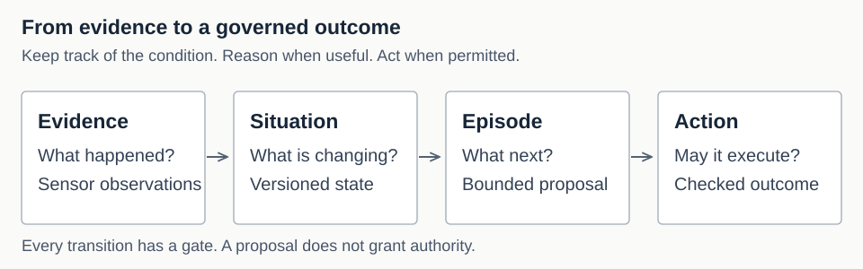

# Agentic Stream documentation

Agentic Stream watches evidence over time, keeps a record of the condition it
reveals, and starts a limited agent reasoning session when that would be useful.
A separate policy and action path checks proposed changes before they execute.

This is the public reading path for an unreleased development snapshot. See
[current status](overview/status.md) and [limitations](overview/limitations.md)
for the boundary between implemented behavior and production qualification.

## Start with the idea

Observations build a **Situation**, the evolving condition. A meaningful change
may start an **episode**, a bounded reasoning session. Its proposal reaches an
effect only through policy and governed dispatch. Each arrow is conditional;
not every reading needs reasoning, and not every proposal may execute.
[Diagram source](assets/runtime-story.mmd) ·
[Architecture evidence](architecture/overview.md).

## Three starting points

| Your goal | Start here |
| --- | --- |
| Understand the concepts, how it works, and why | [Guided learning path](learn/README.md) |
| Build and run the local example | [Quickstart](getting-started/quickstart.md) |
| Check an exact contract or command | [Reference](reference/README.md) and [contracts](contracts/README.md) |

## Documentation map

| Area | Purpose |
| --- | --- |
| [Learn](learn/) | Concepts explained through a motor story, with gradually deeper diagrams |
| [Overview](overview/) | Product, concepts, status, compatibility, limitations |
| [Getting started](getting-started/) | Build and run the supported local workflows |
| [Architecture](architecture/) | Runtime shape, durability, trust boundaries, invariants |
| [Design](design/) | Public summaries of the subsystem design |
| [Contracts](contracts/) | SituationSpec, events, Decisions, worker protocol, persistence |
| [Guides](guides/) | Task-oriented authoring, integration, proof, troubleshooting |
| [Operations](operations/) | Serving, recovery, telemetry, and hardening |
| [Reference](reference/) | Exact CLI, configuration, API, event, migration, and test details |
| [ADRs](adr/README.md) | Decision index and relationship to the design archive |
| [Governance](governance/) | Quality and release criteria |

Maintainers can also read the [documentation plan](PLAN.md) and the
[acceptance bar](BAR.md).

## Public docs and the working archive

`documentation/` is the public reading path. Code, tests, embedded schemas,
migrations and the worker proto are the authority for implemented behavior.

## Source of truth

Public pages are summaries. Implemented behavior is verified against code,
tests, schemas, Protobuf, migrations, the `Makefile`, and CI. The public set is
accepted against [the documentation quality bar](BAR.md). When a summary and
the repository disagree, the discrepancy is a documentation bug to resolve;
when the design and implementation disagree, the page must name the boundary
and link to the evidence.

## Project entrypoints

- [Root README](../README.md) — product landing page.
- [Contributing](../CONTRIBUTING.md) — contribution workflow and gates.
- [Security](../SECURITY.md) — vulnerability reporting and security baseline.
- [Support](../SUPPORT.md) — issue triage and reproducible reports.
- [Code of Conduct](../CODE_OF_CONDUCT.md) — community expectations.

## Next reads

- [Start learning](learn/why.md)
- [Product](overview/product.md)
- [Quickstart](getting-started/quickstart.md)
- [Current status](overview/status.md)
