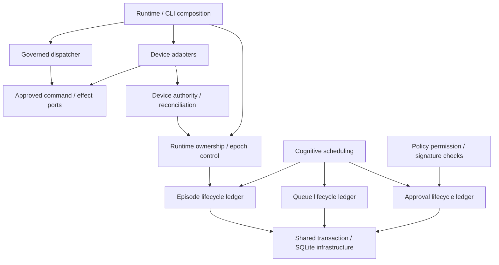

# Business modules and ownership

This page is for maintainers changing module boundaries. The runtime remains a
single-process modular monolith with one SQLite database. Modules divide business
responsibilities and authority; they do not introduce services or queues.

## Forward execution and downward control

The business flow is evidence → versioned Situation → reasoning admission →
bounded episode → typed Decision/Intents → policy → approved command outbox →
dispatch → effect/outcome. A later observation starts another forward pass.

Dependencies are a separate graph. Every production package imports only
explicitly approved packages at a lower architecture level. Composition roots
wire implementations; effect adapters consume ports and cannot reach the
services that decide or dispatch work.

Text equivalent: composition connects dispatch and device adapters through a
shared effect port. Control and scheduling call lower lifecycle ledgers. Device
authority depends on runtime ownership. Each ledger participates in the caller's
existing transaction; an import boundary does not split an atomic operation.
The diagram shows selected dependencies rather than every package import.

Cancellation flows from composition through control and lifecycle operations.
Execution observes durable cancellation/fencing state. Effect authorization is
a read-only readiness capability supplied by control, checked at acceptance;
it is not a callback into the dispatcher. Outcomes and notifications are durable
records or returned values, not reverse service dependencies.

## Concrete capability owners

| Package | Owns |
| --- | --- |
| `actionport` | Approved command, effect outcome, final authorization and effector contracts; no database/network implementation |
| `device` | Closed capability catalog, deterministic materialization, session/boot checks, safe stop and gateway transport |
| `actions` | Approved-command leases, dispatch, outcome verification, reconciliation and durable internal watches |
| `episodeledger` | Episode/attempt state, fencing identity, rejection audit, recovery and cancellation mutations |
| `admission` | Turning due scheduler items into epoch-stamped episodes; drain stop, fixture refusal and recorded skips for unadmittable items |
| `episodes` | Validated request assembly, bounded execution through the `Executor` port, failure accounting and Decision acceptance |
| `executor/native`, `executor/remote` | Concrete executors: the in-process Go executor, and the streamed EpisodeWorker adapter with per-attempt evidence capability and budget accounting |
| `scheduleledger` | Durable queue identity, admission, coalescing and skipped opportunities |
| `cognition` | Trigger evaluation, admission priorities, reconsideration and cost-refusal explanation |
| `approvalledger` | Pending approval, assertion binding, resolution/expiry, and atomic supersession notification |
| `policy` | Permission, principal/signature verification, risk, freshness, rate limits and command publication |
| `control` | Runtime ownership lease, epoch drain/kill and final read-only readiness capability |
| `authority` | Target claims, command bindings, boot/reconciliation barriers and safety evidence |
| `qualification` | Calibration activation and report-only shadow decisions/comparisons |
| `storage` | SQLite configuration, migrations, transactions, replay-path reservation and busy retry |
| `runtime` / `cmd` | Wiring, lifecycle and orchestration; concrete device selection lives here |

The [repository map](repository-map.md) covers the stream, ingress, evidence and
supporting packages. [ADR-017](../../docs/design/DECISIONS.md#adr-017-business-ownership-and-directed-module-boundaries)
records why these additional boundaries exist.

## Shared durable handoffs

Most tables have exactly one mutating package. Four existing aggregates have
explicit producer/consumer phases:

| Aggregate | Producer / permitted consumer mutation |
| --- | --- |
| Intents | Episodes insert accepted proposals; policy changes only policy status and update time |
| Commands | Policy creates pending commands; actions change only dispatch status and update time |
| Command outbox | Policy publishes; actions change only lease, delivery, error and attempt bookkeeping |
| Situations | Engine persists current/versioned state; cognition changes only the last reasoned version |

Before publishing an outbox record, policy may remove its exact prepared command
if rate admission fails. The delete must bind both command and intent identities
and require pending status. It cannot remove leased or delivered work.

The shared database does not grant arbitrary write authority. Other packages
call the owning lifecycle operations with the same transaction. Read queries may
join durable evidence across modules; writes have narrower ownership.
Producer inserts cannot replace or upsert existing intents, commands or outbox
records. Unsupported tuple assignments in shared handoffs fail the ownership
check rather than allowing payload columns to escape inspection.

## Enforced architecture bar

The [architecture bar](../../.agents/context/architecture-bar.md) extends the
existing complexity, coverage and full CI requirements:

- [Layer/import and transitive reachability checks](../../architecture_flow_test.go) reject upward/same-level dependencies and reasoning/replay paths to effect implementations.
- [SQL ownership checks](../../architecture_ownership_test.go) reject foreign lifecycle writes and shared-handoff payload/status bypasses.
- [SQL classifier tests](../../architecture_sql_test.go) cover quoted identifiers, comments, CTEs, inserts/upserts and update columns.
- Contract isolation and final-authorization construction checks separate ports from adapters and upstream services.
- Regression tests prove rollback, identities, recovery, cancellation, fail-closed routing and current readiness.

SQL ownership checks inspect production Go SQL literals. They are a source-level
guard, complemented by transaction and acceptance tests. They do not certify
physical hardware, deployment readiness, or every possible runtime behavior.

## Next reads

- [Architecture overview](overview.md)
- [Durability and recovery](durability.md)
- [Repository map](repository-map.md)
- [Quality governance](../governance/quality.md)
