# Architecture overview

Agentic Stream is a modular monolith with a strict direction of authority.
The stream plane is deterministic; the cognition plane is bounded; the policy
and action planes are the only path to external effects.

## Runtime flow

```mermaid
flowchart LR
    E["Evidence sources"] --> I["Ingress adapters"]
    I --> L["Event log\nidentity + schema + dedup"]
    L --> S["Stream engine\nwatermarks + partitions"]
    S --> O["Operators\nwindows + features"]
    O --> V["Situation versions\nimmutable + digest"]
    V --> C["Cognitive scheduler\ntrigger + budget + freshness"]
    C --> P["Episode\nbounded snapshot"]
    P --> W["Executor / Go worker\nread-only evidence"]
    W --> D["Decision + Intents"]
    D --> G["Policy gateway\nrevalidate + govern"]
    G --> Q["Command outbox"]
    Q --> A["Action dispatcher"]
    A --> X["Effector / outcome"]
    V -.-> N["Durable records + notifications"]
    C -.-> N
    D -.-> N
    X -.-> N
```



Text equivalent: evidence enters ingress and the event log, becomes
event-time-derived Situation versions, and may wake a bounded episode. Only a
validated Decision reaches policy, then the durable outbox and action
dispatcher can reach an effector; notifications are an observation projection.

Each major boundary is typed and durable where state crosses a recovery
boundary. The dashed path is observability
and notification evidence; it is not a shortcut to execution.

## Planes and authority

| Plane | Owns | Does not own |
| --- | --- | --- |
| Ingress/event log | Normalize, validate, identify, deduplicate, quarantine | Situation meaning or actions |
| Stream | Event-time state, windows, operators, Situation versions | Model calls or effectors |
| Cognition | Decide whether a version deserves a bounded episode | Policy approval or effects |
| Episode/executor | Read a snapshot, use scoped evidence, propose output | Mutating stream state or executing commands |
| Policy | Revalidate state, identity, risk, approval, interlock, epoch | Model reasoning or provider calls |
| Action | Lease, dispatch, idempotency, reconcile, record outcome | Changing a Decision into a new intent |
| API/notifications | Health, metrics, control, cursor-resumable observation | Bypassing durable ownership and policy |

## Dependency direction

The implementation follows this direction:

```text
cmd
  -> runtime / api / ingress / replay
  -> engine / situations / cognition / episodes
  -> decisions / policy / actions
  -> eventlog / storage / clock / contractsv1
```

Transport code stays at the edge. Business behavior lives in internal domain
packages. The runtime is deliberately not a graph engine and does not put an
LLM in the event hot path.

## Deployment shape

The default deployment is one Go process with SQLite WAL. A separate Go
EpisodeWorker may run over a private Unix socket; mTLS can be configured for a
worker connection. The Go process hosts the evidence reverse service when that
feature is enabled.

Scale-out is not a hidden property of this design. Ownership leases, virtual
partitions, durable checkpoints, and idempotent ledgers make the single-node
semantics explicit before any broker or distributed scheduler is introduced.

## Source evidence

- Runtime composition: [`internal/runtime/pipeline.go`](../../internal/runtime/pipeline.go)
- CLI wiring: [`cmd/agentic-stream/main.go`](../../cmd/agentic-stream/main.go)
- Detailed design record: [`docs/design/TECHNICAL_DESIGN.md`](../../docs/design/TECHNICAL_DESIGN.md)
- Dated implementation audit snapshot (not current migration authority): [`docs/STREAM_IMPLEMENTATION_AUDIT_2026-08-12.md`](../../docs/STREAM_IMPLEMENTATION_AUDIT_2026-08-12.md)
- Repository map: [repository-map.md](repository-map.md)

## Next reads

- [Durability and recovery](durability.md)
- [Worker boundary](worker-boundary.md)
- [Security model](security-model.md)
- [Public design](../design/README.md)
