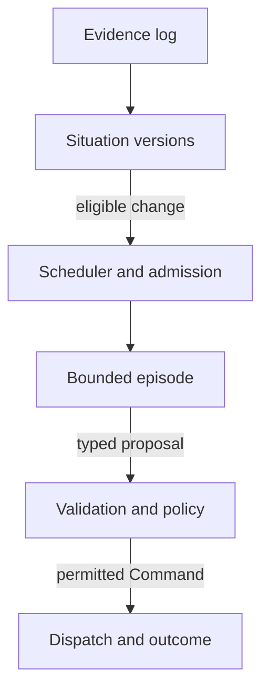

# Architecture overview

Agentic Stream is a modular monolith with a strict direction of authority.
The stream plane is deterministic; the cognition plane is bounded; the policy
and action planes are the only path to external effects.

## Main runtime boundaries

For a first explanation, read [the four-stage story](../learn/README.md).
This diagram adds the runtime owners. Detailed calculations and recovery
steps appear on their own design pages.

What are the major handoffs?

```mermaid
flowchart TD
    E["Evidence log"] --> S["Situation versions"]
    S -->|eligible change| C["Scheduler and admission"]
    C --> B["Bounded episode"]
    B -->|typed proposal| P["Validation and policy"]
    P -->|permitted Command| A["Dispatch and outcome"]
```

Text equivalent: accepted evidence becomes versioned stream state. An eligible
change can reach admission and bounded reasoning. Its typed proposal passes
validation and policy before governed dispatch. Each arrow is a possible
handoff, not a promise that every event traverses the whole path.
Source: [runtime composition](../../internal/runtime/pipeline.go).

API notifications observe durable records. They do not add an alternate path
to execution. [Observability](../design/observability.md) explains that separate
relationship.

## Planes and authority

| Plane | Owns | Does not own |
| --- | --- | --- |
| Ingress/event log | Normalize, validate, identify, deduplicate, quarantine | Situation meaning or actions |
| Stream | Event-time state, windows, operators, Situation versions | Model calls or effectors |
| Cognition | Decide whether a version deserves a bounded episode | Policy approval or effects |
| Episode/executor | Read a snapshot, use scoped evidence, propose output | Mutating stream state or executing commands |
| Policy | Revalidate state, identity, risk, approval, interlock, epoch | Model reasoning or provider calls |
| Action | Lease, dispatch, idempotency, reconcile, record outcome | Changing a Decision into a new intent |
| API/notifications | Health, metrics, control, cursor-resumable observation | Bypassing durable ownership and policy |

## Dependency direction

Data flow and package imports are different maps. The diagram above shows
work moving through the runtime. The [module ownership map](modules.md) shows
which packages may depend on which owners, including lifecycle ledgers,
runtime control, and device ports.

Composition roots wire implementations. Transport stays at the edge;
modules call lower owners through permitted dependencies. Shared SQLite
storage does not grant every module permission to change every lifecycle.
Layer and SQL ownership tests enforce these rules.

The runtime keeps model calls and effector calls outside the deterministic
stream transaction. This preserves ordering and makes the stream history
repeatable without waiting on external services.

## Deployment shape

The default deployment is one Go process with SQLite WAL. A separate Go
EpisodeWorker may run over a private Unix socket; mTLS can be configured for a
worker connection. The Go process hosts the evidence reverse service when that
feature is enabled.

Scale-out is not a hidden property of this design. Ownership leases, virtual
partitions, durable checkpoints, and idempotent ledgers make the single-node
semantics explicit before any broker or distributed scheduler is introduced.

## Source evidence

- Runtime composition: [`internal/runtime/pipeline.go`](../../internal/runtime/pipeline.go)
- CLI wiring: [`cmd/agentic-stream/main.go`](../../cmd/agentic-stream/main.go)
- Detailed design record: [`docs/design/TECHNICAL_DESIGN.md`](../../docs/design/TECHNICAL_DESIGN.md)
- Dated implementation audit snapshot (not current migration authority): [`docs/STREAM_IMPLEMENTATION_AUDIT_2026-08-12.md`](../../docs/STREAM_IMPLEMENTATION_AUDIT_2026-08-12.md)
- Repository map: [repository-map.md](repository-map.md)

## Next reads

- [Understand the design choices](../learn/design-choices.md)

- [Business modules and ownership](modules.md)
- [Durability and recovery](durability.md)
- [Worker boundary](worker-boundary.md)
- [Security model](security-model.md)
- [Public design](../design/README.md)
