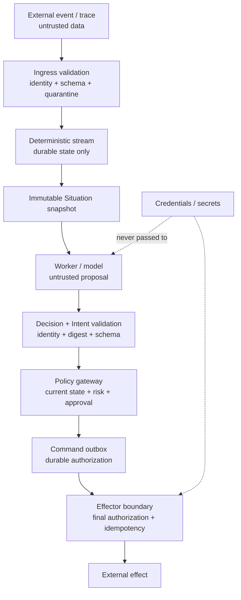

# Security model

Agentic Stream assumes that event payloads, model output, tool descriptions,
and worker output can be untrusted. The system therefore separates data from
authority and validates again at each boundary where authority increases.

## Trust boundaries

Text equivalent: untrusted events are validated before durable stream state;
workers and models propose typed output; validation and policy add authority;
the outbox and effector perform the final controlled transition. Credentials
never flow into the worker/model proposal path.

## Security rules

- Raw events are evidence, never executable instructions.
- A model can read scoped evidence and propose typed Intents, but cannot call
  an effector or access production credentials.
- Every Decision and Intent is checked for schema, identity, snapshot binding,
  digest, expiration, allowed vocabulary, and risk.
- Policy revalidates against current durable state immediately before creating
  or dispatching a Command.
- Interlocks and the current policy epoch are checked again at the concrete
  action boundary.
- Unknown external outcomes stop automatic retry and require reconciliation.
- Replay has no credentials or production effectors by construction.
- Subscriber and control surfaces are authenticated; `serve` refuses remote
  listeners without an authenticated deployment proxy.

## Secret handling

The native provider reads `AGENTIC_STREAM_MODEL_API_KEY` from the process
environment. Subscriber and control tokens are also environment-provided. Do
not put secrets in JSONL traces, SituationSpecs, logs, command arguments,
worker requests, or committed files. Rotate them through the deployment secret
manager and restrict process/database/socket permissions.

## Failure posture

Security validation is fail-closed. Malformed input is quarantined or rejected;
expired capability tokens and stale fences are refused; missing interlock
readiness blocks dispatch; a worker that emits an invalid or late Decision does
not get a retry path into governance.

## Threat model boundary

The runtime protects its semantic authority boundaries. It does not make an
arbitrary host safe: operators still own OS patching, filesystem permissions,
network policy, TLS termination, secret storage, database backup, and external
effector correctness. Read the [deployment hardening checklist](../operations/security-hardening.md)
before exposing a process beyond a local development machine.

## Source evidence

- Root policy: [`SECURITY.md`](../../SECURITY.md)
- Worker/evidence tests: [`internal/worker/`](../../internal/worker/), [`internal/evidence/`](../../internal/evidence/)
- Decision and policy tests: [`internal/decisions/`](../../internal/decisions/), [`internal/policy/`](../../internal/policy/)
- Action tests: [`internal/actions/`](../../internal/actions/)

## Next reads

- [Product invariants](invariants.md)
- [Security hardening](../operations/security-hardening.md)
- [Worker boundary](worker-boundary.md)
