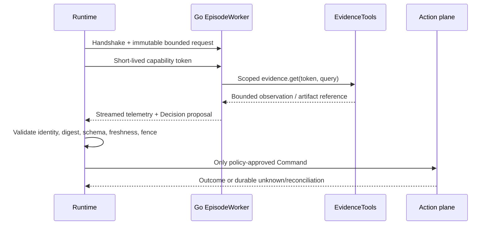

# Worker and EvidenceTools boundary

The worker protocol is a separate-process boundary for bounded episodes. The
worker may read the request and scoped evidence, emit telemetry and a typed
Decision proposal, and terminate. The runtime remains authoritative for
budgets, validation, lifecycle, policy, and effects.

## Protocol shape

The current-v1 Protobuf source is
[`docs/design/contracts/runtime-v1.proto`](../../docs/design/contracts/runtime-v1.proto)
and generated Go stubs live under
[`proto/agenticstream/runtime/v1/`](../../proto/agenticstream/runtime/v1/).

The two services are:

| Service | Direction | Purpose |
| --- | --- | --- |
| `EpisodeWorker` | Runtime calls worker | Handshake, then execute one bounded episode as a stream of events |
| `EvidenceTools` | Worker calls runtime | Scoped read-only evidence access over a private socket |

Handshake compatibility currently validates protocol/contract versions, worker
identity, non-interactive execution, and requested features. The protocol also
carries shadow/counterfactual, replay-ledger, and episode-kind fields, but the
full semantics of those capability fields are not yet enforced.

## Request identity

Every episode request binds tenant, Situation ID/version, snapshot digest,
spec/executor/prompt/objective digests, budget, allowed Intent types, risk
ceiling, dispatch policy, evidence range, and attempt identity. Worker events
carry `(episode_id, attempt_id, fence)` and sequence numbers.

The worker's final event must be terminal. A missing terminal, wrong identity,
stale fence, budget breach, or invalid Decision is a runtime failure—not an
instruction to keep waiting.

## Capability and effect boundaries

Text equivalent: the runtime sends an immutable bounded request and short-lived
capability to a worker; the worker reads scoped evidence and returns a proposal;
the runtime validates it before the action plane can create an outcome.

The worker receives no effector handle, production credential, shell capability,
or arbitrary network capability. Evidence results are bounded and can spill to
an artifact reference. Capability tokens are short-lived, scoped, and not
intended for logging or persistence by the worker.

## Local and TLS transport

The default worker transport is a private Unix domain socket. The runtime can
load a CA, client certificate, private key, and expected server name for an
mTLS worker connection. All four worker TLS flags are required together, and
TLS flags are rejected without `--worker-socket`.

## Conformance

The shared executor conformance suite is under
[`internal/executor/conformance/`](../../internal/executor/conformance/). A
separate worker integration must pass that suite before it is treated as a
compatible executor.

## Next reads

- [Worker contract](../contracts/worker-protocol.md)
- [Build a Go worker](../guides/build-a-go-worker.md)
- [Security model](security-model.md)
