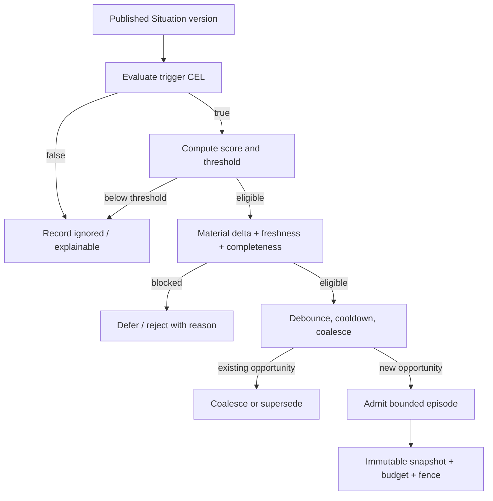

# Cognition and bounded episodes

Cognition is a deterministic admission decision. The scheduler decides when a
Situation deserves a bounded agent episode; the agent does not decide whether
to wake up for every incoming event.

## Admission path

Text equivalent: a published version is evaluated, scored, checked for
freshness/completeness, then debounced/coalesced before a bounded episode is
admitted with a snapshot, budget, and fence.

The scheduler records ignored, deferred, coalesced, admitted, canceled, and
expired outcomes. This is how the runtime makes cognitive cost and behavior
explainable.

## Controls

- **Trigger condition:** deterministic restricted CEL.
- **Score/threshold:** avoids waking an executor for weak evidence.
- **Material delta:** allows a trigger to require a meaningful change.
- **Debounce:** enforces a not-before period after an admission.
- **Cooldown:** limits repeated opportunities over a time horizon.
- **Coalescing:** merges pending work for the same logical condition.
- **Capacity:** defers when bounded concurrency or budget capacity is used.
- **Freshness/completeness:** prevents reasoning from stale or uncertain state.
- **Supersession:** cancels work whose snapshot no longer represents the live
  Situation.

## Episode contract

An episode binds one immutable snapshot, trigger, tenant/entity, executor and
prompt/objective digests, allowed evidence/tools, allowed Intent types, risk
ceiling, dispatch policy, deadline, and finite budget. The model can propose a
Decision; the episode runtime and policy plane validate everything afterward.

Budgets cover wall time, model calls, input/output tokens, tool calls,
tool-result bytes, provider retries, and cost where configured. Budget updates
are durable and a late provider response cannot extend the deadline.

## Cancellation and reconsideration

Material supersession cancels an active attempt. The worker's attempt ID and
fence ensure a late result cannot be accepted. A late correction can create one
deduplicated reconsideration episode bound to the corrected Situation version.

## Source evidence

- Scheduler: [`internal/cognition/`](../../internal/cognition/)
- Episode lifecycle: [`internal/episodes/lifecycle.go`](../../internal/episodes/lifecycle.go)
- Episode assembler: [`internal/episodes/assembler.go`](../../internal/episodes/assembler.go)
- Cancellation/recovery tests: [`internal/episodes/`](../../internal/episodes/)

## Next reads

- [Core concepts](../overview/concepts.md)
- [Worker boundary](../architecture/worker-boundary.md)
- [Decisions and actions](decisions-and-actions.md)
