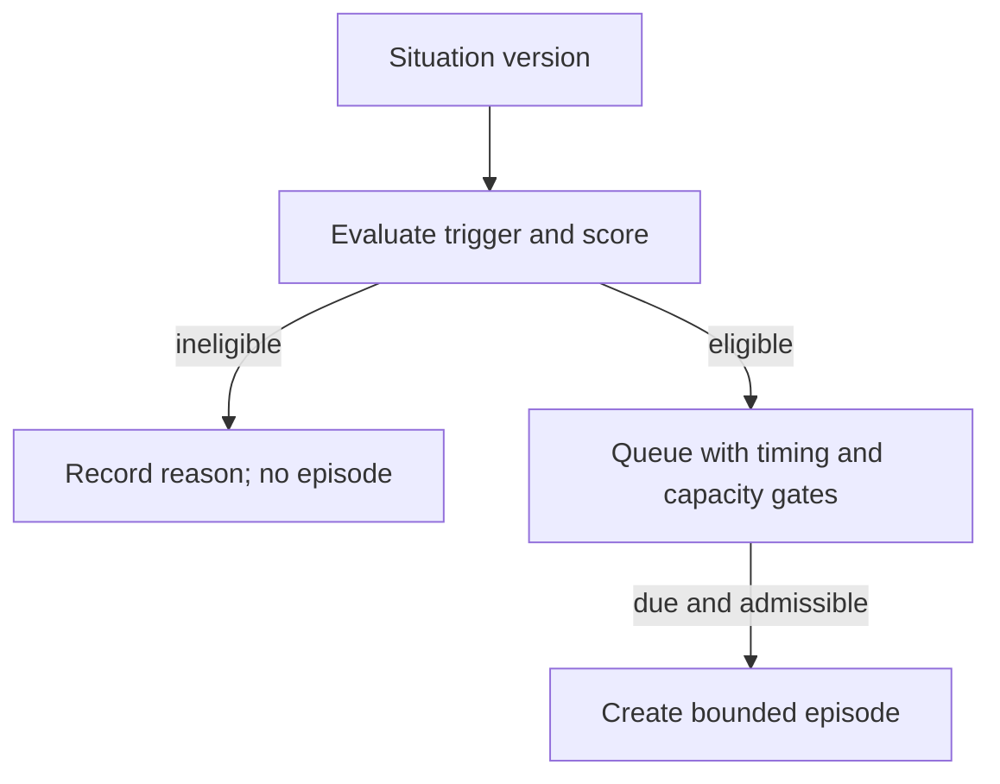

# Cognition and bounded episodes

Cognition is a deterministic admission decision. The scheduler decides when a
Situation deserves a bounded agent episode; the agent does not decide whether
to wake up for every incoming event.

## Admission path

Why does one version start work while another does not?

```mermaid
flowchart TD
    V["Situation version"] --> T["Evaluate trigger and score"]
    T -->|ineligible| R["Record reason; no episode"]
    T -->|eligible| Q["Queue with timing and capacity gates"]
    Q -->|due and admissible| E["Create bounded episode"]
```

Text equivalent: an ineligible version records a reason without creating an
episode. An eligible version can enter a timed queue; only due, admissible work
becomes an episode. This is a conceptual summary, not the exact ordering of
every validation check. Source: [cognition](../../internal/cognition/) and
[admission](../../internal/admission/).

## Why a scheduler instead of a model call per event?

The scheduler spends reasoning effort on declared opportunities. Timing and
supersession prevent a long queue of outdated questions from becoming the
model's workload. Recorded trigger and admission reasons also explain why the
runtime stayed quiet.

This adds domain choices: a trigger or budget that is too restrictive can miss
useful attention; a loose one can spend budget on repeated conditions. Use
replay and the durable evaluations to review those choices before treating them
as behavior qualified for a production deployment.

## Controls

- **Trigger condition:** deterministic restricted CEL.
- **Score/threshold:** avoids waking an executor for weak evidence.
- **Material delta:** allows a trigger to require a meaningful change from
  the most recently evaluated version. The durable `last_reasoned_version`
  marker advances even when the evaluation starts no episode.
- **Debounce:** sets the earliest run time after a queue opportunity is created.
- **Cooldown:** delays work until the configured interval after the latest trigger admission.
- **Coalescing:** replaces open work for the same Situation and trigger; it
  does not merge old request payloads.
- **Capacity:** defers when bounded concurrency or budget capacity is used.
- **Freshness:** validates the live snapshot before dispatch, with bounded
  pre-attempt rebinding where needed; later acceptance and policy checks remain.
- **Evidence status:** completeness is recorded, but the trigger `completeness`
  field is not independently enforced by the current evaluation path. Explicit
  feature conditions, such as the motor heartbeat check, supply actual gates.
- **Supersession:** eligible replacement work coalesces older open items for
  the same Situation and trigger and cancels their live attempts.

## Episode contract

An episode binds one immutable snapshot, trigger, tenant/entity, executor and
prompt/objective digests, allowed evidence/tools, allowed Intent types, risk
ceiling, dispatch policy, deadline, and finite budget. The model can propose a
Decision; the episode runtime and policy plane validate everything afterward.

Budgets cover wall time, model calls, input/output tokens, tool calls,
tool-result bytes, provider retries, and cost where configured. Budget updates
are durable and a late provider response cannot extend the deadline.

## Snapshot binding and attempts

An episode is bound to one immutable snapshot at a time. Before starting an
attempt, the runner may repoint a stale binding to a validated live snapshot, in
the same transaction as attempt start. Identity, budget, trigger delta, and
reconsideration evidence are preserved. The durable limit is three rebindings
across retries; invalid live evidence abandons the episode as `rebind_failed`.
Each started attempt uses its fixed request. See
[ADR-013](../../docs/design/DECISIONS.md#adr-013-re-bind-stale-episodes-to-the-live-situation-version-before-dispatch)
and [rebinding tests](../../internal/episodes/internal/app/rebind_test.go).

## Cancellation and reconsideration

Eligible replacement work can supersede an episode and cancel its attempt.
The worker's attempt ID and fence prevent acceptance of obsolete output.

For `correct_and_reconsider`, a verified corrected snapshot selects succeeded
Commands from the latest approved Intent version at or before the superseded
version. Each eligible Command can create reconsideration work, deduplicated
by Situation, superseded version, and Command. This selection is a reason to
review the effect; it is not a domain proof that the effect was wrong.

The correction remains admission evidence even if a later live snapshot is
used by a rebound attempt. Its accepted Decision is recorded against that live
version. Any compensating proposal must pass governance as a new Intent;
reconsideration does not reverse an effect automatically. Source:
[selection](../../internal/cognition/internal/store/reconsideration.go) and
[admission/deduplication](../../internal/cognition/internal/app/correction.go).

## Source evidence

- Scheduler: [`internal/cognition/`](../../internal/cognition/)
- Episode lifecycle: [`internal/episodeledger/lifecycle.go`](../../internal/episodeledger/lifecycle.go)
- Episode assembler: [`internal/episodes/internal/domain/assembly.go`](../../internal/episodes/internal/domain/assembly.go)
- Cancellation/recovery tests: [`internal/episodes/`](../../internal/episodes/)

## Next reads

- [Core concepts](../overview/concepts.md)
- [Worker boundary](../architecture/worker-boundary.md)
- [Decisions and actions](decisions-and-actions.md)
