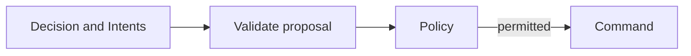
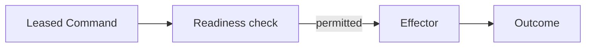

# Decisions, policy, and actions

A model proposal must pass validation and policy before it becomes a Command.
The dispatcher then checks current readiness before calling an effector. Each
step records what was permitted or refused.

## Two authority boundaries

How is a model proposal accepted?

Text equivalent: a proposal must pass binding/schema validation and current
policy before it becomes a Command. Rejection, deferral, or an approval need
can stop this path. Source: [Decision validator](../../internal/decisions/internal/domain/validator.go)
and [policy](../../internal/policy/policy.go).

How is an accepted Command dispatched?

Text equivalent: dispatch leases an accepted Command, checks current authority,
calls the configured effector only when permitted, and records the result.
Source: [dispatcher](../../internal/actions/dispatcher.go).

## Why validate twice?

The first boundary rejects proposals that are malformed, stale, out of scope,
or disallowed. The second accounts for change while an accepted Command waits:
runtime ownership, operator controls, interlocks, or device readiness can change.

The extra checks and durable queue add work and may add latency. They also
keep model output from carrying its own execution authority. A prior approval
cannot become a shortcut past a later stop.

## Validation

Decision validation binds the output to the exact episode attempt, fence,
snapshot digest, Situation version, schema, and allowed catalog. For each
Intent, validation also checks type, risk, parameters, expiry, evidence
references, and its link to a prior Command when proposing compensation.

## Policy

The gateway evaluates against current durable state, not the state observed when
the model started. Approval-required paths create durable approval records;
automatic paths still pass all revalidation and interlock checks. Drain and kill
controls apply to the current policy epoch, the generation of operational
permission. A worker response cannot bypass an operator stop.

## Action and outcomes

Commands are persisted in an outbox with a stable idempotency key. The
dispatcher leases a command, revalidates it, and invokes the concrete effector.
The simulated effector is used by the proof suite; the watch effector is a
bounded CEL-based mechanism with owner/interlock fencing.

If the provider may have accepted a request but the runtime cannot prove the
result, the dispatcher records an unknown outcome and waits for reconciliation.
It does not blindly retry an effect that could duplicate external work.

## Source evidence

- Decision validation: [`internal/decisions/internal/domain/validator.go`](../../internal/decisions/internal/domain/validator.go)
- Policy gateway: [`internal/policy/policy.go`](../../internal/policy/policy.go)
- Dispatcher: [`internal/actions/dispatcher.go`](../../internal/actions/dispatcher.go)
- Effect adapters: [`internal/device/`](../../internal/device/) and [`internal/watch/`](../../internal/watch/)
- Approved effect contracts: [`internal/actionport/`](../../internal/actionport/)

## Next reads

- [Decision and Intent contract](../contracts/decision-intent.md)
- [Security model](../architecture/security-model.md)
- [Durability](../architecture/durability.md)
