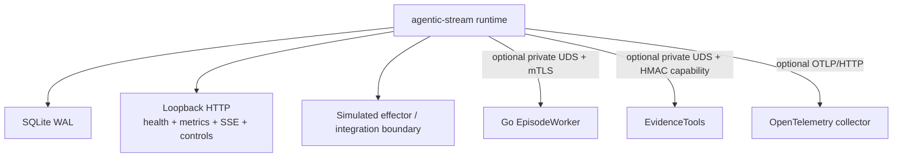

# Deployment model

The current deployment target is intentionally small: one Go runtime process,
one SQLite WAL database, optional local or separate Go worker processes, and a
loopback HTTP surface.

## Components

Text equivalent: one runtime owns SQLite, local HTTP, and the simulated
effector; optional private worker/EvidenceTools sockets and OTLP export extend
the process without changing the authority boundary. External effectors remain
deployment-specific integrations that need separate review.

## Operational assumptions

- The database is on durable local storage with restrictive permissions.
- One owner epoch is active for a database at a time.
- A deployment proxy, if used, authenticates and rate-limits remote access.
- Worker sockets and evidence sockets are private and protected by filesystem
  permissions and/or TLS/HMAC configuration.
- External effectors are idempotent or reconcilable and have their own health,
  timeout, and credential rotation story.

## Deferred scale-out

Kafka, NATS, MQTT, remote fleet management, multi-region state, and a UI are
not current deployment surfaces. The single-node path must establish stable
event-time, replay, policy, and action semantics before adding distributed
coordination.

## Source evidence

- Runtime composition: [`internal/runtime/pipeline.go`](../../internal/runtime/pipeline.go)
- Service and ownership: [`internal/runtime/service.go`](../../internal/runtime/service.go)
- CLI serving path: [`cmd/agentic-stream/main.go`](../../cmd/agentic-stream/main.go)

## Next reads

- [Install](../getting-started/install.md)
- [Operations](../operations/README.md)
- [Compatibility](../overview/compatibility.md)
