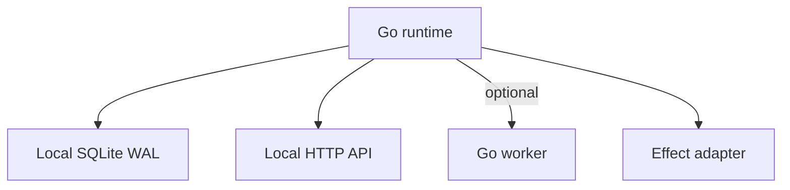

# Deployment model

The current deployment uses one Go runtime process and one local SQLite
database in write-ahead log (WAL) mode. It can use a separate Go worker and
serves its HTTP API on loopback.

## Components

What runs together, and what is optional?

```mermaid
flowchart TD
    R["Go runtime"] --> DB["Local SQLite WAL"]
    R --> API["Local HTTP API"]
    R -->|optional| W["Go worker"]
    R --> E["Effect adapter"]
```

Text equivalent: one runtime owns local durable state and the HTTP API.
An optional Go worker performs bounded episodes. The configured adapter supplies
the governed effect boundary. EvidenceTools and telemetry extend these paths;
they do not introduce a second state owner.
Source: [runtime composition](../../internal/runtime/pipeline.go) and
[worker boundary](../architecture/worker-boundary.md).

## Why start with one node?

State, checkpoint, and queued-work updates can share a local transaction. That
makes ordering and crash recovery easier to establish before distributed
coordination is added. Clear module ownership keeps the application
maintainable without requiring a separate service for each component.

The tradeoff is bounded capacity and availability. Virtual partitions are
logical units inside the runtime; they are not a broker or multi-region
replication system. A separate worker does not distribute SQLite ownership.
See [the design tradeoffs](../learn/design-choices.md).

## Operational assumptions

- The database is on durable local storage with restrictive permissions.
- One owner epoch is active for a database at a time.
- A deployment proxy, if used, authenticates and rate-limits remote access.
- Worker sockets and evidence sockets are private and protected by filesystem
  permissions and/or TLS/HMAC configuration.
- External effectors handle duplicate requests or support reconciliation;
  deployments define health checks, timeouts, and credential rotation.

## Deferred scale-out

Kafka, NATS, MQTT, remote fleet management, multi-region state, and a UI are
not supported deployment options today. The single-node path must establish stable
event-time processing, replay, policy, and action behavior before adding distributed
coordination.

## Source evidence

- Runtime composition: [`internal/runtime/pipeline.go`](../../internal/runtime/pipeline.go)
- Service and ownership: [`internal/runtime/service.go`](../../internal/runtime/service.go)
- CLI serving path: [`cmd/agentic-stream/main.go`](../../cmd/agentic-stream/main.go)

## Next reads

- [Install](../getting-started/install.md)
- [Operations](../operations/README.md)
- [Compatibility](../overview/compatibility.md)
