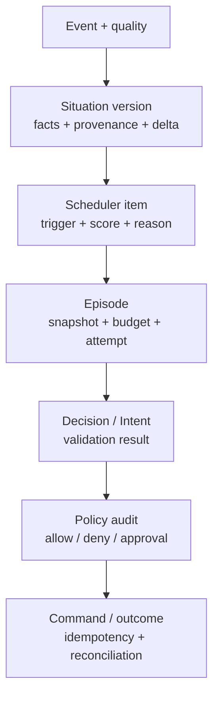

# Observability and explainability

Observability is part of the runtime contract because an operator must be able
to explain what evidence changed, why cognition was admitted or refused, and
what happened to a governed effect.

## Signal layers

| Layer | Surface |
| --- | --- |
| Structured logs | `log/slog`-compatible runtime diagnostics and failures |
| Metrics | Low-cardinality counters/histograms at `/metrics` |
| Traces | OpenTelemetry spans and durable W3C context links; OTLP/HTTP export |
| Notifications | Versioned CloudEvents over cursor-resumable SSE |
| Durable explanation | Event, Situation, scheduler, episode, policy, outbox, outcome, and audit rows |

## Trace configuration

The runtime checks these variables in order:

1. `AGENTIC_STREAM_OTLP_ENDPOINT`;
2. `OTEL_EXPORTER_OTLP_TRACES_ENDPOINT`;
3. `OTEL_EXPORTER_OTLP_ENDPOINT`.

When none is set, the runtime still configures its local telemetry behavior
without an external export destination. Do not put secrets or raw sensitive
payloads into spans.

## Explainability path

Text equivalent: event quality feeds a Situation version, scheduler record,
episode, Decision/Intent validation, policy audit, and command/outcome record;
stable IDs and digests connect the explanation chain.

The chain is durable and linked by stable IDs, digests, trace context, and
tenant/partition identity. Notifications are a projection for observers, not
the authority for recovery.

## Source evidence

- Telemetry: [`internal/telemetry/`](../../internal/telemetry/)
- Notifications: [`internal/notify/`](../../internal/notify/)
- Notification contract: [`internal/notifycontract/`](../../internal/notifycontract/)
- Runtime operations runbook: [`docs/runbooks/runtime-operations.md`](../../docs/runbooks/runtime-operations.md)

## Next reads

- [Operations observability](../operations/observability.md)
- [Notification contract](../contracts/notifications.md)
- [HTTP reference](../reference/http-api.md)
