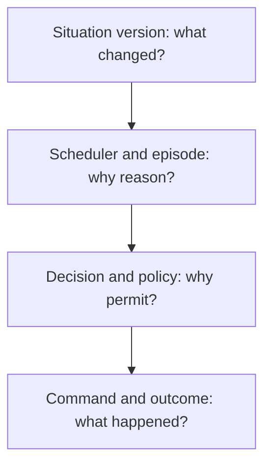

# Observability and explainability

Operators need to understand what changed, why reasoning started or stayed
quiet, and what happened to a permitted action. Logs, metrics, traces, and
stored records answer different parts of those questions.

## Signal layers

| Layer | Surface |
| --- | --- |
| Structured logs | `log/slog`-compatible runtime diagnostics and failures |
| Metrics | Low-cardinality counters/histograms at `/metrics` |
| Traces | OpenTelemetry spans and durable W3C context links; OTLP/HTTP export |
| Notifications | Versioned CloudEvents over cursor-resumable SSE |
| Durable explanation | Event, Situation, scheduler, episode, policy, outbox, outcome, and audit rows |

## Trace configuration

The runtime checks these variables in order:

1. `AGENTIC_STREAM_OTLP_ENDPOINT`;
2. `OTEL_EXPORTER_OTLP_TRACES_ENDPOINT`;
3. `OTEL_EXPORTER_OTLP_ENDPOINT`.

When none is set, the runtime still configures its local telemetry behavior
without an external export destination. Do not put secrets or raw sensitive
payloads into spans.

## Explainability path

Which records answer an incident reviewer's questions?

```mermaid
flowchart TD
    S["Situation version: what changed?"] --> C["Scheduler and episode: why reason?"]
    C --> P["Decision and policy: why permit?"]
    P --> O["Command and outcome: what happened?"]
```

Text equivalent: reviewers follow linked records from the Situation to the
reasoning session, policy result, and effect outcome. This is a lookup path;
it does not imply that every Situation has an episode or Command.
Source: [durable families](../contracts/persistence.md) and
[notifications](../contracts/notifications.md).

Stable identities, digests, trace context, and tenant identity connect those
records to the original event evidence. An ignored trigger and a rejected
proposal are useful explanations, even when there is no final effect.

## Why keep durable explanations beside telemetry?

A trace helps follow a run and metrics help spot trends. Durable records explain
what was accepted and why, including after a restart. Notifications let
subscribers observe committed changes. Recovery uses the stored records.

The public API does not yet offer general endpoints for inspecting or querying records. Operators
need approved read-only tooling for detailed record review. See the
[operational observability guide](../operations/observability.md).

## Source evidence

- Telemetry: [`internal/telemetry/`](../../internal/telemetry/)
- Notifications: [`internal/notify/`](../../internal/notify/)
- Notification contract: [`internal/notify/internal/domain/`](../../internal/notify/internal/domain/)

## Next reads

- [Operations observability](../operations/observability.md)
- [Notification contract](../contracts/notifications.md)
- [HTTP reference](../reference/http-api.md)
