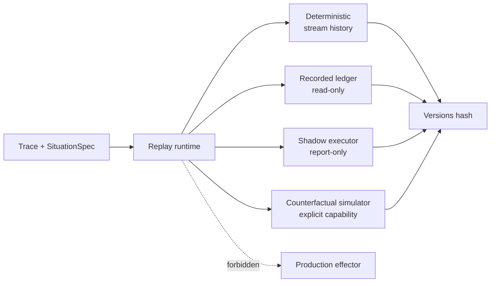

# Replay and shadow modes

Replay is an effect-safety boundary. The default path reconstructs deterministic
stream behavior; other modes are explicit library/runtime capabilities and are
not currently exposed as separate CLI subcommands.

## Modes

| Mode | What it does | External effects |
| --- | --- | --- |
| Deterministic | Replays trace and hashes Situation-version history | Never |
| Recorded | Reuses a durable recorded worker ledger | Never |
| Shadow | Runs a shadow executor against immutable snapshots and reports differences | Never |
| Counterfactual | Sends typed commands only to an explicit simulator | Simulator only; never production |

## Mode separation

Text equivalent: one trace and spec feed deterministic, recorded, shadow, or
explicit counterfactual branches; every branch produces evidence or simulator
output, while production effectors remain outside the replay graph.

The replay package is constructed without credentials, effectors, or a
resolver. The runtime reports `EffectsAllowed=false` for all modes. A
counterfactual simulator is a distinct capability from a production effector.

## Shadow evaluation

Shadow mode lets a new executor or prompt inspect the same snapshot and produce
a report-only artifact. It can be scored and compared without entering the
policy gateway. The active/shadow dispatch policy is also bound to the episode
request and checked at governance boundaries.

## CLI reality

The current CLI exposes deterministic replay through `agentic-stream run`.
Recorded, shadow, and counterfactual modes are covered by internal runtime
APIs and tests; a public CLI for selecting them is not yet implemented.

## Source evidence

- Replay implementation: [`internal/replay/replay.go`](../../internal/replay/replay.go)
- Replay tests: [`internal/replay/replay_test.go`](../../internal/replay/replay_test.go)
- Shadow/mode tests: [`internal/episodes/p8_shadow_test.go`](../../internal/episodes/p8_shadow_test.go), [`internal/runtime/p8_mode_control_test.go`](../../internal/runtime/p8_mode_control_test.go)

## Next reads

- [Quickstart](../getting-started/quickstart.md)
- [Invariants](../architecture/invariants.md)
- [Limitations](../overview/limitations.md)
