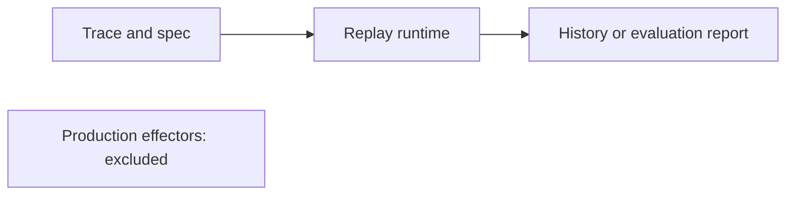

# Replay and shadow modes

Replay reprocesses evidence without performing production effects. The
default mode rebuilds stream history; `run --source-db` selects recorded mode.

## Modes

| Mode | What it does | External effects |
| --- | --- | --- |
| Deterministic | Replays trace and hashes Situation-version history | Never |
| Recorded | Verifies every replayed episode against the decision a live runtime recorded | Never |
| Shadow | Runs a shadow executor against immutable snapshots and reports differences | Never |

## Mode separation

Which boundary can replay reach?


```mermaid
flowchart LR
    T["Trace and spec"] --> R["Replay runtime"]
    R --> O["History or evaluation report"]
    E["Production effectors: excluded"]
```

Text equivalent: replay consumes evidence and produces history or evaluation
artifacts. The isolated production-effector node has no execution edge from
replay. Rehearsing effects without hardware is done live with the `emulator`
effect profile, not in replay. Source: [replay implementation](../../internal/replay/replay.go).

Replay is constructed without production credentials, effectors, or an effect
resolver. It reports `EffectsAllowed=false` for all modes.

## Why keep replay separate?

Reprocessing evidence should not create another real ticket or repeat a device
change. The replay boundary lets a maintainer compare stream history or evaluate
reasoning while keeping production effects excluded by construction.

Deterministic replay proves repeatable stream behavior. It does not prove that
a model always gives the same answer, that a simulation predicts a physical
system, or that a new executor is ready for production. Each needs its own
evaluation evidence.

## Shadow evaluation

Shadow mode lets a new executor or prompt inspect the same snapshot and produce
a report for comparison. It can be scored and compared without entering the
policy gateway. The active/shadow dispatch policy is also bound to the episode
request and checked at governance boundaries.

## Recorded replay

```text
agentic-stream run --spec <spec.yaml> --trace <trace.jsonl> --source-db <runtime.db>
```

Recorded replay answers one question about a live run: did the worker decide
on exactly the Situation the stream reproduces? It replays the trace with
cognition on, then requires every replayed episode to have exactly one
accepted decision in the source database, matched by the stable
situation/version/trigger key. Each decision must be canonical, schema-valid
and match its digest; cite its own episode, attempt and fence; and cite a
situation version at or after its trigger whose snapshot digest equals the one
replay persisted. A live episode assembles the latest version when it is
admitted, so it may cite a later version than its trigger, never an earlier
one. Live episode identifiers are random and are not compared.

The source database is opened read-only (SQLite `mode=ro`, no migrations) and
must have deployed the replayed spec. No worker is called. A missing,
unexpected, tampered or mis-cited decision fails the command.

Shadow mode is still reachable only through internal APIs and tests.

## Source evidence

- Replay implementation: [`internal/replay/replay.go`](../../internal/replay/replay.go)
- Replay tests: [`internal/replay/replay_test.go`](../../internal/replay/replay_test.go)
- Recorded replay of a live experiment run: [`cmd/agentic-stream/experiment_recorded_test.go`](../../cmd/agentic-stream/experiment_recorded_test.go)
- Shadow/mode tests: [`internal/episodes/internal/app/shadow_dispatch_test.go`](../../internal/episodes/internal/app/shadow_dispatch_test.go), [dispatch modes](../../internal/runtime/internal/app/dispatch_mode_test.go), [epoch controls](../../internal/runtime/internal/app/epoch_control_test.go)

## Next reads

- [Quickstart](../getting-started/quickstart.md)
- [Invariants](../architecture/invariants.md)
- [Limitations](../overview/limitations.md)
