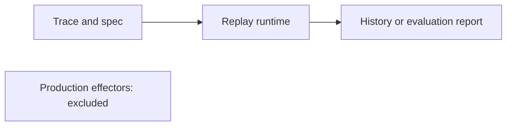

# Replay and shadow modes

Replay reprocesses evidence without performing production effects. The
default mode rebuilds stream history. Other modes are available through
internal APIs and are not exposed as separate CLI subcommands.

## Modes

| Mode | What it does | External effects |
| --- | --- | --- |
| Deterministic | Replays trace and hashes Situation-version history | Never |
| Recorded | Reuses a durable recorded worker ledger | Never |
| Shadow | Runs a shadow executor against immutable snapshots and reports differences | Never |
| Counterfactual | Sends typed commands only to an explicit simulator | Simulator only; never production |

## Mode separation

Which boundary can replay reach?

```mermaid
flowchart LR
    T["Trace and spec"] --> R["Replay runtime"]
    R --> O["History or evaluation report"]
    E["Production effectors: excluded"]
```

Text equivalent: replay consumes evidence and produces history or evaluation
artifacts. The isolated production-effector node has no execution edge from
replay. An explicit counterfactual simulator is a separate capability, described
in the mode table. Source: [replay implementation](../../internal/replay/replay.go).

Replay is constructed without production credentials, effectors, or an effect
resolver. It reports `EffectsAllowed=false` for all modes.

## Why keep replay separate?

Reprocessing evidence should not create another real ticket or repeat a device
change. The replay boundary lets a maintainer compare stream history or evaluate
reasoning while keeping production effects excluded by construction.

Deterministic replay proves repeatable stream behavior. It does not prove that
a model always gives the same answer, that a simulation predicts a physical
system, or that a new executor is ready for production. Each needs its own
evaluation evidence.

## Shadow evaluation

Shadow mode lets a new executor or prompt inspect the same snapshot and produce
a report for comparison. It can be scored and compared without entering the
policy gateway. The active/shadow dispatch policy is also bound to the episode
request and checked at governance boundaries.

## CLI reality

The current CLI exposes deterministic replay through `agentic-stream run`.
Recorded, shadow, and counterfactual modes are covered by internal runtime
APIs and tests; a public CLI for selecting them is not yet implemented.

## Source evidence

- Replay implementation: [`internal/replay/replay.go`](../../internal/replay/replay.go)
- Replay tests: [`internal/replay/replay_test.go`](../../internal/replay/replay_test.go)
- Shadow/mode tests: [`internal/episodes/p8_shadow_test.go`](../../internal/episodes/p8_shadow_test.go), [dispatch modes](../../internal/runtime/internal/app/dispatch_mode_test.go), [epoch controls](../../internal/runtime/internal/app/epoch_control_test.go)

## Next reads

- [Quickstart](../getting-started/quickstart.md)
- [Invariants](../architecture/invariants.md)
- [Limitations](../overview/limitations.md)
