# Stream processing

The stream plane turns unbounded evidence into deterministic, versioned
Situations without invoking a model for every event.

## Event-time path

```mermaid
flowchart LR
    A["Event arrives"] --> B["Validate envelope\nand schema"]
    B --> C["Append / deduplicate\nby stable identity"]
    C --> D["Partition by tenant + key"]
    D --> E["Advance watermark\nwith source health"]
    E --> F["Close/update windows"]
    F --> G["Run deterministic operators"]
    G --> H["Reduce Situation state"]
    H --> I["Publish immutable version\nor audit no-op"]
    I --> J["Schedule cognition\nif material"]
```

Text equivalent: validate and deduplicate the event, partition it, advance the
watermark, update windows/operators, publish an immutable Situation version,
and schedule cognition only when the change is material.

The event log is append-only. The engine serializes state changes per virtual
partition. A later event can produce a new correction version, but it does not
rewrite an earlier published version.

## Time and lateness

`SituationSpec.time` declares bounded out-of-orderness, source idle timeout,
allowed lateness, clock-skew tolerance, and one of these late policies:

| Policy | Meaning |
| --- | --- |
| `drop_with_audit` | Do not change state; retain the decision as an audit |
| `history_only` | Preserve evidence without changing the derived Situation |
| `correct` | Recompute the affected state and publish a correction |
| `correct_and_reconsider` | Correct state and admit a deduplicated reconsideration |

Missing heartbeat and source-health signals can make completeness uncertain.
Incomplete evidence is explicit state, not a silent default.

## Operators and windows

The current deterministic operators include aggregates, slope-like features,
and missing-heartbeat handling. Window kinds include tumbling, sliding, count,
and decay. The compiler checks that operator inputs, windows, and output names
are declared and compatible.

## Situation versions

A version carries the derived facts, lifecycle/phase, severity, completeness,
material delta, provenance summary, source references, and canonical digest.
The cognitive scheduler consumes the immutable snapshot and its version—not a
mutable pointer that can change underneath an episode.

## Source evidence

- Ingress: [`internal/ingress/`](../../internal/ingress/)
- Event log: [`internal/eventlog/`](../../internal/eventlog/)
- Engine: [`internal/engine/`](../../internal/engine/)
- Operators: [`internal/operators/`](../../internal/operators/)
- Situations: [`internal/situations/`](../../internal/situations/)

## Next reads

- [Event contract](../contracts/event-envelope.md)
- [Cognition](cognition.md)
- [Durability](../architecture/durability.md)
