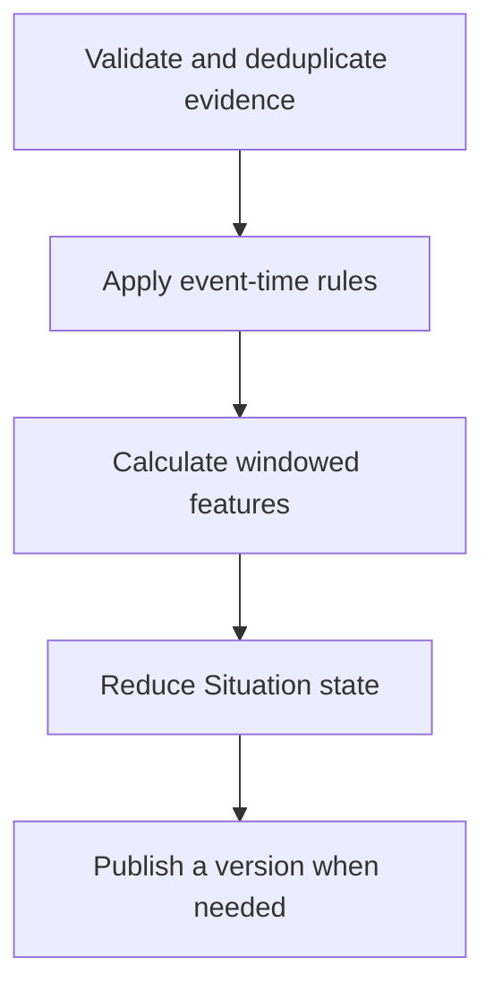

# Stream processing

The stream plane turns unbounded evidence into deterministic, versioned
Situations without invoking a model for every event.

## Event-time path

What happens inside the stream path?

```mermaid
flowchart TD
    E["Validate and deduplicate evidence"] --> T["Apply event-time rules"]
    T --> F["Calculate windowed features"]
    F --> S["Reduce Situation state"]
    S --> V["Publish a version when needed"]
```

Text equivalent: the stream validates evidence, applies time rules, calculates
features, and reduces state. A change may publish a version. This diagram omits
transaction bookkeeping; it does not add model calls or effects to the path.
Source: [engine](../../internal/engine/) and [event log](../../internal/eventlog/).

The engine serializes state changes per virtual partition. A later event can
produce a correction version, but it cannot rewrite a published version.

## Why windows and explicit time rules?

A window gives a calculation a declared evidence horizon. The motor spec uses
a fifteen-minute vibration window rather than treating one reading as the
whole condition. The input time and late-data policy remain part of the result,
so a transport delay does not silently become a different domain history.

The tradeoff is configuration: developers must choose a time horizon, disorder
allowance, idle behavior, and late policy suitable for their sources. Waiting
for more evidence can improve completeness while delaying a result. The
[time and state introduction](../learn/time-and-state.md) explains this without
requiring the full timing contract.

## Time and lateness

`SituationSpec.time` declares bounded out-of-orderness, source idle timeout,
allowed lateness, clock-skew tolerance, and one of these late policies:

| Policy | Meaning |
| --- | --- |
| `drop_with_audit` | Do not change state; retain the decision as an audit |
| `history_only` | Preserve evidence without changing the derived Situation |
| `correct` | Recompute the affected state and publish a correction |
| `correct_and_reconsider` | Correct state and reevaluate for a deduplicated reconsideration, subject to eligibility |

Each virtual partition keeps a clock per source: the latest event time and
ingestion time it has seen. The partition watermark is the slowest active
source's latest event time minus `maxOutOfOrderness`, where a source counts as
active until it has been silent for `idleTimeout` of ingestion time; the
watermark never moves backwards. An event whose event time is ahead of its
`ingested_at` by more than `clockSkewTolerance` is refused as `clock_skew`: it
changes no state and never moves the watermark, so one device with a wrong
clock cannot push its neighbors into lateness.

An event is late when its event time is before its partition's watermark.
A late event later than `allowedLateness` (zero when undeclared) never changes
state under any policy. The engine records every late or skewed event's disposition
(`corrected`, `history_only`, `dropped`, `beyond_allowed_lateness` or
`clock_skew`) in the `event_time_dispositions` table, and the event itself stays in the event log.

Missing heartbeat and source-health signals can make completeness uncertain.
Incomplete evidence is explicit state, not a silent default.

When applying an event fails the same way on every attempt (an operator or a
Situation rule refuses it), the engine records the failure in
`apply_failures`, marks the event processed and continues, so one bad record
cannot halt the tenant; storage and ownership failures still stop the run and
are retried. Due timers that fail the same way are acknowledged and logged.

A Situation's completeness is the weakest of the latest completeness of each
of its inputs, ordered `uncertain` < `provisional` < `on_time` < `corrected` <
`final_by_policy`. A change of completeness alone publishes a version only when
the Situation becomes uncertain, recovers from uncertainty, or takes a late
correction; other changes ride on the next version published for a phase or
fact change. A window that emits `early_and_close` emits a provisional value on
each event and the final value when the window closes. A trigger's
`completeness` (`any`, `on_time`, `final_by_policy`) admits only versions at
least that complete, and names the unmet requirement otherwise.

## Operators and windows

The current deterministic operators include aggregates, slope-like features,
and missing-heartbeat handling. Window kinds include tumbling, sliding, count,
and decay. The compiler checks that operator inputs, windows, and output names
are declared and compatible.

## Situation versions

A version carries the derived facts, lifecycle/phase, severity, completeness,
material delta, provenance summary, source references, and canonical digest.
The cognitive scheduler consumes the immutable snapshot and its version—not a
mutable pointer that can change underneath an episode.

## Source evidence

- Ingress: [`internal/ingress/`](../../internal/ingress/)
- Event log: [`internal/eventlog/`](../../internal/eventlog/)
- Engine: [`internal/engine/`](../../internal/engine/)
- Operators: [`internal/operators/`](../../internal/operators/)
- Situations: [`internal/situations/`](../../internal/situations/)

## Next reads

- [Event contract](../contracts/event-envelope.md)
- [Cognition](cognition.md)
- [Durability](../architecture/durability.md)
