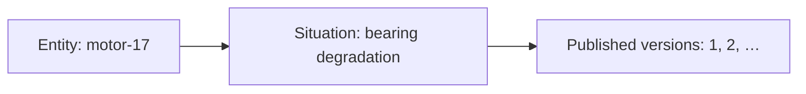

# What a Situation represents

A Situation describes an evolving condition of something in the domain. For
predictive maintenance, the **entity** is a motor and the **condition** is
possible bearing degradation. A temperature reading is evidence about that
condition; a maintenance ticket is a possible response to it.

## Separate the thing, the condition, and its history

What remains the same as evidence changes?

Text equivalent: one motor can be the subject of a bearing-degradation
Situation. That Situation has a history of immutable versions. The arrows
express relationships, not processing steps or a promise that every motor
already has a Situation. Source: [Situation identities and state](../../internal/situations/internal/domain/situations.go).

| Concept | Question it answers | Motor example |
| --- | --- | --- |
| Tenant | Whose evidence and authority is this? | The organization operating the motor |
| Entity | What thing are we observing? | `motor-17`, of type `motor` |
| Situation type | What condition are we interpreting? | `motor_bearing_degradation` |
| SituationSpec | Which declared rules interpret that condition? | Inputs, time rules, features, phases, triggers, and Intent catalog |
| Deployment | Which compiled definition owns this state? | The activated spec identified by its content digest |
| Situation identity | Which durable condition record is this? | The tenant/deployment/partition/type/entity combination |
| Occurrence | Which instance of the condition's lifecycle is recorded? | The condition opened for this motor |
| Version | What was published at a particular point? | Version 1 in `candidate`, with its evidence and facts |

One entity can have several kinds of condition. For example,
bearing degradation and overheating would need separate domain definitions;
changing a spec also creates a fresh deployment namespace. These examples
explain modeling choices, not additional committed motor fixtures.

**Occurrences:** the engine derives the Situation identity from a stable
combination of deployment, tenant, partition, Situation type and entity. When a
spec declares a transition into `resolved`, the Situation closes only through
that transition, so its minimum duration applies; otherwise `closeWhen` closes
it. Once resolved, the Situation reopens as a fresh occurrence (same Situation
ID, a new occurrence ID, back in the initial phase) when `openWhen` holds again
and at least `reopenCooldown` of event time has passed since resolution.
Source: [lifecycle](../../internal/situations/internal/domain/evaluate.go) and
[deployment versioning](../../internal/spec/internal/store/deployments.go).

## Evidence becomes features, then facts

An **event** is an observation, with source, identity, event time, and typed
payload. A **window** selects an evidence horizon. An **operator** produces a
**feature**, such as vibration magnitude over that window. A **reducer** decides
how that feature updates the condition's **facts**.

In the motor spec, `vibration_rms_15m` is an operator output;
`facts.vibration_rms` is a reduced fact. The `latest_event_time` reducer keeps
values from newer event times rather than simply keeping the last arrival.
A `set_union` reducer collects supporting event identities.

Facts are derived values. Evidence identities identify the observations that
support them. **Provenance** connects the published interpretation to its spec,
evidence, time boundary, and content digest so it can be inspected later.
Source: [motor spec](../../examples/predictive-maintenance/predictive-maintenance.situation.yaml),
[reducers](../../internal/situations/internal/domain/reducers.go), and
[snapshot materialization](../../internal/situations/internal/domain/materialize.go).

## Phases express the domain's interpretation

A **phase** is a named state of the condition, such as `candidate`, `warning`,
`incident`, or `resolved`. The spec declares the opening rule, transitions,
minimum durations, closing rule, and severity for its phases.

**Hysteresis** uses different conditions for entering and leaving a state,
so small fluctuations do not continually reopen and close it. **Minimum
duration** requires a transition condition to hold across the configured
event-time interval. The motor spec uses both threshold separation and
duration rules; they stabilize the domain state before reasoning is considered.

**Severity** expresses importance according to that domain definition.
**Confidence** expresses certainty in the interpretation. **Completeness**
records the status of the evidence calculation. They answer different questions:
a serious condition can still have incomplete evidence.

In the current Situation engine, confidence starts at `1.0`. The engine does
not calculate or update it from the evidence. The cognition view derives
uncertainty from that confidence. It also does not track changes to the main hypothesis
across later versions. These fields must not be read as a measured diagnosis
probability or a working hypothesis-management system.
Source: [state initialization](../../internal/situations/internal/domain/situations.go)
and [cognition's state view](../../internal/cognition/internal/domain/delta.go).

A **hypothesis** is a proposed explanation, such as bearing wear rather than
a faulty sensor. It belongs in the reasoning output and its evidence; it is
not a new phase or permission to change a reduced fact. Situation state holds
no hypothesis, because replaying the stream must not depend on what a model
said; the trigger delta key `primary_hypothesis_changed` is therefore true only
for a Situation's first reasoned version.

Phase is separate from an episode's status and a Command's status. A motor can
remain in `warning` while an episode finishes, a proposal is refused, or a
Command waits for readiness. Reasoning and action records do not own the
stream's phase transitions.

## Current state and publication serve different jobs

The current state can change. It contains the facts, evidence, and condition
timers needed for the next evaluation. A published **snapshot** is the stable view supplied
to readers and reasoning. Internal reducer values and timers are stored separately from the snapshot.

The current engine publishes at most one version per feature: when the
occurrence opens or reopens, a lifecycle transition changes phase, or the
Situation becomes or stops being uncertain or takes a late correction. A fact update alone
does not necessarily publish a new version. The next publication includes
the facts held at that time; a snapshot is not a live view of every incoming reading.
Source: [publication gates](../../internal/situations/internal/domain/evaluate.go)
and [current-state versus snapshot persistence](../../internal/situations/internal/domain/materialize.go).

A canonical **digest** identifies content serialized in a consistent form.
It helps detect mismatches and bind work to the intended definition or snapshot.
It does not certify that a sensor was accurate or a diagnosis was correct.

## Model a new domain in this order

1. Name the entity and the condition you want to follow.
2. Declare the observations, units, identities, and time rules.
3. Choose the features and reduced facts needed to interpret the condition.
4. Define phases and the evidence required to enter or leave each phase.
5. Decide which published changes deserve bounded reasoning.
6. Declare permitted proposals, risk limits, and the governed effect boundary.

This keeps domain meaning in the spec and deterministic stream rules. An agent
can reason about a published condition and propose an Intent; it does not
rewrite the condition or grant itself authority.

## Next reads

- [Time and changing state](time-and-state.md)
- [Core concept reference](../overview/concepts.md)
- [Author your first SituationSpec](../getting-started/first-situation.md)
