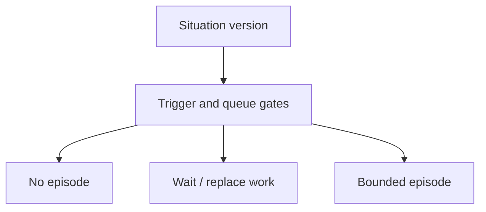

# When an agent should reason

A published Situation version can become a question for an agent. The
scheduler decides whether that question is useful, and admission decides
whether it can start within the available limits.

## A change can be important without needing another agent run

The scheduler evaluates declared **triggers**, rules saying when reasoning may
be useful. The motor example asks for diagnosis in `warning` or `incident`,
checks heartbeat evidence, and scores the condition against a threshold.
It can require a **material delta**: a change between versions that matters
to the domain, such as a new phase.

The runtime compares the new publication with the most recently evaluated
version, even when that earlier evaluation started no episode. It does not
mean “everything that changed since the last model response.” Source:
[delta baseline](../../internal/cognition/internal/app/service.go).

Passing a trigger creates an opportunity for reasoning. Queue timing,
capacity, expiry, and admission still determine whether an episode starts.

## Three possible paths

Does this version deserve reasoning now?

Text equivalent: the runtime may record that no episode is needed, delay or
replace pending work, or admit an episode. A published version is not a model
call. Source: [cognitive scheduler](../../internal/cognition/)
and [episode admission](../../internal/runtime/internal/app/admission.go).

## Why wait or replace work?

| Control | Plain meaning | Why it exists |
| --- | --- | --- |
| Debounce | Put a not-before time on queued work | Allow time before reasoning starts |
| Cooldown | Delay repeated admission for the same trigger | Limit repeated attention to the same condition |
| Coalescing/supersession | Replace older eligible work for the same Situation and trigger | Avoid spending the queue on outdated questions |
| Capacity and expiry | Bound how much work can run and how long it remains useful | Prevent an unlimited backlog |

Here, debounce is a queue delay. It does not promise that the domain condition
has held continuously; phase `minDuration` rules handle that separate question.
See [scheduler timing](../../internal/cognition/internal/domain/timing.go) for the exact
not-before behavior.

## An episode has a beginning and an end

An **episode** is one limited reasoning session. Each execution **attempt**
reads its bound immutable snapshot and can use only its allowed evidence tools and Intent catalog.
Its budget can limit wall time, model calls, tokens, tool calls, result bytes,
retries, and cost.

A native executor runs in the runtime process. A separate Go worker uses the
versioned worker protocol. Both operate behind the same episode authority
boundary; choosing a worker does not grant permission to execute effects.

## What if the condition changes while the agent is working?

Before an attempt starts, an episode that refers to an older version can be
**rebound**: the runtime checks the live snapshot and points the episode to it.
Its identity, budget, and original trigger evidence stay the same. The old
snapshot remains unchanged; the request now points to the newer one. The runtime
records each rebind and allows at most three across retries. If it cannot
validate the live snapshot, it abandons the episode.

Once an attempt starts, its request is fixed. Eligible replacement work can
**supersede** the earlier episode: it replaces that work and cancels its attempt.
Publishing a version alone does not guarantee cancellation. The attempt identity and
**fence**, an increasing generation number, let the runtime reject output from
an obsolete attempt even if it arrives after cancellation.

Current-state checks also happen when proposals reach policy and dispatch.
A snapshot is a stable record of what was read; it is not permanent permission
to act on the world.

Sources: [episode lifecycle](../../internal/episodeledger/lifecycle.go), [worker
boundary](../architecture/worker-boundary.md), [cognition
design](../design/cognition.md), and the accepted rebinding
decision.

## Next reads

- [From proposal to effect](safe-actions.md)
- [Cognition mechanics](../design/cognition.md)
- [Worker and evidence tools](../architecture/worker-boundary.md)
