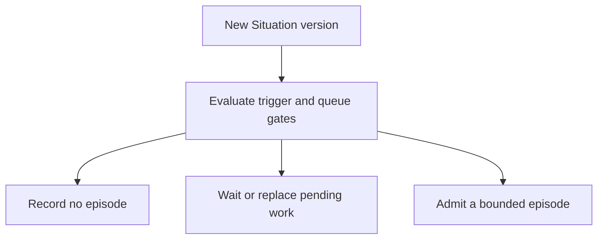

# When an agent should reason

For readers who understand Situation versions: this page explains the gate
between a changing condition and a finite reasoning session.

## A change can be important without needing another agent run

The scheduler evaluates declared **triggers**, rules saying when reasoning may
be useful. The motor example asks for diagnosis in `warning` or `incident`,
checks heartbeat evidence, and scores the condition against a threshold.
It can require a **material delta**, a meaningful change such as a new phase.

Passing a trigger creates an opportunity for reasoning. Queue timing,
capacity, expiry, and admission still determine whether an episode starts.

## Three possible paths

Does this version deserve reasoning now?

Text equivalent: the runtime may record that no episode is needed, delay or
replace pending work, or admit an episode. A published version is not a model
call. Source: [cognitive scheduler](../../internal/cognition/)
and [episode admission](../../internal/admission/).

## Why wait or combine work?

| Control | Plain meaning | Why it exists |
| --- | --- | --- |
| Debounce | Put a not-before time on queued work | Allow time before reasoning starts |
| Cooldown | Delay repeated admission for the same trigger | Limit repeated attention to the same condition |
| Coalescing/supersession | Replace or combine pending work as state changes | Avoid spending the queue on outdated questions |
| Capacity and expiry | Bound how much work can run and how long it remains useful | Prevent an unlimited backlog |

Here, debounce is a queue delay. It does not promise that the domain condition
has held continuously; phase `minDuration` rules handle that separate question.
See [scheduler timing](../../internal/cognition/scheduler.go) for the exact
not-before behavior.

## An episode has a beginning and an end

An **episode** is one limited reasoning session. It reads one immutable
snapshot and can use only its allowed evidence tools and Intent catalog.
Its budget can limit wall time, model calls, tokens, tool calls, result bytes,
retries, and cost.

A native executor runs in the runtime process. A separate Go worker uses the
versioned worker protocol. Both operate behind the same episode authority
boundary; choosing a worker does not grant permission to execute effects.

## What if the condition changes while the agent is working?

Material supersession can cancel the old attempt. The attempt identity and
**fence**, an increasing generation number, let the runtime reject output from
an obsolete attempt even if it arrives after cancellation.

Current-state checks also happen when proposals reach policy and dispatch.
A snapshot is a stable record of what was read; it is not permanent permission
to act on the world.

Sources: [episode lifecycle](../../internal/episodeledger/lifecycle.go),
[worker boundary](../architecture/worker-boundary.md), and
[cognition design](../design/cognition.md).

## Next reads

- [From proposal to effect](safe-actions.md)
- [Cognition mechanics](../design/cognition.md)
- [Worker and evidence tools](../architecture/worker-boundary.md)
