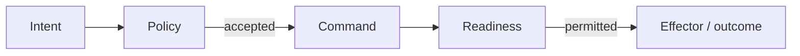

# From proposal to effect

An episode can suggest a change, such as opening a maintenance ticket. Policy
decides whether to permit it, and the action dispatcher controls execution.

## Four records, four meanings

Suppose an episode suggests opening a maintenance ticket. That suggestion is
not yet an authorized request to a ticket provider.

| Record | Example meaning | Who owns the next step? |
| --- | --- | --- |
| Decision | “Bearing wear is plausible; here is the supporting evidence” | Runtime validates the proposal |
| Intent | “Propose a maintenance ticket for this motor” | Policy evaluates the typed request |
| Command | “This accepted request may enter governed dispatch” | Action dispatcher checks current authority |
| Outcome | “Succeeded,” “failed,” or “we cannot yet prove the result” | Action/reconciliation path records evidence |

The ticket illustrates the action path. The local tests use a simulated
effector, and the opening motor trace produces no ticket.

## Where authority increases

How does a proposal reach an external system?

Text equivalent: policy evaluates a validated proposal against current state.
An accepted request becomes a Command; the dispatcher checks authority again
before an effector performs it and records an outcome. Denial, deferral,
approval requirements, or failed readiness can stop this path.
Source: [policy](../../internal/policy/) and [dispatcher](../../internal/actions/internal/app/dispatch.go).

The model can propose allowed Intent types. It cannot grant itself a higher
risk ceiling, create a governed Command, or call an effector. Evidence tools
are scoped read tools, not an execution shortcut.

## Why check again after approval?

While work waits, the condition can change, a different runtime can take
ownership, or an operator can stop admission or dispatch. An **interlock** is a readiness condition that must
hold before execution. Policy and action checks use current durable state so
earlier reasoning or approval cannot silently bypass a later stop.

The spec catalog declares allowed action types and risk. The schema accepts some
policy modes that the runtime does not yet fully enforce; use the
[current limitations](../overview/limitations.md) when adapting a spec.

## A timeout does not tell you whether the effect happened

A provider may accept a request and then lose the reply. Retrying immediately
could create a second ticket. A stable **idempotency key** identifies the same
logical request across delivery attempts; its protection depends on the
provider honoring that identity.

When the runtime cannot prove the result, it records an unknown or
reconciliation-required outcome. **Reconciliation** means obtaining evidence of
what happened before deciding the next safe step. General reconciliation is
available internally. There is no public CLI command for it yet.

## A correction does not undo an effect

If later evidence changes the condition, reconsideration can reassess a prior
succeeded Command. Reversing or adjusting that effect requires a separate
compensating Intent linked to the earlier Command and governed on its own
merits. [Time and state](time-and-state.md) explains these three different jobs.

## Replay is a different execution boundary

Deterministic replay rebuilds stream history without external effects. Shadow
mode evaluates an executor without sending its proposals into governance.
None of these modes authorizes a production effect.

Sources: [Decision/Intent contract](../contracts/decision-intent.md),
[unknown-outcome tests](../../internal/actions/internal/app/crash_recovery_test.go),
[recovery](../operations/recovery.md), and [replay](../design/replay-and-shadow.md).

## Next reads

- [Who owns state and authority?](runtime-boundaries.md)
- [Why these design choices](design-choices.md)
- [Decision and action mechanics](../design/decisions-and-actions.md)
- [Security model](../architecture/security-model.md)
