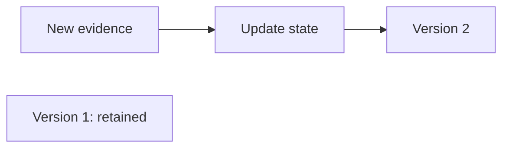

# Time and changing state

Readings can arrive late, arrive twice, or fail to arrive. The runtime records
when evidence happened and how it was processed so those differences remain
visible in the Situation history.

## Two times tell different stories

**Event time** is when the source says the observation happened.
**Ingestion time** is when the runtime received it. A network delay can make
an older reading arrive after a newer one.

Illustrative timeline, not a committed test trace:

| Arrival order | Reading happened at | Runtime received it at |
| --- | --- | --- |
| First | 10:02 | 10:02 |
| Second | 10:01 | 10:03 |

The second reading is older evidence, even though it arrived later. Windows
use event time so a transport delay does not silently change what period a
measurement describes.

## A watermark says how far processing has progressed

A **watermark** is a time boundary used to judge window progress and lateness.
When a source allows out-of-order arrivals, its watermark follows the latest
event time by the configured allowance. The partition combines active sources;
the spec supplies rules for sources that become idle or start reporting again.
The boundary moves forward, never back.

It is not proof that all earlier evidence exists. A delayed reading can still
arrive behind it. The spec declares how to handle that evidence: audit and drop
it, keep it in history, publish a correction, or correct and reconsider reasoning.

The motor fixture allows two minutes of out-of-order arrival and declares
`correct_and_reconsider` with a separate allowed-lateness limit. These are
example domain choices, not recommended defaults for every source.

## A Situation changes; a published version stays fixed

What happens to earlier conclusions when new evidence arrives?

Text equivalent: new evidence updates current state and may publish a new
version. Version 1 is retained; it is not overwritten. The isolated node is
intentional: the new version does not edit the old one.
Source: [Situation implementation](../../internal/situations/)
and [engine](../../internal/engine/).

The history shows which version each attempt actually read.
Before an attempt starts, its episode may be rebound to a newer validated
snapshot; during execution the request stays fixed. Supersession and acceptance
checks protect against stale output. See [reasoning](reasoning.md).

## Missing evidence is part of the state

**Completeness** records a feature's processing status. The runtime copies
that status into Situation state. It is separate from diagnostic confidence
and does not certify that every required sensor has reported.

| Status | Meaning in the current processing path |
| --- | --- |
| `provisional` | A result emitted while its window is still progressing |
| `on_time` | An on-time result, including healthy heartbeat evidence |
| `corrected` | A result changed by accepted late evidence |
| `final_by_policy` | A window result closed under the configured time policy |
| `uncertain` | Evidence such as missing or late heartbeat needs caution |

Missing heartbeat evidence can make the evidence status uncertain while
vibration readings look normal. The motor trigger explicitly checks heartbeat
features. The current scheduler does not enforce the schema-visible trigger
`completeness` field as a separate admission gate; use explicit trigger
conditions, such as the heartbeat check, when those checks must affect
admission. Source: [feature emission](../../internal/operators/), [Situation
update](../../internal/situations/internal/domain/reducers.go), and [trigger
evaluation](../../internal/cognition/internal/domain/trigger_rules.go).

## Correction, reconsideration, and compensation

A **correction** changes the published interpretation of evidence. Under
`correct_and_reconsider`, eligible prior succeeded Commands can create
**reconsideration** work: review a previous action against the correction.
The runtime prevents duplicate reconsideration for the same Situation,
superseded version, and prior Command;
one correction may therefore produce no reconsideration or more than one.

A **compensation** is a new proposed effect linked to a prior Command. The runtime checks
that its type is allowed, that it identifies the prior Command correctly, and
that policy and current dispatch conditions permit it. A corrected snapshot
does not undo a ticket or reverse a device operation automatically. The prior
Command and its recorded outcome remain in history. Source:
[reconsideration selection and evidence](../../internal/cognition/internal/store/reconsideration.go),
[deduplication](../../internal/cognition/internal/app/correction.go), and
[Intent contract](../contracts/decision-intent.md).

## Why preserve the history?

It lets a reviewer ask what the system knew at the time, what changed later,
and which version an episode used. Deterministic replay checks the stream
history with effects disabled. That does not make a model's answer deterministic.

Sources: [time policy and stream processing](../design/stream-processing.md),
[late-correction test](../../internal/runtime/internal/app/pipeline_e2e_test.go), and
[replay design](../design/replay-and-shadow.md).

## Next reads

- [When an agent should reason](reasoning.md)
- [Stream mechanics](../design/stream-processing.md)
- [Durability and recovery](../architecture/durability.md)
