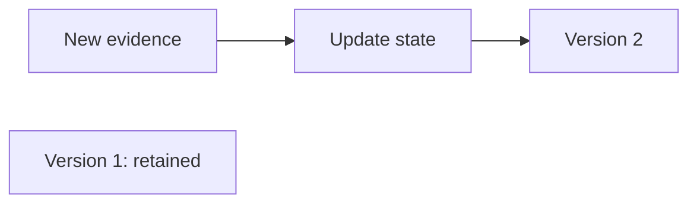

# Time and changing state

For readers following the motor story: this page explains why arrival order
and the published history are different things.

## Two times tell different stories

**Event time** is when the source says the observation happened.
**Ingestion time** is when the runtime received it. A network delay can make
an older reading arrive after a newer one.

Illustrative timeline, not a committed test trace:

| Arrival order | Reading happened at | Runtime received it at |
| --- | --- | --- |
| First | 10:02 | 10:02 |
| Second | 10:01 | 10:03 |

The second reading is older evidence, even though it arrived later. Windows
use event time so a transport delay does not silently change what period a
measurement describes.

## A watermark says how far processing has progressed

A **watermark** is a time boundary used to judge window progress and lateness.
For bounded disorder, the source boundary trails the latest event time by the
configured allowance. The partition considers active sources; idle and
rejoining sources need explicit rules. The boundary moves forward, never back.

It is not proof that all earlier evidence exists. A delayed reading can still
arrive behind it. The spec declares how to handle that evidence: audit and drop
it, keep it in history, publish a correction, or correct and reconsider reasoning.

The motor fixture allows two minutes of out-of-order arrival and declares
`correct_and_reconsider` with a separate allowed-lateness limit. These are
example domain choices, not recommended defaults for every source.

## A Situation changes; a published version stays fixed

What happens to earlier conclusions when new evidence arrives?

Text equivalent: new evidence updates current state and may publish a new
version. Version 1 is retained; it is not overwritten. The isolated node is
intentional: the new version does not edit the old one.
Source: [Situation implementation](../../internal/situations/)
and [engine](../../internal/engine/).

An episode bound to version 1 can therefore be explained later. If new evidence
makes that work stale, cancellation and acceptance checks protect the newer
state. A correction can also prompt reconsideration under the declared policy.

## Missing evidence is part of the state

**Completeness** describes whether the runtime has enough expected evidence,
including source-health information. Missing heartbeat evidence can make a
condition uncertain even when the available vibration readings look normal.
The runtime records that uncertainty so triggers and policy can consider it.

## Why preserve the history?

It lets a reviewer ask what the system knew at the time, what changed later,
and which version an episode used. Deterministic replay checks the stream
history with effects disabled. That does not make a model's answer deterministic.

Sources: [time policy and stream processing](../design/stream-processing.md),
[late-correction test](../../internal/runtime/pipeline_e2e_test.go), and
[replay design](../design/replay-and-shadow.md).

## Next reads

- [When an agent should reason](reasoning.md)
- [Stream mechanics](../design/stream-processing.md)
- [Durability and recovery](../architecture/durability.md)
