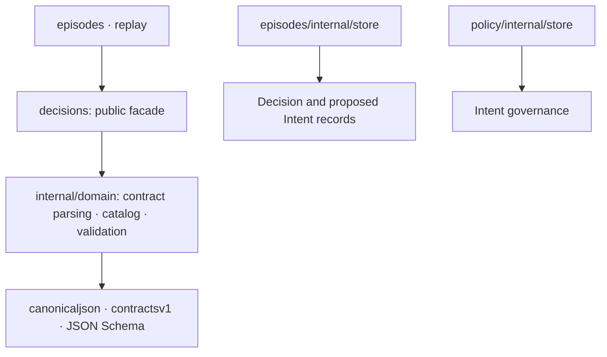

# Decisions

`decisions` validates worker-proposed Decisions and their Intents against the
episode's trusted attempt, Situation snapshot and compiled catalog authority.
It owns pure rules only: the episode store persists Decision evidence, and
policy revalidates and governs proposed Intents.

| Layer | Responsibility |
| --- | --- |
| Facade | Public type aliases; `Validate` and `CompileIntentCatalog` delegate to domain rules |
| Domain | Canonical parsing, shared schema checks, compiled catalog, trusted identity binding, risk, parameter, evidence and freshness rules |

Use `CompileIntentCatalog` to build an opaque catalog, then pass that catalog
and the episode's trusted `Input` to `Validate`. `Input.Now` is supplied by the
caller; validation does not read the wall clock. Missing trusted time or
catalog authority is a typed refusal. The compiled catalog blocks external
schema loads and cannot be edited through the public facade.

Validation preserves rejection order because the reason and field are durable
episode evidence. The Decision is canonicalized and digest-checked before
identity binding; attempt and fence checks precede snapshot checks. Each Intent
schema and digest are checked before identity, authority, parameters and
expiry. A Decision may contain at most one actionable Intent. Compensation is
allowed only for reconsider episodes, and all Intent types and risk labels are
checked against both the catalog and attempt authority.

The validated `Result` exposes the Decision ID/digest and ordered Intents. Each
Intent exposes canonical bytes and its digest for the episode-to-policy
handoff. Episode storage retains the original Decision bytes from the worker
outcome; the validator's parsed document is not a replacement for that audit
input.

See [module vocabulary](UBIQUITOUS_LANGUAGE.md) and the
migration audit.
