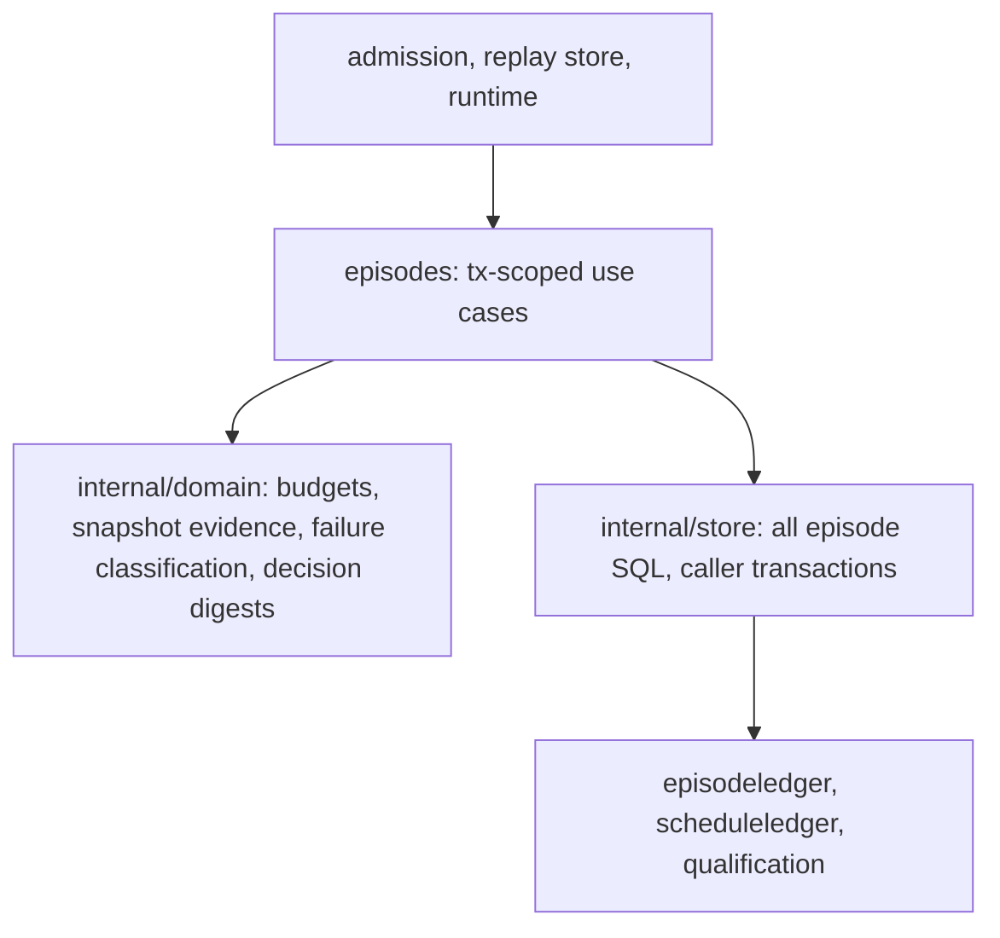

# Episodes reference module

Episodes turns scheduler items into bounded reasoning units: it assembles
deterministic requests from immutable situation snapshots, admits them with
cost reservation, claims the oldest dispatchable episode inside one
transaction (re-binding stale episodes to live versions, refusing killed
policy epochs), executes it under a supersession watch and wall-time budget,
and persists validated decisions — governing active dispatches while shadow
dispatches only score.

The module's public API is **transaction-threaded** (`Assemble`, `Persist`,
`Rebind` and the runner's claim/conclude steps take the caller's `*sql.Tx`),
exactly like `episodeledger`. That contract dictates the layer shape: the
transaction-scoped use cases stay in the facade package, pure rules live in a
domain layer, and every SQL statement lives in a store layer that receives
the caller's transaction. A conventional app layer is impossible without
redesigning the cross-module transaction contract (recorded as a deferred
follow-up), and the layer arithmetic agrees — admission and the executors
(level 6) import episodes, pinning the facade at level 5.

## Responsibilities

| Layer | Responsibility |
| --- | --- |
| Facade | Public API (`Request`, `Outcome`, `Executor` port, `Assembler`, `Runner`, `FakeExecutor`, catalog compile, budget errors) and the transaction-scoped claim → re-bind → fence → execute → validate → persist → conclude sequencing |
| Domain | Pure rules with table tests: wall-time budget parsing, snapshot evidence validation and binding, execution failure classification (the budget error types live here and are aliased by the facade), decision digests and validation-failure documents |
| Store | Every SQL statement behind domain-named methods taking the caller's transaction: assembly loads, the dispatchable-episode read, live-situation and attempt-status reads, decision and validated-intent inserts, retry and lifecycle updates through the ledger |

## Preserved sequences

Claim atomicity (an episode quarantine commits inside the claim transaction so
the queue never blocks), the stale re-bind bound of three, the epoch kill
gate, the detached persist context with its five-second budget, supersession
cancellation, budget-exhaustion classification, and shadow decisions scoring
without ever touching intents or commands. All pinned by the package's suites
(golden assembler, runner, rebind, cancellation, dispatch-freshness and
shadow-dispatch tests) which ran unchanged through the migration.

## Evidence and limits

Coverage: facade 74.6%, domain 88.9%, store 67.1%. Gates enforce downward
imports, domain purity and store-only SQL, each proven by injected violations
during migration; durable ownership of `decisions` and the `intents` insert
handoff moved to the store layer (authority/policy/eventlog precedent).
Deferred: the app layer needs an episodeledger-style unit contract agreed
across admission, replay and runtime; `CompileIntentCatalog` and the executor
document stay facade-side until the spec projection has a second consumer.

- [Episodes language](UBIQUITOUS_LANGUAGE.md)
- [Migration design](../../docs/episodes-reference-module-2026-10-05/DESIGN.md)
- [Plan and rounds](../../docs/episodes-reference-module-2026-10-05/PLAN.md)
