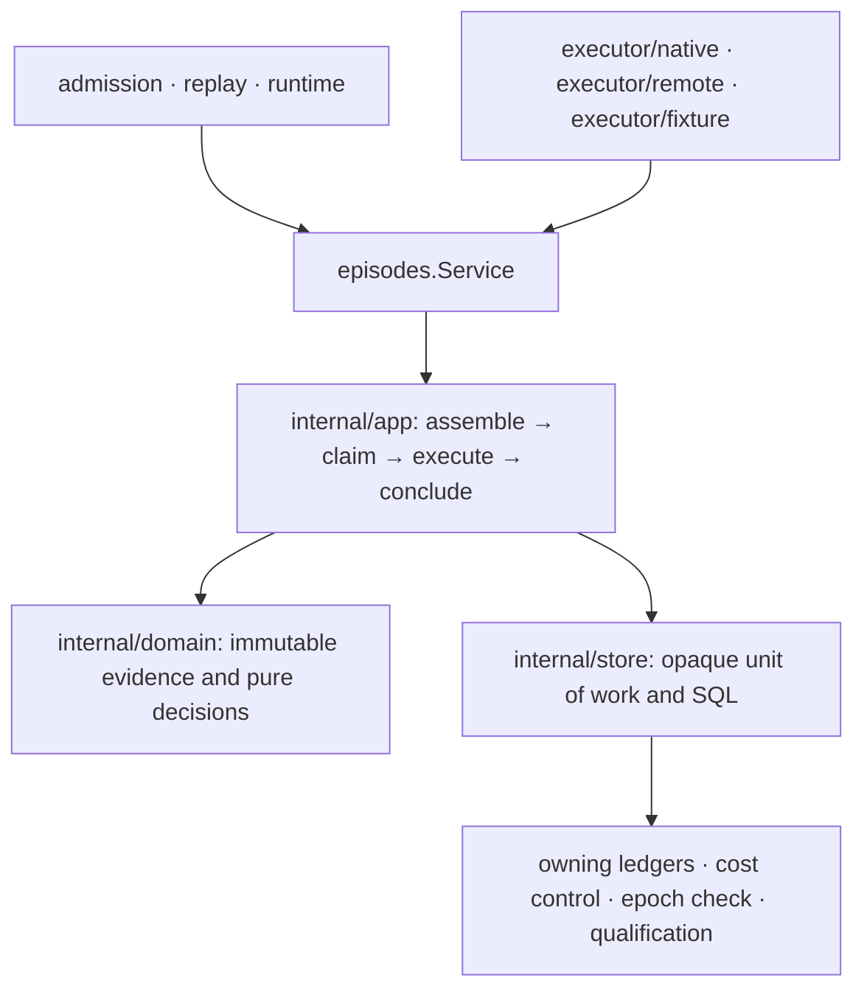

# Episodes

Episodes owns deterministic request assembly and bounded reasoning execution.
Consumers use `Service`, constructed once by `New(Config)`. The facade exposes
`Assemble`, `Persist` and `RunOnce`; its methods only delegate. Rebinding is
private to the runner. Concrete executors implement the public `Executor` port
and live under `internal/executor/`.

| Layer | Responsibility |
| --- | --- |
| Facade | Configuration adaptation, domain aliases, executor port and three delegating operations |
| App | Ordered use cases; clock reads, ID allocation, telemetry, supersession cancellation; uses domain decisions and transactional ports |
| Domain | Requests/outcomes, budget cache, snapshot validation, canonical assembly and provenance, catalog authority, decision validation/storage rules, failure/epoch classification, freshness/retry limits and shadow scoring |
| Store | SQL projections and decision/intent producer writes; opaque transaction joins; calls owning ledger, reservation, epoch and shadow APIs on the original transaction |
| Executors | Native reasoning, worker protocol and deterministic demo fixtures, behind the same episode port |

## Construction

Assembly-only consumers such as replay materialization pass `Config{Spec: ...}`.
`Execution == nil` explicitly selects assembly-only use; `RunOnce` returns an
error before touching a database or executor. An execution configuration must
supply a database, executor and decision-epoch check. A shadow spec also needs
shadow persistence. Clock and ID generator retain their existing defaults;
aggregate cost accounting is an optional configured feature.

Runtime composition supplies the same explicit epoch port used by policy.
Unowned fixture composition keeps its existing explicit permissive check;
live owner-scoped composition supplies the control gate. Missing execution
ports are constructor errors. There are no public setters or compatibility
constructors that can silently omit a required check.

## Atomic ownership

Admission and replay pass their caller-owned `*sql.Tx` to the facade. It joins
that transaction through `store.Join`; the private `Tx` exposes no SQL handle,
query methods, commit or rollback. Ledger, cost and epoch ports receive the
same underlying transaction. Joined use cases never open a second transaction.

The runner opens one claim transaction and a separate conclusion transaction,
executing outside both. Claim-time quarantine commits so an unusable oldest
row cannot block the queue. Rebind and retry budgets remain three. Epoch checks
occur before dispatch and inside the conclusion transaction. A cancelled
parent context does not cancel the detached five-second persistence budget.

The store owns decisions and the declared intent-producer handoff. Active
execution inserts validated pending intents for downstream policy. Shadow
execution writes qualification-owned scores and no intents or commands.
Episode/scheduler lifecycle tables remain owned by their ledgers; foreign
mutations are not permitted. Existing transactional read projections over
scheduler, situation and reconsideration evidence remain in store.

## Evidence and audit

Canonical request bytes, digest domains, admission identities, error precedence,
clock reads, cancellation and golden fixtures are unchanged. Regression tests
prove caller rollback, fencing, refusal, stale rebinds, deadline handling,
shadow isolation and replay parity. Architecture gates enforce facade
operations, opaque transactions, store-only SQL, pure domain rules, application
ports and transport isolation across every episode layer.

The [completion record](../../docs/episodes-reference-module-2026-10-05/README.md)
contains the plan, validation and [dead/test-only code decisions](../../docs/episodes-reference-module-2026-10-05/CODE_AUDIT.md).
See [module language](UBIQUITOUS_LANGUAGE.md) for matching code/storage terms.
