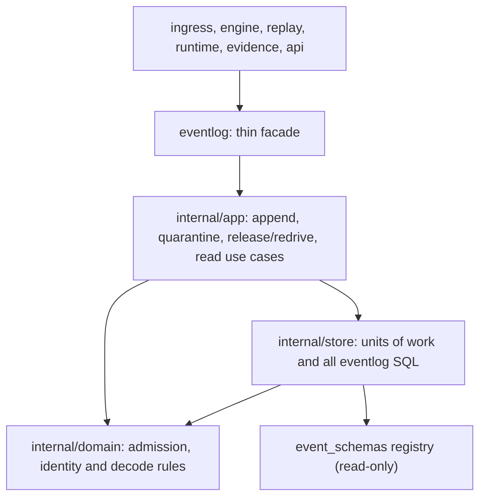

# Event log reference module

The event log is the append-only normalized evidence store: it admits
contract- and schema-valid envelopes, inserts them with duplicate suppression,
quarantines invalid deliveries with bounded retries, records gaps instead of
deleting evidence, and streams reads for every downstream plane. It owns three
durable tables (`event_log`, `event_quarantine`, `event_gaps`) and their
rules.

## Responsibilities

| Layer | Responsibility |
| --- | --- |
| Facade | Public `EventLog` method set, `Record` with its envelope contract, constructors and delegation |
| App | Use cases: batch append with rollback on later admission failure, quarantine delivery with post-commit conflict reporting, release, atomic redrive, gap recording, read streaming |
| Domain | Pure rules over plain values: schema payload checking, quarantine identity derivation and conflict decision, event body encoding, stored-time decoding, input validation |
| Store | Every SQL statement and transaction behind a `Unit` for caller-owned transactions |

The domain layer is deliberately contract-free (layer 1, like authority's):
the public `Record` and its `contractsv1.Envelope` stay in the facade, which
keeps the whole module below its low-level importers (ingress, evidence).
Reviewed re-leveling recorded with this migration: eventlog 2→4, ingress
3→5, evidence 4→5.

## Preserved sequences

Append: per envelope inside one transaction — contract validation, registered
schema check when required, trace-context validation, encode, insert with
`ON CONFLICT DO NOTHING` reporting -1 for duplicates. Quarantine: identity
derived from event id (or payload digest) plus payload bytes; same payload
counts one bounded retry (max 10); different payload under the same id
commits a rejection and then reports the conflict; a spent budget records
exactly one gap. Redrive loads only a released, un-redriven record, re-admits
it by the append rules, appends and marks it redriven atomically. Reads
stream in log order with the documented scope and limit rules.

## Evidence and limits

Each layer has its own tests (facade 79%, app 75%, domain 81%, store 76%
coverage) plus the unchanged package suite pinning rollback, duplicate,
conflict and redrive behavior. Gates enforce downward imports, domain purity,
app infrastructure isolation, store-only SQL and single durable ownership
(now pointing at the store layer); injected violations were rejected during
migration. `ReadEntityWindow` still takes the raw database handle; moving its
callers onto a facade method is a recorded follow-up. Invalid evidence enters
quarantine through `QuarantineEnvelope` or `QuarantineRaw`; the only gap the
log records is the one a quarantine record owes when its retries run out
(`event_gaps`, reason `quarantine_retry_exhausted`). Ingress applies
backpressure and never drops evidence, so there is no general gap API.

- [Event log language](UBIQUITOUS_LANGUAGE.md)
- [Migration design](../../docs/eventlog-reference-module-2026-10-05/DESIGN.md)
- [Plan and rounds](../../docs/eventlog-reference-module-2026-10-05/PLAN.md)
