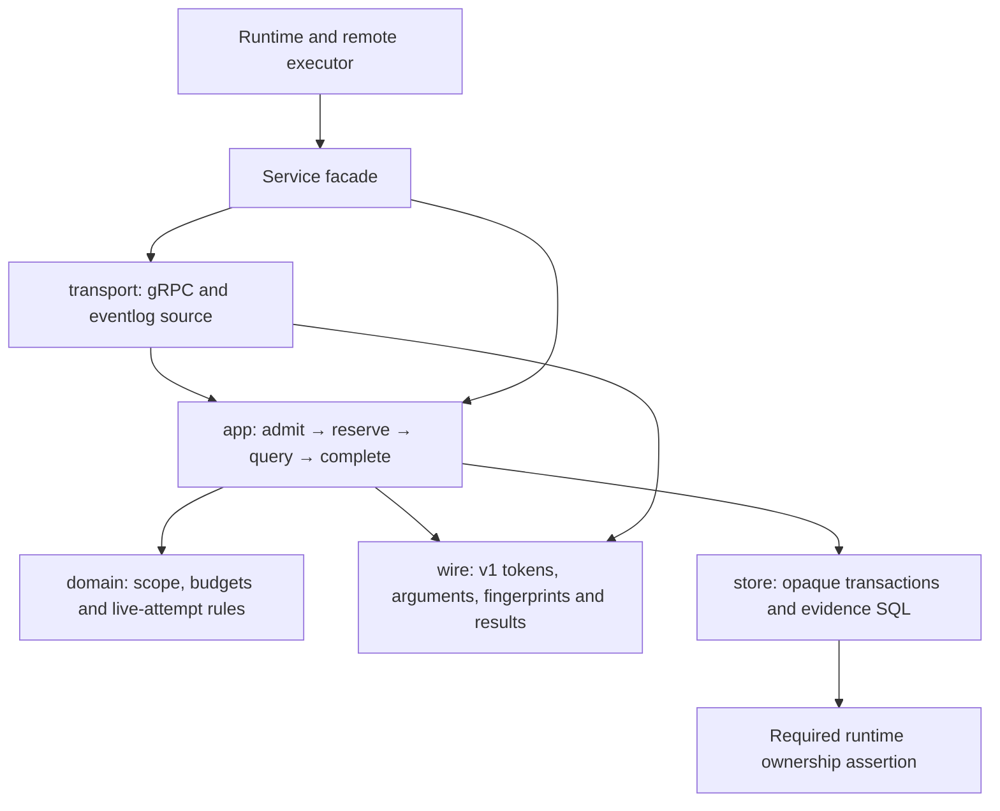

# Evidence

Evidence owns the capability-scoped, bounded, read-only tool boundary for episode
workers and the durable evidence-call ledger. Consumers construct `Service`
through `New(Config)`. The facade delegates every operation; its private layers
are inaccessible to other business modules.

| Layer | Responsibility |
| --- | --- |
| Facade | Configuration adaptation, domain aliases, direct service/adapter delegation |
| App | Clock reads and random identity issuance; ordered authorization, reservation, provider execution, completion/failure and recovery |
| Domain | Scope completeness/defaults, authority/time checks, numeric/identity/range/entity admission, deadline/result bounds, live-attempt and reservation integrity rules |
| Store | Private database/transaction handles, original transactions, ledger SQL and ownership plumbing; loaded episode/attempt projections contain no admission rules |
| Wire | Exact v1 JSON/base64/HMAC, closed tool arguments and event envelopes, stable request fingerprints and protobuf value projection |
| Transport | gRPC status adaptation and read-only eventlog queries through the eventlog owner's API |

See [ubiquitous language](UBIQUITOUS_LANGUAGE.md) for matching code and durable terms.

## Explicit construction

`Config.Capabilities` supplies issuer, audience, active key ID and key ring.
All keys must be at least 32 bytes; the service copies the map and bytes.
An omitted scope key ID defaults to the configured active key. Clock, maximum
TTL and skew are configured here; defaults remain 15 minutes and one second.
Negative TTL/skew configuration is rejected. Key material is private and never
persisted in the ledger.

`Config.Ledger` supplies DB, lease owner, runtime epoch and required `OwnerCheck`.
Live composition supplies `owner.Assert` at construction, before startup
recovery. Tests that deliberately exercise unowned fixture state pass an
explicit assertion function. There is no silently skipped nil-owner check.

`Config.Calls` supplies already configured capability and ledger services,
a read-only `Query`, matching runtime epoch and the call clock. Missing ports or
an epoch mismatch fail construction. Capability-only and recovery-only services
refuse unconfigured operations. Runtime creates the ledger before it has the
worker evidence key; the same ledger is then shared with the worker-call service.
The concrete components remain private behind this one public facade.

## Public operations

| Operation | Use |
| --- | --- |
| `Issue` / `Verify` | Sign or authenticate a short-lived fenced capability |
| `IssueTime` | Preserve the remote attempt issuer's configured clock read before scope preparation |
| `Call` | Serve the existing EvidenceTools gRPC method through the transport adapter |
| `RuntimeEpoch` | Read the immutable ledger epoch for runtime recovery composition |
| `RecoverTx` | Interrupt prior-epoch calls inside the caller's startup recovery transaction |
| `ReclaimExpired` | Interrupt expired or foreign-epoch running reservations under ownership |
| `NewRuntimeEpoch` | Generate an opaque process-owner identity through the identity codec |
| `EventLogQuery` | Bind the eventlog-owned, tenant/entity/time/row-scoped provider |

Reserve, Complete and Fail are private use cases. No public mutable Server,
Issuer, Verifier or Ledger structs, setters or compatibility constructors remain.
The old in-memory deduplication route existed only for tests and has been removed;
worker calls always use the durable ledger, including module integration tests.

## Safety and transaction sequence

Admission preserves envelope → trace → token → numeric limits → exact
identity/tool/trace/epoch → time range → arguments/entity → deadline ordering.
A granted time range and row/byte ceiling are never expanded by worker input.
The deadline is capped at capability expiry. Query errors expose stable safe
messages rather than provider details.

Reservation runs ownership assertion, live episode/attempt checks and request/
token identity checks in one transaction. A completed reservation returns its
verified exact result without querying again. A running duplicate is rejected;
a failed/interrupted call is terminal and needs a new call identity.

Providers execute outside transactions. Completion opens a separate transaction
and repeats ownership and live-attempt checks before the unchanged fenced,
leased update. Failure and completion retain a detached five-second persistence
budget even when the caller was canceled. Startup recovery joins the original
runtime transaction, so ownership acquisition and all recovery mutations roll
back together. Evidence owns only `evidence_call_ledger`; existing transactional
reads of episode/attempt state stay in store until the owner offers read ports.

## Verification and further work

Regression tests pin token claims, request fingerprints and result bytes; prove
scope refusal, result bounds, single reservation winner, durable replay, stored
result integrity, owner loss, supersession, cancellation and caller rollback.
Architecture gates keep the facade thin, domain pure, SQL in store, handles
opaque and protocol/codecs outside app/domain/store.

The completion record (`docs/evidence-reference-module-2026-10-05/README.md`)
contains the code audit (`docs/evidence-reference-module-2026-10-05/CODE_AUDIT.md`)
and final validation. The next useful improvement is an owner-provided
transactional episode/attempt read port, preserving the existing atomic checks.
