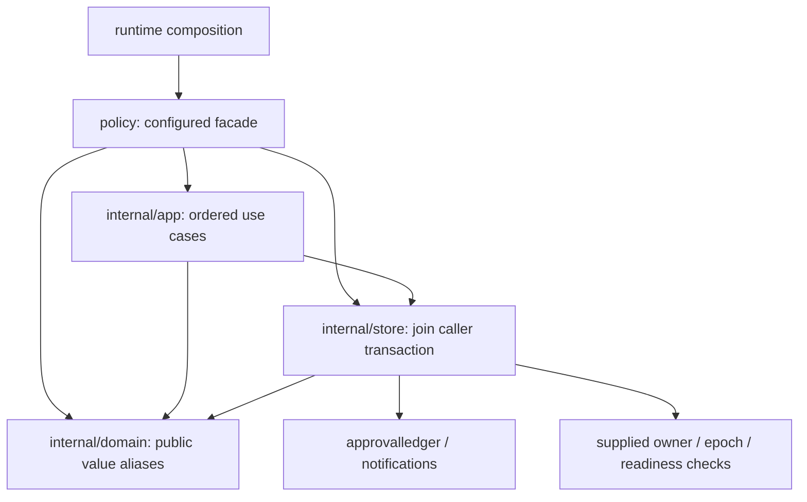

# Policy reference module pattern

Policy follows authority's durable-module pattern and device's typed-record
pattern. Its transaction ownership is different: the episode/pipeline caller
already owns the transaction, so policy joins it rather than opening another.

## Reused patterns

| Authority / device pattern | Policy adaptation |
| --- | --- |
| `Service` constructed by `New(Config)` | Required ownership, decision-epoch and interlock checks; missing inputs are errors. No mutable setters. |
| App use cases named after business actions | Evaluate an intent, resolve a human approval, publish a prepared command or approval request. |
| Pure rules over named values | Schema/digest/identity, principal/signature, risk, freshness, compensation and approval disposition rules in domain. |
| Typed records with original documents retained | Decision and intent governance fields are projected after schema validation; original decoded documents remain the digest and approval-record inputs. Effector parameters and trigger deltas remain opaque JSON. |
| Named request / attempt values | Evaluation and approval requests at the facade; evaluation/approval attempts in app; command preparation, outcome, publication and lifecycle values below it. |
| Lower transactional checks through store plumbing | Store passes the exact original `*sql.Tx` to supplied ownership, epoch, interlock and calibration checks. It never begins, commits or rolls back. |
| One adapter owns each I/O concern | Every policy SQL statement is in store; approval lifecycle mutations still use approvalledger on that same transaction. |

## Public operations

- `New(Config) (*Service, error)` validates safety dependencies and policy version.
- `Service.EvaluateIntent(ctx, tx, EvaluationRequest)` evaluates and records one intent.
- `Service.ResolveApproval(ctx, tx, ApprovalResolution)` records a human decision,
  then re-runs evaluation before commanding.
- `NextPendingIntent(ctx, db, tenant)` selects the oldest pending intent.
- `Service.ApprovalForSigning(ctx, tx, ApprovalLookup)` presents a tenant-bound
  request and exact decision-bound signing bytes to authorized principals.
- Policy definition/digest functions are pure exports used by replay and artifacts.

Existing unowned simulation/test composition supplies explicit checks. Real
runtime composition binds `RuntimeOwner.Assert` and
`EpochControl.AssertDecisionTx` when those controls are configured. Policy
always invokes its supplied checks. A callback's actual authority is supplied
by composition; constructor validation cannot verify what a callback does.
Calibration is supplied as a narrow transaction-scoped check; runtime composition
adapts the qualification store. Optional calibration is a permission source: absent or failed calibration sends
R2 intents to human approval. It does not enable automatic consequential work.

## Preserved sequences

Evaluation: owner → durable intent projection → epoch → existing result or
validated decision/intent → compensation → intent identity → episode lifecycle
→ situation version → completeness → expiry → risk → interlock → command
identity → hourly rate admission → outbox/status/audit.

Human resolution: owner → durable approval/intent → already resolved → stale
approved intent → expiry → distinct registered principals → durable assertion
binding → signature → single-use binding → role authority → resolution/status/
notification → full evaluation when approved.

Schema validation happens before governance fields are used. Original documents
are decoded once per pending evaluation; digest checks and approval presentation
reuse those documents. No schema, protocol, migration or dependency changes.

## Enforcement and limits

The existing import, downward-layer, pure-domain, infrastructure isolation,
store-only SQL and mutation-ownership checks cover all four layers. Reasoning
cannot reach any policy layer. Replay can use the pure definition exports and
still cannot reach effect implementations.

Store retains read-only joins across accepted decision, episode, Situation,
principal and command handoff records. Moving those projections to owner ports
would be a separate multi-module change. Mutable internal document maps and
opaque effector parameters remain current data-encapsulation limits.

Human approval presentation and resolution are connected to authenticated
loopback HTTP routes through the owner-scoped runtime pipeline. Both grants and
denials require signed, authorized human decisions. The runtime owns tenant and
time; invalid fresh submissions do not consume pending approvals. Maintenance
drains committed command outbox work without new sensor input. The old public
signing helper is removed; signing stays in domain and clients receive exact
bytes through presentation. See [the HTTP design](APPROVAL_HTTP_DESIGN.md).

## Package documentation

- [Approval HTTP design](APPROVAL_HTTP_DESIGN.md) defines the implemented integration and its security/test contract.

- [Approval integration record](APPROVAL_INTEGRATION.md) retains the original 33-function inventory, completed HTTP path and remaining CLI/deployment work.
- [Ubiquitous language](UBIQUITOUS_LANGUAGE.md) maps governance terms to code and durable records.
- [Refactor plan](../../docs/policy-reference-module-2026-10-05/PLAN.md) and
  [validation](../../docs/policy-reference-module-2026-10-05/VALIDATION.md) retain the dated change history and evidence.
