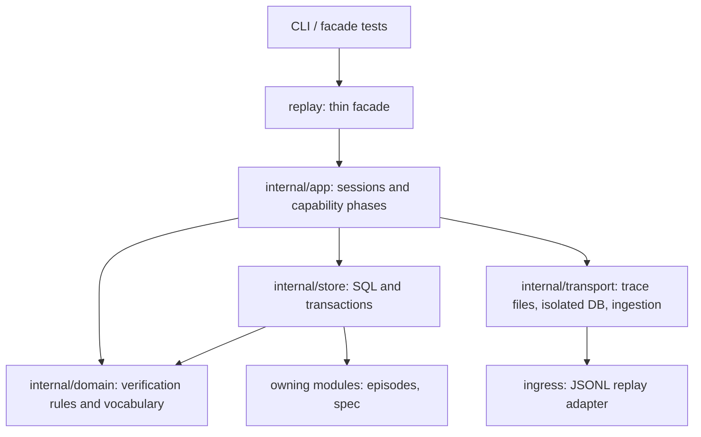

# Replay reference module

Replay converts one trace file into a verified, effect-free proof: it replays
the trace against a compiled spec inside a fresh isolated database, hashes the
situation versions deterministically, and in its worker-aware modes verifies
recorded decisions or compares paired shadow trials report-only. No mode accepts credentials, effectors or a resolver;
`EffectsAllowed` is false in every result.

## Responsibilities

| Layer | Responsibility |
| --- | --- |
| Facade | Public contract aliases and one-line delegation; no logic, SQL or files |
| App | Session sequencing (compile, deployment, epoch, ingest, engine, materialize, collect) and the recorded and shadow phases |
| Domain | Modes, capabilities, worklist episodes, trials and comparisons as pure rules: capability admission, recorded verification and matching, shadow binding precedence, comparison sealing, admission windows, epoch selection, baseline policy, versions hash |
| Store | The only SQL: worklist, version and snapshot digests, spec deployment, episode materialization through the episodes assembler, comparison persistence into `shadow_comparisons` |
| Transport | Trace line reading, isolated database lifecycle, trace ingestion through ingress |

App imports no SQL, database, storage or network packages. Domain takes time
and derived digests as parameters (the intent catalog and policy digest are
compiled by app). Writes go only through the owning modules' APIs inside
store-owned transactions; replay owns no durable table.

## Public operations

- `Run(ctx, Request)` — deterministic session; `Request` carries the isolated database path, spec, trace and tenant.
- `RunRecorded(ctx, Request, sourceDB)` — recorded mode: verifies every
  replayed episode against the accepted decision a live runtime recorded in
  `sourceDB`, opened read-only (`run --source-db`).
- `RunShadow(ctx, Request, workerSocket, workerName)` — shadow mode: pairs the
  deterministic baseline with a candidate worker on every replayed episode
  (`run --worker-socket`).
- `RunNTimes` / `AllHashesEqual` — determinism proof loop (`run --repeat`).
- Capability ports: `RecordedLedger`, `ShadowExecutor`, `BaselineExecutor` —
  the contracts the recorded ledger and the shadow worker adapter implement.
  The package's own tests inject doubles through `RunMode` in `export_test.go`.

## Evidence and limits

Each layer has its own tests (facade 100%, app 75%, domain 71%, store 81%,
transport 92% coverage). Gates enforce downward imports, pure domain rules,
app infrastructure isolation, store-only SQL and the effect/replay isolation
now covering every replay layer; injected violations were rejected during
migration. `Result.SimulatedResults` stays `[]map[string]any` by contract:
the simulator port returns arbitrary outcome JSON, and worker-aware modes are not yet wired
into the CLI (deferred follow-up in the migration plan).

- [Ubiquitous language](UBIQUITOUS_LANGUAGE.md)
- [Migration design](../../docs/replay-reference-module-2026-10-05/DESIGN.md)
- [Plan and rounds](../../docs/replay-reference-module-2026-10-05/PLAN.md)
