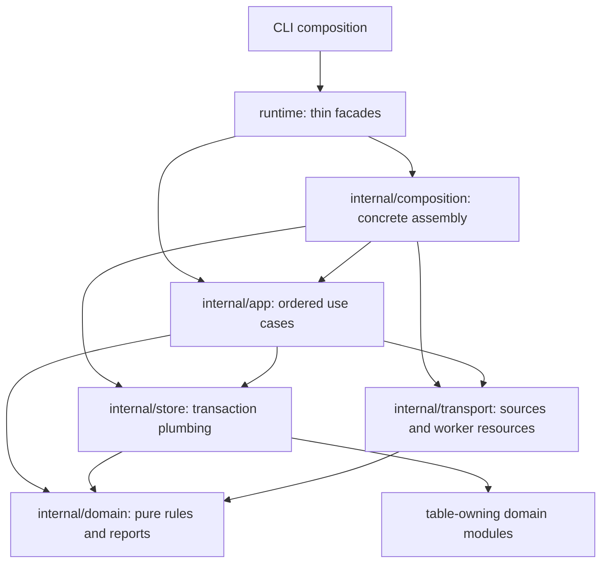

# Runtime reference module

Runtime owns live orchestration and process resource lifetimes. It composes
existing domain modules and joins their operations to the original transaction.
Their ledgers retain ownership of their lifecycle transitions and tables.

## Responsibilities

| Layer | Responsibility |
| --- | --- |
| Facade | Public configuration/report aliases and delegation; keeps implementation fields private |
| Composition | Constructs stream, admission, episode, policy, action and watch planes; supplies authority checks; validates worker options before I/O |
| App | Advances sources and governed batches; binds approval tenant/time; maintains readiness and approved work; sequences worker setup and cleanup |
| Domain | Reports, worker option validation, closed route ownership, heartbeat cadence and cancellation classification; no I/O or clock reads |
| Store | Ownership/cost transactions, policy evaluation and approval transactions, atomic recovery through existing lifecycle owners |
| Transport | JSONL/simulator/live UDS sources; native model/provider tools; evidence gRPC listener; remote worker connection; TLS and resource teardown |

App imports no SQL, database or network packages. Domain takes clock-derived
values as inputs. SQL stays in store. Config aliases refer to lower public
module contracts; private use-case and connection objects are never returned.

## Public operations

- `NewService(owner, ledger, epoch)` → `Start(ctx)` → `Ready()` → `Close(ctx)`.
- `NewWorkerRuntime(ctx, config)` returns the selected `Executor`; `Errors()`
  exposes asynchronous evidence-server failures and `Close()` releases resources.
- `ValidateWorkerRuntimeConfig(config)` checks option consistency without I/O.
- `NewPipeline(ctx, config)` → `Start(ctx)` → `RunJSONL`, `RunSimulatorJSONL`
  or `RunLiveSocket` → `Close()`.
- `Pipeline.ApprovalForSigning` and `Pipeline.ResolveApproval` bind the configured
  tenant and trusted runtime clock before joining the policy transaction.

A configured remote route never constructs the native executor. Evidence starts
before the remote connection when enabled. Setup failures close partially opened
resources. Teardown stops evidence serving, closes its listener, then closes the
worker connection. The caller owns the database and closes it after these resources.

## Preserved runtime sequences

Readiness: claim owner epoch and recover episode/evidence state in one transaction
→ start the heartbeat → become ready. Recovery uses the ownership claim timestamp
unless the coordinator has an explicit clock override. Renewal or reclamation
failure clears readiness. Close stops and joins the heartbeat before releasing
ownership.

Batch: prepare/fence source advancement → ingest → expire watches → advance stream
→ fire recent watches through paginated evidence → check ownership → admit
episodes → execute episodes → evaluate intents → dispatch approved commands.
Clock reads, identity sources, ordering, locks and transaction boundaries retain
the original behavior. Maintenance expires watches and dispatches committed
approved commands without waiting for new source input.

Effect routing reserves watch installation and closed device routes before
fallback. Device routes with no gateway fail closed. Authorization and device
verification stay with the selected effector. Routing is internal to app; the
unused public `CompositeEffector` and `RecoveryCoordinator` APIs are removed.

Human approvals use the [authenticated HTTP contract](../policy/APPROVAL_HTTP_DESIGN.md).
Presentation and resolution both enforce owner/tenant scope; policy owns principal,
signature, single-use and full re-evaluation rules.

## Evidence and limits

Each layer has its own tests. Gates enforce downward imports, pure domain rules,
app infrastructure isolation, store-only SQL, lifecycle ownership and exclusion
of effect implementations from reasoning/replay. Temporary violations confirmed
the purity, clock, app and SQL gates reject invalid runtime code.

Runtime remains a composition root. Its app coordinates concrete lower modules;
introducing a port for every plane would add abstraction without a current need.
Some lower contract payloads remain opaque maps. Live UDS source processing is
synchronous and backlog/fairness behavior remains a separate audit follow-up.
This migration does not qualify a deployment or a physical device installation.

- [Runtime language](UBIQUITOUS_LANGUAGE.md)
- [Migration design](../../docs/runtime-reference-module-2026-10-05/DESIGN.md)
- [Plan and rounds](../../docs/runtime-reference-module-2026-10-05/PLAN.md)
- [Validation and review](../../docs/runtime-reference-module-2026-10-05/VALIDATION.md)
